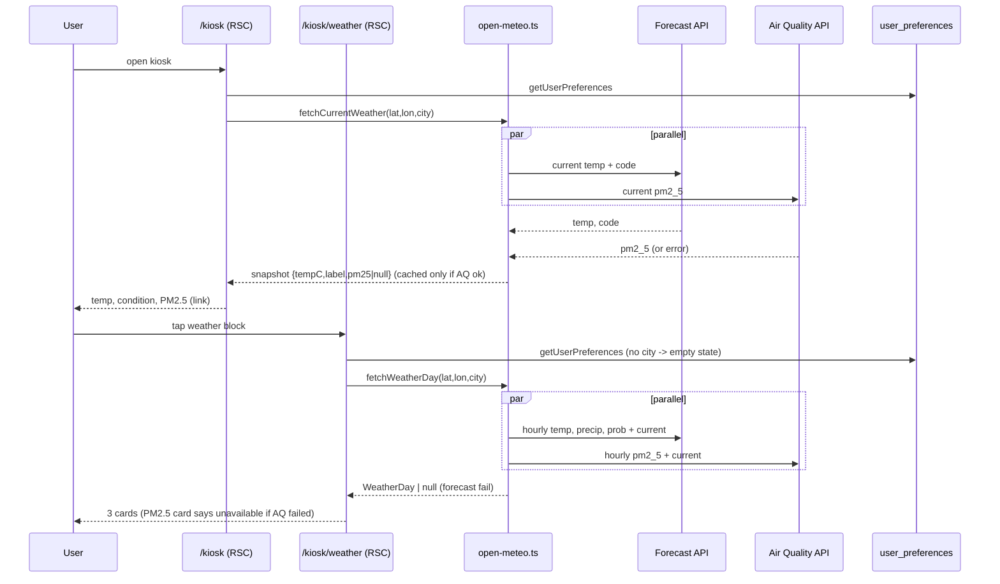

# Design: Kiosk weather — PM2.5 + day detail page

**Mode:** simple

**User-first line:** One clear PM2.5 number on the glance board. One tap to a day view in the city's own time. Weather failures never hide what still works.

## Recommended design (Option 1 — server page, lib fetch, visx cards)

**What it is:** Extend `lib/weather/open-meteo.ts` with PM2.5 and an hourly day fetch. The kiosk weather block shows temp, condition, and PM2.5, and links to a new RSC page `/kiosk/weather`. The page uses `CoreShellPage` (the hamburger menu is the "menu"). Three visx cards show temperature, PM2.5, and rain.

**Example:** `const day = await fetchWeatherDay(lat, lon, city)` in `app/(shell)/kiosk/weather/page.tsx`. No `/api` route.

**Pros:** No new public surface. No client waterfall. Same auth as `/kiosk`. Kiosk first-load bundle unchanged (charts only load on the new route).
**Cons:** No in-page refresh (reload refreshes; `force-dynamic`). Two Open-Meteo calls per load.

**Rejected alternative (≤3 lines):** `GET /api/weather/day` + client fetch. It adds Has API = yes, a rate limit, a contract, and a loading flash. It gives refresh without navigation, which a kiosk does not need.

## Recommendation

**Pick Option 1.** It is the smallest change that meets all four outcomes and matches the `/kiosk` pattern (server data → client UI).

## Chosen design (user-approved)

<!-- Fill after Gate B -->

## System design

### Overview

- **What it is:** Server-first read path. The RSC page reads city prefs, calls two Open-Meteo hosts in parallel, and passes plain arrays to client chart components. Nothing is stored.
- **Components / boundaries:** Browser → Next RSC (`/kiosk`, `/kiosk/weather`) → `lib/weather/open-meteo.ts` → Open-Meteo forecast + air-quality hosts. Prefs come from `getUserPreferences`. Trust boundary = server ↔ Open-Meteo (read-only, public, no key).
- **Data flow:** Kiosk loader adds `pm25` to the snapshot. Day page builds one 24-row table by merging both APIs on the local `time` string. See Sequence diagram and Contracts.
- **Consistency & failure:** Data is read-only and may be up to 15 min old. Forecast and AQ fail independently (`Promise.allSettled`). AQ down → `pm25: null`, temp still shown, result **not cached** (grill Q5). Forecast down → no snapshot / day (`null`).
- **Chrome wiring (architecture, not polish):** three path-based rules must treat `/kiosk/weather` as part of Kiosk: header (`core-app-header`), rail hiding (`hidesShellRailChrome`), nav active state (`registry` `activeMatch: "prefix"`). Without them the page says "Settings" and shows a duplicate rail.
- **Why this shape:** No DB, no API route, no proxy change. Page-level `auth()` is the kiosk model (`proxy.ts` stays untouched).
- **Best practices:** City-local time via `timezone=auto`; never `new Date(timeString)`. Hourly `null` stays `null`. Cache only complete results.
- **Anti-patterns:** Putting a `<Link>` inside the weather `<Link>`. Drawing `null` as 0. Parsing API times with the device time zone.
- **Reference:** `docs/ARCHITECTURE.md` (shell vs feature layers); `app/(shell)/kiosk/page.tsx`.

## Sequence diagram

## Contracts

### API contracts

**N/A — Has API = no.** No new or changed HTTP route, GraphQL field, or server action. The only new contract is an internal lib contract:

| Item | Detail |
|------|--------|
| `WeatherSnapshot` (changed) | Add `pm25: number \| null` — whole number (`Math.round` of AQ `current.pm2_5`), `null` if AQ failed. Drop no existing field; `locationLabel` stays (unused by strip). |
| `fetchCurrentWeather(lat,lon,label)` | Same signature. Runs forecast + AQ in parallel (`Promise.allSettled`). Forecast fail → `null`. AQ fail → snapshot with `pm25: null`, **not cached**. |
| `fetchWeatherDay(lat,lon,label)` (new) | Returns `WeatherDay \| null`. `null` only if forecast fails or has no usable hours. Separate 15-min cache, **only when AQ also succeeded**. |
| `WeatherDay` (new) | `{ date: "YYYY-MM-DD"; label: string; nowIndex: number; current: { tempC: number; pm25: number \| null }; aqAvailable: boolean; rainTotalMm: number; hours: WeatherHour[] }` |
| `WeatherHour` (new) | `{ time: string; hour: number; tempC: number \| null; pm25: number \| null; rainMm: number \| null; rainProbPct: number \| null }` — `time` is the API local string; `hour` = 0–23 read from `time.slice(11,13)`. |
| Pure helpers (new, `lib/weather/weather-day.ts`) | `buildWeatherDay(forecastJson, aqJson \| null, label)`, `hourFromLocalTime(s)`, `formatPm25Line(pm25)` → `"PM2.5 21 µg/m³"` or `"PM2.5 —"`, `formatWeatherDayMeta(city, date)` → `"Ho Chi Minh City · Sat, Oct 10"`. |
| Upstream calls | Forecast: `https://api.open-meteo.com/v1/forecast?latitude&longitude&current=temperature_2m,weather_code&hourly=temperature_2m,precipitation,precipitation_probability&forecast_days=1&timezone=auto`. AQ: `https://air-quality-api.open-meteo.com/v1/air-quality?latitude&longitude&current=pm2_5&hourly=pm2_5&forecast_days=1&timezone=auto`. Both `next: { revalidate: 900 }`. |

Merge rule: build rows from forecast `hourly.time` for `date` = `current.time.slice(0,10)`. Match AQ by identical `time` string. No match → `pm25: null`. `nowIndex` = `hourFromLocalTime(current.time)`.

### Database contracts

**N/A — Has DB = no.** Reuses existing `user_preferences` (`weatherCity`, `weatherLatitude`, `weatherLongitude`) read-only. No schema, migration, or query change.

### Example queries

N/A — no DB.

## Design patterns used

### Pattern 1 — Server-first data (RSC → client UI)
- **What it is:** A server component fetches data. Client components only draw it.
- **How we use it here:** `kiosk/weather/page.tsx` awaits `fetchWeatherDay`, passes `WeatherDay` to `WeatherDayView` → client `WeatherDayChart`.
- **Why we chose it:** Same as `/kiosk`; no API surface.
- **Best practices:** Pass plain JSON props only. Keep chart imports on this route.
- **Reference:** `app/(shell)/kiosk/page.tsx`.

### Pattern 2 — Fail-soft loader (partial failure)
- **What it is:** Each source can fail alone; the rest still renders.
- **How we use it here:** `Promise.allSettled` in `open-meteo.ts`; `loadWeatherSnapshot` keeps `try/catch → null`; PM2.5 card shows "temporarily unavailable".
- **Why we chose it:** Temp must survive an AQ outage.
- **Best practices:** Do not cache partial data. Never turn `null` into `0`.
- **Reference:** `lib/kiosk/load-kiosk-page.ts`.

### Pattern 3 — Chart shell composition (visx)
- **What it is:** A small client chart built from `ChartShell` + `ChartParentSize` + visx scales/shapes.
- **How we use it here:** New generic `components/weather/weather-day-chart.tsx` (`kind: "line" | "bars"`), colors from `colorByIndex`.
- **Why we chose it:** Existing `LineChart`/`ColumnChart` are Money-specific; changing them risks Money.
- **Best practices:** Fixed chart height; tokens only; respect `prefersReducedMotion`; `defined()` to skip `null`.
- **Reference:** `components/charts/chart-shell.tsx`, `line-chart.tsx`.

## UI / UX / mobile

**Build ↔ UI lock:** Build must match the specs below and reuse live chrome (`CoreShellPage`, `Card`, `Skeleton`, `AnalyticsEmptyState`). No new menu component.

- **80/20 — #1 (always visible):** Temp + PM2.5 in the kiosk weather block. **#2:** the whole weather block is a link to `/kiosk/weather`. Secondary: city setup stays in Settings; menu = shell hamburger.
- **Top journey:** `/kiosk` → read temp + PM2.5 → tap weather → scan 3 cards → hamburger to leave.

### Kiosk weather block (`KioskContextStrip`)

- **Layout (4 lines, end-aligned on wide):** label `Weather` → temp `NN°C` (display 3xl) → condition → `PM2.5 NN µg/m³` (`text-sm text-muted`). City line removed.
- **Link:** when `weather` exists, the right column is one `next/link` to `/kiosk/weather`: `fx-hit-40 fx-press`, `rounded-[var(--radius-sm)]`, visible focus ring, `transition-colors` only. `aria-label="Weather details"`-style name includes temp and PM2.5.
- **PM2.5 null:** show `PM2.5 —` (row stays; no layout shift).
- **No weather:** keep current text. No city → Settings link (not nested in a link). City set but fetch failed → "Weather is temporarily unavailable." (no link).
- **Skeleton:** weather side = 4 lines: label, temp, condition, PM2.5 (today 3; also fix the label→temp spacing to match live). Same grid + radii.

### Weather day page (`/kiosk/weather`)

- **Chrome:** title `Weather`; breadcrumbs `Kiosk › Weather` (crumb to `/kiosk`); meta `<city> · <Sat, Oct 10>` (grill Q1; passed through new optional `meta` prop on `CoreShellPage`, else resolver default `Hourly outlook`). Shell rail hidden; hamburger shown.
- **Order:** Temperature → PM2.5 → Rain. One column on narrow, auto-fit grid on wide: `repeat(auto-fit,minmax(min(100%,26rem),1fr))`. No hardcoded breakpoints.
- **Card (each):** `Card` with title inside card (no outer heading), big "now" headline + unit, then chart (fixed height, e.g. `h-48`). Temp: `NN°C`. PM2.5: `NN µg/m³` or `—`. Rain: today total `N.N mm`.
- **Charts:** same x axis `00–23` (ticks 00/06/12/18/23). Temp = line, PM2.5 = line, Rain = mm bars. "Now" vertical marker at `nowIndex`. Tooltip: temp `HH:00 · NN°C`; PM2.5 `HH:00 · NN µg/m³`; rain `HH:00 · N.N mm · NN% chance`. `null` points are gaps. WHO line deferred.
- **States:** no city → `AnalyticsEmptyState` "Set your city in Settings" + link. Forecast failed (`null`) → one `AnalyticsEmptyState` "Weather is temporarily unavailable." (not an error alert). AQ failed → PM2.5 card body "Air quality is temporarily unavailable." Temp + rain still draw. All rain `0` → bars flat, headline `0 mm` (not empty).
- **Skeleton parity:** `WeatherDayPageSkeleton` = 3 card skeletons in the same auto-fit grid; each = title bar, headline bar, chart block (same height). Used by `kiosk/weather/loading.tsx`.
- **Mobile:** ≥44px link/menu hits; no hover-only data (tooltip also opens on tap/focus via `useChartTooltip`); cards stack.
- **A11y:** each chart wrapper has `role="img"` + `aria-label` summary (e.g. "Temperature today, range 24 to 32 °C"); link has visible focus.
- **Light/dark:** tokens only; verify in `/settings`.
- **Measure after ship:** taps on weather block; page reload rate.

## Security design review (OWASP)

Trust boundaries: browser ↔ Next server (session); server ↔ Open-Meteo (public read-only).

Abuse cases:

- Unauthenticated visit to `/kiosk/weather` → page `auth()` redirects to `/login`.
- Tampered coords → none; lat/lon come from the user's own saved prefs, never from the URL or query.
- Upstream sends bad JSON / odd numbers → parse in `try/catch`; treat non-finite numbers as `null`.

| OWASP | Status | Note |
|-------|--------|------|
| A01 Broken Access Control | pass | Page-level `auth()`; prefs read by session user only. No `/api` route. |
| A02 Cryptographic Failures | N/A | No secrets, no stored data. |
| A03 Injection | pass | Coords are numbers from DB, set via `URL.searchParams`. City label rendered as React text (escaped). |
| A04 Insecure Design | pass | Read-only; fail-soft; no partial caching. |
| A05 Security Misconfiguration | pass | `proxy.ts` matcher unchanged by design (kiosk is page-auth only). |
| A06 Vulnerable Components | pass | No new package (visx already in repo). Open-Meteo free tier = non-commercial; fine for personal use. |
| A07 Auth Failures | pass | Same session model as `/kiosk`. |
| A08 Software / Data Integrity | pass | Merge by `time` key; mismatched rows dropped. |
| A09 Logging / Monitoring | N/A | No new logging; failures return `null` silently as today. |
| A10 SSRF | pass | Fixed upstream hosts; only numeric params vary. |

Source: https://owasp.org/Top10/

## Acceptance criteria

- [ ] Kiosk weather block shows temp, condition, `PM2.5 N µg/m³`; city line is gone.
- [ ] AQ failure → `PM2.5 —`; temp and condition still show; that result is not cached.
- [ ] Weather block links to `/kiosk/weather`; no `<a>` inside `<a>`; no-city copy still links to Settings.
- [ ] `/kiosk/weather` shows temp line, PM2.5 line, rain bars (mm) with probability in tooltip, same `00–23` axis, "now" marker.
- [ ] Page title is `Weather`, crumbs `Kiosk › Weather`, meta `<city> · <date>`, hamburger menu present, shell rail hidden, Kiosk nav item active.
- [ ] Unauthenticated user is redirected to `/login`. No city → empty state with Settings link.
- [ ] Hourly `null` is a chart gap, never `0`. Times are city-local; no `new Date(timeString)`.
- [ ] Kiosk skeleton (4-line weather side) and `WeatherDayPageSkeleton` match live order, grid, and radii.
- [ ] Looks right in light and dark. `npm run lint`, `npm run build`, and `npm test` pass. `lib/kiosk-first-load.test.ts` still passes.

## Challenges answered

- **Do we need this?** Yes — PM2.5 changes daily choices; day view answers "when".
- **What fails?** AQ API down (handled), forecast down (empty state), null hours (gaps), city in another time zone (city-local day).
- **Is this overspecified?** No: no API, no DB, one generic chart, three small chrome fixes.
- **Deferred Enhancements:** WHO 15 µg/m³ line/band; multi-day; live refresh; user date-format pref in page meta (fixed `en` format for now).

## Domain / ADR notes

- **Glossary terms used:** Kiosk weather block, Weather day page (added to `GLOSSARY.md` by grill).
- **ADR:** N/A — skipped: easy to reverse (route, cache rule, chart shape).
- **Grill locks honored:** city in page meta; rain mm bars + probability tooltip; WHO line deferred; `timezone=auto` city-local day with `nowIndex` from `current.time`; no cache on AQ fail; PM2.5 = rounded `current.pm2_5` or `PM2.5 —`.
- **Doc update:** `docs/DESIGN_GUIDE.md` "Kiosk glance pattern" item 1 → today + weather (temp, condition, PM2.5) that links to the day page.
- **Build note:** `AGENTS.md` says this Next.js differs from training data. Read `node_modules/next/dist/docs/` before writing the route, `loading.tsx`, and `Link` code.
