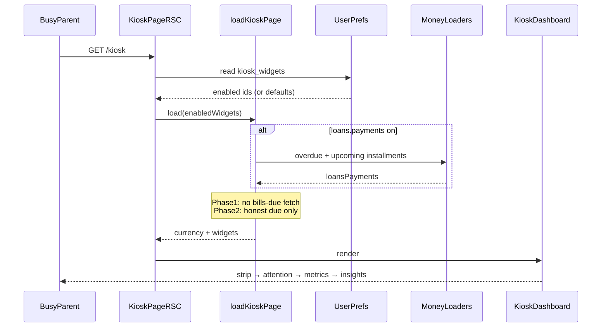

# Design: Kiosk attention-first glance

**Mode:** full

## Decision 1: how to ship the settled hierarchy?

Settled locks (do not reopen): payments above metrics (D1); attention = loans + bills-due, not `bills.summary` (D2); insights dense / below / opt-in (D3); net = money #1 (D4); suggestions-only until user reopens Build (D5). This Decision only chooses **how** to land that stack when Build runs.

### Option 1 — Phased attention (loans now; honest bills-due later)

**What it is:**
Ship the new stack order and one attention zone with **loan payments** as the real action list. Reserve a **bills-due slot** in the same zone that stays empty / omitted until a real due signal exists. Never invent due from `bills.summary` month totals. Update guide + skeleton in the same change. Bills-due UI/data is a follow-on slice (or separate run) when an honest path exists.

**Example:**
`kiosk-dashboard.tsx`: strip → attention (`KioskLoansCard` + optional bills-due stub omit) → metrics (net first) → opt-in insights. Skeleton mirrors that order. `DESIGN_GUIDE` § Kiosk glance rewritten to match.

**Pros:**

- Delivers Gate A fix-first (urgency above calm metrics) without fake bills
- Defaults stay loans-led; no new finance domain this pass
- Fits D5 suggestion package; Build can reopen for Phase 1 alone

**Cons:**

- Dual-attention product scope looks incomplete until bills-due lands
- Stub risk: empty slot chrome if not fully omitted when no signal

### Option 2 — Full attention zone in one Build

**What it is:**
One Build ships loans reorder **and** a real bills-due list co-located in attention, fed by an honest due path (loader extension / reuse of existing bills due semantics elsewhere — not ledger summary). Metrics and insights follow as settled.

**Example:**
Loader gains `widgets.billsDue` when enabled; attention zone shows loans list + bills-due rows; registry may add `bills.due` (separate from `bills.summary`).

**Pros:**

- Matches Glossary “Kiosk attention” fully in one ship
- One attention place for loan + bill urgency from day one

**Cons:**

- No kiosk bills-due data today → forces new domain/loader work (fights “no new finance domain” / Has API·DB no)
- Larger Build; easy to slip into faking due from month ledger under pressure

## Tradeoffs

| Factor | Option 1 | Option 2 |
|--------|----------|----------|
| Cost / time | Low–med (reorder + docs + skeleton) | Med–high (data + UI + registry) |
| Complexity | Low; stub discipline | Higher; new signal ownership |
| Usability | Strong loans glance now; bills later | Full dual attention when ready |
| Failure cases | Incomplete dual-attention until Phase 2 | Fake due / scope creep / empty bands |

## Recommendation

**Pick Option 1** because Grill residual forbids fake due from `bills.summary`, there is no kiosk bills-due loader today, and D5 stops at Gate B suggestions. Phase 1 ships the ★ hierarchy with honest loans-only attention; Phase 2 adds bills-due only when a real signal exists.

## Chosen design (user-approved)

**Option 1 — Phased attention** + **Task 0 design-system parity** (Gate B / Decision 6 → 1+2, 2026-10-10).

Phase 1 Build: parity on `/kiosk` + `/kiosk/weather`, then strip → loans attention → net-first metrics → opt-in insights; guide + skeleton sync. Phase 2 bills-due deferred until honest due signal (never from `bills.summary`).

## System design

### Overview

- **What it is:** Status-board hierarchy reshape on the existing Money-workspace RSC path. No new public API or schema. The page still loads only enabled widgets; the **client stack order** changes so Kiosk attention precedes calm totals.
- **Components / boundaries:** Authenticated shell → `app/(shell)/kiosk/page.tsx` → `load-kiosk-page` (server) → `KioskDashboard` (+ skeleton). Prefs stay `kiosk_widgets` via existing PATCH. Weather detail OOS.
- **Data flow:** Server resolves widgets → returns payload → dashboard renders strip → **attention** → metrics → optional insights. Fields: see Contracts (N/A for Phase 1).
- **Consistency & failure:** Widget-gated: missing payments data → omit attention loans block (no phantom). Bills-due Phase 2: omit until signal exists. Prefs miss → defaults (weather, net, payments).
- **Why this shape:** Reuse widget-gated status board; reject Money-home / builder / dual urgency callouts.
- **Best practices:** One attention zone; skeleton + guide same PR; clean-minimal tokens; no `bills.summary` as due.
- **Anti-patterns:** Metrics-before-urgency; elevating `*InsightsStats` page density above fold; inventing due from ledger net.
- **Reference:** `docs/DESIGN_GUIDE.md` § Kiosk glance; `docs/ARCHITECTURE.md` workspace shell.

### Concept 1 — Attention before totals

- **What it is:** Needs-me-now signals (loans overdue/due-soon; later bills-due) sit above calm money KPIs.
- **How we use it here:** Band reorder in dashboard + skeleton; Glossary “Kiosk attention”.
- **Why we chose it:** Gate A fix-first; D1/D2 settled.
- **Best practices:** Loans list primary; bills-due co-located only when real; net remains #1 money total below.
- **Reference:** `GLOSSARY.md` — Kiosk attention.

## Sequence diagram



## Contracts

### API contracts

N/A — no new/changed public endpoints. Existing `PATCH /api/user/preferences` (`kiosk_widgets`) unchanged.

**Events / other module APIs (if any):**

- Phase 2 (future): internal extension of `load-kiosk-page` for bills-due only; still not a new public route unless a later run changes Has API.

### Database contracts

N/A — no schema / migration / write-owner change. Prefs column already stores `kiosk_widgets`.

**Data ownership notes:**

- Loan due rows: existing loans due services (read via loader).
- Bills month ledger (`bills.summary`): metrics band only — **never** attention.
- Bills-due Phase 2: must own a real due read; out of scope until data path exists.

### Example queries

N/A for Phase 1 (no query ownership change). Placeholder for Phase 2 only:

```sql
-- Phase 2 placeholder: real bills-due read (not month ledger SUM).
-- Exact table/shape TBD when bills due domain is chosen — do not implement from summary.
-- SELECT ... WHERE workspace_id = $1 AND due_date <= $2 ...
```

## Design patterns used

### Pattern 1 — Kiosk glance stack

- **What it is:** Fixed status-board bands (not a freeform dashboard).
- **How we use it here:** New order: strip → attention → metrics → optional insights in `kiosk-dashboard.tsx` + skeleton + guide.
- **Why we chose it:** Product intent; D1–D4.
- **Best practices:** Action list not in a Card; labels inside metric cards; update guide with code.
- **Anti-patterns:** Money-home KPI walls; dashboard builder.
- **Reference:** `docs/DESIGN_GUIDE.md` § Kiosk glance.

### Pattern 2 — Widget-gated load

- **What it is:** Server loads only enabled widget payloads.
- **How we use it here:** Keep `load-kiosk-page` + registry defaults; Phase 2 gates bills-due the same way.
- **Why we chose it:** No new API; protects glance when extras off.
- **Best practices:** Defaults weather + net + payments; insights/ledgers opt-in.
- **Anti-patterns:** Always-fetch all Money domains.
- **Reference:** `lib/kiosk/load-kiosk-page.ts`, `widget-registry.ts`.

### Pattern 3 — Progressive disclosure (attention zone)

- **What it is:** Show vital urgency first; dense detail only when opted in and lower.
- **How we use it here:** Loans list in attention; insights stay `variant="page"` below fold / off by default (D3).
- **Why we chose it:** Gate A secondary = insights; avoid compact variant this pass.
- **Best practices:** Omit empty attention children; Settings remain widget chooser.
- **Anti-patterns:** Compact insight redesign; dual callout + list duplication.
- **Reference:** Gate A 80/20; Settings `#settings-kiosk`.

| Pattern | Why chosen (one line) | Reference |
|---------|----------------------|-----------|
| Kiosk glance stack | Status board IA with attention-first order | DESIGN_GUIDE |
| Widget-gated load | Enabled-only data; no new API | load-kiosk-page |
| Progressive disclosure | Dense insights off critical path | widget defaults |

## UI / UX / mobile

- **UI:** Align Gate A #1/#2 with defaults on: attention (loan overdue/due-soon) then net. Context strip stays calm secondary. Insights/extra ledgers secondary (Settings / below).
- **Build ↔ UI lock:** Implementation must match these Design UI specs + live chrome (sizes, positions, texts). Do not invent a competing IA.
- **80/20 UI:**
  - Goals: needs-me-now → net → optional detail
  - Vital few: loan urgency; net; calm strip; no insight wall on path
  - **Important #1:** Urgent loan state (payments widget on)
  - **Important #2:** Net this month (net widget on)
  - Measure after ship: time-to-answer ~5s phone-width defaults
- **Layout / hierarchy (Phase 1 target):**
  1. Context strip (weather if on)
  2. **Attention zone** — loans payments list (flat divide-y + overdue Alert); bills-due omitted until Phase 2
  3. **Metrics** — auto-fit grid; net first when on; optional bills/savings ledger cards secondary
  4. **Optional insights** — full-width dense KPI bands only if enabled
- **Loading / empty / error / success:** Skeleton mirrors new section order. Empty attention when payments off or no rows — no fake “all clear” chrome that looks like urgency. Loader/prefs errors: existing page patterns.
- **Skeleton parity (zero CLS):** `kiosk-dashboard-skeleton.tsx` same band order/grid/radii as live in the same change.
- **Design-system / existing-page parity (lock — `/kiosk` + `/kiosk/weather`):**
  - **Chrome:** Keep `CoreShellPage` + registry headers/crumbs; weather nested `Kiosk → Weather`.
  - **Primitives:** `Card` / `Alert` / `Skeleton` / `AnalyticsEmptyState` / `Button` — no one-off dashed empty panels (`border-dashed` custom boxes). Outer surfaces `rounded-[var(--radius-md)]`; nested `rounded-[var(--radius-sm)]`.
  - **Empty / error:** “No widgets” → `AnalyticsEmptyState` + Settings CTA; “No upcoming payments” → same primitive (+ loans deep link when useful); weather fetch fail → empty with clear next action (reload / Settings), not title-only.
  - **Unavailable metrics:** `KioskNetUnavailable` must take a **title** (Net / Bills / Savings / …) — never label every fallback “Net”.
  - **Money colors:** Prefer `chartIncomeColor` / `chartExpenseColor` (+ theme) like `AnalyticsStats` — do not use `--destructive` for normal expenses.
  - **Weather KPI cards:** In-card labels `text-sm font-medium text-muted` (match kiosk/Analytics KPI labels); keep visx + `colorByIndex`; grid `repeat(auto-fit,minmax(min(100%,26rem),1fr))` + skeleton match.
  - **Weather loading meta:** Stable `PageHeading` meta (no jump from default “Hourly outlook” to city/date after load).
  - **Guide sync:** DESIGN_GUIDE context-strip line order must match live/tests (temp → PM2.5 → condition) when guide is updated for attention-first.
  - **Type scale:** Keep kiosk glance hero `text-4xl` if intentional for status board; document vs Analytics `text-2xl sm:text-3xl` — do not silently shrink without product call.
- **Mobile:** Primary phone; ≥44px hits on pay/deep links (`fx-hit-40` / `iconOnly`); no hover-only; auto-fit metrics; thumb-reach list actions.
- **Accessibility:** Section `aria-label` / labelledby preserved; overdue Alert uses existing warning semantics; focus order follows visual hierarchy (attention before metrics).
- **Day-to-day:** Open `/kiosk` → see urgency (if any) → read net → optional pay/loan → optional weather/Settings — without scrolling insight walls first.
- **Phase 2 UI (suggestion only):** Bills-due rows secondary inside same attention zone; ledger `bills.summary` stays in metrics when on.

## Security design review (OWASP)

Trust boundaries:

- Session/auth shell → workspace-scoped Money reads in loader (unchanged)
- Client prefs PATCH already authenticated; no new trust edge in Phase 1

Abuse cases:

- Tamper enabled-widget list to request extra data — server must still authorize workspace reads (existing)
- Infer other households’ due amounts — N/A if workspace scoping holds
- Social-engineer urgency chrome — UI-only; no privilege change

| OWASP | Status | Note |
|-------|--------|------|
| A01 Broken Access Control | pass | Reuse workspace-scoped loaders; no client-supplied workspace id |
| A02 Cryptographic Failures | N/A | No new secrets/crypto |
| A03 Injection | pass | No new raw SQL in Phase 1; Phase 2 must use Drizzle/`inArray` |
| A04 Insecure Design | pass | Explicit: no fake due from ledger; omit empty signals |
| A05 Security Misconfiguration | N/A | No new config surface |
| A06 Vulnerable Components | N/A | No new deps planned |
| A07 Auth Failures | pass | Existing shell auth |
| A08 Software / Data Integrity | pass | Prefs via existing PATCH only |
| A09 Logging / Monitoring Failures | N/A | No new sensitive logs |
| A10 SSRF | N/A | No new outbound fetches in Phase 1 |

Source: https://owasp.org/Top10/

## Challenges answered

- **Do we need this?** Yes — overdue buried under metrics is the Gate A fix-first; status-board intent fails without reorder.
- **What fails?** Skeleton/guide lag → CLS/doc lie. Faking bills-due from `bills.summary` → wrong urgency. Enabling insights without below-fold rule → glance death. Building full dual-attention without data → empty or dishonest UI.
- **Is this overspecified?** Option 1 is intentionally thin (reorder + parity). Option 2 would over-build vs Has API/DB no and D5. Compact insight variant correctly deferred (D3).

## Domain / ADR notes

- **Glossary terms used:** Kiosk attention (`GLOSSARY.md`)
- **ADR:** N/A — skipped: three-part bar fails (easy reverse UI + Design-only stop); grill already skipped
- **Grill locks honored:** D1 reorder payments above metrics; D2 loans + bills-due (not ledger); D3 insights dense/below/opt-in; D4 net #1; D5 suggestions-only; one attention zone
