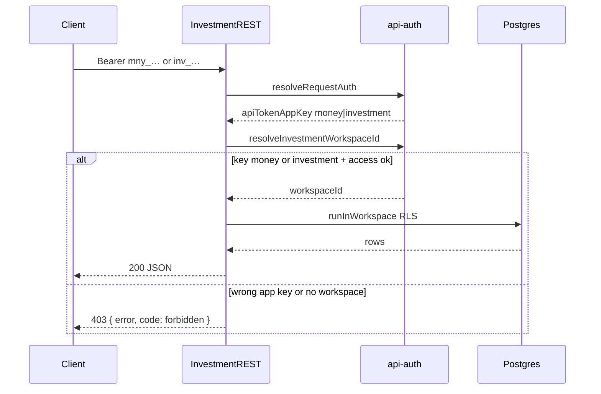
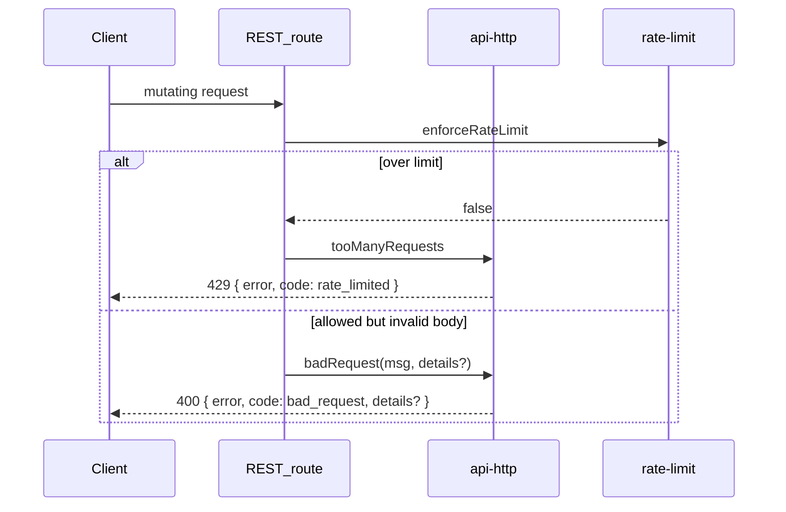
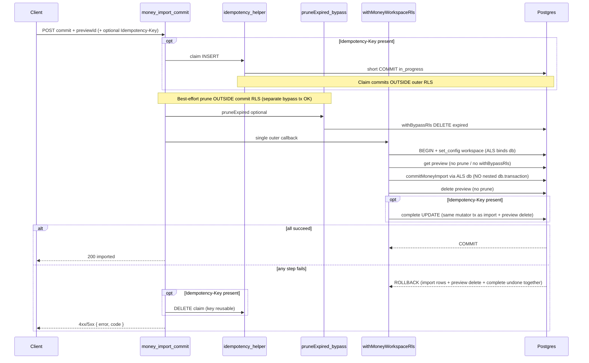

# Design: App-wide API + DB hardening

**Mode:** simple — from `00-run.md`  
**Has API:** yes · **Has DB:** yes · **Has UI:** no  
**Updated:** 2026-09-22 (design-update round 3 — general Fix ask 1–4)

## Decision 1: which design approach?

### Option 1 — Shared REST kit + align hot paths (recommended)

**What it is:**
Extract shared REST error helpers; make Investment REST accept money **or** investment API keys (same rule as `resolveInvestmentWorkspaceId` / Investment GraphQL). Add rate limits on Investment mutating REST. Put Money import commit + preview delete on **one outer RLS connection** (refactor nested `db.transaction` / no prune-bypass inside that callback). Improve Investment Zod error messages. Add durable Postgres `Idempotency-Key` store on three hot REST mutators. Document pagination dialects and non-RLS system tables; keep ESLint array/`SUM` guards.

**Example:**
`lib/api-http.ts` → `{ error, code }` JSON for 4xx/429; `requireInvestmentContext` allows `apiTokenAppKey === "money" | "investment"`; money import commit: prune outside → one `withMoneyWorkspaceRls` → ALS-bound `commitMoneyImport` + preview delete (no nested `db.transaction`, no `withBypassRls` prune inside).

**Pros:**

- Fixes Critical auth/error splits with a small, testable diff
- Matches Mode simple and ranks 1–5, 7–10 (rank 6 docs-only)
- Reuses Money helpers / `runInWorkspace` / existing rate-limit names

**Cons:**

- Does not unify list pagination this run (rank 6 docs-only)
- Idempotency-Key only on hot mutating REST (not every write)

**Rejected alternative (≤3 lines):** Full rewrite of every list pagination across Money/Investment/Baby — boil-the-ocean; rejected for Mode simple / Decision 5.

## Tradeoffs

One-line: Option 1 ships auth/errors/rate-limit/tx/idempotency on hot paths now; pagination unify waits for a follow-up.

## Recommendation

**Pick Option 1** — shared JSON error kit, Investment REST auth aligned to GraphQL (money keys allowed; GraphQL unchanged), Investment rate limits, atomic Money import commit, Investment validation messages, Idempotency-Key on hot mutators, plus docs/lint hygiene for ranks 6 and 9–10.

## Chosen design (user-approved)

- **Decision 3 Option 1:** Allow money API keys on Investment REST; do **not** tighten GraphQL.
- **Decision 4 Option 3:** Scope = analysis ranks **1–10**.
- **Decision 5 Option 1:** Rank **6** = document only (no pagination code). **Implement:** 1–5, 7–10 (9–10 = docs/lint if little code).

## Build vs Defer

| Rank | Severity | This run | Notes |
|------|----------|----------|-------|
| 1 | Critical | **Build** | Investment REST auth = GraphQL / `resolveInvestmentWorkspaceId` |
| 2 | Critical | **Build** | Shared `{ error, code }` JSON; replace plain-text 429/404 on hot session routes + GraphQL HTTP 429/403 where cheap |
| 3 | Major | **Build** | Core `lib/api-http.ts` (+ thin feature re-exports) |
| 4 | Major | **Build** | `enforceRateLimit` on Investment activities + import REST |
| 5 | Major | **Build** | One outer RLS connection: commit writes + preview delete share ALS tx; prune **outside**; refactor `commitMoneyImport` (no nested `db.transaction`) |
| 6 | Major | **Docs only** | Table pagination dialects; follow-up ticket — **no code rename** |
| 7 | Major | **Build** | Investment Zod → join issues in `badRequest` / `details` |
| 8 | Enhancement | **Build** | HTTP `Idempotency-Key` + durable Postgres table on three hot REST mutators (money import commit, investment import commit, workspace members add) — **not deferred** |
| 9 | Enhancement | **Docs / hygiene** | Document non-RLS system tables + ownership checks |
| 10 | Enhancement | **Docs / lint** | Confirm ESLint array/`SUM` guards; no new violations |

## System design

### Overview

- **What it is:** Same workspace-scoped App Router APIs; harden trust and contract edges without a new BFF or schema rewrite.
- **Components / boundaries:** Client → REST/GraphQL routes → `require*Context` / Yoga context → `runInWorkspace` (RLS) → Postgres. Cron stays on `withBypassRls` + `lib/cron-auth.ts`.
- **Data flow:** Auth resolve → workspace id → feature handler → one outer RLS transaction for multi-step Money import writes. Error path always JSON `{ error, code }` on REST (and preferred on GraphQL HTTP transport errors). Fields: see Contracts.
- **Consistency & failure:** Import commit + preview delete share the **same** RLS connection / ALS-bound tx (all-or-nothing rollback). Prune of expired previews runs **outside** that callback (never `withBypassRls` nested under the commit RLS tx). Auth mismatch → 403. Rate limit → 429 JSON. Idempotency: short committed claim `INSERT`, then side effect + complete in **one** DB transaction when the route has an outer tx (money import); on caught failure after claim → **DELETE** claim (key reusable). TTL prune deletes only expired **`completed`** rows (never ambiguous `in_progress`).
- **Why this shape:** Aligns transports to one auth truth (`lib/api-auth.ts`); avoids rewriting list dialects (rank 6 deferred).
- **Best practices:** One auth resolver of truth; Money `{ error, code }` as REST bar; ESLint `ANY`/`SUM` rules; no client-supplied workspace id alone.
- **Anti-patterns:** Plain-text error bodies; Investment-only token check that disagrees with GraphQL; N separate `with*WorkspaceRls` for one user action.
- **Reference:** `docs/ARCHITECTURE.md`, `lib/api-money.ts`, `db/index.ts`.

### Concept 1 — Dual auth, one app-key rule

- **What it is:** Session cookie and API token share the same workspace resolve rules per feature.
- **How we use it here:** Investment REST accepts money **or** investment keys; GraphQL already does — leave GraphQL alone.
- **Why we chose it:** Fixes silent automation bugs; unlocking money keys is additive (not a silent lockout).
- **Best practices:** Document allowed key matrix; test money + inv + wrong key; Baby stays session-only.
- **Reference:** `lib/api-auth.ts` `resolveInvestmentWorkspaceId`.

## Sequence diagram

### Auth align (Investment REST)



### Error helper (shared JSON)



### Import atomic commit (rank 5 — nested-tx reality; composed with rank 8 claim)

**Today (broken):** route opens **three** `withMoneyWorkspaceRls` calls; `getImportPreview` / `deleteImportPreview` call `pruneExpired` → `withBypassRls` (separate top-level tx on `getDbInstance()` while an outer RLS connection may still be held); `commitMoneyImport` always opens its own `db.transaction` (nested under RLS, not the same atomic unit as preview delete).

**Target wiring order** (when `Idempotency-Key` present — see also Idempotency-Key sequence below):

1. **Claim** — short committed `INSERT` **outside** the outer RLS callback (peers must see `in_progress`).
2. **Prune** — optional best-effort `pruneExpired` still **outside** RLS.
3. **Outer RLS** — preview load + import writes + preview delete + **idempotency complete** share one mutator tx.
4. On caught failure after claim → **DELETE** claim (outside / after rollback); key reusable.



### Idempotency-Key (rank 8 — main + failure returns)

Applies to the three hot mutators. Money import composes with the Import sequence above (claim outside RLS; complete inside mutator tx). Investment import / members add: claim commit, then wrapping write tx = feature writes + complete.

```mermaid
sequenceDiagram
  participant C as Client
  participant R as hot_mutator_REST
  participant Idem as idempotency_helper
  participant DB as Postgres

  C->>R: mutate + Idempotency-Key + body
  R->>Idem: hash raw body bytes; claim
  Idem->>DB: INSERT in_progress ON CONFLICT DO NOTHING
  alt claim won (row returned)
    Note over R,DB: Side effect + complete in ONE mutator tx (money: outer RLS; else wrapping write tx)
    R->>DB: feature writes
    R->>DB: UPDATE completed + response_body
    alt mutator tx commits
      DB-->>R: COMMIT
      R-->>C: success (no replay header)
    else caught failure / abort after claim
      DB-->>R: ROLLBACK writes
      Idem->>DB: DELETE claim (status in_progress)
      R-->>C: 4xx/5xx { error, code } (no stored-error replay)
      Note over C,R: Same key+body may retry (new claim)
    end
  else conflict — existing row
    Idem->>DB: SELECT existing by unique key
    alt expires_at <= now() (completed OR in_progress)
      Idem->>DB: DELETE expired row
      Idem->>DB: INSERT new claim
      Note over Idem,DB: Expired UNIQUE reclaim — never 409 in-flight
      R->>DB: side effect + complete (same as claim-won path)
      R-->>C: success
    else non-expired in_progress
      R-->>C: 409 { error, code: idempotency_in_progress }
    else non-expired completed + same request_hash
      R-->>C: replay status+body + Idempotency-Replayed: true
    else non-expired completed + different request_hash
      R-->>C: 409 { error, code: idempotency_body_mismatch }
    end
  end
```

## Contracts

### API contracts

#### Shared REST error envelope (changed)

| Item | Detail |
|------|--------|
| Shape | `{ error: string, code: string, details?: unknown }` — match `lib/api-money.ts` |
| Codes | `unauthorized` 401 · `forbidden` 403 · `bad_request` 400 · `not_found` 404 · `conflict` 409 · `idempotency_in_progress` 409 · `idempotency_body_mismatch` 409 · `rate_limited` 429 · `db_unavailable` 503 |
| Who | All hardened REST helpers (`lib/api-http.ts`); feature files re-export |
| Migration | Tokens / timezone / GraphQL HTTP 429–403 move from plain text → this JSON |

#### Investment REST auth (changed)

| Item | Detail |
|------|--------|
| Method + path | Existing `app/api/investment/**` (activities, import, …) via `requireInvestmentContext` |
| Auth / who can call | Session **or** API token with `appKey` **money** or **investment**; write scope when `requireWrite` |
| Request fields | Unchanged per route |
| Success | Unchanged |
| Errors | Wrong key / no workspace → 403 `{ error, code: "forbidden" }`; GraphQL Investment **unchanged** (already allows money) |
| Downstream | `resolveInvestmentWorkspaceId`, `verifyMoneyWorkspaceAccess` |

#### Investment rate limit (changed)

| Item | Detail |
|------|--------|
| Paths | `app/api/investment/activities/route.ts`, `[id]/route.ts`, `app/api/investment/import/**` |
| Behavior | Call `enforceRateLimit` with stable names (e.g. `investment:activities`, `investment:import:*`) before mutate |
| Over limit | 429 `{ error, code: "rate_limited" }` |

#### Investment validation messages (changed)

| Item | Detail |
|------|--------|
| Paths | Investment REST that today return opaque `"Validation failed"` / `"Invalid query"` |
| Errors | 400 `bad_request` with human message; optional `details` = Zod `flatten()` / joined issues (workspace members pattern) |

#### Money import commit (changed behavior, same path)

| Item | Detail |
|------|--------|
| Method + path | `POST /api/money/import/commit` |
| Auth | Existing `requireMoneyContext` + write + CSRF/rate limit as today |
| Request | Unchanged (`type`, `previewId` \| `rows`) |
| Success | Unchanged import result |
| Errors | Preview missing → 400; any failure inside outer RLS → **ROLLBACK** of import writes **and** preview delete together |
| Downstream | Optional best-effort `pruneExpired` **before** entering RLS. One `withMoneyWorkspaceRls`: load preview (**no** prune / **no** `withBypassRls`) → `commitMoneyImport` on ALS-bound `db` (**must not** open nested `db.transaction`) → `deleteImportPreview` (**no** prune). Refactor `lib/money-import.ts` + commit-path preview helpers accordingly. |

#### Pagination (document only — no API change)

| Dialect | Where | Params |
|---------|-------|--------|
| Money lists | Money validators / GraphQL | `page` / `pageSize` + composite cursor |
| Investment / Savings REST | Investment/Savings validators | `limit` / `cursor` (uuid) |
| Baby GraphQL | Baby validators | `limit` max 100 |

**Follow-up (not this PR):** unify dialects.

#### Idempotency-Key on hot mutators (changed — rank 8)

| Item | Detail |
|------|--------|
| Header | Optional `Idempotency-Key` |
| Max key length | **128** Unicode code points; longer → 400 `{ error, code: "bad_request" }` |
| Paths (this run only) | `POST /api/money/import/commit`; `POST /api/investment/import/commit`; `POST /api/workspace/members` (add). **No** REST loan pay — pay is GraphQL-only (`payLoanInstallmentWithTransaction`); out of scope. Members remove/patch **not** in scope. |
| Missing header | Current behavior (no store; unsafe to retry documented) |
| Request body hash | Hash of **raw request body bytes as received** (same bytes on claim and on compare). Do **not** re-serialize / sort JSON keys. |
| Same key + same actor (`user_sub`) + same `workspace_id` + same route + same request body hash within TTL | Replay first **completed** success: same HTTP status + JSON body; response header `Idempotency-Replayed: true` |
| Same key + different body hash | **409** `{ error, code: "idempotency_body_mismatch" }` |
| Concurrent in-flight (same unique key, first request still `in_progress`, **not** expired) | **409** `{ error, code: "idempotency_in_progress" }` — do **not** wait/lock across serverless instances |
| Post-claim handler failure / abort | **DELETE** the claim row (do **not** leave `in_progress` until TTL). Same key + same body **may retry** and take a new claim. Do **not** store/replay error responses. |
| TTL | **24 hours** from claim insert. Non-expired `completed` rows are replayable. Rows with `expires_at <= now()` are **not** replayed. |
| Expired UNIQUE reclaim | On claim conflict, if existing row `expires_at <= now()`: **DELETE** that row then INSERT a new claim. **Never** return 409 in-flight for an expired row (whether prior status was `completed` or `in_progress`). |
| Storage | Durable Postgres table `http_idempotency` (**this run** — not cache). See Database contracts. |
| Claim → complete lifecycle | (1) Short **committed** claim `INSERT` (visible to peers). (2) Side effect + `completed` UPDATE in **one** DB transaction when the route has (or opens) an outer tx — money import: same outer RLS/ALS tx as Task 4. Routes without a feature outer tx (investment import, members add): one short transaction wrapping feature writes + complete, **before** the HTTP response is sent. (3) Caught failure after claim → DELETE claim. |
| Claim SQL | `INSERT … ON CONFLICT DO NOTHING` (or catch unique violation) on unique `(workspace_id, user_sub, route, key)` — **not** check-then-act SELECT. Winner runs handler; loser reads row for replay / conflict / expired reclaim. |

**Why same-tx complete closes double-apply:** Side-effect commits and `completed` UPDATE commit together. A crash cannot leave applied writes without a stored response. Retry after DELETE-on-failure or after expired reclaim therefore cannot double-apply a prior success-without-complete (that window is impossible when complete shares the mutator tx).

**Events / other module APIs:** none beyond the above.

### Database contracts

No schema change for ranks 1–7, 9–10. Rank 8 **adds** durable table `http_idempotency` (additive migration this run). Rank 5 is connection/tx ownership only — **no** schema change for import preview (`money_import_preview` already has workspace RLS in `0034`; keep it **off** the non-RLS system list).

| Table / collection | Purpose | Key fields (typed) | Indexes / uniques | Write owner | Read owners |
|--------------------|---------|--------------------|-------------------|-------------|-------------|
| `money_import_preview` (existing) | Stash preview rows until commit | existing (`0015` + RLS `0034`) | existing | Money import (RLS) | Money import preview/commit |
| Money domain rows touched by import | Persist committed import | existing schema | existing | `commitMoneyImport` on outer RLS/ALS tx | Money GraphQL/REST |
| **`http_idempotency` (new, rank 8)** | Durable first-response store for `Idempotency-Key` | See column table below | **UNIQUE** `(workspace_id, user_sub, route, key)`; index on `expires_at` | Shared HTTP idempotency helper (claim + complete) | Same helper on replay |
| `api_token`, `audit_event`, `user_preferences`, `workspace*` | System / user (**no** workspace RLS) | existing | existing | App routes with ownership filters | Same — **document** rank 9 |

#### `http_idempotency` columns (typed)

| Column | Type | Null | Notes |
|--------|------|------|-------|
| `id` | `uuid` | NOT NULL | PK, `gen_random_uuid()` |
| `workspace_id` | `uuid` | NOT NULL | FK → `workspace(id)` ON DELETE CASCADE |
| `user_sub` | `text` | NOT NULL | Actor who sent the key |
| `route` | `text` | NOT NULL | Stable route id, e.g. `POST /api/money/import/commit` |
| `key` | `text` | NOT NULL | Client `Idempotency-Key` (≤128) |
| `request_hash` | `text` | NOT NULL | Hash of **raw body bytes as received** (e.g. sha256 hex) |
| `status` | `text` | NOT NULL | `in_progress` \| `completed` (check constraint). On known handler failure: **DELETE** row (no `failed` status). |
| `response_status` | `integer` | NULL | Set when `completed` |
| `response_body` | `jsonb` | NULL | Stored JSON body when `completed` |
| `expires_at` | `timestamptz` | NOT NULL | Claim time + 24h |
| `created_at` | `timestamptz` | NOT NULL | `default now()` |
| `completed_at` | `timestamptz` | NULL | When response stored |

**Ownership / RLS:** **No workspace RLS** on `http_idempotency` (same class as `security_rate_limit` / system tables). Cross-feature helper (Money, Investment, workspace members) always filters by `workspace_id` + `user_sub` from server auth — never trust client-supplied workspace alone. Document under rank 9 list as app-filter table. **`response_body` is sensitive** (may hold money amounts / member data): 24h TTL, app-filter only, never log the jsonb.

**TTL cleanup owner:** Shared helper (or tiny cron/best-effort prune on claim path) deletes **only** `WHERE expires_at <= now() AND status = 'completed'`. **Do not** prune `in_progress` (ambiguous if a crash left a claim; reclaim path handles expiry under UNIQUE — see Example 4). Best-effort; expired rows must not replay even if not yet deleted.

**Claim / complete / reclaim (rank 8 integrity):**

1. **Claim** — committed `INSERT` first (so peers see `in_progress`).
2. **Side effect + complete** — same DB transaction when the route has an outer tx (money import RLS) or a wrapping write tx (investment import / members). Complete **before** HTTP response.
3. **Caught failure / abort after claim** — `DELETE` claim → same key+body may retry.
4. **Expired UNIQUE reclaim** — on conflict, if `expires_at <= now()`, `DELETE` existing row then `INSERT` new claim; never 409 in-flight for expired.
5. **Success-without-complete** — closed by rule 2 (same-tx). Task 6 must prove crash between handler success and complete cannot double-apply (impossible when complete shares the mutator tx).

**Additive migration sketch (next number after latest in `db/migrations/`):**

```sql
CREATE TABLE IF NOT EXISTS http_idempotency (
  id uuid PRIMARY KEY DEFAULT gen_random_uuid(),
  workspace_id uuid NOT NULL REFERENCES workspace(id) ON DELETE CASCADE,
  user_sub text NOT NULL,
  route text NOT NULL,
  key text NOT NULL,
  request_hash text NOT NULL,
  status text NOT NULL CHECK (status IN ('in_progress', 'completed')),
  response_status integer NULL,
  response_body jsonb NULL,
  expires_at timestamptz NOT NULL,
  created_at timestamptz NOT NULL DEFAULT now(),
  completed_at timestamptz NULL,
  CONSTRAINT http_idempotency_workspace_user_route_key_uq
    UNIQUE (workspace_id, user_sub, route, key)
);

CREATE INDEX IF NOT EXISTS http_idempotency_expires_idx
  ON http_idempotency (expires_at);
```

**Data ownership notes:**

- Workspace feature data: RLS via `app.workspace_id` in `runInWorkspace`.
- System / app-filter tables (`api_token`, `audit_event`, `user_preferences`, `workspace*`, **`http_idempotency`**): no workspace RLS; app must filter by `userSub` / workspace membership.
- **Do not** list `money_import_preview` as non-RLS — it has workspace RLS (`0034`).
- Rank 5: **no** schema migration — same outer RLS connection + ALS; refactor helpers only.
- Rank 8: migration + Drizzle schema **this run**.

### Example queries

```ts
// Example 1: Money import commit — outer RLS only; prune outside; no nested tx
await pruneExpired(); // optional; withBypassRls OK here — NOT inside the callback below
await withMoneyWorkspaceRls(ctx, async () => {
  // getImportPreview / deleteImportPreview MUST skip pruneExpired on this path
  const rows = previewId
    ? await getImportPreview(ctx, previewId) // commit-path: no prune
    : bodyRows;
  if (previewId && !rows) throw /* bad_request */;
  // commitMoneyImport uses ALS-bound `db` — MUST NOT call db.transaction()
  const imported = await commitMoneyImport(ctx, type, rows);
  if (previewId) await deleteImportPreview(ctx, previewId); // no prune
  return imported;
});
// Acceptance: force throw after import writes, before/during delete → ROLLBACK; no committed import rows
```

```sql
-- Example 2: Tenant read under RLS (unchanged pattern)
-- SET LOCAL app.workspace_id = '<workspace-uuid>';
-- SELECT … FROM money_… WHERE …;  -- policies enforce workspace
```

```ts
// Example 3: Keep ESLint bar — never bind JS arrays as PG arrays
// GOOD: .where(inArray(table.id, ids))
// BAD:  sql`WHERE id = ANY(${ids}::uuid[])`
```

```sql
-- Example 4: Idempotency claim + expired reclaim + complete (scalar binds only)

-- 4a. Claim attempt
INSERT INTO http_idempotency (
  workspace_id, user_sub, route, key, request_hash, status, expires_at
) VALUES (
  $1::uuid, $2, $3, $4, $5, 'in_progress', now() + interval '24 hours'
)
ON CONFLICT (workspace_id, user_sub, route, key) DO NOTHING
RETURNING id;

-- 4b. If no row returned: SELECT existing
SELECT id, request_hash, status, response_status, response_body, expires_at
FROM http_idempotency
WHERE workspace_id = $1::uuid
  AND user_sub = $2
  AND route = $3
  AND key = $4
LIMIT 1;

-- 4c. Expired UNIQUE reclaim — never 409 in-flight for expired
-- If expires_at <= now(): DELETE then retry INSERT (4a). Applies to completed OR in_progress.
DELETE FROM http_idempotency
WHERE id = $7::uuid
  AND workspace_id = $1::uuid
  AND user_sub = $2
  AND expires_at <= now();
-- then INSERT (4a) again

-- 4d. Non-expired in_progress → 409 idempotency_in_progress
-- Non-expired completed + same hash → replay; different hash → 409 idempotency_body_mismatch

-- 4e. Complete in SAME DB transaction as side effect (money: outer RLS; others: wrapping write tx)
UPDATE http_idempotency
SET status = 'completed',
    response_status = $5,
    response_body = $6::jsonb,
    completed_at = now()
WHERE id = $7::uuid
  AND user_sub = $2
  AND workspace_id = $1::uuid
  AND status = 'in_progress';

-- 4f. Caught handler failure / abort after claim → DELETE (key reusable; no 24h block)
DELETE FROM http_idempotency
WHERE id = $7::uuid
  AND workspace_id = $1::uuid
  AND user_sub = $2
  AND status = 'in_progress';

-- 4g. TTL prune — completed expired only (never ambiguous in_progress)
DELETE FROM http_idempotency
WHERE expires_at <= now()
  AND status = 'completed';
```

## Design patterns used

### Pattern 1 — Shared HTTP error facade

- **What it is:** One module owns status → `{ error, code }` mapping so features do not drift.
- **How we use it here:** `lib/api-http.ts`; `api-money` / `api-investment` / … re-export.
- **Why we chose it:** Rank 2–3; Money already is the bar.
- **Best practices:** Never `new Response("text")` for API errors on hardened routes; optional `details` for Zod only.
- **Anti-patterns:** Per-route ad-hoc JSON shapes.
- **Reference:** `lib/api-money.ts`.

### Pattern 2 — require*Context + runInWorkspace

- **What it is:** Resolve auth once, then run DB work under workspace RLS.
- **How we use it here:** Fix Investment context app-key gate; wrap import commit in one outer RLS callback; refactor `commitMoneyImport` to use ALS/`runInWorkspace` tx (no nested `db.transaction`).
- **Why we chose it:** Repo canonical REST path.
- **Best practices:** Feature facades stay thin; auth rules live in `api-auth` resolve helpers.
- **Anti-patterns:** Extra token checks that disagree with `resolve*WorkspaceId`.
- **Reference:** `lib/api-money.ts`, `db/index.ts`.

### Pattern 3 — Named enforceRateLimit on mutating REST

- **What it is:** Stable bucket names per route family before writes.
- **How we use it here:** Investment activities + import (Money/workspace already do this).
- **Why we chose it:** Rank 4 abuse gap.
- **Best practices:** Same JSON 429 via shared helper; CSRF still required for session writes.
- **Anti-patterns:** Rate limit only on GraphQL HTTP, not REST twins.
- **Reference:** `lib/rate-limit.ts`, Money import routes.

### Pattern 4 — Idempotency-Key claim/complete

- **What it is:** Durable first-response store: short committed claim, then side effect + complete in one mutator tx so retries replay success instead of double-applying.
- **How we use it here:** Shared helper + `http_idempotency` on three hot REST mutators; money import claim **outside** outer RLS, complete **inside** that same ALS tx (Task 4 + Task 6).
- **Why we chose it:** Rank 8 Build; serverless cannot wait across instances — UNIQUE claim + 409 beats check-then-act.
- **Best practices:** `INSERT … ON CONFLICT DO NOTHING`; hash raw body bytes; complete same-tx as writes; DELETE claim on caught failure; prune only expired `completed`; expired UNIQUE reclaim (never 409 in-flight for expired).
- **Anti-patterns:** Check-then-act SELECT; prune `in_progress`; store/replay errors; complete outside mutator tx (success-without-complete window).
- **Reference:** Example 4 + Idempotency-Key sequence; Task 6.

| Pattern | Why chosen (one line) | Reference |
|---------|----------------------|-----------|
| Shared HTTP error facade | One parseable client contract | `lib/api-money.ts` |
| require*Context + RLS | Tenant trust boundary | `db/index.ts` |
| Named rate limit | Close Investment mutate gap | `lib/rate-limit.ts` |
| Idempotency-Key claim/complete | Safe retries on hot mutators | Example 4; Task 6 |

## UI / UX / mobile

N/A — no UI

## Security design review (OWASP)

Trust boundaries:

- HTTP Bearer token / session cookie → `resolveRequestAuth`
- Workspace id from server resolve only (not body)
- RLS `set_config` per transaction; cron bypass is separate

Abuse cases:

- Money key used on Investment REST (now allowed by design — must still pass workspace access)
- Flood Investment import/activities without rate limit (fixed)
- Commit succeeds, preview delete fails → orphan preview / retry confusion (fixed by one outer RLS/ALS tx + no nested commit tx / no prune-bypass inside)
- Opaque validation used to probe fields (improved messages still must not leak secrets)
- Duplicate import/member-add retries without `Idempotency-Key` (mitigated on three hot REST paths via durable claim table)
- Orphaned `in_progress` after crash (mitigated: DELETE on caught failure; same-tx complete with side effect; prune never deletes `in_progress`; expired UNIQUE reclaim)

| OWASP | Status | Note |
|-------|--------|------|
| A01 Broken Access Control | pass (target) | Align Investment REST to GraphQL; keep workspace access checks |
| A02 Cryptographic Failures | pass (target) | No new crypto; `response_body` may hold money/member JSON — mitigate with 24h TTL, app-filter (`workspace_id` + `user_sub`), never log `response_body` |
| A03 Injection | pass | Keep parameterized Drizzle + ESLint array/`SUM` rules |
| A04 Insecure Design | pass (target) | Rate limit Investment mutates; atomic multi-step write |
| A05 Security Misconfiguration | pass (target) | Prefer JSON errors over plain text on API routes |
| A06 Vulnerable Components | N/A | No new deps planned |
| A07 Auth Failures | pass (target) | Explicit money\|investment key matrix + tests |
| A08 Software / Data Integrity | pass (target) | Single outer RLS tx for import commit+cleanup; idempotency claim unique |
| A09 Logging / Monitoring Failures | N/A | No new audit surface this run |
| A10 SSRF | N/A | No user URL fetch |

Source: https://owasp.org/Top10/

## Challenges answered

- **Do we need this?** Yes — Critical auth split and mixed error bodies break clients; import partial failure is a real integrity bug.
- **What fails?** Money-token Investment REST automation; clients parsing 429 text; commit without preview cleanup; Investment abuse without rate limit.
- **Is this overspecified?** No — rank **6** docs-only; rank **8** Build with bounded three REST paths + one table; 9–10 docs/lint; one shared kit not a framework rewrite.
- **Aggressive:** Allowing money keys on Investment REST widens token power — acceptable because GraphQL already grants it; document + test so operators are not surprised.
- **Aggressive:** One big import tx holds locks longer — prefer correctness over three short txs; keep work inside existing commit path only; prune stays outside.
- **Aggressive:** Joining Zod `details` can enlarge error payloads — cap to flatten/issues; never dump raw input secrets.
