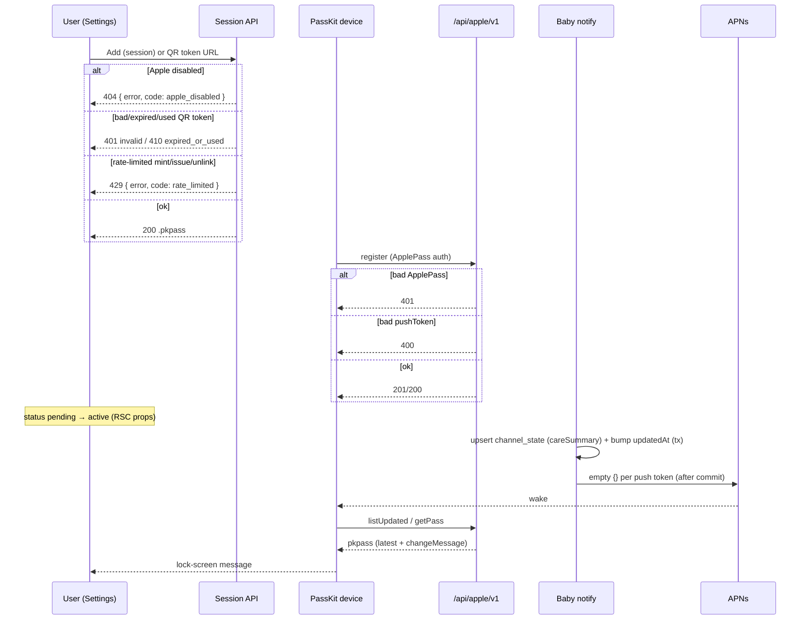

# Design: apple-wallet-notifications

**Mode:** full  
**Has UI:** yes · **Has API:** **yes** · **Has DB:** **yes**  
**Grill:** frontier-empty · human `1/1/1/1/1`  
**ADRs:** ADR-001 / ADR-002 Accepted  
**Design-update:** Round 2 Fix ask applied (API + DB residuals)

## Decision 1: How to ship the Wallet channel this pass?

### Option 1 — Full PassKit loop + Settings + Baby fan-out (recommended)

- **What it is:** Shared `lib/apple-wallet` with issue, PassKit web service, empty APNs, DB (subscriber/devices/registrations + workspace latest), shell Settings Add/status/QR, and Baby care notify fan-out using `careSummary`.
- **Example:** Caregiver Adds pass on `/settings` → device registers → feed logged → lock-screen shows same summary Telegram would send.
- **Pros:** Hits Gate A metric (real lock-screen); matches WalletCast loop; one vertical slice users can trust.
- **Cons:** Needs Apple certs + HTTPS; larger Build than UI-only.

### Option 2 — Settings shell + env gate only (defer WS/APNs)

- **What it is:** Show gated Settings section and maybe issue a static pass; skip register/listUpdated/getPass + APNs until a later run.
- **Example:** Add downloads a pass that never updates on care events.
- **Pros:** Smaller first PR; UI visible sooner.
- **Cons:** No lock-screen value; risks fake “active”; fails Outcome/Metric.

### Recommendation

**Pick Option 1** — user-first: day-to-day value is the care lock-screen ping, not a dead pass. Grill already locked the loop pieces.

## Chosen design (pending Gate B)

**Option 1** — Full PassKit channel.

## Locked picks (do not reopen)

| Topic | Pick |
|-------|------|
| Module | Shared `lib/apple-wallet` + thin `app/api/apple/**` (ADR-001) |
| Grain | One serial per `(workspace, user)`; multi-device via registrations |
| Issue auth | Session Add + short-lived QR issue token (ADR-002) |
| Issue token policy | **Single-use + TTL ≤10m** — redeem sets `consumed_at`; invalid → `401`, expired/used → `410` |
| Lock-screen copy | Telegram `careSummary` (user override) |
| Enable | Env-gated until required `APPLE_*` complete |
| Latest text | Workspace channel-state + bump subscriber `updatedAt` |
| Subscribe home | Shell `/settings` only; Telegram stays `/baby/settings` |
| Settings status | **RSC `/settings` props only** — not a REST status route |
| Workspace resolve | Baby `appKey` via `workspaceCookieName("baby")` (+ optional `workspaceId` on mutators) + membership → 403 |
| Soft-unlink | `status=removed` + **delete registrations** in same tx; push/WS filter `status=active` |
| fail UI | **Request-scoped only** (reload → not linked / pending; no durable error column) |
| v1 events | Baby care only |
| Status | not linked / pending / active / fail — **active** = ≥1 registration for this user’s serial; **pending** = issue→first register only; after last unregister → **not_linked** until re-Add |
| Human mutator rate-limit | issue download + mint + **unlink** (mirror watch-pair mint RPM) |

## System design

### Overview

- **What:** Parallel Baby notify channel via Apple Wallet PassKit (not App Store push).
- **Boundaries:** Core Settings owns subscribe UI; `lib/apple-wallet` owns issue/WS/APNs/DB repos; Baby owns care writes + schedule fan-out call (same events as Telegram).
- **Auth split:** Humans = session (Add/unlink/token mint); devices = `Authorization: ApplePass <authToken>`.
- **Data flow:** Issue → register device → care event → set workspace latest + bump subscriber `updatedAt` → empty APNs `{}` → device listUpdated/getPass → `changeMessage`.
- **Enable gate:** Incomplete `APPLE_*` ⇒ channel off (no Add/QR; issue/WS/notify no-ops).
- **Failure:** Issue errors → request-scoped fail status; APNs 410/Unregistered → prune token; remaining registrations keep active.
- **Why:** Matches Gate A + WalletCast loop without shipping a marketing-card product.
- **Anti-patterns:** Public unauthenticated issue; status=active without registration; missing `updatedAt` bump; Wallet UI under Baby settings.
- **Point to:** Sequence, API/DB contracts, OWASP below.

### Concept 1 — Parallel notify sinks

Same Baby care event → Telegram (optional) ‖ Wallet (optional); independent enable gates.

### Concept 2 — PassKit update loop

Issue → register → latest + `updatedAt` → empty APNs → fetch → `changeMessage` (Apple + WalletCast).

### Concept 3 — Auth boundary split

Session for humans; pass auth token for devices; QR uses short-lived single-use issue token only.

## Design patterns used

### Pattern 1 — Env all-required enable gate (repo)

**What:** Channel on only when every required env/cert is present.  
**Where:** `lib/telegram/config.ts` → mirror as `isAppleWalletEnabled`.  
**Apply:** Settings CTAs, issue, WS, notify.  
**Avoid:** Showing Add when Apple cannot issue.

### Pattern 2 — Injected notify deps + schedule (repo)

**What:** Fire-and-forget notify with injectable send deps for tests.  
**Where:** `features/baby/server/notify.ts`.  
**Apply:** Add Wallet branch beside Telegram; do not block GraphQL.  
**Avoid:** Awaiting APNs inside mutations.

### Pattern 3 — Framework-free PassKit + ApnsSender (WalletCast)

**What:** Lib implements WS/APNs; thin Next routes translate Request→Response; fake APNs in tests.  
**Where:** WalletCast `webservice.ts` / `apns.ts`.  
**Apply:** `lib/apple-wallet/{webservice,apns,pass,notify}.ts`.  
**Avoid:** Business logic inside route files.

## Sequence diagram



## API contracts

### Error envelope (all human JSON errors)

Flat project shape (`lib/api-http.ts`):

```ts
type ApiErrorBody = { error: string; code: string; details?: unknown };
```

No nested `{ error: { message } }`.

### Workspace resolve (human routes + Settings RSC)

| Rule | Value |
|------|--------|
| appKey | `"baby"` |
| Cookie | `workspaceCookieName("baby")` → `ctx_workspace_baby` via existing workspace resolve (cookie → default → personal/first membership) |
| Optional override | Mutators may accept `{ workspaceId?: string }` (body); session issue may accept `?workspaceId=` — must still pass membership |
| Membership | Actor must be a member of that Baby workspace → else **403** `{ error, code: "forbidden" }` |
| Disabled Apple | **404** `{ error, code: "apple_disabled" }` (no leak of cert state) |
| Settings status | Same resolve on RSC `/settings` page load — **not** a REST route |

### Session / human routes

#### `GET /api/apple-wallet/issue` (session)

| | |
|--|--|
| Auth | Session cookie |
| Workspace | Baby cookie resolve; optional `?workspaceId=` |
| Guards | Rate-limit (issue download); membership |
| Idempotency | **Safe to retry** — reissue same serial; upsert subscriber (see DB upsert rules) |
| Success | `200` body = pkpass bytes |
| Headers | `Content-Type: application/vnd.apple.pkpass`; `Cache-Control: no-store` |

#### `GET /api/apple-wallet/issue?t=<token>` (QR redeem)

| | |
|--|--|
| Auth | Issue token (no session required) |
| Policy | **Single-use + TTL ≤10m**; bound to `workspace_id` + `user_sub` |
| Idempotency | Redeem is **unsafe to retry** after success (token consumed) |
| Success | Same pkpass headers as session issue |
| Errors | See matrix — **not** `400` for bad/expired token |

#### `POST /api/apple-wallet/issue-token` (mint)

| | |
|--|--|
| Auth | Session + `assertSameOriginStrict` |
| Body | `{ workspaceId?: string }` (optional override) |
| Guards | Rate-limit (mirror watch-pair mint RPM); membership; Apple enabled |
| Idempotency | **Unsafe to retry** — each call mints a new token (prior outstanding tokens may remain until TTL/consume; housekeeping prunes) |
| Success | `201` |

```ts
// 201 response
{
  data: {
    url: string;       // absolute GET /api/apple-wallet/issue?t=...
    expiresAt: string; // ISO-8601
  }
}
```

| Headers | `Cache-Control: no-store` (parity with `POST /api/watch/pair` — body embeds redeemable URL) |

#### `DELETE /api/apple-wallet/subscription` (unlink)

| | |
|--|--|
| Auth | Session + `assertSameOriginStrict` |
| Body | `{ workspaceId?: string }` optional |
| Guards | Rate-limit (mirror mint RPM); membership; Apple enabled |
| Idempotency | **Idempotent** — already removed / never linked → `204` |
| Success | `204` no body |
| Side effects | Soft `status=removed` + delete registrations (same tx); see DB |

#### Settings status (RSC only — not REST)

Loaded in `app/(shell)/settings/page.tsx` (or child server component) and passed as props:

```ts
type AppleWalletSettingsProps = {
  appleEnabled: boolean;
  status: "not_linked" | "pending" | "active" | "fail";
  // fail is request-scoped after a failed Add in this navigation only;
  // on fresh RSC load: fail never appears — map to not_linked | pending | active
};
```

### Human error matrix

| Situation | Status | `code` |
|-----------|--------|--------|
| No session (session routes) | 401 | `unauthorized` |
| Not Baby workspace member | 403 | `forbidden` |
| Apple channel disabled / incomplete env | 404 | `apple_disabled` |
| Cross-origin on mint/unlink | 400 | `bad_request` |
| Invalid issue token (unknown / bad shape) | 401 | `unauthorized` |
| Expired or already-used issue token | 410 | `gone` |
| Rate limited (issue / mint / unlink) | 429 | `rate_limited` |
| DB unavailable | 503 | `db_unavailable` |

**Do not** use `400` for bad/expired QR tokens.

### PassKit web service (Apple device)

Base: `webServiceURL` = `{BASE_URL}/api/apple` (paths under `/v1/...`).  
Align with WalletCast `createAppleWebService` (`walletcast-main/src/lib/apple/webservice.ts`).

| Op | Route | Auth | Success | Failure |
|----|-------|------|---------|---------|
| Register | `POST /v1/devices/{deviceLibraryId}/registrations/{passTypeId}/{serialNumber}` | `ApplePass` | `201` new reg / `200` existing; body empty | `401` bad/missing auth; `400` invalid `pushToken` (hex string 16–200) |
| Unregister | `DELETE` same | `ApplePass` | **`200` always when auth ok** (WalletCast — even if reg already gone) | `401` bad/missing auth only |
| listUpdated | `GET /v1/devices/{deviceLibraryId}/registrations/{passTypeId}?passesUpdatedSince=` | **None** (deviceLibraryId only; no `ApplePass`) | `200` `{ serialNumbers: string[], lastUpdated: string }` / `204` none | `404` wrong passTypeId |
| getPass | `GET /v1/passes/{passTypeId}/{serialNumber}` | `ApplePass` | `200` pkpass + `Content-Type: application/vnd.apple.pkpass` + `Last-Modified` + `Cache-Control: no-cache`; or **`304`** when request `If-Modified-Since` (HTTP-date, seconds) ≥ pass `Last-Modified` | **`401`** if auth bad or **`status≠active`**; **`404`** only if subscriber serial unknown after auth (channel row always present post-issue — see DB) |
| log | `POST /v1/log` | none | `200` (accept + discard/redact) | — |

**Authorize rule:** `ApplePass` must match subscriber `auth_token` **and** `status=active`. Wrong/missing token → **`401`**. Valid token but **`status≠active`** (e.g. removed) → **`401`**. **`404`** only when serial not found after auth succeeds.

**Pass fields:** `latest` with `changeMessage: "%@"`; serial + authenticationToken unique per subscriber.

## Database contracts

**RLS:** All five tables are **Non-RLS** (PassKit WS has no `app.workspace_id` session). Tenancy = membership checks for humans; serial + `auth_token` for devices. Task 2 adds them to `docs/ARCHITECTURE.md` Non-RLS list.

### `apple_wallet_channel_state`

| Column | Type | Null | Default |
|--------|------|------|---------|
| `workspace_id` | uuid PK → `workspace.id` ON DELETE CASCADE | no | — |
| `latest_message` | text | no | `''` |
| `latest_message_at` | timestamptz | yes | null |
| `updated_at` | timestamptz | no | now() |

- **Write owner:** **issue** (ensure empty row) + notify (care text)  
- **Read owners:** getPass (WS), notify  
- **Indexes:** PK only

### `apple_wallet_subscriber`

| Column | Type | Null | Default |
|--------|------|------|---------|
| `id` | uuid PK | no | `gen_random_uuid()` |
| `workspace_id` | uuid → `workspace.id` ON DELETE CASCADE | no | — |
| `user_sub` | text | no | — |
| `serial_number` | text UNIQUE | no | — |
| `auth_token` | text | no | — |
| `status` | text check `active\|removed` | no | `'active'` |
| `created_at` | timestamptz | no | now() |
| `updated_at` | timestamptz | no | now() |

- **Uniques:** `(workspace_id, user_sub)`; `serial_number`  
- **Indexes:** `(workspace_id, status)` for notify  
- **Write owner:** issue + unlink (+ register may set `status='active'` — no-op when authorize already requires active)  
- **Read owners:** Settings RSC, issue, WS (ApplePass), notify fan-out  
- **No** durable `last_issue_error` — fail UI is request-scoped

### `apple_wallet_device`

| Column | Type | Null | Default |
|--------|------|------|---------|
| `device_library_id` | text PK | no | — |
| `push_token` | text | no | — |
| `updated_at` | timestamptz | no | now() |

- **Write owner:** WS register / APNs prune  
- **Read owners:** notify (push tokens)  
- **ON DELETE:** when last registration for device removed → delete device row (WalletCast pattern)

### `apple_wallet_registration`

| Column | Type | Null | Default |
|--------|------|------|---------|
| `device_library_id` | text → `apple_wallet_device` ON DELETE CASCADE | no | — |
| `serial_number` | text → `apple_wallet_subscriber.serial_number` ON DELETE CASCADE | no | — |
| `pass_type_id` | text | no | — |
| `created_at` | timestamptz | no | now() |

- **PK:** `(device_library_id, serial_number)`  
- **Indexes:** `(serial_number)` — serial-only deletes/counts (unlink, Settings reg count, push join)  
- **Write owner:** WS register/unregister; unlink (bulk delete by serial)  
- **Read owners:** listUpdated, notify, Settings reg count

### `apple_wallet_issue_token` (mirror `watch_pairing_code` shape)

| Column | Type | Null | Default |
|--------|------|------|---------|
| `id` | uuid PK | no | `gen_random_uuid()` |
| `token_hash` | text UNIQUE | no | — |
| `workspace_id` | uuid → `workspace.id` ON DELETE CASCADE | no | — |
| `user_sub` | text | no | — |
| `expires_at` | timestamptz | no | — |
| `consumed_at` | timestamptz | yes | null |
| `created_at` | timestamptz | no | now() |

- **Policy:** single-use + TTL → `consumed_at` set on successful redeem  
- **Indexes:** `expires_at` (housekeeping); unique `token_hash`  
- **Write owner:** mint + redeem  
- **Read owners:** redeem only  
- **Prune:** `POST /api/cron/db-housekeeping` deletes where `expires_at <= now()` OR `consumed_at IS NOT NULL` (and older than grace if desired)

### Soft-unlink + re-Add upsert

| Action | Rules |
|--------|--------|
| Unlink | In **one tx**: set `status='removed'`, `updated_at=now()`; `DELETE` all `apple_wallet_registration` for that `serial_number`; orphan devices cleaned (no regs left → delete device). Do **not** delete subscriber row. Settings → **not_linked** until re-Add (not pending). |
| WS unregister (last device) | Same **removed** + orphan cleanup when reg count hits 0 (see Transactions); user must re-Add before register works again. |
| Push / listUpdated / getPass / ApplePass | Always filter or require `subscriber.status = 'active'`. |
| Re-Add (issue after removed) | Upsert on `(workspace_id, user_sub)`: keep **same** `serial_number`; set `status='active'`; **keep** `auth_token` until explicit rotate policy (prefer keep); clear regs already done by unlink. |
| Session reissue while active | Same serial + auth_token; bump `updated_at` only if pass content fields need refresh. |

### Transactions (required)

| Path | In one DB tx | After commit |
|------|--------------|--------------|
| Issue upsert | insert/update subscriber + **`apple_wallet_channel_state` INSERT … ON CONFLICT DO NOTHING** (or upsert with `latest_message=''`) for workspace so getPass never 404s for missing channel after successful issue | build/sign pkpass |
| Register | device upsert + registration insert; set subscriber `status='active'` (no-op if already active per authorize) | — |
| Unregister | delete registration for `(device, serial)`; if **0 regs** left for that `serial_number` → set subscriber `status='removed'`; if **0 regs** left for that `device_library_id` → delete device row (WalletCast) | — |
| Unlink | soft-remove + delete regs (+ orphan devices) | — |
| Notify | `channel_state` upsert + bump all active subscribers’ `updated_at` | APNs best-effort (compensating; prune 410 after) |

## Example queries

```ts
// Status for Settings RSC (session user) — use table column refs
const sub = await db.query.appleWalletSubscriber.findFirst({
  where: and(
    eq(appleWalletSubscriber.workspaceId, workspaceId),
    eq(appleWalletSubscriber.userSub, userSub),
    eq(appleWalletSubscriber.status, "active"),
  ),
});
const regs = sub
  ? await db
      .select()
      .from(appleWalletRegistration)
      .where(eq(appleWalletRegistration.serialNumber, sub.serialNumber))
  : [];
// not_linked | pending (sub && regs.length===0) | active (regs.length>0)
// fail only from in-request Add failure prop — never from DB

// Notify fan-out (single tx) then APNs
await db.transaction(async (tx) => {
  await tx
    .insert(appleWalletChannelState)
    .values({
      workspaceId,
      latestMessage: careSummary,
      latestMessageAt: now,
      updatedAt: now,
    })
    .onConflictDoUpdate({
      target: appleWalletChannelState.workspaceId,
      set: {
        latestMessage: careSummary,
        latestMessageAt: now,
        updatedAt: now,
      },
    });
  await tx
    .update(appleWalletSubscriber)
    .set({ updatedAt: now })
    .where(
      and(
        eq(appleWalletSubscriber.workspaceId, workspaceId),
        eq(appleWalletSubscriber.status, "active"),
      ),
    );
});
// then APNs using push-token SELECT below
```

```sql
-- Distinct push tokens for workspace (notify)
SELECT DISTINCT d.push_token
FROM apple_wallet_registration r
JOIN apple_wallet_device d ON d.device_library_id = r.device_library_id
JOIN apple_wallet_subscriber s ON s.serial_number = r.serial_number
WHERE s.workspace_id = $1
  AND s.status = 'active';

-- listUpdated: serials for device with subscriber.updated_at > since
SELECT r.serial_number, s.updated_at
FROM apple_wallet_registration r
JOIN apple_wallet_subscriber s ON s.serial_number = r.serial_number
WHERE r.device_library_id = $1
  AND r.pass_type_id = $2
  AND s.status = 'active'
  AND ($3::timestamptz IS NULL OR s.updated_at > $3);
```

## UI / UX / mobile (Build must match)

| Lock | Spec |
|------|------|
| Home | Shell `/settings` only — new `SettingsSection` category (e.g. id `apple-wallet`) |
| Gate A #1 | When `appleEnabled`: **Add to Apple Wallet** first (link/button → session issue download) |
| Gate A #2 | Status always visible when section shown: not linked / pending / active / fail |
| fail | Request-scoped after failed Add in client/RSC navigation; reload clears to not_linked/pending/active |
| Secondary | QR under details: “Scan from another device”; mint token on expand/show |
| Hidden | When Apple off: no Add/QR; short unavailable copy (mirror Telegram gate) |
| Separate channels | One line: Wallet here; Telegram remains under Baby settings |
| Unlink | Button + instruction to delete pass in Apple Wallet |
| Chrome | `SettingsSection` + DESIGN_GUIDE tokens; update `app/(shell)/settings/loading.tsx` category/skeleton parity |
| Mobile | Add = same-device download; QR for other phone; hit targets ≥44 via existing Button/`fx-hit-40` |
| Light/dark | Semantic tokens only; verify both |

## Security (OWASP)

| OWASP | Status | Note |
|-------|--------|------|
| A01 Broken Access Control | Mitigate | Session + Baby membership for issue/unlink; pass auth timing-safe; issue token bound to user+workspace, single-use + short TTL |
| A02 Cryptographic Failures | Mitigate | Certs/PEMs only in env; never DB/logs; HTTPS `BASE_URL` for updates |
| A03 Injection | Mitigate | Zod/validate pushToken + path params; no raw SQL concat |
| A04 Insecure Design | Mitigate | No public issue; no fake active; rate-limit issue + mint + unlink; same-origin on mutators |
| A05 Misconfiguration | Mitigate | Enable gate; `.env.example` names only; prune 410 tokens |
| A06 Vulnerable Components | Mitigate | Pin `passkit-generator` (+ QR lib if used); review advisories |
| A07 Auth Failures | Mitigate | Constant-time token compare; expire + consume issue tokens |
| A08 Integrity | Mitigate | Signed `.pkpass`; stable serial per user |
| A09 Logging | Mitigate | No auth tokens / PEMs in logs; Apple log endpoint redacts |
| A10 SSRF | N/A | No user-controlled fetch URLs in v1 |

## Aggressive challenges

- **Long `careSummary`:** Lock screen may truncate — accepted (Q3); do not invent a second formatter this pass.
- **Reissue same serial:** Required for updates; rotating serial breaks Apple update identity — keep serial, keep auth until unlink.
- **QR token replay:** **Locked:** single-use + TTL ≤10m; invalid→401, expired/used→410.
- **Multi-workspace:** Status/issue for **Baby** active workspace cookie — switching workspace means different pass.
- **Dev without certs:** Channel stays off — do not ship stub “active”.
- **Missing `updatedAt` bump:** Silent no-notify — tasks must assert bump + listUpdated.

## Non-goals

Google Wallet; WalletCast marketing dashboard; replace Telegram/Loans push; native app push; brand-studio pass art.

## Tasks handoff

See `04-tasks.md`. Automated tests planned (unit + route). E2E: optional Settings visibility only; real-device lock-screen is manual (certs).
