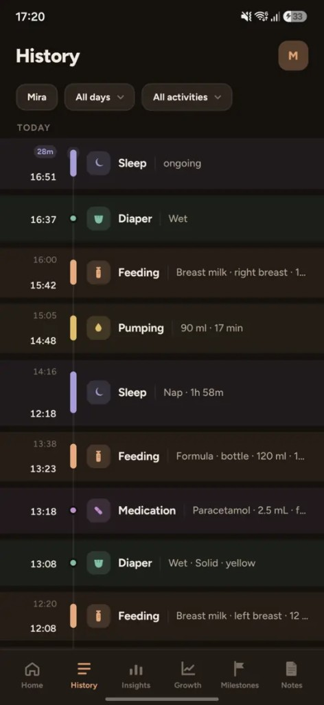
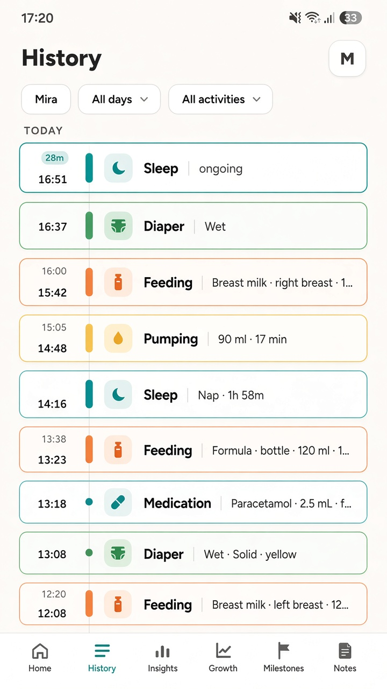
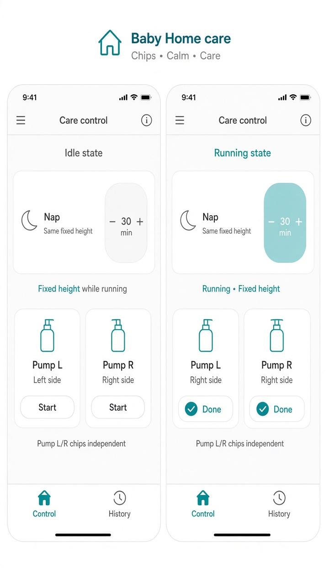

# UI concept (UI/UX designer): baby-activities-color-cues

**Result:** done
**Updated:** 2026-09-19
**Has UI:** yes

## Sources followed

| Source | Applied? | Notes |
|--------|----------|-------|
| Project `docs/DESIGN_GUIDE.md` / AGENTS.md UI rules | yes | tokens, radii, no hex sprawl |
| `clean-minimal-ui` skill | yes | teal accent, quiet surfaces |
| `frontend-ui-engineering` skill | yes | stable layout, a11y second channel |
| Existing UI patterns in repo (list paths) | yes | Activities ledger rows; Home timed chips; History source photo |

## Concept depth

**lean** — two related surfaces; 2 light mockups + source History ref.

## Align with Gate A (80/20)

| Item | From 01a / idea | How concept honors it |
|------|-----------------|------------------------|
| Important info/action #1 | Activities type + color + border cue | Left accent bar + tinted icon chip with thin border (History language) |
| Important info/action #2 | Stable Home chips; quiet save | Fixed Nap height; no Saved banner; chip Done flash only |
| Secondary (expand / modal / menu) | Norms / full timeline | Not in mockups |
| Top user journey | Nap → Pump (independent) → Activities scan | Shown across two refs |
| Sensible defaults | Near = theme border; unknown age = type only | Documented below |

## Screen / surface map

| Surface | Purpose | Primary actions |
|---------|---------|-----------------|
| Activities list/table | Scan typed + unusual time/ml | Open Edit / select (unchanged) |
| Home care chips | Log without noise / jump | Start/stop Nap, breast, Pump independently |

## UI reference images (required for Gate A2; confirm at Gate B without re-show)

| Surface | Variant (light / dark / mobile) | File path | Shown at Gate A2? | Confirmed at Gate B? (text ok) |
|---------|---------------------------------|-----------|-------------------|-------------------------------|
| Source History borders | dark / mobile (user) | `.my-docs/workflow/baby-activities-color-cues/ui-refs/00-source-history-borders.png` | yes | |
| Activities colors + borders | light / mobile | `.my-docs/workflow/baby-activities-color-cues/ui-refs/01-activities-colors-borders-light.png` | yes | |
| Home timer stable + quiet | light / mobile | `.my-docs/workflow/baby-activities-color-cues/ui-refs/02-home-timer-stable-light.png` | yes | |

Markdown previews:

## Layout concept (plain words)

- **Hierarchy / eye flow:** Activities — time → color bar → icon chip → title/summary. Home — chips stay in place; only the active family’s label/timer text updates.
- **Color language (type):** Sleep lavender; Diaper green; Feed peach/orange; Pump gold; Medicine/growth rose-violet (map to CSS variables in Design).
- **Comparison border (time/ml only):**
  - **Near regular:** solid border in the activity’s theme color (same as type).
  - **Below regular:** cooler / thinner border (or dashed) — not alarm red.
  - **Above regular:** warmer / slightly thicker border — still soft, not error.
  - Pair with `aria-label` or subtle text cue in Design (second channel).
- **No comparison:** diaper-type-only / some growth → type accent only, neutral thin border.
- **Home quiet save:** remove success `message` banner (“Saved breast feed” etc.). Keep on-chip Done flash (~2s). Errors may still use message.
- **Nap height:** reserved min-height for idle and running so subtitle/timer swap does not grow the card.
- **Pump independence:** starting Pump must not clear Nap session or breast timer; breast L↔R may still replace each other.

## Interaction notes

- Colors/borders are scan aids — not new filters.
- Timer tick updates only the running chip’s elapsed label (child island), not the whole Home tree remount.
- Skeleton: Activities row chrome must match new accent/chip so CLS stays zero.

## Out of concept (defer)

- Full duration-proportional History timeline rail.
- Insights chart color remap.
- Caregiver-editable personal norms.
- Dark Activities mock (light + source dark ref is enough for lean Gate A2).
