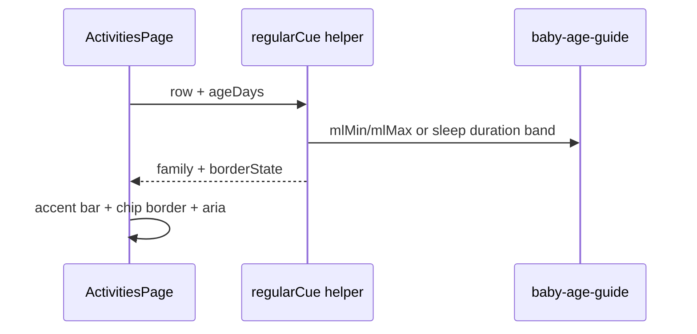

# Design: Activities colors + Home care feedback polish

**Mode:** full — from `00-run.md`

## Decision 1: which design approach?

### Option 1 — Dual timer families + cue helpers (recommended)

**What it is:**
Keep one `babyQuickCare` mutation. Widen local care-timer storage to **two concurrent slots** (breast family `breast_l|breast_r`, pump family `pump_l|pump_r`). Change plan/localAfter so pump actions never clear breast or attach breast `breastRunning`. Change server so **pump family** skips auto-`endNap` and does not require stopping breast. Activities get pure color + regular-cue helpers + row chrome. Home drops success banners; isolates elapsed; reserves Nap height.

**Example:**
Tap Pump L while Nap open and Breast L running → server writes pump start only; open sleep stays open; breast timer stays in storage; Nap chip height unchanged; Activities later show feed/sleep/pump accents with border cue from `baby-age-guide` ml/duration bands.

**Pros:**
- Fixes real server bug (Pump ends nap today)
- Matches Gate A2 / History accent language without new APIs
- Reuses age-guide ml bands; small duration tables added once

**Cons:**
- Storage migrate + plan/server tests must stay in sync
- Sleep duration bands are app-owned soft defaults (document as non-medical)

### Option 2 — Separate Pump mutation + History timeline rebuild

**What it is:**
New GraphQL path for pump that never touches sleep/breast; rebuild Activities as a full duration-proportional History timeline for colors/borders.

**Example:**
`babyPumpQuickCare` mutation + new timeline component replacing Spending ledger rows.

**Pros:**
- Hard isolation of Pump at the API boundary

**Cons:**
- Larger surface, duplicates quick-care idempotency
- Timeline rebuild was Gate A non-goal; slower, more CLS risk

## Tradeoffs

| Factor | Option 1 | Option 2 |
|--------|----------|----------|
| Cost / time | Medium | High |
| Complexity | Plan + store + server gates | New API + UI rewrite |
| Usability | Matches approved concept | More visual change than asked |
| Failure cases | Dual-slot migrate bugs | Two mutation paths to keep correct |

## Recommendation

**Pick Option 1** because it fixes Pump↔nap/feed at the real server/client choke points, keeps Activities as the existing ledger with History-style accents, and stays inside Gate A2 / non-goals.

## Chosen design (user-approved)

**Option 1** — Dual timer families + cue helpers; Gate B approved 2026-09-19.  
Also **Decision 2 → Option 1** — recent pump as fourth Home status line (`lastPump`).

## Sequence diagram

```mermaid
sequenceDiagram
  participant Home as BabyHome
  participant Plan as planBabyQuickCare
  participant Store as careTimer slots
  participant API as babyQuickCare
  participant QC as quick-care server
  participant DB as babyCareEvent

  Home->>Plan: action Pump L (breast slot running, nap open)
  Plan->>Plan: breastRunning omitted for pump family
  Plan->>API: BREAST pump_l, no breastRunning
  API->>QC: mutate
  QC->>QC: skip endNap (pump family)
  QC->>QC: skip saveBreast (none attached)
  QC->>DB: start/update pump feed leg
  QC-->>Home: steps (no endNap)
  Home->>Store: set pump slot only; breast slot unchanged

  Note over Home: Success — no Saved banner; chip Done flash only
```

Activities cue path (client-only):



## Contracts

### API contracts

| Item | Detail |
|------|--------|
| Method + path (or name) | Existing `babyQuickCare` (behavior change); existing `babyHomeQuickStatus` adds `lastPump` |
| Auth / who can call | Unchanged workspace baby auth |
| Request fields | Same quick-care schema; **semantic change:** clients must not send `breastRunning` for pump-family actions when breast is independent |
| Success response | Same `steps` + `openSleep`; pump family must not include `endNap` solely due to open sleep; status includes `lastPump` |
| Errors | Unchanged |
| Downstream calls | Telegram notify filters unchanged unless steps change |

**Events / other module APIs (if any):**
- None new. Telegram still follows committed steps.

### Database contracts

| Table / collection | Purpose | Key fields | Indexes / uniques | Write owner | Read owners |
|--------------------|---------|------------|-------------------|-------------|-------------|
| (none) | No schema migration | — | — | — | — |

**Data ownership notes:**
- LocalStorage care timer JSON shape changes (client-only migrate). Prefer `{ breast: Timer|null, pump: Timer|null }` with one-time read from legacy single-side blob.

### Example queries

No new SQL. Server still updates/inserts `baby_care_event` as today; pump family simply skips the open-sleep end update.

```ts
// Plan: pump family does not clear breast slot
localAfterFromQuickRequest(request) // pump_l start while breast_l running → clearBreastTimer false
```

```ts
// Cue: ml near-regular
compareMlToBand(120, { mlMin: 90, mlMax: 150 }) // → "near"
```

## Patterns to reuse

| Pattern | Why it fits | Reference |
|---------|-------------|-----------|
| Age feed ml bands | Regular ml source | `lib/baby-age-guide.ts` |
| Timed chip + done-flash | Quiet confirm | `baby-timed-care-chip.tsx` |
| Isolated 1 Hz tick | Selective re-render | `baby-home.tsx` breast elapsed child |
| Activity log rows | Cue inputs | `lib/baby-insights-activity-log.ts` |
| DESIGN_GUIDE tokens | Color accents | `app/globals.css` / docs |

## Implementation sketch (Option 1)

### A. Color + cue (Activities)

1. CSS vars e.g. `--baby-act-sleep`, `--baby-act-feed`, `--baby-act-diaper`, `--baby-act-pump`, `--baby-act-med`, `--baby-act-growth` (light/dark).
2. Family map (History mood → tokens):
   - sleep → sleep; diaper → diaper; feed formula/breast/bottle → feed; feed method pump / growthKind pump → pump; medication → med; other growth → growth.
3. Extract metric: bottle/formula/pump `amountMl`; sleep duration from `endedAt - at` (open sleep → `none` comparison); breast/pump timer `durationSec` when present.
4. Banding:
   - **ml:** existing `babyFeedGuideForAge` → below `< mlMin`, near `[mlMin, mlMax]`, above `> mlMax`.
   - **Sleep duration (soft caregiver defaults, non-medical):** add `napMinMin` / `napMaxMin` on sleep bands — starter table: 0–1mo 20–120; 1–2mo 20–120; 3–4mo 30–120; 5–6mo 30–120; 7–12mo 45–120; 1–3y 60–180 (minutes). Breast session duration: reuse same nap table for that age **or** `none` if duration missing — prefer compare when `durationSec` present.
5. Border state: `below` | `near` | `above` | `none` (no metric / unknown age / open sleep).
6. UI: mobile card left bar + icon chip border; desktop event cell chip; `aria-label` includes cue; skeleton mirrors chrome.

### B. Quiet save (Home)

- On quick-care success: **do not** `setMessage` from step keys / `home.savedFeed`.
- Keep messages for saveBlocked, chainFailed, recovery.
- Done-flash paths unchanged.

### C. Selective re-render + Nap height

- Nap/pump elapsed via dedicated tick children (like breast), not parent 30s/`clock` for face text.
- Nap: always reserve subtitle line (`min-h` or empty spacer) so losing `nextSleepLabel` does not shrink chip; keep `min-h-14` on chip/card.
- Prefer memoized chip islands keyed by side; `saving` may still disable all — acceptable if DOM nodes do not remount.

### D. Pump ≠ stop feed/nap

**Client store:** two slots; write helpers `writeBreastSlot` / `writePumpSlot`.

**Plan rules:**
- BREAST `breast_*`: preempt only breast slot; never clear pump slot.
- BREAST `pump_*`: preempt only pump slot; never clear breast; **omit** breast slot from `breastRunning`.
- `PUMP_AMOUNT`: never clear breast/pump timers; omit breast `breastRunning` unless product later wants merge (default: omit).
- `SLEEP` / `DIAPER` / `FORMULA`: leave existing breast-stop behavior unless tests prove otherwise (out of this ask) — **do not** end unrelated pump timer when stopping breast.

**Server (`executeBabyQuickCare` order):**
- Detect pump family: action `PUMP_AMOUNT` or `BREAST` with `pump_*` side.
- If pump family: **skip** open-sleep `endNap` block; **skip** `saveBreast` unless request explicitly includes breastRunning (client should not send it for independence).
- Non-pump actions keep today’s endNap behavior (unless a later pass expands “unrelated”).

### E. Recent pump status line (Decision 2 → Option 1)

- Add `lastPump: BabyTimelineItem | null` to home quick status.
- Server: newest feed event whose top-level `method` or any `legs[].method` is `pump` | `pump_l` | `pump_r` (order by feed activity time like lastFeed).
- Client: extend `statusLine` with `"pump"`; copy `home.status.pumpEmpty` / `home.status.pumpItem` (EN+VI) mirroring feed/diaper sentence shape.
- Place after diaper (or after feed — **after diaper** keeps feed/sleep/diaper order, pump last).
- Skeleton: fourth status placeholder under `data-skeleton="home-status"`.
- GraphQL/query options + e2e fixtures include `lastPump`.

## UI / UX / mobile

- **UI concept (01b):** History left bar + tinted chip border; Home quiet + fixed Nap height — honor; no conflicting layout.
- **80/20:** #1 Activities color+border; #2 Home stable quiet chips + status (feed/sleep/diaper/**pump**).
- **Layout / hierarchy:** time → bar → chip → title/summary on Activities; Home chip grid unchanged; status block gains pump line.
- **Loading / empty / error / success:** success = chip flash only; errors keep banner; Activities loading skeleton with accent placeholders; Home status skeleton **4** lines.
- **Skeleton parity (zero CLS):** update `BabyActivitiesPageSkeleton` / list skeleton rows with bar+chip slots.
- **Mobile:** ≥44px hits unchanged; accents must not grow row height beyond current card padding.
- **Accessibility:** do not rely on color alone — `aria-label` (or sr-only) for below/near/above; contrast on chip borders in light+dark.
- **Day-to-day:** soft cue language; no medical claim copy.

## Security design review (OWASP)

Trust boundaries:
- Workspace-scoped quick-care + timeline reads unchanged.
- LocalStorage timers are device-local UX only.

Abuse cases:
- Client omits `breastRunning` maliciously → may skip saving an in-progress breast (existing trust model: client-owned timer). Pump independence makes this intentional for pump taps only.

| OWASP | Status | Note |
|-------|--------|------|
| A01 Broken Access Control | pass | No auth change |
| A02 Cryptographic Failures | N/A | |
| A03 Injection | pass | No new raw SQL |
| A04 Insecure Design | pass | Soft cues; no medical claims |
| A05 Security Misconfiguration | N/A | |
| A06 Vulnerable Components | N/A | |
| A07 Auth Failures | N/A | |
| A08 Software / Data Integrity | pass | Idempotent request id unchanged |
| A09 Logging / Monitoring Failures | N/A | |
| A10 SSRF | N/A | |

Source: https://owasp.org/Top10/

## Challenges answered

- **Do we need this?** Yes — scan + concurrent Pump/Nap/Feed + quiet Home.
- **What fails?** Server auto-endNap on Pump; single timer slot; success banners; Nap subtitle height.
- **Is this overspecified?** No — Option 2 rejected; no timeline rebuild; no new DB.
