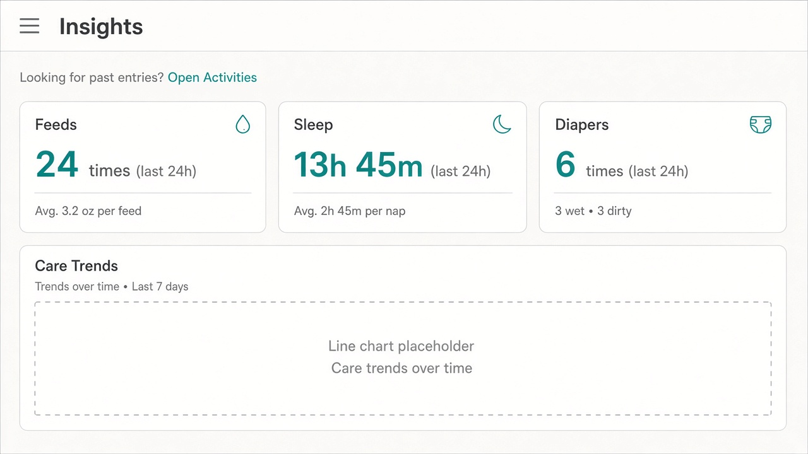

# UI concept (UI/UX designer): baby-activities-page

**Result:** done
**Updated:** 2026-09-18 (Gate A2 Option 2 — Spending chrome parity)
**Has UI:** yes

## Sources followed

| Source | Applied? | Notes |
|--------|----------|-------|
| Project `docs/DESIGN_GUIDE.md` / AGENTS.md UI rules | yes | Clean-minimal teal; `SHELL_DASHBOARD_STACK`; flat sharp table (no Card); filters → period → content; skeleton parity; ≥44px hits |
| `clean-minimal-ui` skill | yes | One teal accent; 8px grid; hairline borders; sharp tables; light mock for Gate A2 |
| `frontend-ui-engineering` skill | yes | Loading / empty / error; keyboard path; no hover-only Edit |
| Existing UI patterns in repo (list paths) | yes | `money-transactions-page.tsx` page stack; `InsightsDateRangeFiltersBar` / `MoneyFilterToolbar` + `FilterMenu`; `analytics-transactions-table.tsx` (`Button variant="ghost"` Edit in `TableRowActions`); `TransactionSelectionBar` / `BabyActivitySelectionBar`; `AnalyticsPeriodChip`; Baby section nav |

## Concept depth

**lean** — one primary surface (Activities page) + ≥1 light desktop image. Optional Insights cue image for findability after the move.

## Align with Gate A (80/20)

| Item | From 01a / idea | How concept honors it |
|------|-----------------|------------------------|
| Important info/action #1 | Period / date range (Apply when draft differs) | Always-visible period chip under filters; default **last 7 days**; Apply on filter bar when draft ≠ applied |
| Important info/action #2 | Activity ledger rows (what + when) + select + Edit | Main page body is the selectable ledger — not collapsed, no Insights expand gate |
| Secondary (expand / modal / menu) | Full edit in modal; rare filters in overflow; no summary strip; capture elsewhere | Edit opens existing modal; no KPI/trend strip; charts stay on Insights |
| Top user journey | Baby → Activities → range → scan → Edit/Delete → refresh | Nav **Activities** next to Insights; page is cleanup-only |
| Sensible defaults | Last 7 days; no selection; quiet empty; Insights cue | Same defaults; Insights shows one-line Activities link |

## Screen / surface map

| Surface | Purpose | Primary actions |
|---------|---------|-----------------|
| **Activities** (`/baby/activities`) | Browse / fix / delete past care + growth | Set range & filters → select rows → Edit / Delete |
| Insights cue (supporting) | Stop “entries vanished” after move | One-line link to Activities |

## UI reference images (required for Gate A2; confirm at Gate B)

Draft visual mockups for **Gate A2** (UI look) approval, then confirm still match at **Gate B**. Store under `.my-docs/workflow/baby-activities-page/ui-refs/`.

| Surface | Variant (light / dark / mobile) | File path | Shown at Gate A2? | Confirmed at Gate B? |
|---------|---------------------------------|-----------|-------------------|----------------------|
| Activities page (primary) | light desktop | `.my-docs/workflow/baby-activities-page/ui-refs/01-activities-page-light.png` | yes | |
| Insights → Activities cue | light desktop (optional lean) | `.my-docs/workflow/baby-activities-page/ui-refs/02-insights-activities-cue-light.png` | yes | |

**Minimum:** one image for the main primary surface (light). Prefer also: dark and/or mobile when the change is user-facing. Lean mode: one image is enough.

Markdown previews (for humans opening this file):

## Gate A2 feedback (Option 2)

**Human choice:** Activities must use the **same filter bar style** and **same table style** (row Edit button, floating edit bar, …) as Money **Spending**.

Round-1 mock was too far off (solid All / Feed / Sleep pill chips + teal text Edit links). **Round-2 mocks and this concept lock Spending-parity chrome** — see locks below. Insights cue image (`02-…`) stays as-is.

## Chrome locks (Spending parity — mandatory)

### Filter bar = Money / Insights toolbar (not care-type pills)

- **Locked pattern:** `MoneyFilterToolbar` + `FilterMenu` dropdown triggers + **Apply** (primary) / **Reset** (secondary or ghost per Money), same family as Spending’s `AnalyticsFiltersBar` and Baby Insights’ `InsightsDateRangeFiltersBar`.
- **Activities desktop chrome:** **Date range** menu button + **Care** multi-select menu button (Feed / Sleep / Diaper / … live *inside* the Care menu, not as a primary chip row) → Apply / Reset on the right.
- **Do not** use a primary row of solid teal (or filled) **All / Feed / Sleep / Diaper / …** pill chips. That was the rejected Gate A2 look.
- Reuse Insights date+Care filter chrome for Activities; do not invent a third filter language.

### Table = Money transactions selectable ledger

- Checkbox leading column; **sharp** table edges (no card radius on the table).
- Selected row: light teal / accent wash; checked checkbox uses accent.
- Row **Edit** = `Button variant="ghost" size="sm"` inside `TableRowActions` — **not** a teal text / underline-only link.
- Mobile cards follow Money ledger mobile cards when the Spending table does the same split.

### Floating selection bar = Transaction / Baby activity bar

- Same as `TransactionSelectionBar` / existing `BabyActivitySelectionBar`: fixed bottom, centered surface, `rounded-[var(--radius-md)] border border-border bg-surface shadow-[var(--shadow-md)]`.
- Contents: count label (“N activit(y|ies) selected”) + **Edit** (secondary) + **Delete** (danger) + **Clear** (ghost).
- Do not invent a different pill / dock style.

## Layout concept (plain words)

- **Hierarchy / eye flow:** Page heading **Activities** → **filter toolbar** (outlined menu triggers + Apply/Reset) → period chip → ledger table → (when selected) fixed bottom selection bar. No charts, no KPI strip.
- **Core vs secondary:** Dominant = date/Care filter menus + row list + select/Edit. Deferred = full fields in edit modal; care-type choices inside Care menu; Insights charts; capture flows on Home / Log.
- **Chrome order (locked for Build):** Match live Money Spending DOM: **filters bar → period chip → ledger**. Gate A “period → filters → ledger” means this chrome-then-list stack **without** summary stats — not a reorder above Money. Period stays always visible (#1) via `AnalyticsPeriodChip` under the toolbar.
- **Nav:** Baby section item **Activities**, `group: "review"`, next to Insights; route `/baby/activities`. Top-level page — no breadcrumbs.
- **Insights after move:** Remove Activity log panel. Add a quiet one-line cue under the Insights heading (before charts), e.g. “Looking for past entries? **Open Activities**” → `/baby/activities`. Not an alert banner; muted + teal link.
- **Components to reuse** (from `components/ui/*` or feature patterns):

| Component / pattern | Where it already lives | Use for |
|---------------------|------------------------|---------|
| `InsightsDateRangeFiltersBar` (`MoneyFilterToolbar` + `FilterMenu` Date + Care + Apply/Reset) | `analytics-filters.tsx` (Baby Insights) | Activities filter chrome — **not** solid care-type pill row |
| `AnalyticsPeriodChip` | Insights / Money | Always-visible range (#1); small active filter tags if any |
| Selectable ledger (checkbox, Event, Recorded, ghost Edit) | Activity log + `analytics-transactions-table.tsx` / `TableRowActions` | Main ledger on Activities |
| `BabyActivitySelectionBar` (parity with `TransactionSelectionBar`) | `baby-activity-selection-bar.tsx` | Edit / Delete / Clear when selected |
| `BabyInsightsEditModal` | `baby-insights-edit-modal.tsx` | Single-row edit / delete |
| `SHELL_DASHBOARD_STACK` / `SHELL_FULL_SPAN` | `lib/shell-layout.ts` | Page body spacing |
| `PageHeading` | shell | Title **Activities** |
| Baby section nav + icon | `app-section-nav.ts`, nav icons | **Activities** next to Insights |

## States

| State | Behavior |
|-------|----------|
| Loading | Full-page skeleton: filter toolbar → period chip → table rows (mirror live stack; zero CLS). No expand gate — data loads on open. |
| Empty | Quiet muted copy in table region (“No activities in this range”) — not error chrome; no selection bar. |
| Error | Inline `Alert` above table (“Couldn’t load activities”) + retry path when safe. |
| Success | After save/delete: list refreshes; selection clears; toast or settle alert for delete (reuse existing Activity log feedback scale). |

## Skeleton parity

Activities loading skeleton mirrors live order: filter toolbar skeleton (`MoneyAnalyticsFiltersBarSkeleton`-style triggers) → period chip skeleton → selectable table skeleton (same column count / row placeholders). Insights skeleton **drops** the collapsed Activity log block and may include a thin cue-line placeholder if the cue is always present.

## Mobile / a11y notes

- Thumb reach / ≥44px hits / no hover-only: row ghost Edit and selection-bar actions meet `fx-hit-40` / button primitives; filter **menu** triggers tappable (same as Spending / Insights); no hover-only actions.
- Labels, focus, contrast via tokens: visible labels / `aria-label` on icon-only; focus into edit modal; teal + text for selected state (not color alone); light + dark via semantic tokens.

## Style rules checklist

| Rule | Pass? | Note |
|------|-------|------|
| Semantic tokens (no hard-coded hex in feature UI) | yes | Teal accent via `--accent` |
| Concentric radii (`--radius-md` / `--radius-sm`) | yes | Filter menus / selection bar use `--radius-md`; nested chips `--radius-sm`; **table stays sharp** |
| One accent; clean-minimal / project preset | yes | Match Spending chrome without Money columns |
| Transition specificity (no `transition` shorthand) | yes | CSS-only microinteractions |
| Light + dark survive | yes | Concept + Build must verify both; Gate A2 image is light |

## Out of scope for this concept

- Summary stats / trend strip on Activities
- Charts on Activities
- Dual Activity log still on Insights
- New capture flows
- Money Spending code changes
- Solid All/Feed/Sleep primary pill chip row (rejected at Gate A2)
- Dark / mobile reference images (lean pass — optional later)

## Handoff to Analyze / Design

What Architect must preserve (do not reinvent the UI concept):

1. **Activities** is a Spending-like page: **filters toolbar → period chip → selectable ledger** only (no KPI/trend strip); default range **last 7 days**.
2. Filter chrome = **`InsightsDateRangeFiltersBar` / Money `FilterMenu` style** (Date + Care menus + Apply/Reset) — **not** a solid care-type pill row.
3. Table + row Edit + floating bar = Money transactions / `BabyActivitySelectionBar` parity (ghost Edit, not teal text link).
4. Ledger jobs (select → Edit / Delete → modal) move with the log off Insights; Insights keeps charts + a **short one-line Activities cue** (not silent removal).
5. Nav: `/baby/activities`, label **Activities**, review group next to Insights; reuse existing log helpers / selection bar / edit modal rather than rebuilding.
