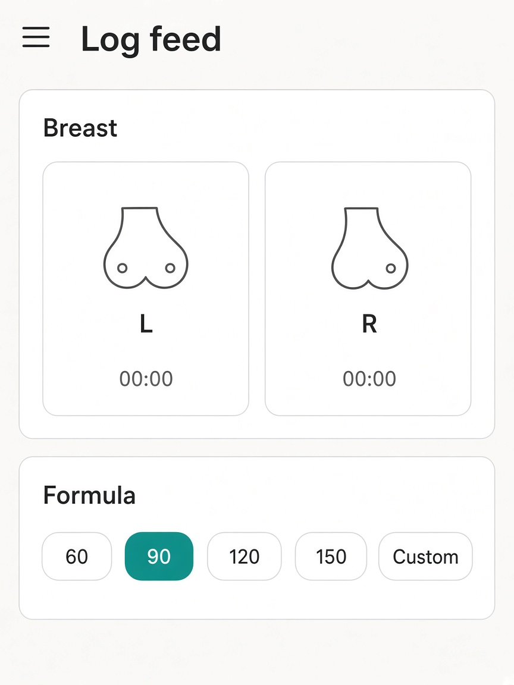
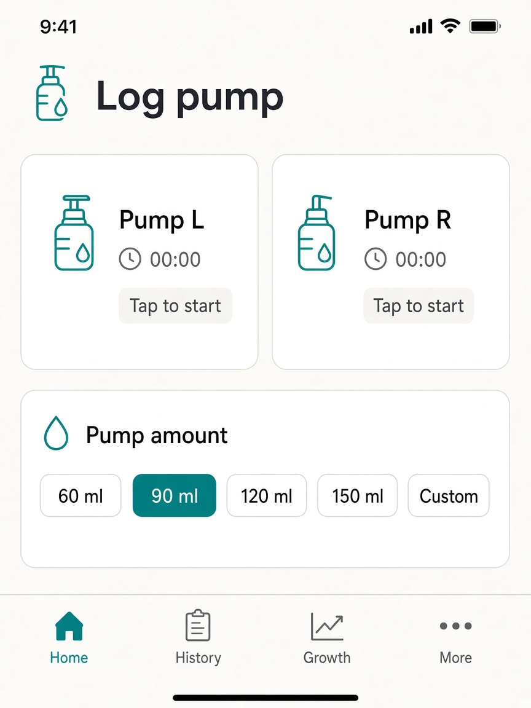
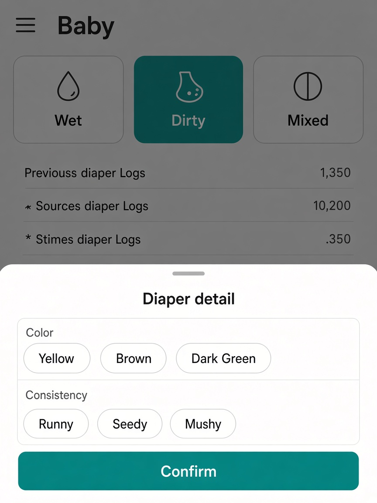

# UI concept (UI/UX designer): baby-care-pages-control-parity

**Result:** done
**Updated:** 2026-09-19
**Has UI:** yes

## Sources followed

| Source | Applied? | Notes |
|--------|----------|-------|
| Project `docs/DESIGN_GUIDE.md` / AGENTS.md UI rules | yes | clean-minimal / quiet tokens |
| `clean-minimal-ui` skill | yes | teal, 8px, hairline |
| `frontend-ui-engineering` skill | yes | states, a11y hits |
| Existing UI patterns in repo | yes | Home chips/sheets; money/new Category+Amount |

## Concept depth

**full** — four primary surfaces (feed, pump, growth, diaper).

## Align with Gate A (80/20)

| Item | From 01a / idea | How concept honors it |
|------|-----------------|------------------------|
| Important info/action #1 | Page primary controls | Feed breast+formula; Pump L/R+ml; Diaper kinds; Growth kind + field lines |
| Important info/action #2 | Feedback or Save | Timer/done flash; Growth primary Save |
| Secondary (expand / modal / menu) | Diaper dirty/mixed sheet | Bottom sheet over diaper page |
| Top user journey | Open → primary tap(s) → done | Same as Home / money/new |
| Sensible defaults | Home snaps; wet one-tap | Keep; Vaccine not default |

## Screen / surface map

| Surface | Purpose | Primary actions |
|---------|---------|-----------------|
| `/baby/feed` | Breast + formula like Home | L/R timers; ml chips + Custom |
| `/baby/pump` | Pump like Home | L/R timers; ml chips + Custom |
| `/baby/growth` | money/new field chrome | Kind chips; Value/Amount inputs; Unit/Symptoms Select |
| `/baby/diaper` | Home diaper + sheet | Wet/Dirty/Mixed; sheet on dirty/mixed |

## UI reference images (required for Gate A2; confirm at Gate B without re-show)

| Surface | Variant (light / dark / mobile) | File path | Shown at Gate A2? | Confirmed at Gate B? (text ok) |
|---------|---------------------------------|-----------|-------------------|-------------------------------|
| Feed | light / mobile | `.my-docs/workflow/baby-care-pages-control-parity/ui-refs/01-feed-home-controls-light.png` | yes | |
| Pump | light / mobile | `.my-docs/workflow/baby-care-pages-control-parity/ui-refs/02-pump-lr-ml-light.png` | yes | |
| Growth | light / mobile | `.my-docs/workflow/baby-care-pages-control-parity/ui-refs/03-growth-money-new-form-light.png` | yes | |
| Diaper + sheet | light / mobile | `.my-docs/workflow/baby-care-pages-control-parity/ui-refs/04-diaper-buttons-modal-light.png` | yes | |

Markdown previews:

## Layout concept (plain words)

- **Hierarchy / eye flow:** Title → primary control row(s) → optional secondary sheet. Growth: kind chips → one field per line → Save.
- **Core vs secondary:** One-tap care controls dominate; diaper detail and custom ml are sheets/modals.
- **Components to reuse:**

| Component / pattern | Where it already lives | Use for |
|---------------------|------------------------|---------|
| `BabyTimedCareChip` | Home / feed | Breast + pump L/R |
| `BabyBottleMlChips` + `BabyCustomMlModal` | Home | Formula + pump ml |
| `BabyDiaperKindControl` + `BabyDiaperDetailSheet` | Home | Diaper page |
| money/new `Field` + `Select` + amount input | `money-transaction-form.tsx` | Growth Unit/Symptoms/Value/Amount |
| `baby-page-skeleton` + page `loading.tsx` | baby shells | Skeleton parity |

## States

| State | Behavior |
|-------|----------|
| Loading | Page skeleton matching live layout |
| Empty | Idle chips, no fake data |
| Error | Notify / field error under Growth fields |
| Success | Done flash + navigate (care) or stay + notify (growth) |

## Skeleton parity

- Feed: breast pair + formula chip row (no amount field, no pump).
- Pump: L/R pair + ml chip row.
- Growth: kind chip row + stacked field lines + save bar.
- Diaper: three kind buttons (sheet not in skeleton).

## Mobile / a11y notes

- Thumb reach / ≥44px hits / no hover-only: chips and kind buttons use existing ≥44 patterns (`fx-hit-40` / timed chips).
- Labels, focus, contrast via tokens: Field labels + Select; focus rings from primitives.

## Style rules checklist

| Rule | Pass? | Note |
|------|-------|------|
| Semantic tokens (no hard-coded hex in feature UI) | yes | |
| Concentric radii (`--radius-md` / `--radius-sm`) | yes | |
| One accent; clean-minimal / project preset | yes | |
| Transition specificity (no `transition` shorthand) | yes | |
| Light + dark survive | yes | Build must verify dark |

## Out of scope for this concept

- Home redesign; Sleep page; Insights/Activities restyle; new growth kinds; dark-only mockups (verify in build).

## ui-refs fidelity note

Gate A2 images are **look intent**. Build follows live Home (`BabyTimedCareChip`, bottle/diaper controls) and money/new (`InputGroup` Amount without `$` for growth, `MoneyUsageQuickPick` Category chrome). Replace any mock-only details (currency prefix, invented lists) with real components after Build.
