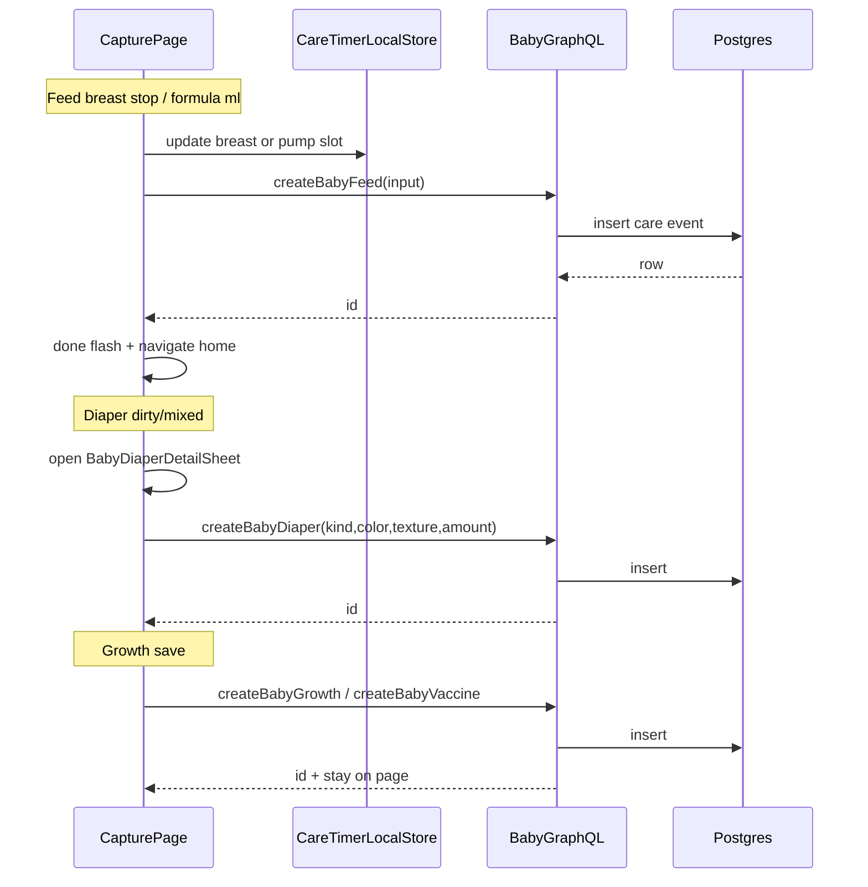

# Design: Baby care pages control parity

**Mode:** full

## Decision 1: which design approach?

### Option 1 — Extract reusable shared controls from Baby Home **and** money/new (recommended)

**What it is:**
Do **not** copy Home or money/new JSX into capture pages. First extract **reusable components** from:
1. Baby Home care controls → Feed / Pump / Diaper
2. Money new form fields (Amount `InputGroup` row, Category `MoneyUsageQuickPick` field) → Growth (and money/new keeps using the same extracts)

Pages only pass props. No visual forks.

**Example:**
- Extract `BabyBreastSidePair`, `BabyPumpSidePair`, `BabyMlChipSection` from Home
- Extract `MoneyAmountField` (Field + InputGroup leading/trailing addons + optional recent chips slot) from `money-transaction-form.tsx` — money/new + Growth Value/Amount
- Keep / lightly wrap `MoneyUsageQuickPick` as the Category control; extract `MoneyCategoryField` (legend/Field chrome + quick-pick) if money inlines that — money/new Category + Growth Unit; Growth Symptoms = multi-select wrapper around the **same** chip chrome
- Diaper: existing shared kind + sheet

**Pros:**

- One definition for care controls and for money Amount/Category chrome
- Growth truly shares money components, not a look-alike
- Fixes land once on money and baby

**Cons:**

- Extract money form carefully (Amount has currency + topAmounts) — props must allow non-currency trailing label for Growth
- Home + money/new must stay green after refactor

### Option 2 — Page-local restyle (copy markup)

**What it is:**
Rebuild similar-looking buttons/fields inside each form without shared section components.

**Example:**
New chip rows on Feed that look like Home but are separate JSX.

**Pros:**

- Faster first paint of pages; fewer Home refactors

**Cons:**

- Drift from Home; violates “same components reusable”
- Duplicate timer/diaper bugs

## Tradeoffs

| Factor | Option 1 | Option 2 |
|--------|----------|----------|
| Cost / time | Medium — wiring + nav + skeletons | Medium-high — redo UI twice |
| Complexity | Shared APIs to learn | Local forks |
| Usability | Matches learned Home/money | Looks similar, behaves differently risk |
| Failure cases | Timer store misuse | Silent UX divergence |

## Recommendation

**Pick Option 1** because the user requires reusable components from **both** Baby Home and money pages — extract first, then wire Feed/Pump/Diaper/Growth (and keep money/new on the same extracts).

## Chosen design (user-approved)

**Option 1** — Extract reusable shared controls from Baby Home **and** money/new, then wire Feed / Pump / Diaper / Growth (+ skeletons / nav). Gate B approved 2026-09-19.

## Reusable component map (required)

### From Baby Home

| Shared component (extract or keep) | Used by | Notes |
|------------------------------------|---------|-------|
| `BabyBreastSidePair` (new extract) | Home, Feed | L/R timed chips; props only |
| `BabyPumpSidePair` (new extract) | Home, Pump | pump_l / pump_r |
| `BabyMlChipSection` (wrap chips + custom open) | Home bottle, Home pump amount, Feed formula, Pump amount | |
| `BabyCustomMlModal` (existing) | Home, Feed, Pump | |
| `BabyDiaperKindControl` + `BabyDiaperDetailSheet` (existing) | Home, Diaper | Full 2×2 incl. dry |

### From money/new (`money-transaction-form.tsx`)

| Shared component (extract or keep) | Used by | Notes |
|------------------------------------|---------|-------|
| `MoneyAmountField` (new extract) | money/new Amount (+ any other money amount rows that match), Growth **Value** + **Amount** | `Field` + `InputGroup`; props: `leadingAddon?`, `trailingAddon?`, value, onChange, required, hint, recentAmounts slot optional. Growth: no currency `$` — trailing unit text or empty |
| `MoneyCategoryField` (new extract or thin Field wrapper around existing `MoneyUsageQuickPick`) | money/new Category (and similar Account/Merchant picks if same chrome — only Category required this pass), Growth **Unit** | Single `selectedId` + Other picker |
| `MoneyMultiCategoryField` or `MoneyUsageQuickPick` multi wrapper (new) | Growth **Symptoms** only this pass | Same chip + Other chrome; `selectedIds: string[]` toggle |

**Rules:**

1. After extract, **money/new** and **Home** must call the shared components — no private duplicate markup left for those controls.
2. Growth must import money extracts — not re-implement InputGroup/Category look-alikes.
3. ui-refs remain look intent; Build follows live extracted components.

## Sequence diagram



## Contracts

### API contracts

No new public endpoints. Existing mutations only:

| Item | Detail |
|------|--------|
| Method + path (or name) | GraphQL `createBabyFeed` / `createBabyDiaper` / `createBabyGrowth` / `createBabyVaccine` (unchanged shapes) |
| Auth / who can call | Existing baby workspace session |
| Request fields | Unchanged — Feed: method + durationSec/amountMl; Diaper: kind + optional color/texture/amount; Growth: kind + value/unit/notes |
| Success response | Existing CareEvent / Growth ids |
| Errors | Existing notify.error paths |
| Downstream calls | none |

**Events / other module APIs (if any):**

- none

### Database contracts

No schema or migration changes.

| Table / collection | Purpose | Key fields (name, type) | Indexes / uniques | Write owner | Read owners |
|--------------------|---------|-------------------------|-------------------|-------------|-------------|
| (unchanged) baby care / growth tables | Existing writes | existing | existing | existing server resolvers | Home / Insights / Activities |

**Data ownership notes:**

- Client only reuses mutations; no new write owners.

### Example queries

```ts
// Feed formula chip
await babyGraphQLRequest(CREATE_FEED, {
  input: { method: "formula", amountMl: 90 },
});

// Pump timer stop (same family as Home)
await babyGraphQLRequest(CREATE_FEED, {
  input: { method: "pump_l", durationSec: elapsed },
});

// Diaper sheet save
await babyGraphQLRequest(CREATE_DIAPER, {
  input: { kind: "dirty", color: "brown", texture: "mushy", amount: "medium" },
});
```

## Patterns to reuse

| Pattern | Where | Use |
|---------|-------|-----|
| Dual care timer slots | `lib/baby-breast-timer-store.ts` | Feed breast; Pump pump |
| Bottle/pump ml chips | `BabyBottleMlChips` + `BabyCustomMlModal` | Formula + pump amount |
| Diaper plan + sheet | `lib/baby-diaper-quick-plan.ts` + detail sheet | Diaper page |
| Money Amount `MoneyAmountField` | extract from money form | Growth Value/Amount + money/new |
| Money Category `MoneyCategoryField` | extract from money form | Growth Unit + money/new Category |
| Money multi Category chrome | new wrapper on quick-pick | Growth Symptoms |
| Skeleton parity | `baby-page-skeleton.tsx` | All touched pages |

## UI / UX / mobile

Aligned with Gate A / `01b` (do not re-argue 80/20):

- Feed: Breast L/R + Formula chips dominant; no amount-method fields; no Pump.
- Pump: L/R + ml chips dominant; section nav “Log pump”.
- Diaper: Home 2×2 kinds; dirty/mixed → sheet; wet/dry one-tap per Home plan.
- Growth: kind chips → one field per line → Save; **Value/Amount** via extracted `MoneyAmountField`; **Unit** via extracted `MoneyCategoryField`; **Symptoms** via multi wrapper on same Category chrome.
- **Symptoms (multi):** Same chip + Other chrome as Category; `selectedIds: string[]` toggle. Not checkboxes.
- **Unit (single):** `MoneyCategoryField` / quick-pick single `selectedId` from allowed units.
- **Diaper:** Full Home 2×2 including **dry**.
- **ui-refs:** Gate A2 look intent only. Build matches **live** extracted Home + money components (no `$` on growth Value unless trailing unit prop set).
- Hits ≥44; light+dark tokens; skeletons match live.

## Security (OWASP)

| Area | Risk | Mitigation |
|------|------|------------|
| A01 Broken access | n/a new | Existing baby GQL auth |
| A03 Injection | notes/values | Existing validators; no raw SQL added |
| A04 Insecure design | Diaper detail lost | Require sheet path for dirty/mixed like Home |
| A05 Misconfig | none | no new env |
| A07 Auth fail | none | workspace cookie unchanged |

## Aggressive challenges

| Challenge | Response |
|-----------|----------|
| Why not keep Pump on Feed? | Idea + A2: dedicated Pump page |
| Why include dry on diaper page? | Same Home control; dry is part of 2×2 |
| Symptoms ≠ single Category | Same chrome; multi-select semantics documented in tasks |
| Extract shared “HomeCarePanel”? | Out of scope — reuse components first; extract only if duplication hurts Build |

## Has API / Has DB

- **Has API:** no
- **Has DB:** no

## Open concerns before build

- none — Symptoms multi + dry tile + ui-ref vs live chrome settled above.
