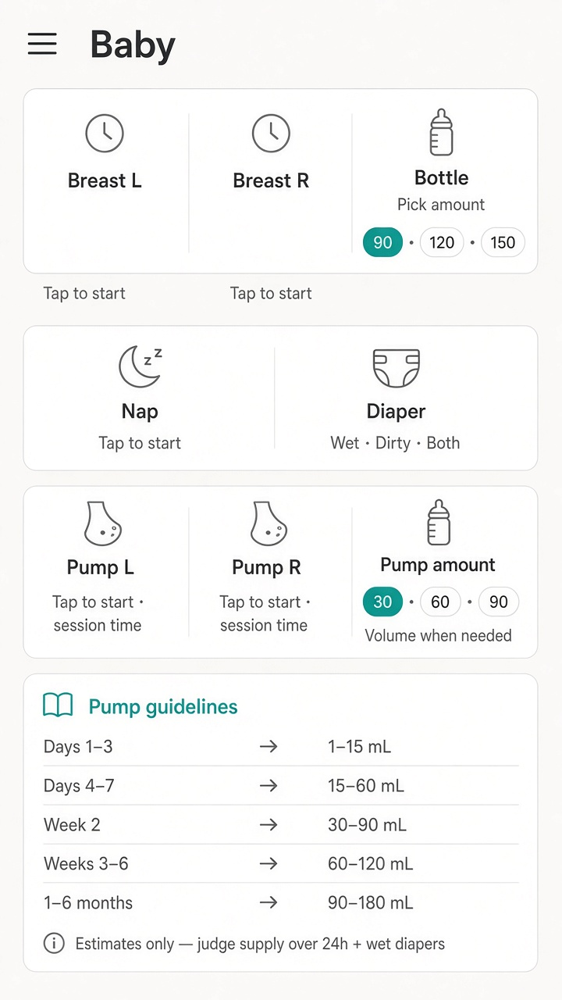
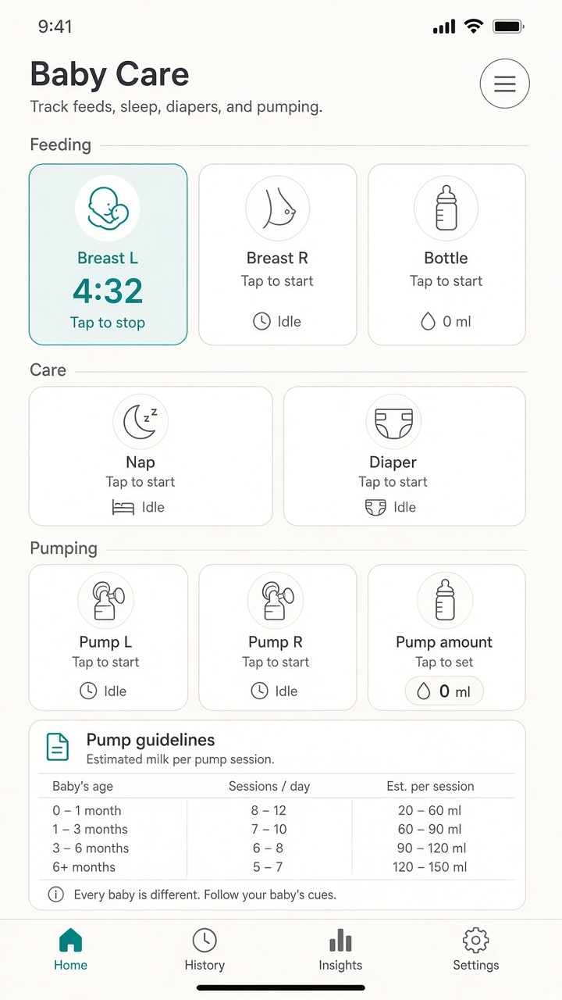
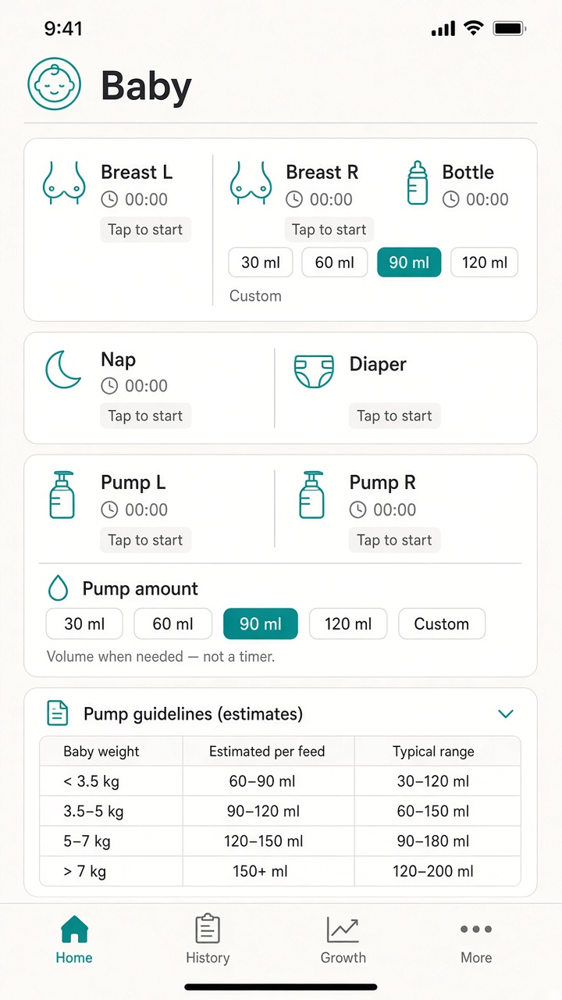

# UI concept (UI/UX designer): baby-care-pump-lr-timer

**Result:** done
**Updated:** 2026-09-19
**Has UI:** yes

## Sources followed

| Source | Applied? | Notes |
|--------|----------|-------|
| Project `docs/DESIGN_GUIDE.md` / AGENTS.md UI rules | yes | Clean-minimal teal; hairline cards; ≥44px hits; skeleton parity; tokens; no purple/glow |
| `clean-minimal-ui` skill | yes | One teal accent; 8px grid; Inter; quiet light mockups for Gate A2 |
| `frontend-ui-engineering` skill | yes | Idle / running / Done / amount / loading / error; no hover-only; large night chips |
| Existing UI patterns in repo (list paths) | yes | `components/baby-home.tsx`; `baby-quick-value-card.tsx`; `baby-bottle-ml-chips.tsx`; `baby-feed-form.tsx`; Growth chips (`baby-growth-page.tsx`) |

## Concept depth

**full** — new 4-row Baby home composition + timer copy + Pump amount (Bottle-like) + Row 4 guidelines. ≥2 light images for Gate A2 (3 shipped).

## Align with Gate A (80/20)

| Item | From 01a / idea | How concept honors it |
|------|-----------------|------------------------|
| Important info/action #1 | Home care rows: Breast L·R + Bottle; Nap + Diaper; Pump L·R + Pump amount — large chips; Pump L/R also on feed | Always-visible 4-row home; timer chips vs amount chips visually distinct |
| Important info/action #2 | Running: elapsed + **Tap to stop**; after stop: brief **Done**; Row 4 guidelines | Running state never shows Done; Row 4 estimates table + caveats below chips |
| Secondary (expand / modal / menu) | Pump amount / Bottle amount; optional duration, Custom, diaper detail, notes | Amount chips are dedicated controls — never forced on timer stop |
| Top user journey | Open home → Pump L (or Breast L) → Tap to stop → stop → brief Done → idle; optional Pump amount | Primary surface is home; feed log mirrors Pump L/R + same timer rules |
| Sensible defaults | Idle Tap to start; running Tap to stop; stop = duration-only; Growth default stays non-pump | Defaults called out in states + copy |

### Gate A locks (must stay visible in UI)

- **Home rows (locked):** Row 1 Breast L + Breast R + Bottle · Row 2 Nap + Diaper · Row 3 Pump L + Pump R + **Pump amount** · Row 4 guidelines.
- **Under each big chip:** short helper / guideline text (not a wall of text).
- **Timer running:** elapsed + **Tap to stop** — **never Done** until after stop; then brief Done flash.
- **Pump amount:** Bottle-like ml chips (secondary); **not** a timer.
- **Growth:** remove Pump from Growth capture (secondary surface note below).

### Gate A2 locks (human approved 2026-09-19)

- **Approve UI look:** yes — with refinements below (Build follows these over mock drift).
- **Icons on home buttons:** every big home care control shows a clear icon — **match figurative icon style in `ui-refs/02-home-timer-running-light.png`** (breastfeeding, breast outline, bottle, moon/zzz, diaper, pump, amount/drop; teal when selected/running).
- **Guidelines = four collapsible sections** (not one pump-only block):
  1. **Feed** guidelines
  2. **Sleep** guidelines
  3. **Diaper** guidelines
  4. **Pump** guidelines (postpartum session estimates + caveats from idea)
- **Collapsed by default:** all four guideline sections start collapsed; **exclusive** expand (D3→2 — opening one closes others).
- Prefer image **01** for row composition; **02** for Tap to stop **and** icon style; ignore incidental mock chrome.

## Screen / surface map

| Surface | Purpose | Primary actions |
|---------|---------|-----------------|
| **Baby home** (primary) | Night one-tap care + pump L/R + guidelines | Start/stop timers; pick Bottle / Pump amount; scan Row 4 |
| `/baby/feed` | Same Pump L/R + timer / Done rules as home | Method chips → one-tap create; Tap to stop while running |
| `/baby/sleep`, `/baby/diaper` | Behavior parity with home one-tap / Done-flash | Start/end nap; diaper kinds — no extra Save |
| `/baby/growth` (secondary change) | Growth/health only | **No Pump chip** — default stays weight (or current non-pump) |

## UI reference images (required for Gate A2; confirm at Gate B without re-show)

Draft visual mockups for **Gate A2** (UI look) approval. At **Gate B**, ask whether UI still matches — **do not re-Read / re-render `ui-refs/` by default**. Re-show images only if the human asks, layout changed after A2, or design update touched UI.

Store under `.my-docs/workflow/baby-care-pump-lr-timer/ui-refs/`.

| Surface | Variant (light / dark / mobile) | File path | Shown at Gate A2? | Confirmed at Gate B? (text ok) |
|---------|---------------------------------|-----------|-------------------|-------------------------------|
| Baby home idle (all 4 rows) | light mobile 9:16 | `.my-docs/workflow/baby-care-pump-lr-timer/ui-refs/01-home-idle-light.png` | yes | |
| Baby home timer running | light mobile 9:16 | `.my-docs/workflow/baby-care-pump-lr-timer/ui-refs/02-home-timer-running-light.png` | yes | |
| Baby home Pump amount | light mobile 9:16 | `.my-docs/workflow/baby-care-pump-lr-timer/ui-refs/03-home-pump-amount-light.png` | yes | |

**Minimum:** one image for the main primary surface (light). Prefer also: dark and/or mobile when the change is user-facing. Full mode: idle + running (+ amount) for Gate A2.

Markdown previews (for humans opening this file):

**Gate A2 note:** Mockups are directional. Canonical layout is the locked 4 rows above. Prefer **01** for row composition + helpers + Row 4; **02** for **Tap to stop** (not Done); **03** for Bottle-like Pump amount. Ignore incidental mock chrome (extra bottom nav, alternate guideline columns) if it conflicts with this concept — Build follows this doc + home patterns, not every mock pixel.

## Layout concept (plain words)

- **Hierarchy / eye flow (home):** Title **Baby** → **Row 1** feed chips (with icons) → **Row 2** nap/diaper → **Row 3** pump timers + amount → **Row 4** four collapsible guideline headers (Feed / Sleep / Diaper / Pump), **all collapsed by default**. Rows 1–3 stay first-screen; Row 4 headers stay scannable without opening bodies.
- **Timer chips vs amount chips:**
  - **Timers** (Breast L·R, Pump L·R, Nap): large `BabyQuickSimpleCard`-style night chips (`min-h-14` / fx-hit-40). Idle = label + **Tap to start**. Running = elapsed + **Tap to stop** + selected/teal emphasis. After stop = brief **Done** flash (~2s) → idle.
  - **Amounts** (Bottle, **Pump amount**): `BabyBottleMlChips`-style ml pills (+ Custom). Selected ml = teal fill. Helper: “Pick amount” / “Volume when needed” — **never** show a live timer on these controls.
- **Under-chip helpers:** one short muted line per big control (session hint, diaper kinds cue, volume-when-needed). Full estimates live only in Row 4.
- **Row 4 — four guideline accordions** (collapsed by default):
  - **Feed** — short feed guidance (when expanded).
  - **Sleep** — short sleep/nap guidance (when expanded).
  - **Diaper** — short diaper guidance (when expanded).
  - **Pump** — postpartum session estimates table (Days 1–3 → 1–15 mL; Days 4–7 → 15–60 mL; Week 2 → 30–90 mL; Weeks 3–6 → 60–120 mL; After 1–6 months → 90–180 mL) + caveats (estimates not targets; judge over 24h + wet diapers + weight; pain/sudden drop → seek care).
  - Headers always visible with chevron; bodies only when expanded. Not a wall of text when collapsed.
- **Feed / sleep / diaper logs:** same idle → running (**Tap to stop**) → Done flash rules; Pump L/R on feed beside breast methods. Behavior parity with home — not a pixel clone of every home section.
- **Growth (secondary):** drop Pump from kind chips; no pump amount form on Growth. Historical growth pump rows may still show as generic “Pump” in lists (Enhancement / Non-goal migrate).
- **Copy (product preference for Build):** prefer **Tap to stop** over today’s `home.tapToSave` (“Tap to save”) while a timer is running. Idle keeps **Tap to start**. Done only after stop.
- **Components to reuse:**

| Component / pattern | Where it already lives | Use for |
|---------------------|------------------------|---------|
| Care chip + done-flash | `baby-home.tsx` / `baby-quick-value-card.tsx` | Breast + Pump L/R + Nap timers |
| Bottle ml chips | `baby-bottle-ml-chips.tsx` | Bottle + **Pump amount** |
| Diaper kind control | `baby-diaper-kind-control.tsx` | Row 2 Diaper |
| Feed method chips / one-tap | `baby-feed-form.tsx` | Pump L/R on feed |
| Growth kind chips | `baby-growth-page.tsx` / `baby-growth-page-chips.ts` | Remove Pump |
| Button / Card / Skeleton / Alert | `components/ui/*` | Feedback, loading, errors |

## States

| State | Behavior |
|-------|----------|
| Idle | Timer chips: **icon** + label + Tap to start (+ short helper). Amount chips: icon + ml pills. Row 4: four collapsed guideline headers visible. |
| Running | One timed chip selected: elapsed (tabular) + **Tap to stop**. Never Done. Other care chips stay tappable per existing home rules (or soft-disable if product already does). |
| Stop → success | Brief **Done** flash on that chip (~2s via existing done-flash); duration saved; return to idle. No amount form. |
| Amount success | Bottle / Pump amount: brief logged/Done on the ml control (same Bottle pattern); does not start a timer. |
| Loading | Home skeleton mirrors 4 rows: chip placeholders for rows 1–3 + **four collapsed guideline header** placeholders for row 4 (same order/gaps/radii). |
| Empty | N/A for home chips (always present). Guideline headers always present; Pump body shows estimates when expanded even with no pump history. |
| Guidelines collapsed (default) | Only four headers + chevrons; no guideline body text until expand. |
| Error | Inline / pending retry bar under chips (existing home pending pattern); sleep fail-closed stays as today. |

## Skeleton parity

- Update home loading skeleton (`baby-page-skeleton` / home loading) to **four rows**: (1) three chip slots, (2) two chip slots, (3) three chip slots with amount-style block for the third, (4) guidelines card block.
- Match `rounded-[var(--radius-md)]` outer / `--radius-sm` nested pills; same `gap-3` / section spacing as live home — zero CLS when Rows 3–4 appear.

## Mobile / a11y notes

- Thumb reach / ≥44px hits / no hover-only: all care chips and ml pills are large tap targets (`min-h-14` / `fx-hit-40`); no hover-only stop.
- Labels, focus, contrast via tokens: running state = teal selected **plus** elapsed + Tap to stop text (not color alone); EN/VI L/R and Tap to stop / Done remain clear; light + dark via semantic tokens.

## Style rules checklist

| Rule | Pass? | Note |
|------|-------|------|
| Semantic tokens (no hard-coded hex in feature UI) | yes | Teal via `--accent`; mock hex for Gate A2 only |
| Concentric radii (`--radius-md` / `--radius-sm`) | yes | Outer chips/cards `--radius-md`; ml pills `--radius-sm` |
| One accent; clean-minimal / project preset | yes | Quiet teal light; match Baby home |
| Transition specificity (no `transition` shorthand) | yes | CSS-only press / done-flash |
| Light + dark survive | yes | Concept locks both; Gate A2 images are light |

## Out of scope for this concept

- Insights timeline / charts redesign; full legacy pump migrate
- Solids or new feed methods beyond Pump L/R
- Undo after quick save; Telegram redesign beyond one-line map if required later
- Dark / desktop reference images this pass (optional later)
- Production code, schema, timer-store shape, or GraphQL contracts (Analyze / Design)

## Handoff to Analyze / Design

What Architect must preserve (do not reinvent the UI concept):

1. **Locked home layout:** Row 1 Breast L·R + Bottle; Row 2 Nap + Diaper; Row 3 Pump L·R + **Pump amount** (Bottle-like, not a timer); Row 4 guidelines; short helpers under big chips.
2. **Running copy:** elapsed + **Tap to stop** — never Done until after stop; then brief Done flash (duration-only for pump/breast timers).
3. **Pump amount** is secondary Bottle-like ml entry — never forced on timer stop.
4. **Pump L/R** on Baby home **and** `/baby/feed`; **remove Pump from Growth** capture UI.
5. Feed / sleep / diaper logs match home one-tap / timer / Done-flash **spirit** (not necessarily pixel-identical).
6. Skeleton must gain Row 3 + Row 4 parity with live home.
7. Gate A2 approval is against `ui-refs/` + this concept; Build follows this doc over incidental mock chrome.
