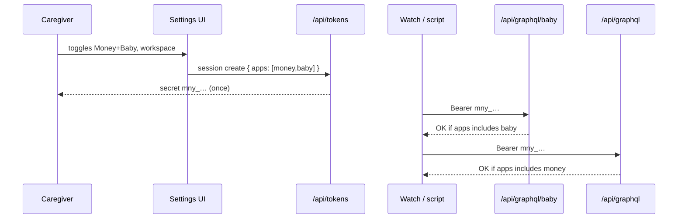

# Design: Multi-app personal API tokens (Money + Baby grants)

**Mode:** full  
**Result:** ready for design-review (revised after Decision 3)  
**Updated:** 2026-09-22  
**Has API:** yes  
**Has DB:** yes — add `apps` grant list on `api_token`  
**Decision 3:** Option 2 — one secret, app toggles (user chose)

## Decision 1: which design approach? (superseded)

Historical Options 1/2 (separate `bby_` vs phone proxy) — **withdrawn**.  
**User chose Decision 3 Option 2:** one Bearer secret; Settings toggles grant **Money** and/or **Baby**.

## Decision 4: token prefix for multi-app secrets

### Option 1 — Keep `mny_` (recommended)

**What it is:** Settings-created personal tokens still use `mny_` prefix; `apps[]` decides Money vs Baby access.  
**Example:** `Authorization: Bearer mny_…` works on Money GraphQL if `apps` includes `money`, and on Baby GraphQL if `apps` includes `baby`.  
**Pros:** Matches “same API keys”; existing docs/help stay familiar; no new prefix machinery.  
**Cons:** Prefix name says “money” even for Baby-only tokens (document clearly).

### Option 2 — Neutral `tok_` for new tokens

**What it is:** New multi-app tokens use `tok_`; legacy `mny_`/`sav_`/`inv_` keep old single-app behavior.  
**Example:** New secret `tok_…` with apps `[money, baby]`.  
**Pros:** Honest naming.  
**Cons:** Two eras of tokens; more parse/allowlist code; caregivers learn a new prefix.

## Recommendation (Decision 4)

**Pick Option 1 (`mny_`)** — **user chose Option 1 (2026-09-22).**

## Chosen design (user-approved)

**Gate B approved 2026-09-22:** Decision 3 Option 2 (multi-app grants) + Decision 4 Option 1 (`mny_` prefix).

## System design

### Overview

- **One secret per token row**, bound to one `workspace_id` and one user.
- **Grants:** `apps: ("money"|"baby")[]` (min 1) — same shareable set as workspace member grants (`SHAREABLE_WORKSPACE_APP_KEYS`).
- **Request path:** Bearer → `resolveRequestAuth` → Money/Baby GraphQL checks **grant**, not a single exclusive `appKey`.
- **Create/edit (session):** Settings checkboxes Money / Baby (reuse label map from members UI). At least one required.
- **Membership:** On create (and grant edit), assert `assertWorkspaceAppAccess` for **each** granted app.
- **Legacy rows:** `app_key = money|savings|investment` with null/empty `apps` → treat as `[app_key]` if shareable, else keep single-app legacy for sav/inv.
- **Out of scope:** Changing Savings/Investment token UX; OAuth; anonymous API.
- **Failure:** No matching grant → FORBIDDEN (no workspace bind). Revoke still kills whole secret.
- Point to sequence + contracts; OWASP below.

### Concept 1 — Grant list on personal token

Like `workspace_member_app`, but on the API token: one secret, many app doors.

### Concept 2 — App GraphQL gate by grant

`resolveMoneyWorkspaceId` / `resolveBabyWorkspaceId` require grant membership in `apps` (after legacy backfill).

## Design patterns used

### Pattern 1 — Shareable app key list

- **What:** Reuse `SHAREABLE_WORKSPACE_APP_KEYS` + `parseShareableWorkspaceAppKeys`.
- **How:** Token create/PATCH validate with same helper as members.
- **Why:** One vocabulary for “which apps.”
- **Best practices:** Do not invent a second enum for money/baby.

### Pattern 2 — GraphQL workspace resolver with capability check

- **What:** Money already resolves api_key workspace; extend with grant check.
- **How:** `tokenGrantsInclude(auth, "baby")` before returning workspaceId.
- **Why:** Wrong-app calls fail closed.
- **Best practices:** Same for Money; Baby no longer nulls all api_key.

### Pattern 3 — Additive column + backfill

- **What:** Add `apps jsonb`; backfill from `app_key`; keep `app_key` for legacy/prefix display.
- **How:** Migration; read path `apps ?? [appKey]`.
- **Why:** No break for existing Money tokens.
- **Best practices:** Expand/contract; never drop `app_key` this pass.

## Sequence diagram



## API contracts

### Auth

| Client | Credential | Access rule |
|--------|------------|-------------|
| Web | Session + CSRF | Unchanged |
| External | `Authorization: Bearer mny_…` (Decision 4 Opt 1) | GraphQL app allowed iff token `apps` includes that app |

### Token CRUD

| Method | Path | Auth | Body / notes |
|--------|------|------|----------------|
| GET | `/api/tokens` | Session | List includes `apps` |
| POST | `/api/tokens` | Session | `{ name, workspaceId, apps: ["money","baby"], scopes, … }` — **replace** exclusive `appKey` for shareable tokens (accept `appKey` as legacy alias → `[appKey]`) |
| PATCH | `/api/tokens/{id}` | Session | Optional `{ apps }` edit grants without rotating secret |
| DELETE | `/api/tokens/{id}` | Session | Revoke |

### Baby / Money GraphQL

| Endpoint | Bearer allowed when |
|----------|---------------------|
| `POST /api/graphql/baby` | `apps` includes `baby` |
| `POST /api/graphql` (Money) | `apps` includes `money` |

Schema of care ops unchanged. Scopes `read`/`write` still apply.

### Docs

- `docs/BABY_API.md`, `docs/API.md`, Help: one token + app toggles; remove “Baby Bearer not shipped” / separate `bby_` story.

## Database contracts

**Has DB = yes.**

| Change | Detail |
|--------|--------|
| Column | `api_token.apps` `jsonb` nullable → not null after backfill (or null = derive from `app_key`) |
| Backfill | `apps = jsonb_build_array(app_key)` for rows where app_key in (`money`,`baby`); sav/inv leave apps null and keep single-app legacy |
| Keep | `app_key` text — set to first grant or `"money"` when money granted else `"baby"` for new rows (prefix + display) |

### Example queries

```sql
ALTER TABLE api_token ADD COLUMN apps jsonb;
UPDATE api_token SET apps = jsonb_build_array(app_key)
  WHERE app_key IN ('money', 'baby') AND apps IS NULL;

-- resolve (app code)
-- grants = row.apps ?? [row.app_key]
-- allow baby GQL if 'baby' = ANY(grants)
```

## UI / UX / mobile

- Replace App **select** with **Money / Baby checkboxes** (same labels as `workspace-members-panel` `APP_LABELS`).
- Require ≥1 app; Workspace still required; Create disabled until workspace + ≥1 app.
- List row shows grants (e.g. `money, baby`) not only `appKey`.
- Optional: edit grants on active token (PATCH) — include in Task if cheap; else create-only grants for MVP and note Enhancement.
- Align Gate A2 chrome; after Build re-screenshot with toggles.
- Skeleton: Settings section already exists — update checkbox row parity if layout changes.

## Security design review (OWASP)

| OWASP | Status | Note |
|-------|--------|------|
| A01 Access control | pass | Per-app grant + membership assert per app |
| A02 Crypto | pass | Existing hash/lookup |
| A04 Insecure design | pass | Least privilege via toggles; default both unchecked until user picks |
| A05 Misconfig | pass | Session CSRF unchanged; Bearer skips Origin |
| A07 Auth | pass | Revoke; scopes |
| Others | N/A / pass | Same as prior pass |

## Aggressive challenges

| Challenge | Response |
|-----------|----------|
| Prefix still `mny_` for Baby-only? | Document; or Decision 4 Option 2 |
| Revoke kills Money+Baby? | Yes — edit grants instead of two secrets |
| Why not separate `bby_`? | User chose one secret |
| sav/inv? | Out of scope this pass |

## Clarity check

Blocked only on **Decision 4** if user rejects `mny_` default. Otherwise ready for re-review → Gate B.
