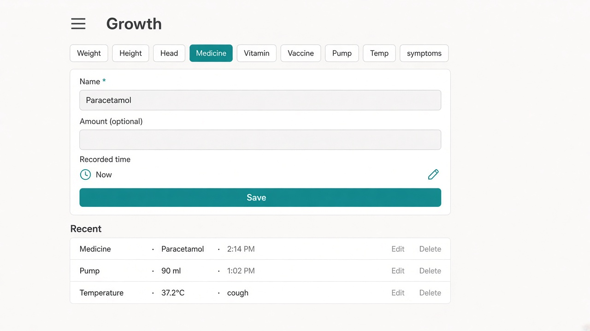
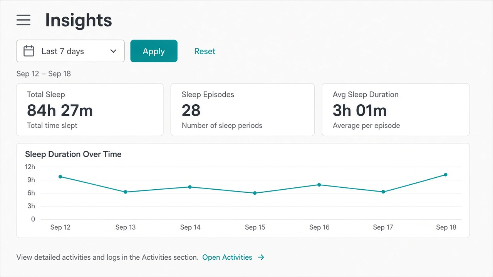

# UI concept (UI/UX designer): baby-growth-health-logging

**Result:** done
**Updated:** 2026-09-18
**Has UI:** yes

## Sources followed

| Source | Applied? | Notes |
|--------|----------|-------|
| Project `docs/DESIGN_GUIDE.md` / AGENTS.md UI rules | yes | Clean-minimal teal; shell heading + hamburger; flat forms/lists; skeleton parity; ≥44px hits; tokens only |
| `clean-minimal-ui` skill | yes | One teal accent; 8px grid; hairline borders; light mockups for Gate A2 |
| `frontend-ui-engineering` skill | yes | Loading / empty / error; keyboard path; no hover-only Edit |
| Existing UI patterns in repo (list paths) | yes | `baby-measure-page.tsx` (rename → Growth); `baby-insights-dashboard.tsx` (date-only trim); `baby-vaccines-page.tsx` (schedule + deep link); Baby section nav / headers / i18n |

## Concept depth

**full** — multi-surface: Growth capture (primary) + Insights date-only chrome + supporting Vaccines deep-link cue. ≥2 light images for Gate A2.

## Align with Gate A (80/20)

| Item | From 01a / idea | How concept honors it |
|------|-----------------|------------------------|
| Important info/action #1 | Kind picker + Save for kinds **written on Growth only**; time = **now** | Always-visible kind chips (measures / med / vitamin / vaccine dose / pump / temp+symptoms) + strong Save; no Feed pump or Vaccines-schedule as write homes |
| Important info/action #2 | Recent entries list (scan + edit / delete) | Always-visible Recent list under the form; row Edit / Delete |
| Secondary (expand / modal / menu) | Units, notes, historical time; Vaccines schedule; Insights “More”; optional pump notes/side | Deferred under More / expand / Vaccines page / Insights More |
| Top user journey | Baby → Growth → kind → value / symptoms → Save → Recent; optional Insights date range | Primary stack matches journey; Insights chrome is date → Apply only |
| Sensible defaults | Now; °C; last-used med/vitamin name; symptoms unchecked; pump = amount + time; Insights default period | Defaults called out in layout + states |

### Gate A locks (must stay visible in UI)

- **Vaccines:** dose **write** on Growth; Vaccines page = schedule / read + deep link into Growth.
- **Pump:** Growth = I expressed (**amount + time**); Feed pump = baby fed expressed milk (not this form).
- **Symptoms:** multi-select **with or without** temperature.
- **Med / vitamin:** short **name required** (or last-used pick) before Save.
- **Insights:** **date / time filter only** — no care-type or growth-kind filter chrome.

## Screen / surface map

| Surface | Purpose | Primary actions |
|---------|---------|-----------------|
| **Growth** (rename of Measure capture) | Log growth + health + pump; scan Recent | Pick kind → short form → Save; Edit / Delete rows |
| **Insights** (chrome trim) | Review by date range | Set date/time range → Apply; scan KPIs / charts |
| Vaccines (supporting) | Schedule / read only | Browse schedule; deep link “Log dose on Growth” |
| Nav / Home / Activities cues | Rename Measure → Growth | Labels + links say Growth |

## UI reference images (required for Gate A2; confirm at Gate B without re-show)

Draft visual mockups for **Gate A2** (UI look) approval. At **Gate B**, ask whether UI still matches — **do not re-Read / re-render `ui-refs/` by default**.

Store under `.my-docs/workflow/baby-growth-health-logging/ui-refs/`.

| Surface | Variant (light / dark / mobile) | File path | Shown at Gate A2? | Confirmed at Gate B? (text ok) |
|---------|---------------------------------|-----------|-------------------|-------------------------------|
| Growth capture (primary) | light desktop | `.my-docs/workflow/baby-growth-health-logging/ui-refs/01-growth-capture-light.png` | yes | |
| Insights after trim | light desktop | `.my-docs/workflow/baby-growth-health-logging/ui-refs/02-insights-date-only-light.png` | yes | |

**Minimum:** one image for the main primary surface (light). Prefer also: dark and/or mobile when the change is user-facing. Full mode: ≥2 light surfaces (Growth + Insights).

Markdown previews (for humans opening this file):

## Layout concept (plain words)

- **Hierarchy / eye flow (Growth):** Page title **Growth** → **kind picker** (always on) → **short fields for selected kind** → primary **Save** → **Recent** list. Eye never hunts for a second write home.
- **Hierarchy / eye flow (Insights):** Title **Insights** → **date/time toolbar only** (Apply / Reset) → period chip → KPIs / charts. No care or growth-kind filter row.
- **Core vs secondary:** Dominant = Growth kinds + Save + Recent; Insights date range. Deferred = units / notes / past time; Vaccines schedule; Insights chart toggles under **More**; optional pump notes / side L/R.
- **Kind → form (happy paths):**
  - **Weight / Height / Head** — value + unit (preselected) + time = now.
  - **Medicine / Vitamin** — **Name required** (type or last-used chip); optional amount; time = now. Save disabled / blocked until name.
  - **Vaccine** — dose name / antigen short label + time = now (write here only).
  - **Pump** — **amount + time** (label: expressed milk / pumping — not a baby feed). Duration / L/R / notes under More.
  - **Temp + symptoms** — optional °C; symptom checkboxes (cough, vomiting, rash, breathing changes, unusual sleepiness) start unchecked; Save allowed with symptoms only, temp only, or both.
- **Vaccines page cue:** Keep schedule UI; add quiet link “Log a dose on Growth” → Growth with vaccine kind preselected. No dose form on Vaccines.
- **Rename:** Every user-facing Measure label for this path becomes **Growth** (nav, heading, Home/Activities cues). Route reclaim vs `/baby/growth` redirect is Analyze/Design — concept requires the **visible name** Growth.
- **Components to reuse:**

| Component / pattern | Where it already lives | Use for |
|---------------------|------------------------|---------|
| Measure kind chips + form + recent list | `baby-measure-page.tsx` | Rename Growth; extend kinds |
| Insights date-range filter bar | `baby-insights-dashboard.tsx` / analytics filters | Keep Date + Apply/Reset; **remove** care/growth chip chrome |
| Vaccines page | `baby-vaccines-page.tsx` | Schedule/read + deep link to Growth |
| PageHeading + Baby section nav | shell / `app-section-nav.ts` | Title **Growth**; nav label Growth |
| Button / Input / Chip / Alert / Skeleton | `components/ui/*` | Save, fields, feedback, loading |

## States

| State | Behavior |
|-------|----------|
| Loading | Growth skeleton: heading → kind row → form block → recent rows. Insights skeleton: date toolbar → period chip → KPI/chart placeholders (no care/kind chip skeletons). |
| Empty | Growth Recent: quiet “No entries yet — pick a kind and save.” Insights: empty copy mentions **date range only** (never “try care-type filters”). |
| Error | Inline alert + retry when safe; med/vitamin name-missing shows field error (not a toast-only fail). |
| Success | Row appears / updates in Recent; short settle feedback; Insights Apply refreshes KPIs/charts. |

## Skeleton parity

- **Growth:** Mirror live order — kind chips → form fields → Save → Recent rows (`BabyMeasurePageSkeleton` → Growth skeleton rename). Same radii / gaps.
- **Insights:** Drop care-type and growth-kind chip placeholders; keep date toolbar + period + metrics/chart skeletons so CLS stays zero after trim.

## Mobile / a11y notes

- Thumb reach / ≥44px hits / no hover-only: kind chips and Save are large tap targets; row Edit/Delete use button primitives (`fx-hit-40` / ghost buttons) — not hover-only.
- Labels, focus, contrast via tokens: visible Name label (required); focus ring on Save and fields; selected kind = teal fill **plus** text (not color alone); light + dark via semantic tokens.

## Style rules checklist

| Rule | Pass? | Note |
|------|-------|------|
| Semantic tokens (no hard-coded hex in feature UI) | yes | Teal via `--accent`; mock hex for Gate A2 only |
| Concentric radii (`--radius-md` / `--radius-sm`) | yes | Outer cards/surfaces `--radius-md`; chips `--radius-sm`; lists/tables sharp |
| One accent; clean-minimal / project preset | yes | Match Baby Measure / Insights look |
| Transition specificity (no `transition` shorthand) | yes | CSS-only microinteractions |
| Light + dark survive | yes | Concept locks both; Gate A2 images are light |

## Out of scope for this concept

- Clinical AI, dosing calculators, doctor integrations
- Feed / Sleep / Diaper Home redesign (except Measure→Growth cues)
- Full vaccine schedule product rewrite
- Activities redesign beyond Growth label / filter coherence
- Per-symptom Insights charts
- Dark / mobile reference images this pass (optional later)
- Production code, schema, or GraphQL contracts (Analyze / Design)

## Handoff to Analyze / Design

What Architect must preserve (do not reinvent the UI concept):

1. **Growth** is the only write home for med / vitamin / vaccine **dose** / pump express / temp+symptoms / weight / height / head; kind picker never offers Feed pump or Vaccines-schedule write.
2. Primary UI always shows **kind picker + Save** and **Recent** list; secondary fields deferred.
3. Med / vitamin **name required** (or last-used); symptoms allowed **without** temperature; pump happy path = **amount + time**.
4. **Vaccines** stays schedule/read + deep link to Growth for a dose.
5. **Insights** filter chrome = **date/time only** (Apply/Reset); remove care-type and growth-kind bars; empty copy mentions range only.
6. User-facing Measure wording for this path becomes **Growth**; settle `/baby/growth` redirect conflict in Analyze without changing this IA.
7. Skeletons stay in lockstep with both surfaces (Growth rename/extend + Insights trim).
