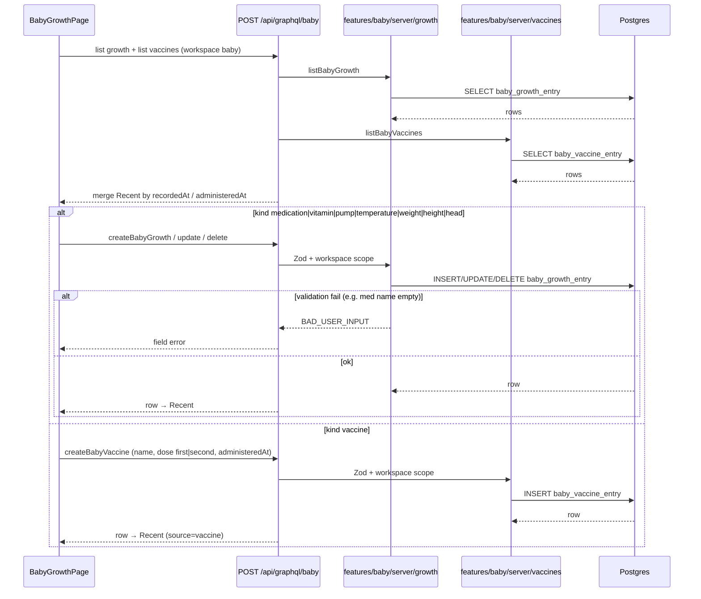

# Design: Baby Growth + health logging

**Mode:** full — from `00-run.md`  
**Updated:** 2026-09-18

## Design locks (do not re-open)

Settled in Analyze Q&A (all Option 1) + Gate A / Gate A2 / `01b`:

| Lock | Choice |
|------|--------|
| **D2** | Reclaim `/baby/growth` for capture; `/baby/measure` → Growth; remove Growth→Insights permanent redirect |
| **D3** | Growth vaccine UI facade over existing vaccine GraphQL APIs; Vaccines page = schedule/read only (no create/update/delete write UI) + deep link to Growth for changes |
| **D4** | Required first/second dose on Growth vaccine form (same as today’s vaccine API) |
| **D5** | Symptoms as structured `notes` JSON only on temperature (no free-text notes this pass); no jsonb column |
| **D6** | Merge vaccine doses into Growth Recent this pass |
| **D7** | One temp±symptoms chip/kind (`temperature`); not a separate symptoms kind |
| **Gate A** | Growth sole write home for dose / pump / meds / symptoms; **all vaccine writes** (create/update/delete) on Growth; Vaccines = schedule/read only; pump = amount+time; med/vitamin name required |
| **Gate A2** | Keep existing Insights date/period bar styles; remove care/growth chips only |
| **`01b` IA** | Kind picker + Save + Recent; Insights date → Apply only |
| **Temp empty** | Reject `temperature` when no `valueNum` and no symptoms (temp and/or symptoms required) |
| **Temp notes** | `notes` = symptoms JSON only this pass; invalid decode → empty + field error |
| **Growth chips** | Growth-only catalog incl. UI-only `vaccine`; do not extend Insights/Activities growth chips |
| **Last-used** | Deferred this pass — typed med/vitamin name required only |
| **Recent merge** | Fetch N=50 each source, merge, take top 50 |

---

## Decision 1: implementation packaging

### Option 1 — One Growth page owner (rename Measure in place)

**What it is:**
Move `app/(shell)/baby/measure` → `growth`, rename `BabyMeasurePage` → `BabyGrowthPage` (and skeleton), and keep **one** client page owner for kind chips → form → Save → merged Recent. That owner calls growth GraphQL for measure/health kinds and vaccine GraphQL for the vaccine kind. Insights trim + Vaccines deep-link are thin sibling edits.

**Example:**
`/baby/growth` → `<BabyGrowthPage />`. Save vaccine → `createBabyVaccine`; Save med → `createBabyGrowth` with `kind: "medication"`, `valueText: name`. Recent = merge `listBabyGrowth` + `listBabyVaccines` by time.

**Pros:**

- Matches today’s Measure shape and `01b` one-surface habit.
- One place for kind routing, validation UX, and Recent merge.
- Fewer glue files; skeleton parity stays obvious.

**Cons:**

- Page file grows (mitigate: small pure helpers for symptom encode/decode + Recent merge in `lib/`).
- Vaccine + growth concerns live in one component (clear kind switch keeps them separate).

### Option 2 — Split capture into many modules + thin shell

**What it is:**
Thin Growth route composes separate modules (`GrowthKindForm`, `VaccineDoseFacade`, `GrowthRecentList`, …) each with own queries/mutations. Page only lays out chrome.

**Example:**
`page.tsx` mounts three siblings; vaccine module owns vaccine queries; growth module owns growth queries; a fourth merge hook stitches Recent.

**Pros:**

- Smaller named pieces; vaccine facade is easy to find.
- Possible reuse if another surface needed dose form later (not planned).

**Cons:**

- Wiring (defaults, invalidate, deep-link `?kind=vaccine`, merge sort) scatters and drifts from Measure.
- Easier to ship dual empty states or miss skeleton order.
- Over-splits a Gate A “one write home” surface.

## Tradeoffs

| Factor | Option 1 | Option 2 |
|--------|----------|----------|
| Cost / time | Medium rename + extend | Similar + more glue |
| Complexity | One owner; helpers for encode/merge | Many owners; shared state harder |
| Usability | Same as `01b` if locks held | Same only if composition stays aligned |
| Failure cases | Large file misses a kind branch | Missed invalidate → stale Recent / dual write leftover |

## Recommendation

**Pick Option 1** because Measure already proves the page-owner pattern, `01b` locks one Growth surface, and Analyze’s vaccine facade is a Save/Recent branch — not a second product. Option 2 adds file churn without a second consumer this pass.

## Chosen design (locked for Build)

**Decision 1 Option 1** — one Growth page owner (rename Measure in place) + vaccine facade + merged Recent. Matches `00-run.md` Design Decision 1 lock. Gate B still approves tasks/tests before Build; do not re-pick packaging unless Gate B rejects.

---

## Sequence diagram



Insights path (unchanged data plane): UI sets date range → Apply → existing Insights queries with **empty** care/growth chip arrays (= all). No new mutations.

---

## Contracts

### API contracts

No new GraphQL operation names required. Harden / extend inputs.

| Item | Detail |
|------|--------|
| Method + path (or name) | Existing Baby GraphQL: `createBabyGrowth` / `updateBabyGrowth` / `deleteBabyGrowth` / list growth; `createBabyVaccine` / `updateBabyVaccine` / `deleteBabyVaccine` / list vaccines |
| Auth / who can call | Same as today: authenticated user + Baby workspace cookie; server scopes by `workspaceId` / baby |
| Request fields (growth create) | `kind` ∈ extended enum; `recordedAt?`; `valueNum?`; `valueText?`; `unit?`; `notes?`; `source?` |
| Kind field rules | **weight/height/head:** `valueNum` + `unit` required. **medication/vitamin:** `valueText` = name **required** (trim min 1); optional amount in `valueNum`/`unit`. **pump:** `valueNum` + `unit` (e.g. ml) required; time via `recordedAt`. **temperature:** require **at least one** of: non-null `valueNum` (°C) **or** non-empty allowlisted symptoms in `notes`; reject when both missing (empty temperature row). **Not** a growth kind: vaccine |
| Vaccine create (unchanged shape) | `name` required; `dose` ∈ `first` \| `second` required; `administeredAt?`; `notes?` |
| Success response | Existing row types |
| Errors | `BAD_USER_INPUT` on Zod fail; `NOT_FOUND` on cross-workspace id (keep today’s pattern) |
| Downstream calls | none |

**Symptoms payload (D5 + D7) — temperature `notes` ownership:**

- Temperature rows: `notes` = **symptoms JSON only** this pass. No parallel free-text notes on temperature (Gate A secondary “notes” does not apply to this kind until a follow-up).
- Prefer versioned JSON:

```json
{"v":1,"symptoms":["cough","vomiting","rash","breathing","sleepiness"]}
```

- Allow only the fixed id set above. Reject unknown ids at Zod edge.
- **Valid rows:** temp only (`valueNum` set, `symptoms` empty/omit); symptoms only (`valueNum` null/omit, `symptoms` non-empty); both.
- **Invalid:** `kind: temperature` with no `valueNum` **and** empty/missing symptoms → `BAD_USER_INPUT`.
- **Encode:** UI/helper writes only this JSON shape into `notes` for temperature saves/updates.
- **Decode on edit:** parse `v:1` + allowlisted ids → checkboxes. **Invalid / non-JSON / wrong `v` / unknown ids** → treat as **safe empty symptoms** for display + show a **field error** (“Could not load symptoms — pick again”); do **not** wipe silently on Save without user re-pick (reject update that would re-encode unknown payload without explicit UI state).
- Legacy free-text `notes` on old temperature rows: same decode path → empty symptoms + field error; first successful edit replaces `notes` with symptoms JSON only.

**Med / vitamin last-used (this pass):** **Defer** last-used name chips. Typed **name required** only (Gate A name lock still holds). Follow-up may add last-used from recent `valueText` of that kind.

**Recent merge limit (D6):** Fetch up to **N=50** growth rows + **N=50** vaccine rows (newest first each). Merge by `recordedAt` / `administeredAt` descending; take **top N=50** for the UI list. Documented so doses are not dropped by unbounded merge of one side only.

**Events / other module APIs:** none. Feed `method: "pump"` stays feed-only (not Growth pump).

### Database contracts

| Table / collection | Purpose | Key fields (name, type) | Indexes / uniques | Write owner | Read owners |
|--------------------|---------|-------------------------|-------------------|-------------|-------------|
| `baby_growth_entry` | Growth + health logs | `kind` enum **extended** with `vitamin`, `pump`; `value_num`, `value_text`, `unit`, `notes`, `recorded_at` | existing workspace/recorded + baby/kind indexes | Growth GraphQL / growth.ts | Growth UI, Insights, Activities |
| `baby_vaccine_entry` | Vaccine doses (unchanged schema) | `name`, `dose` first\|second, `administered_at`, `notes` | existing | Growth UI via vaccine APIs (Vaccines page read-only write) | Growth Recent, Vaccines schedule |
| `baby_growth_kind` enum | Kind discriminator | add `vitamin`, `pump`; keep `temperature`, `medication`, measures | n/a | migration | validators + UI |

**Data ownership notes:**

- Vaccine **writes** move to Growth UI only; table ownership stays `vaccines.ts`.
- Do **not** add a `vaccine` value to `baby_growth_kind` this pass (D3).
- Activities may show new growth kinds via existing growth mutations where applicable; chip chrome on Activities **unchanged**.

### Example queries

```sql
-- Example 1: list growth rows for Recent (workspace + baby, newest first)
SELECT id, kind, recorded_at, value_num, value_text, unit, notes
FROM baby_growth_entry
WHERE workspace_id = $workspace::uuid AND baby_id = $baby::uuid
ORDER BY recorded_at DESC
LIMIT 50;
```

```sql
-- Example 2: insert named medicine (value_text = name)
INSERT INTO baby_growth_entry (
  workspace_id, baby_id, kind, recorded_at, value_text, value_num, unit, notes,
  source, created_by_user_sub, updated_by_user_sub
) VALUES (
  $workspace::uuid, $baby::uuid, 'medication', $recorded_at,
  $name, $amount, $unit, NULL, 'web', $sub, $sub
);
```

```sql
-- Example 3: insert vaccine dose (Growth facade → same table Vaccines reads)
INSERT INTO baby_vaccine_entry (
  workspace_id, baby_id, name, dose, administered_at, notes,
  source, created_by_user_sub, updated_by_user_sub
) VALUES (
  $workspace::uuid, $baby::uuid, $name, 'first', $administered_at, NULL,
  'web', $sub, $sub
);
```

---

## Patterns to reuse

| Pattern | Why it fits | Reference (repo path or known name) |
|---------|-------------|-------------------------------------|
| Kind chips + form + recent list | Primary Growth surface (`01b`) | `components/baby-measure-page.tsx` → rename Growth |
| **Growth-only chip catalog** | Capture kinds ≠ Insights/Activities filter chips | New `BABY_GROWTH_PAGE_CHIPS` (or equivalent) — **do not** silently extend `BABY_INSIGHTS_GROWTH_CHIPS` / Activities set |
| Vaccine mutations + Zod | Dose facade without new table | `features/baby/server/vaccines.ts`, `lib/validators/baby.ts` |
| Growth CRUD server | Same parse → insert | `features/baby/server/growth.ts` |
| Insights date bar, empty chips = all | Date-only trim without restyle | `InsightsDateRangeFiltersBar`; `lib/baby-insights-filters.ts` |
| Redirects in `next.config.ts` | Reclaim `/baby/growth`; measure → growth | existing Baby redirect block |
| Skeleton parity | Zero CLS after rename/trim | `components/baby-page-skeleton.tsx` |

**Growth page chip ids (exact, D7):**

| Chip id | Maps to | Notes |
|---------|---------|-------|
| `weight` | `baby_growth_kind.weight` | measure |
| `height` | `baby_growth_kind.height` | measure |
| `head` | `baby_growth_kind.head` | measure |
| `medication` | `baby_growth_kind.medication` | name required (typed) |
| `vitamin` | `baby_growth_kind.vitamin` | name required (typed) |
| `vaccine` | **UI-only** | Not a `baby_growth_kind`; Save → vaccine APIs |
| `pump` | `baby_growth_kind.pump` | amount + time |
| `temperature` | `baby_growth_kind.temperature` | **One** Temp±symptoms chip (not a separate symptoms chip) |

Insights/Activities growth chip set stays **today’s five** (`weight|height|head|temperature|medication`) unless copy-only; do **not** add vitamin/pump/vaccine to that shared Insights list this pass.

---

## UI / UX / mobile

- **UI concept (01b):** Follow `01b` + `ui-refs/` — do not invent a second IA. Growth = title → kind chips → short fields → Save → Recent. Insights = date/time toolbar + period chip → KPIs/charts (no care/growth chip row).
- **80/20 (aligned, not re-argued):** #1 kind + Save; #2 Recent; secondary = units/notes/past time, Vaccines schedule, Insights More, optional pump L/R/notes.
- **Layout / hierarchy:** Match `ui-refs/01-growth-capture-light.png` and `02-insights-date-only-light.png`. Vaccine deep link: `/baby/growth?kind=vaccine` (or equivalent) preselects vaccine chip.
- **Loading / empty / error / success:** Growth skeleton: heading → kinds → form → recent rows. Insights skeleton: date toolbar → period → metrics (triggerCount **1**, no chip skeletons). Empty Recent: quiet “No entries yet…”. Insights empty copy mentions **date range only**. Med/vitamin missing name → field error. Empty temperature (no temp + no symptoms) → field error. Success → row in Recent.
- **Skeleton parity (zero CLS):** Rename Measure skeleton → Growth; update Insights filter skeleton with trim. Concentric radii `--radius-md` / `--radius-sm`.
- **Mobile:** ≥44px kind chips + Save; Edit/Delete not hover-only; thumb-friendly stack.
- **Accessibility:** Required Name label; selected kind = teal + text (not color alone); focus rings via tokens; light + dark.
- **Day-to-day:** Defaults = now, °C, symptoms unchecked, pump amount+time, Insights default period with all types. **Last-used med/vitamin chips deferred** this pass (typed name only).
- **Recent row display:** Prefer **time + short summary** (e.g. symptom labels for temp rows) — not symptom text in place of time (ui-ref quirk).

**Copy locks:** User-facing Measure → Growth (EN+VI). Pump label = expressed / pumping (not baby feed). Vaccines page = schedule/read only — **no** create, update, or delete write UI; deep link “Log a dose on Growth” (and cue that changes happen on Growth). Growth Recent owns vaccine edit/delete.

---

## Security design review (OWASP)

Trust boundaries:

- Browser → GraphQL Baby API (session + workspace cookie).
- Client form values (names, numbers, symptom ids, vaccine dose) → Zod at server before DB.
- Workspace / baby ownership on every read/write (existing server pattern).

Abuse cases:

- Cross-workspace growth/vaccine idOR → must stay `NOT_FOUND`.
- Oversized `valueText` / `notes` / symptom spam → max lengths + allowlisted symptom ids.
- Client skips “name required” → server Zod rejects medication/vitamin without `valueText`.
- Empty temperature (no temp + no symptoms) → server Zod rejects.
- Dual vaccine write if Vaccines create/edit/delete left live → remove **all** write controls on Vaccines (D3 / Task 3b); Growth Recent owns edit/delete.

| OWASP | Status (pass / fail / N/A) | Note |
|-------|----------------------------|------|
| A01 Broken Access Control | pass | Keep workspace-scoped growth/vaccine CRUD; no id-only updates |
| A02 Cryptographic Failures | N/A | No new secrets/crypto; health text already workspace-private |
| A03 Injection | pass | Drizzle/parameterized; JSON symptoms parsed then re-validated; React text escape |
| A04 Insecure Design | pass | Server enforces name + dose + temp-or-symptoms; allowlisted symptoms; one write home |
| A05 Security Misconfiguration | N/A | No new CORS/headers/debug flags |
| A06 Vulnerable Components | N/A | No new deps planned |
| A07 Auth Failures | pass | Reuse existing Baby workspace auth gate |
| A08 Software / Data Integrity | pass | Structured notes version field `v:1`; reject unknown symptom ids |
| A09 Logging / Monitoring Failures | pass | Do not log raw health notes/PII in new paths; keep existing error codes |
| A10 SSRF | N/A | No server fetch of user URLs |

Source: https://owasp.org/Top10/

---

## Challenges answered

- **Do we need this?** Yes — Measure/Growth split brain, thin health kinds, and noisy Insights chips block the stated metric.
- **What fails?** Skipping redirect rewrite sends `/baby/growth` to Insights; leaving Vaccines create/edit/delete controls dual-writes; skipping Recent merge hides doses on Growth; UI-only kinds fail Zod.
- **Is this overspecified?** No new vaccine table or jsonb column; packaging = Option 1 locked. Rejected: growth-kind vaccine rows, separate symptoms kind, Insights bar restyle, Activities chip trim, last-used chips this pass.
