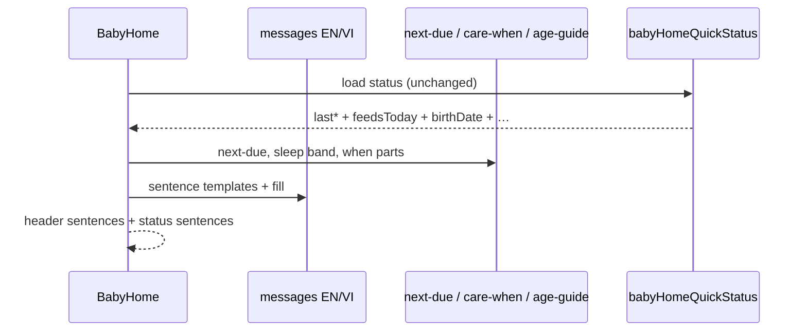

# Design: Baby home 3AM full-sentence copy

**Scope:** Rewrite baby home **section headers** and **last-care information rows** into plain full sentences (EN + VI) so a tired caregiver can understand them at 3AM. Light UI composition only — no new APIs, no chip/layout/order changes.

**Do not reopen:** bottle chips / `recentBottleMl`, birth-date prompt store, feed-session merge, Kind sheet, section order (breast → bottle|nap|diaper), Gate 3 pauses on prior baby-home runs.

**No new ADR.** Copy + i18n + small heading/status helpers.

---

## Problem (one line)

Headers and status lines are clipped labels (`Bottle · recommend ~120 ml / times · today 3/8`) and fragments (`next in 1 hr`, `Feed (Formula 90 ml) · 20 min ago`) — hard to parse when half-asleep.

---

## Settled product intent (from user)

| Topic | Intent |
|-------|--------|
| **Headers** | Full sentences, plain words |
| **Information row** | Last-care block also full sentences |
| **Tone** | Easy at 3AM — short, clear, no jargon |
| **Facts** | Keep the same data (next-due, suggested ml, `n/N`, sleep guide, last summary + when) |

---

## Option 1 — One-line sentence headers + sentence status — **Recommended**

**What it is:**  
Each section header is **one short sentence** (or two short clauses linked with a period). Drop the `Label · tip` middot pattern for these four sections. Last-care rows become **one sentence each** (no separate bold label + fragment line). Same facts as today; only wording and composition change.

**Example (EN):**

```text
Breast — Next feed is in about 1 hour.
Bottle — About 120 ml each time. Today 3 of 8 feeds.
Nap — At this age, about 14 hours of sleep a day, with 2 to 3 naps.
Diaper — Next change is in about 2 hours.

Last feed was a bottle of 90 ml, about 20 minutes ago.
Last nap ended about 1 hour ago.
Last diaper was wet, about 45 minutes ago.
```

**Pros:**

- Fastest scan: one thought per section.
- Matches “full sentences” literally.
- No API / schema work.

**Cons:**

- Longer lines on narrow phones (wrap is OK; keep under ~2 lines).
- Status sentences may need light parsing of existing `summary` strings or small formatter helpers.

---

## Option 2 — Short title + sentence underneath

**What it is:**  
Keep a bold one-word title (`Breast`) and put the full sentence on a second muted line. Status keeps a short title + sentence body.

**Example:**

```text
Breast
Next feed is in about 1 hour.
```

**Pros:**

- Strong landmark labels for thumb-scan.
- Sentences can be longer without crowding the title.

**Cons:**

- More vertical space / CLS risk if skeleton not updated.
- Slightly slower than one line at 3AM.

---

## Tradeoffs

| Factor | Option 1 | Option 2 |
|--------|----------|----------|
| 3AM speed | Best (one glance) | Good (two glances) |
| Vertical space | Same as today | Extra line per section |
| Skeleton work | Small text-width tweak | Must add second line |
| Implementation | i18n + heading/status compose | Same + layout |

## Recommendation

**Pick Option 1** — one-line sentence headers and one-sentence status rows. Matches the user ask with minimal layout change.

---

## Chosen design (user-approved)

**Option 1** — one-line sentence headers + one-sentence last-care rows (Gate 2 + Gate 2-UI · 2026-09-13).

**Addendum (user · 2026-09-13):** **Highlight important words** inside those sentences for quick 3AM scanning (see Scan emphasis below).

---

## Copy contract (Option 1 — EN; VI must match meaning)

### Rules (all locales)

1. **Full sentence** — capital start, period at end (VI: natural full sentence, not telegram fragments).
2. **Plain words** — “about”, “each time”, “today”, “next feed”, “overdue”; no “recommend ·”, no `/ times`.
3. **Same facts** — do not invent medical advice; keep guide caveat as-is.
4. **No birth date** — bottle header = short action sentence only (no ml guide, no `n/N`); nap has no sleep-blend sentence.
5. **Accessibility** — the full sentence remains readable as one string (screen readers hear the whole sentence). Keep existing `data-testid`s on headers and status.
6. **Scan emphasis** — important words use weight/contrast so the eye hits facts first; the rest of the sentence stays quieter.

### Scan emphasis (3AM quick scan)

Match DESIGN_GUIDE status-strip idea: **bold + `tabular-nums` on numbers and blocking words**; remainder `text-muted` (or default body weight on a medium section lead).

**How (UI):** Compose headers/status as React nodes (not one raw string). Glue parts with i18n templates that use placeholders, or small `parts[]` helpers. Use `<strong className="font-medium text-foreground tabular-nums">` (or `span` with those classes) for emphasis — **not** accent color, **not** underline (must not look like links). No `dangerouslySetInnerHTML`.

**What to emphasize (bold / foreground):**

| Surface | Emphasize | Keep quiet (muted / normal) |
|---------|-----------|------------------------------|
| Section lead | Section name: `Breast`, `Bottle`, `Nap`, `Diaper` | Em dash and filler words |
| Breast / diaper due | Duration (`1 hour`, `20 minutes`) + state word (`overdue` when overdue) | `Next feed is in about`, `Change is about`, `to start`, etc. |
| Breast / diaper empty | Action targets: `Left`, `Right`, or `kind` | `Tap … to start/log` |
| Bottle guide | `{ml} ml`, `{n}`, `{max}` | `About`, `each time`, `Today`, `of`, `feeds` |
| Bottle no-guide | `amount` (or whole short action if awkward) | Rest of sentence |
| Nap blend | Sleep totals / nap counts / typical length numbers from the band | `At this age`, `of sleep a day`, `with` |
| Nap / bottle empty action | Verb target if useful (`start`, `end`, `amount`) | Rest |
| Status feed/diaper | Plain detail facts (`90 ml`, `left`/`right`, `wet`/`poop`/…) + when phrase numbers/clock | `Last feed was`, `a bottle of`, commas |
| Status sleep open | `napping now` + elapsed | `Baby is`, `for` |
| Status sleep ended | when phrase | `Last nap ended` |
| Empty / error / loading | Optional light emphasis on `yet` / none — keep calm; do not shout |

**Example (EN visual weight):**

```text
Breast — Next feed is in about 1 hour.
^^^^^^                              ^^^^^^^
strong                              strong

Bottle — About 120 ml each time. Today 3 of 8 feeds.
               ^^^^^^                  ^    ^

Last feed was a bottle of 90 ml, about 20 minutes ago.
                          ^^^^^        ^^^^^^^^^^^^^^^
```

**VI:** Same emphasis rules on the equivalent fact words (numbers, side, kind, overdue), not English loanwords.

### Section headers

| Section | When | EN sentence pattern (facts in **bold** = emphasize) |
|---------|------|-----------------------------------------------------|
| **Breast** | empty / no due | **Breast** — Tap **Left** or **Right** to start. |
| **Breast** | next due | **Breast** — Next feed is in about **{duration}**. |
| **Breast** | overdue | **Breast** — Feed is about **{duration} overdue**. |
| **Bottle** | birth set + finite guide | **Bottle** — About **{ml} ml** each time. Today **{n}** of **{max}** feeds. |
| **Bottle** | no birth / no guide | **Bottle** — Pick an **amount** below. |
| **Nap** | birth set + band | **Nap** — At this age, about **{total}** of sleep a day, with **{naps}**. (facts from existing blend bands; rewrite each band key as one sentence; emphasize number spans) |
| **Nap** | no birth | **Nap** — Tap to **start** or **end** a nap. |
| **Diaper** | empty / no due | **Diaper** — Tap a **kind** to log a change. |
| **Diaper** | next due | **Diaper** — Next change is in about **{duration}**. |
| **Diaper** | overdue | **Diaper** — Change is about **{duration} overdue**. |

**Duration wording:** Prefer “about 1 hour”, “about 20 minutes” (sentence-friendly). Compact `1h` / `20m` only if the existing duration helper cannot expand without a larger refactor — then document in tasks and keep “about {compact}”. Emphasize the duration token either way.

**Nap bands:** Rewrite all six `home.header.nap.blend*` keys into full sentences; drop standalone `home.header.recommend` from the header line (the sentence itself is the guide). Keep “guidelines only” caveat under the grid.

### Last-care information rows (`data-testid="baby-home-status"`)

Replace title + `summary · when` with **one sentence per kind** (with scan emphasis).

| Kind | States | EN pattern (facts in **bold** = emphasize) |
|------|--------|--------------------------------------------|
| **Feed** | empty | No feed logged yet. |
| **Feed** | has item | Last feed was {plainDetail with **facts**}, **{when}**. |
| **Sleep** | open nap | Baby is **napping now** (for **{elapsed}**). |
| **Sleep** | empty | No nap logged yet. |
| **Sleep** | ended | Last nap ended **{when}**. |
| **Diaper** | empty | No diaper logged yet. |
| **Diaper** | has item | Last diaper was **{kind}**, **{when}**. |
| **Any** | load error | Keep honest: `Could not load. You can still log care below.` |
| **Any** | loading | Keep short: `Loading…` |

**`{when}`:** Prefer sentence tails: `about 20 minutes ago`, `just now`, `yesterday at 2:10 PM` (reuse `formatBabyCareWhen` keys; adjust EN/VI strings so they fit mid-sentence). Emphasize the whole when phrase (or its number/clock parts).

**`{plainDetail}`:** Soften today’s machine summary for the home row only (do not change timeline list labels in this run unless shared helper forces it):

| Today’s summary-ish | Plain detail (EN) | Emphasize |
|---------------------|-------------------|-----------|
| `Feed (Formula 90 ml)` | `a bottle of 90 ml` | `90 ml` |
| `Feed (Breast L)` / `Breast R` | `breast on the left` / `right` | `left` / `right` |
| Merged legs | Keep short: `breast and a bottle of 90 ml` | sides + `90 ml` |
| Diaper kinds | `wet` / `poop` / `mixed` / `dry` | the kind word |
| Sleep summary | Prefer “ended” sentence above; if only summary exists, wrap plainly | when / elapsed |

If a reliable plain mapper is too risky in one pass: **fallback** `Last feed: {summary}, {when}.` as a full sentence — still better than middot fragments — and note as Enhancement follow-up. Still emphasize `{when}` and any ml/kind found.

### Heading component

`BabyHomeSectionHeading` today: `label` + optional ` · {rest}`.

**Change:** Render a **sentence as composed nodes** (section lead strong + muted glue + strong facts). No middot join. Accept `children` or a structured `parts` prop — not a single flat string if emphasis is required. Skeleton must still reserve one text line per section (same height family).

### Out of scope

- Changing quick-card button labels (`Left` / `Right` / chip ml).
- New GraphQL fields or DB.
- Rewriting the full timeline page copy (home status only).

---

## Sequence diagram

Client-only compose; status payload unchanged.



---

## Contracts

### API contracts

**N/A** — no endpoint changes. Reuse `babyHomeQuickStatus` as today.

### Database contracts

**N/A** — no schema changes.

### Example queries

**N/A** — no new queries.

---

## Patterns to reuse

| Pattern | Why it fits | Reference |
|---------|-------------|-----------|
| i18n message keys + `fill({…})` | Existing home copy | `messages/baby/en.ts`, `vi.ts`, `baby-home.tsx` |
| Next-due labels | Same due facts | `lib/baby-next-due.ts` |
| Care-when formatter | Same relative time | `lib/baby-format-care-when.ts` |
| Sleep bands | Same facts, new sentence keys | `lib/baby-age-guide.ts` |
| Section heading testids | Keep e2e stable | `baby-home-header-*`, `baby-home-status` |
| Skeleton parity | Zero CLS | `components/baby-page-skeleton.tsx` |

---

## UI / UX / mobile

- **Layout / hierarchy:** Same section order and controls. Headers/status are full sentences with **scan emphasis** (strong facts, muted glue). Eye flow: bold facts → rest of sentence → controls → last-care sentences.
- **Loading / empty / error / success:** Sentence forms for empty/error; loading stays short; empty/error stay calm (little or no shouty bold).
- **Skeleton parity:** One header line per section + status block lines unchanged in structure; update if heading markup gains/loses a node.
- **Mobile:** Allow wrap; avoid forcing nowrap. Hits ≥44px unchanged (no control changes).
- **Accessibility:** Full sentence remains the accessible text; emphasis is visual weight only (not color-only meaning). Keep `aria-labelledby` on sections.
- **Gate 2-UI focus:** Can you catch **time / ml / n of max / kind** in one sleepy glance before reading the whole sentence?

---

## Security design review (OWASP)

Trust boundaries: none new (display-only strings from existing workspace-scoped status).

Abuse cases: N/A for copy.

| OWASP | Status | Note |
|-------|--------|------|
| A01 Broken Access Control | N/A | No access change |
| A02 Cryptographic Failures | N/A | |
| A03 Injection | Pass | React text nodes; i18n fill only for known placeholders |
| A04 Insecure Design | Pass | No new trust in user HTML |
| A05 Security Misconfiguration | N/A | |
| A06 Vulnerable Components | N/A | |
| A07 Auth Failures | N/A | |
| A08 Software / Data Integrity | N/A | |
| A09 Logging / Monitoring Failures | N/A | |
| A10 SSRF | N/A | |

Source: https://owasp.org/Top10/

---

## Challenges answered

- **Do we need this?** Yes — user asked for 3AM-readable full sentences; current fragments fail that.
- **What fails?** Over-long nap sentences on small screens — keep each band to one short sentence.
- **Is this overspecified?** No — copy table + compose rules only; no API.
