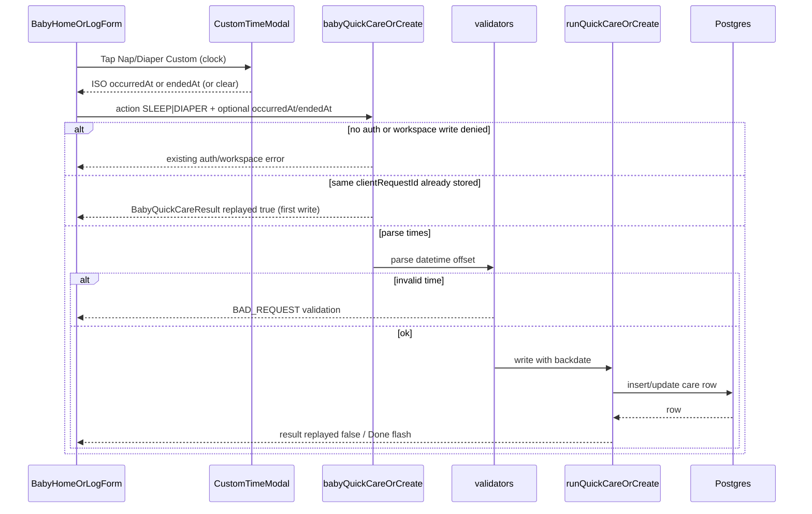

# Design: Baby care layout — custom time, Diaper row, timer copy

**Mode:** simple  
**Has API:** yes — additive optional `occurredAt` / `endedAt` on home quick-care; log create paths already accept them  
**Has DB:** no

## Decision 1: which design approach?

### Option 1 — Shared-control polish + clock Custom + additive quick-care time (recommended)

**What it is:**  
Keep Option B home and shared log forms. Reorder rows (Nap → Diaper above Pump → Pump). Add Nap/Diaper **Custom = clock time** (`occurredAt` / sleep `endedAt`) via a shared datetime modal (Insights-style). Diaper Custom is a **sibling** beside the 2×2, **same size as Nap**. Pump sides use Breast-style **12rem section + nested L/R**. Merge stop title on **all** timed chips. Center Done in the shared face. Custom **ml** keeps save-on-second-tap; add a separate **Edit** control to reopen the ml modal.

**Example:**  
Home: Nap + Custom(time) → Diaper 2×2 + Custom(time, Nap-sized) → Pump (12rem L/R section | amount). Custom time 06:40 → Start nap / log diaper sends `occurredAt`. Running chip label: `End nap - Tap to stop`. Pending Custom 135 ml → second Custom tap saves; **Edit** reopens modal.

**Pros:**

- Honors settled D1–D4; reuses Breast grid, timed chip, Custom ml helpers
- Additive GraphQL/Zod only; no DB/migration
- Home + log stay in sync via shared components

**Cons:**

- Nap/Diaper Custom ≠ Pump Custom ml (two Custom meanings — mitigated by copy/icons)
- Merged stop title may wrap on narrow / VI
- Extra Edit chrome on ml Custom

### Rejected alternative (≤3 lines)

Keep Nap|Diaper on one row, fake ml Custom on Nap, or always-open ml modal (D4 Option 1). Rejected: fights settled placement/size/Custom-time decisions and breaks fast re-log.

## Tradeoffs

One-line: Option 1 matches locked decisions with a small additive API; alternatives reopen Custom meaning or row layout.

## Recommendation

**Pick Option 1** — layout + clock Custom + shared chrome fixes on existing controls; wire optional times through quick-care and existing create inputs.

## Chosen design (user-approved)

<!-- Fill after Gate B -->

## System design

### Overview

- **What it is:** Workspace-scoped Baby GraphQL stays the write path. UI sets optional event times; resolvers/validators already persist `occurred_at` / end times — this change only **exposes** optional ISO strings on the home quick-care input and wires existing create-input fields on log forms.
- **Components / boundaries:** Client (home + log forms) → `POST /api/graphql/baby` Yoga → Zod edge → `runBabyQuickCare` / create sleep|diaper|feed|pump → Postgres. Workspace from session cookie, not client body.
- **Data flow:** Custom time modal → local pending ISO → mutation with field from **pending clock map** (UI): Nap idle → `occurredAt`; Nap running (end) → `endedAt`; Diaper → `occurredAt` (Auto-endNap on that request uses truth table). Custom ml path unchanged except Edit. (Fields: Contracts.)
- **Consistency & failure:** Write strongly consistent per mutation; bad datetime → validation error; auth/workspace miss → existing errors; idempotent `clientRequestId` replay unchanged.
- **Why this shape:** Extend quick-care in place vs parallel “custom time” mutation; creates already support times.
- **Best practices:** Additive optional fields; validate ISO+offset at Zod edge; never trust client workspace id; keep chrome presentational — page owns save.
- **Anti-patterns:** New DB columns for time; inventing a second Custom ml modal for Nap; dropping diaper kind 2×2 for Custom.
- **Reference:** `docs/ARCHITECTURE.md` workspace feature APIs; `lib/graphql/baby-typeDefs.ts` create inputs.

### Concept 1 — Optional backdate on existing writes

- **What it is:** Same mutation/kinds; optional timestamps override “now” at insert/end.
- **How we use it here:** Home Custom time → `babyQuickCare`; log Custom time → `createBabyDiaper` / `startBabySleep` / `endBabySleep` (already have fields).
- **Why we chose it:** No new write owner; Has DB no.
- **Best practices:** Omit field = server now; reject non-ISO; sleep end uses `endedAt` not `occurredAt`.
- **Reference:** Insights edit `datetime-local` + create input Zod.

## Sequence diagram



## Contracts

### API contracts

| Item | Detail |
|------|--------|
| Method + path (or name) | GraphQL `babyQuickCare(input: BabyQuickCareInput!)` — **additive optional time fields** |
| Auth / who can call | Existing baby write workspace session (unchanged). No `babyId` on input. |
| Request fields (change) | Add optional `occurredAt: String` (ISO-8601 with offset) on `BabyQuickCareInput`. Add optional `endedAt: String` for SLEEP **end** path. Existing: `action`, `breastRunning`, `feedSessionEventId`, `clientRequestId`. |
| Semantics | See **Time truth table** below. Omit used field → server “now”. **Wrong/unused field on a path → IGNORE** (do not apply to the write; do not reject solely for that). **Present** `occurredAt` / `endedAt` strings are still Zod-validated even when the path later IGNORE-applies them. |
| Success response | Existing `BabyQuickCareResult` unchanged (`replayed` included). |
| Idempotency | Same `clientRequestId` → return **stored** result (`replayed: true`). Replay is by id only — **no** body/hash compare. Client **must not** reuse an id with different times; different times still replay the first write. Do not invent a mismatch 422. |
| Errors | Invalid datetime on any **present** time field → Zod/GraphQL BAD_REQUEST (same codes as create inputs), including fields the path will IGNORE for the write. Auth/workspace unchanged. |
| Downstream | `runBabyQuickCare` applies times per truth table into existing create/end helpers. |

**Time truth table (`babyQuickCare`):**

| Path | Clock used for that write | Unused field if sent |
|------|---------------------------|----------------------|
| **SLEEP** + no open nap → **start** | `occurredAt` if set, else server now | `endedAt` → **IGNORE** |
| **SLEEP** + open nap → **end** | `endedAt` if set, else server now | `occurredAt` → **IGNORE** |
| **DIAPER** insert | `occurredAt` if set, else server now | `endedAt` → **IGNORE** |
| **BREAST** / **FORMULA** / **PUMP_AMOUNT** insert (this pass) | Always server now for that insert | `occurredAt` / `endedAt` → **IGNORE** (do not apply to those inserts) |
| **Auto-endNap** (open nap closed as side effect of a **non-SLEEP** kind, e.g. DIAPER/FEED) | `endedAt` if set, else `occurredAt` if set, else server now | — (same request’s times feed this clock) |

**Precedence:** When `action.kind` is **SLEEP** and a nap is open, the **SLEEP end** row wins (`endedAt` else now; **IGNORE** `occurredAt`). The Auto-endNap row applies **only** when closing an open nap as a side effect of a **non-SLEEP** kind (DIAPER / FEED / etc.).

Pump family still does **not** auto-end open sleep (existing rule).

**Additive GraphQL (sketch):**

```graphql
input BabyQuickCareInput {
  action: BabyQuickActionInput!
  breastRunning: BabyQuickBreastInput
  feedSessionEventId: ID
  clientRequestId: String!
  occurredAt: String   # NEW optional
  endedAt: String      # NEW optional — sleep end
}
```

**Log / dedicated mutations (wire UI only — fields exist):**

| Mutation | Time field | Notes |
|----------|------------|-------|
| `createBabyDiaper` | `occurredAt` | Already on input + Zod |
| `startBabySleep` | `occurredAt` | Already |
| `endBabySleep` | `endedAt` | Already |
| Feed/pump creates | `occurredAt` | Optional reuse if log forms gain Custom time later; not required for Nap/Diaper Custom |

**Events / other module APIs:** none.

### Database contracts

**N/A — Has DB no.** `occurred_at` / end columns already written by create/end helpers. No migration.

### Example queries

```graphql
# Home: diaper with custom time
mutation {
  babyQuickCare(input: {
    clientRequestId: "qc-diaper-20260920-0640"
    action: { kind: DIAPER, diaperKind: wet }
    occurredAt: "2026-09-20T06:40:00.000+07:00"
  }) { steps { step wrote } replayed }
}
```

```graphql
# Home: end nap with custom end time
mutation {
  babyQuickCare(input: {
    clientRequestId: "qc-sleep-end-0640"
    action: { kind: SLEEP }
    endedAt: "2026-09-20T06:40:00.000+07:00"
  }) { steps { step wrote } openSleep { id } replayed }
}
```

## Design patterns used

### Pattern 1 — Section grid 12rem + nested L/R pair

- **What it is:** Outer auto-fit `minmax(12rem)` sections; L/R live in a nested pair so each side matches Breast width.
- **How we use it here:** Pump home/log: sides section + amount section (drop 3-col `asContents` with amount).
- **Why we chose it:** Repo Breast|Bottle pattern; avoids fragile column weights.
- **Best practices:** Match Breast section token; keep pair internal 8rem; skeleton order mirrors.
- **Anti-patterns:** Forcing Pump L+R+ml into one equal 3-col row.
- **Reference:** Breast|Bottle in `components/baby-home.tsx`.

### Pattern 2 — Timed care chip chrome

- **What it is:** One chip owns idle / running / Done face for timers.
- **How we use it here:** Running label = `{endTitle} - {tapToStop}` on **all** timed chips; Done overlay `justify-center`.
- **Why we chose it:** Single place for copy + centering (D3 + Done).
- **Best practices:** i18n compose short connector; no duplicate subtitle stop; reserve height for CLS.
- **Anti-patterns:** Per-surface stop subtitle forks.
- **Reference:** `components/baby-timed-care-chip.tsx`, `baby-quick-value-card.tsx`.

### Pattern 3 — Compound Custom: ml save vs Edit; clock modal separate

- **What it is:** Parent owns pending custom state; different affordances for save vs edit vs clock.
- **How we use it here:** Custom ml: second tap saves; **Edit** opens `BabyCustomMlModal`. Nap/Diaper Custom: clock modal → pending ISO for save.
- **Why we chose it:** D4 Option 2 + D1 clock without conflating ml and time.
- **Best practices:** Distinct labels; seed modal from override; clear pending on success rules unchanged. **Edit placement:** outside the flush ml **2×2** (not a fifth tile inside the grid); accessible name (visible label or `sr-only` text); ≥44px hit (`fx-hit-40` / big-control min-h); no overlap with Custom hit area; flush 2×2 grid geometry unchanged.
- **Anti-patterns:** One Custom button doing ml and time; Edit inside the ml 2×2 or overlapping Custom.
- **Reference:** `baby-home-bottle-selection.ts`, `BabyCustomMlModal`.

| Pattern | Why chosen (one line) | Reference |
|---------|----------------------|-----------|
| 12rem section + nested L/R | Pump = Breast width | `baby-home.tsx` Breast row |
| Timed chip chrome | One stop/Done path | `baby-timed-care-chip.tsx` |
| Compound Custom | D1 clock + D4 Edit | selection helpers + modals |

## UI / UX / mobile

- **UI concept (01b):** N/A (simple mode skipped) — preserve idea layout rules below; do not invent a new control family.
- **80/20:** #1 primary care taps (start/stop, L/R, diaper kinds); #2 Custom time on same section row. Secondary: ml **Edit**, diaper detail sheet.
- **Layout / hierarchy:** Row1 Breast|Bottle → Row2 Nap + Custom(time) → Row3 Diaper 2×2 + Custom(time, **Nap-sized**) → Row4 Pump (12rem L/R \| amount). Log forms mirror section patterns.
- **Pending clock → GraphQL field map (pin):** When the caregiver confirms Custom time, the next save sends that ISO on the field below (do not send the wrong field — wrong field is IGNORE and the write uses “now” or the wrong end clock).

  | UI action | Field on `babyQuickCare` / create | Notes |
  |-----------|-----------------------------------|-------|
  | **Nap idle** (start) | `occurredAt` | Start nap at custom time |
  | **Nap running** (end) | `endedAt` | End nap at custom time; do not rely on `occurredAt` alone for SLEEP end |
  | **Diaper** | `occurredAt` | Diaper insert at custom time; **do not** send `endedAt` alone. If an open nap is auto-closed on this request, **Auto-endNap** uses the truth table on the **same** request’s times (`endedAt` else `occurredAt` else now) |

- **Custom ml Edit (D4):** Place **Edit outside** the flush Bottle/Pump ml **2×2** (sibling or adjacent chrome — not a grid cell). Accessible name required; ≥44px; no overlap with Custom; keep the flush 2×2 intact.
- **Loading / empty / error / success:** Existing pending/Done; validation toast on bad time; clear Custom pending (clock + ml) after successful save per existing helpers.
- **Skeleton parity:** `baby-page-skeleton` row markers/order match live (nap row, diaper-above-pump, pump sections); same radii/heights.
- **Mobile:** ≥44px hits (`fx-hit-40` / big control min-h); Custom and Edit separate so thumb does not miss; no hover-only; watch VI wrap on merged stop title.
- **Accessibility:** Visible labels for Custom time vs Custom ml vs Edit; focus in modals; `datetime-local` or equivalent with accessible name.
- **Day-to-day:** One-handed log; kinds stay on 2×2; clock Custom does not replace kind tiles.

## Security design review (OWASP)

Trust boundaries:

- Browser → Baby GraphQL (session cookie / workspace). Client-supplied `occurredAt` / `endedAt` are **untrusted** until Zod datetime parse.
- No new upload, SSRF, or cross-feature APIs.

Abuse cases:

- Far-future / far-past timestamps to skew timeline → accept if create path already allows; optional clamp only if repo already clamps (do not invent policy here).
- Replay with different times under same `clientRequestId` → stored first result (`replayed: true`); no body-hash reject.
- Cross-workspace write → blocked by workspace context (unchanged).

| OWASP | Status | Note |
|-------|--------|------|
| A01 Broken Access Control | pass | Workspace write gate unchanged; no client workspace id |
| A02 Cryptographic Failures | N/A | No new secrets/PII fields beyond existing care times |
| A03 Injection | pass | Zod datetime at edge; Drizzle parameterized writes |
| A04 Insecure Design | pass | Additive optional times; no new trust boundary |
| A05 Security Misconfiguration | N/A | No config/CORS change |
| A06 Vulnerable Components | N/A | No new deps |
| A07 Auth Failures | pass | Same baby write auth |
| A08 Software / Data Integrity | pass | Idempotent `clientRequestId` retained |
| A09 Logging / Monitoring Failures | pass | Do not log full care PII beyond existing patterns |
| A10 SSRF | N/A | No URL fetch from input |

Source: https://owasp.org/Top10/

## Challenges answered

- **Do we need this?** Yes — uneven widths, missing Nap/Diaper clock Custom, awkward stop/Done chrome hurt daily one-handed logging.
- **What fails?** Without API wire, home Custom time cannot backdate; without skeleton/e2e updates, CLS and row-order tests fail; conflating ml Custom with clock Custom confuses caregivers.
- **Is this overspecified?** No — one recommended layout + additive optional fields; Has DB no; settled D1–D4 not relitigated.
