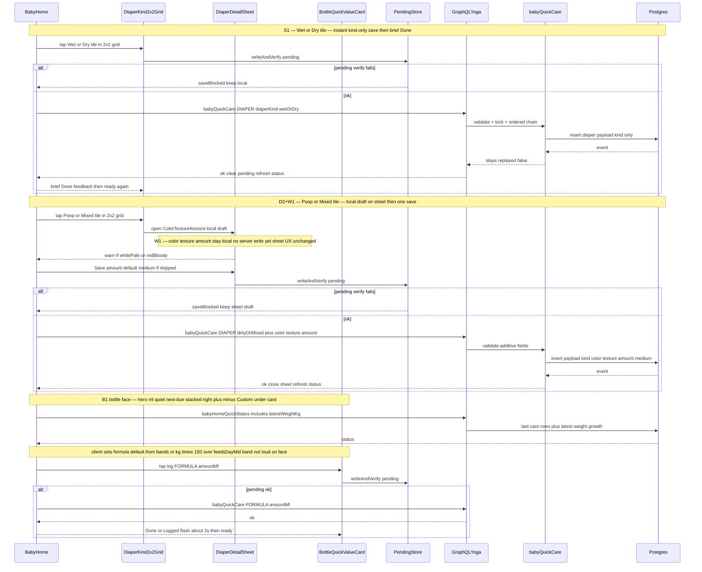

# Design: Baby home logging detail polish

**Scope:** Extend Option B quick-care home from `baby-home-redesign` (local unmerged). Polish next-due copy, bottle/diaper card layout, richer diaper logging, last-ml on row 3, and age/weight bottle guide.

**Do not reopen:** auto-finalize order, `babyQuickCare` transaction/lock/replay core, Custom ml modal, birthday prompt, nap lock. Touch `babyQuickCare` / GraphQL **only** with **additive** DIAPER payload fields (and matching `createBabyDiaper` parity).

**No new ADR:** storage stays `baby_care_event.payload` jsonb; one additive status field. Not an expensive architecture change.

---

## Settled defaults (non-blocking — Design picks)

| # | Decision |
|---|----------|
| 6 | **Red-flag colors** (White/Pale, Red/Bloody): **warn in-sheet** and **store `color` on the event**. No separate Insights alerts this pass. |
| 6b | **Caution textures** (Watery, Hard): **warn in-sheet** (caution copy / warn labels) and **store `texture` on the event** — same spirit as #6. **No Insights alerts** this pass. |
| 7 | **No Step 2 notes** this pass. |
| 8 | **EN next-due:** keep `home.nextIn` = `"next in {duration}"`; duration like **`5 min`** (space + unit word). Align VI so `{duration}` uses **`phút`** (e.g. `5 phút`) inside `"lần tiếp theo trong {duration}"`. **Same locale-aware duration** feeds **`home.nextIn` and `home.overdue`** (not compact `5m` for either). Timeline may keep compact via a separate helper. |
| 9 | **Age guide:** **replace / retune** `FEED_GUIDE_BANDS` to match the `01-idea.md` table (incl. 1–2 days 5–15 ml). Keep `lib/baby-next-due.ts` interval bands untouched. |
| 10 | **Ship on the same branch** as unmerged redesign work (local follow-on, not a strict post-merge only). |
| 11 | **Latest weight:** **extend `babyHomeQuickStatus` with `latestWeightKg: Float`** (nullable). One home round-trip already; one extra indexed growth SELECT in the same resolver is cheaper than a second client query and keeps weight off the critical UI path as optional. |
| 12 | **Poop detail:** first-class **jsonb payload fields** (`color`, `texture`, `amount`) — **not** a notes dump. |
| 13 | **Amount skipped on home:** for **`babyQuickCare` DIAPER** dirty/mixed only, **WRITE `amount: "medium"`** when omitted. **`createBabyDiaper` / update:** write `amount` **only when the client sends it** (omit key otherwise) until the full form collects amount. |

**Gate 1 (already settled):** Dry instant-save (`dry`); latest growth weight; UI “Poop Only” = storage `dirty`; bottle ml only; amount optional default Medium **on home**.

**Diaper UX (user-approved before Gate 2 — do not reopen):**

| Code | Decision |
|------|----------|
| **Architecture** | **Option B** only (one quick-care + jsonb + `latestWeightKg`). **Do not reopen Option A.** |
| **D2** | **Kind tiles + Step 2 sheet** — **not** a progressive 4-phase single-value button. |
| **W1** | Sheet holds a **local draft**; **one** `babyQuickCare` on Save (no server writes while picking color/texture/amount). |
| **S1** | Wet / Dry: instant kind-only save → brief Done feedback → ready again. Poop / Mixed: open Step 2 (**sheet unchanged**). |
| **D-A layout** | **No diaper ↑↓.** One Kind control = **2×2 tile grid** (Wet \| Poop / Mixed \| Dry) at nap/bottle **height** — **not** a 1×4 horizontal strip. Icons + short labels OK; full names in `aria-label`. |
| **B1 bottle** | Tall log matches Start nap; **+/− stacked on the RIGHT** at 50% height each; **hero = ml**; quieter subtitle prefers **next-due** over band on face; **Custom** demoted under card; brief **Done/Logged ~2s** after successful save. |

---

## Option A — Split writes + notes dump + separate weight read

**What it is:**  
Keep `babyQuickCare` DIAPER as kind-only (plus new `dry`). Wet/Dry save via quick-care. Poop/Mixed open Step 2 and call **`createBabyDiaper`**, stuffing color/texture/amount into **`notes`**. Fetch latest weight with a **second** client query (`babyGrowthEntries(kind: weight, limit: 1)`). Retune age bands in `lib/`.

**Example:**

```ts
// Wet / Dry — existing quick-care shape (+ dry)
babyQuickCare({ action: { kind: "DIAPER", diaperKind: "wet" }, clientRequestId })

// Poop — second mutation; detail only in notes
createBabyDiaper({
  kind: "dirty",
  notes: "color=yellow;texture=soft;amount=medium",
})
```

**Pros:**

- Almost no change to `BabyQuickActionInput` / quick-care insert body.
- Reuses existing full-form mutation and growth list query.
- Smaller GraphQL surface for the DIAPER action.

**Cons:**

- **Two home write paths** — breaks redesign’s one-mutation story (pending replay, Telegram, idempotency only cover `babyQuickCare`).
- Notes encoding is fragile, untyped, and hard to summarize or query later.
- Extra network round-trip for weight on every home load.
- Full form and home diverge further; e2e must cover both paths.

---

## Option B — One quick-care DIAPER extension + jsonb detail + status weight — **Recommended**

**What it is:**  
All home diaper saves stay on **`babyQuickCare`**. Add optional **`diaperColor` / `diaperTexture` / `diaperAmount`** on the action (and the same fields on **`createBabyDiaper`** for parity). Store structured keys on `BabyDiaperPayload`. Replace the diaper value-card / cycle / ↑↓ with **one Kind control as a 2×2 tile grid** (Wet | Poop / Mixed | Dry) at Start nap / bottle height (**D2** / **D-A** — not a progressive 4-phase button, **not** a 1×4 strip). Wet and Dry instant-save with brief Done (**S1**); Poop Only / Mixed open a **Step 2 sheet** with **local draft** and **one save** on confirm (**W1**; reuse home `Modal` pattern like Custom ml — sheet UX unchanged). Extend **`babyHomeQuickStatus`** with **`latestWeightKg`**. Client shows last bottle ml from existing `lastFeed.payload.amountMl`. Bottle face follows **B1** (hero ml, quiet next-due, stacked right ±, demoted Custom, ~2s Done/Logged).

**Example:**

```graphql
mutation {
  babyQuickCare(
    input: {
      clientRequestId: "req_diaper_001"
      action: {
        kind: DIAPER
        diaperKind: "dirty" # UI: Poop Only
        diaperColor: "yellow"
        diaperTexture: "soft"
        diaperAmount: "medium" # home quick-care: written (default if skipped); create omits unless sent
      }
    }
  ) {
    replayed
    steps { step event { id } }
  }
}

query {
  babyHomeQuickStatus(dayFrom: "...", dayTo: "...") {
    lastFeed { payload summary }
    latestWeightKg # e.g. 4.2 or null
    birthDate
    feedsToday
  }
}
```

**Pros:**

- One home write path — pending replay, lock, notify rules unchanged.
- Typed jsonb history; summaries / Telegram can map cleanly later.
- One home read; weight available without a second query.
- Matches redesign Option B and Gate 1 defaults.

**Cons:**

- Additive GraphQL + Zod + payload work on DIAPER and `createBabyDiaper`.
- e2e option-b diaper cycle / ± / ↑↓ assertions must be rewritten for **2×2 Kind tiles** + sheet (+ B1 bottle face).
- Shared kind surface (`dry` + display “Poop Only”) touches many files.

---

## Tradeoffs

| Factor | Option A | Option B |
|--------|----------|----------|
| Cost / time | Faster GraphQL change; more e2e path split debt | Slightly more contract work; one coherent path |
| Complexity | Two mutations + notes parser | Additive fields on one mutation |
| Usability | Same Kind → Step 2 UX possible | D2/W1/S1 + **D-A 2×2** Kind + **B1** bottle; better history later |
| Failure cases | Poop save bypasses quick-care replay | Same fail-closed pending rules as redesign |
| Failure cases | Notes collide with real notes later | Old rows without new keys stay valid |

## Recommendation

**Pick Option B.** It keeps the redesign’s single home write/read model, stores diaper detail as real fields (Gate 1 / settled defaults), and folds latest weight into the existing status query with a clear null-when-missing rule. Option A looks smaller on day one but splits saves and buries data in notes.

## Chosen design (user-approved Option B + B1 bottle + D-A diaper)

**Approved architecture:** Option B (jsonb + `latestWeightKg` + one home write). **Do not reopen Option A.**

**Approved product UX:** **D2** + **W1** + **S1** + **D-A** (2×2 Kind tiles, no diaper steppers) + **B1** bottle face. Gate 2 still needed for full design + tasks sign-off after design-review re-run.

| Slice | Change |
|-------|--------|
| **UI — bottle (B1)** | Tall log matches Start nap; **+/− stacked on the RIGHT** at **50% height each**. **Hero = ml amount**; **subtitle quieter** (prefer **next-due** over age-band on face). **Custom** demoted to **text under the card** (not a fourth primary). Brief **Done/Logged** flash **~2s** after successful save. |
| **UI — diaper (D-A)** | **One** Kind control: **2×2 tile grid** — row1 **Wet \| Poop**, row2 **Mixed \| Dry** — at nap/bottle **height**. **Not** a 1×4 horizontal strip. **No** side steppers / ↑↓. Icons + short labels OK; **full names in `aria-label`**. Poop/Mixed → **Step 2 sheet** unchanged (local draft; color red-flag + watery/hard texture caution in-sheet). Wet/Dry → instant save + brief Done. |
| **UI — shared** | Row 3 last ml; bottle suggested ml from retuned bands + optional weight formula (guide copy quieter / not competing as loud face hero). |
| **Write** | `babyQuickCare` DIAPER + `createBabyDiaper` accept optional color/texture/amount; **default medium only on home quick-care** when dirty/mixed omit amount; **W1** = one mutation at Save for sheet path |
| **Read** | `babyHomeQuickStatus.latestWeightKg` |
| **Copy** | Locale-aware next-due **and overdue** duration; Poop Only / Dry labels (short on tile, full in aria); Kind / Step 2 / Done-Logged / color warn / texture caution strings EN+VI |
| **Unchanged** | Chain order, lock, replay table, Custom ml **modal** behavior, birthday, next-due **interval** bands, Step 2 sheet fields |
| **Rejected** | Progressive 4-phase single-value diaper button; mid-sheet server saves; diaper ↑↓ value card; **1×4 Kind strip**; Custom as a fourth primary on the bottle face |

---

## Sequence diagram

Main diaper flow (Option B + D-A 2×2 Kind). Bottle B1 path noted at the end (client face polish; save still `FORMULA` + `amountMl`).



**Key failures (unchanged redesign rules):** Zod field validation → GraphQL `BAD_REQUEST` (ambiguous pending — keep replay); other `BABY_QUICK_*` codes via existing outcome helper; pending verify fail → no mutation; replay same `clientRequestId` → `replayed: true`.

---

## Contracts

### Payload enums (shared)

| Field | Values | When required |
|-------|--------|----------------|
| `kind` | `wet` \| `dirty` \| `mixed` \| `dry` | Always |
| `color` | `yellow` \| `brown` \| `green` \| `black` \| `white_pale` \| `red_bloody` | Optional; only meaningful for `dirty` \| `mixed` |
| `texture` | `soft` \| `seedy` \| `mushy` \| `watery` \| `hard` \| `formed` | Optional; only for `dirty` \| `mixed` |
| `amount` | `smear` \| `medium` \| `blowout` | Home `babyQuickCare` Poop/Mixed: **always written** (UI default `medium` if skipped). `createBabyDiaper` / update: **only when sent** |
| `notes` | string | Unchanged optional; **Step 2 does not collect notes this pass** |

**UI labels:** `dirty` → EN “Poop Only” / VI **“Chỉ phân”**; `dry` → EN “Dry” / VI **“Khô”**; storage stays `dirty` / `dry`.

**Red-flag / caution UX:** `white_pale` and `red_bloody` show an in-sheet warning; `watery` and `hard` show in-sheet **caution** copy (warn labels). Selected values still save on the event (`color` / `texture`). **No Insights alert pipeline** this pass.

**Server rules:**

- `wet` / `dry`: reject color/texture/amount if sent via **existing Zod refine** → GraphQL **`BAD_REQUEST`**. Treat as **ambiguous pending** (keep replay). **Do not** invent `BABY_QUICK_DIAPER_DETAIL_NOT_ALLOWED` or add any code to `BABY_QUICK_DEFINITE_NO_COMMIT_CODES` (still only `UNAUTHORIZED` / `FORBIDDEN` / `NOT_FOUND`).
- `dirty` / `mixed` on **`babyQuickCare`**: color/texture optional; if `diaperAmount` omitted, **service writes `amount: "medium"`** (prefer service write over Zod `.default`).
- `dirty` / `mixed` on **`createBabyDiaper`**: color/texture optional; **omit `amount` from payload unless the client sends it** (full form stays kind-only this pass — no silent Medium).
- **`updateBabyEventDiaperPayloadSchema`:** same wet/dry reject-detail + dirty/mixed optional-detail rules as create; **no silent medium** on update unless amount is sent.
- Old events without new keys remain valid; summaries fall back to kind-only.

### API contracts

#### 1. `babyQuickCare` — additive DIAPER fields only

| Item | Detail |
|------|--------|
| Method + path | GraphQL `mutation babyQuickCare(input: BabyQuickCareInput!)` |
| Auth | Workspace member (existing Baby GraphQL auth) |
| Request fields (changed) | Existing fields unchanged. **Add optional:** `action.diaperColor: String`, `action.diaperTexture: String`, `action.diaperAmount: String`. `diaperKind` enum gains `dry`. |
| Success response | Unchanged `BabyQuickCareResult` |
| Errors | Existing quick-care codes + `BABY_QUICK_DIAPER_REQUIRED`; Zod wet/dry+detail / bad enum → **`BAD_REQUEST`** (ambiguous pending) |
| Downstream | Same insert + Telegram `createDiaper` notify; payload includes new keys |

**Zod (`babyQuickCareSchema`):** extend `diaperKind`; optional color/texture/amount enums; refine wet/dry vs dirty/mixed as above.

#### 2. `createBabyDiaper` — parity

| Item | Detail |
|------|--------|
| Method + path | GraphQL `mutation createBabyDiaper(input: CreateBabyDiaperInput!)` |
| Auth | Same |
| Request fields | Add optional `color`, `texture`, `amount` (same enums). `kind` includes `dry`. |
| Success | `BabyCareEvent!` unchanged shape |
| Errors | Existing + same wet/dry reject-detail rules (Zod → `BAD_REQUEST`) |
| Notes | Full form may stay kind-only UI this pass; API accepts fields so home and future form share one contract. **Does not** default omitted amount to medium. |

#### 3. `babyHomeQuickStatus` — additive weight

| Item | Detail |
|------|--------|
| Method + path | GraphQL `query babyHomeQuickStatus(dayFrom, dayTo)` |
| Auth | Same |
| Request | Unchanged |
| Success | Existing fields + **`latestWeightKg: Float`** (nullable) |
| Errors | Unchanged |
| Downstream | One extra read: latest `baby_growth_entry` where `kind = 'weight'` for baby, `order by recorded_at desc limit 1` |

**Weight normalize (server):**

- If `unit` trims to `kg` (case-insensitive) → `latestWeightKg = valueNum` as float.
- If `unit` is `g` → divide by 1000.
- Else → `null` (ignore lb / unknown this pass; no wrong kg×150).
- Missing valueNum → `null`.

**Why not separate growth query:** home already depends on one status query; a second client fetch races with refresh and duplicates auth/day wiring. Extending status is one SELECT and keeps Option B’s “one home read” promise.

**Why `latestWeightKg` not `latestWeightMinor`:** growth is already decimal `value_num` + free-text unit; caregivers and the guide math think in kg. Minor grams would force a new convention without a money-style integer column.

#### 4. Module APIs (pure `lib/`)

| Module | Role |
|--------|------|
| `lib/baby-diaper-detail.ts` (new) | Enums, default amount `medium`, color red-flag set, texture caution set (`watery`/`hard`), “detail allowed for kind?” |
| `lib/baby-diaper-quick-plan.ts` (new) | Kind tap → `instantSave` vs `openSheet` (**S1**); home save plan shape (W1 local draft → one mutation); default amount medium |
| `lib/baby-age-guide.ts` | Retune bands; `babySuggestedBottleMl({ ageDays, weightKg })` → band mid or weight formula under 6 mo when weight present |
| `lib/baby-format-duration.ts` / next-due | Locale-aware duration for **next-in and overdue** (`5 min` / `5 phút`); keep compact form for timeline if needed |
| `lib/baby-quick-value-steppers.ts` | Drop `BABY_DIAPER_CYCLE` for home Kind tiles; bottle stepper unchanged (B1 stacks ± on right) |
| Display | Map `dirty` → Poop Only / “Chỉ phân”; `dry` → Dry / “Khô” in summaries / Telegram via i18n; short tile labels OK if aria has full name |

### Database contracts

| Table | Purpose | Key fields | Indexes / uniques | Write owner | Read owners |
|-------|---------|------------|-------------------|-------------|-------------|
| `baby_care_event` | Care rows; diaper payload jsonb **extended in place** | `payload.kind`, optional `color`, `texture`, `amount`, `notes?`, `quickRequestId?` | Existing type/baby indexes | `babyQuickCare` / `createBabyDiaper` | Home status, timeline, Telegram summary |
| `baby_growth_entry` | Latest weight source (read-only this pass) | `kind`, `value_num`, `unit`, `recorded_at` | Existing baby/kind listing | Growth forms (unchanged) | `home-quick-status` latest weight |
| `baby_quick_care_request` | Replay — **unchanged** | — | — | quick-care | quick-care |

**No migration** for diaper fields (jsonb). **No profile weight column.** **No RLS change** — existing `baby_care_event` / `baby_growth_entry` workspace RLS already covers reads/writes.

**Data ownership:** Home never writes growth. Weight is read-only for bottle guide. Diaper detail only on diaper events.

### Example queries

```ts
// 1) Latest weight inside getBabyHomeQuickStatus (Drizzle-style)
const rows = await db
  .select({
    valueNum: babyGrowthEntry.valueNum,
    unit: babyGrowthEntry.unit,
  })
  .from(babyGrowthEntry)
  .where(
    and(
      eq(babyGrowthEntry.workspaceId, workspaceId),
      eq(babyGrowthEntry.babyId, babyId),
      eq(babyGrowthEntry.kind, "weight"),
    ),
  )
  .orderBy(desc(babyGrowthEntry.recordedAt), desc(babyGrowthEntry.id))
  .limit(1);
// then normalizeUnitToKg(rows[0]) → number | null
```

```ts
// 2) Quick-care DIAPER insert payload (dirty + detail; amount defaulted on home only)
payload: {
  kind: "dirty",
  color: "yellow",
  texture: "soft",
  amount: "medium", // written by babyQuickCare when UI skipped; createBabyDiaper omits if not sent
  quickRequestId: clientRequestId,
}
```

```graphql
# 3) Status read used by home (last ml from payload client-side)
query BabyHomeQuickStatus($dayFrom: String!, $dayTo: String!) {
  babyHomeQuickStatus(dayFrom: $dayFrom, dayTo: $dayTo) {
    birthDate
    feedsToday
    latestWeightKg
    lastFeed {
      at
      summary
      payload
    }
    lastDiaper { at summary payload }
    lastSleep { at endedAt summary }
    openSleep { id occurredAt }
  }
}
```

### Age guide target bands (replace current table)

**Day indexing:** `babyAgeInDays` is **0 on the birth calendar day** (`babyCalendarDayNumber(today) − babyCalendarDayNumber(birth)`). Band cuts use that number. Caregiver copy “1–2 days” maps to inclusive **`ageDays` 0–2** in the first band (day of birth through two calendar days later).

| Age (`ageDays` inclusive) | Per-feed ml | Feeds/day (`feedsMin`–`feedsMax`) |
|---------------------------|-------------|-----------------------------------|
| 0–2 (caregiver “1–2 days”) | 5–15 | 8–12 |
| 3–7 | 30–60 | 8–12 |
| 8–28 (2–4 weeks) | 60–90 | 6–8 |
| 29–91 (1–3 mo) | 90–150 | 6–8 |
| 92–183 (3–6 mo) | 120–180 | 5–6 |
| 184–365 (6–12 mo) | 180–240 | 3–4 |
| >365 | hold last milk band or existing older bands — Design: keep post-12mo bands from today so toddlers do not jump to newborn ml |

**Weight formula (bottle only, age &lt; 183 days, `latestWeightKg` present):**  
`perFeed ≈ round10( clamp( weightKg * 150 / feedsDayMid ) )` — **multiplier fixed at 150** (not a 150–160 range). `feedsDayMid = (feedsMin + feedsMax) / 2`. Clamp inside band or as alternate suggestion — UI copy: guidelines only; wet-diaper / weight-gain caveats.

**Last ml (row 3):** if `lastFeed.payload.amountMl` is a positive number, show it next to summary (e.g. `120 ml · …`). No new server field.

### Layout contracts (UI)

**Bottle (B1)**

- Tall **log** button height matches **Start nap**.
- **+/− stacked on the RIGHT** of the log button; each stepper **50%** of log height (top +, bottom −).
- **Hero** on the log face = **ml amount** (primary number).
- **Subtitle quieter** than the hero — prefer **next-due** (or overdue) on the face; **do not** put the age-band as loud competing face copy.
- **Custom** demoted to **text link / text under the card** — **not** a fourth primary control beside log/±.
- After successful bottle save: brief **Done** or **Logged** flash **~2 seconds**, then return to ready.

**Diaper (D-A + D2/W1/S1)**

- **One** Kind control at the **same height** as Start nap / bottle (**D2**).
- Layout = **2×2 tile grid** of four kinds — e.g. row1 **Wet | Poop**, row2 **Mixed | Dry** — **not** a **1×4** horizontal strip.
- **No** side steppers, **no** ↑/↓ value card, **no** progressive 4-phase single-value button.
- **Icons + short labels** on tiles OK; **full names** (e.g. “Poop Only”) in **`aria-label`** (and summaries elsewhere).
- **S1:** after Wet/Dry success, show brief Done on the tile/control, then ready-to-tap.
- **W1:** Step 2 edits stay local until Save; cancel discards draft; **sheet fields/flow unchanged**.
- Hit area ≥44 px per tile where practical; no overlapping `fx-hit-40`.

**Skeleton**

- `BabyHomeSkeleton` updated in the **same change** as each live layout shift:
  - Task 9: bottle/nap **B1** structure (tall log, stacked right ±, quiet subtitle slot, Custom under card — not a fourth primary).
  - Task 10: **2×2 Kind tile** geometry (not 1×4, no diaper steppers) — CLS.

### i18n

- VI `home.nextIn`: e.g. `"lần tiếp theo trong {duration}"` with duration `5 phút`.
- VI / EN `home.overdue`: same duration helper (`5 phút` / `5 min`) inside the existing overdue sentence shape.
- EN duration words: `min` / `h` with spaces (`5 min`, `1 h 5 min`) for next-due **and** overdue only.
- Kind labels (settled): EN Poop Only / Dry; VI **“Chỉ phân”** / **“Khô”** — full strings for aria / summaries; short tile text may abbreviate if readable.
- Plus Wet / Mixed, Step 2 color/texture/amount, **color red-flag warn** + **texture caution** (`watery`/`hard`) keys, brief **Done** / **Logged** (~2s bottle + Wet/Dry), guide caveat, last-ml fragment.
- Custom under-card affordance needs a clear EN+VI string (not a primary chip label competing with log).

---

## Challenges answered

**Do we need this?**  
Yes for Gate 1 + polish outcomes: Dry + poop detail via **D2** sheet, readable VI next-due, **B1** bottle face (height, stacked ±, hero ml, quiet next-due, demoted Custom, ~2s Done/Logged), **D-A 2×2 Kind** (no diaper steppers, not 1×4), last ml, retuned bottle guide. Without jsonb fields we cannot trust history later.

**What fails?**  
- e2e still asserting wet→dirty→mixed ± / ↑↓ cycle or a **1×4** Kind strip — rewrite early for **2×2 tiles** + B1.  
- Wrong unit on growth → null weight (safe).  
- Sending color on wet → validation error (safe).  
- Pending store fail → no silent diaper write (existing).  
- Accidental mid-sheet `babyQuickCare` (**W1** violation) — keep draft local until Save.  
- Loud band copy on bottle face competing with hero ml — violates **B1** (prefer next-due subtitle).

**Is this overspecified?**  
Enums are fixed for one UI sheet; Insights alerts and Step 2 notes are explicitly out. Color red-flags and watery/hard texture caution are in-sheet warn + store only (settled #6 / #6b). Full `/baby/diaper` form can stay kind-only this pass. No second mutation, no profile weight, no migration. Progressive 4-phase diaper button and **1×4 Kind strip** are explicitly rejected. Custom ml **modal** stays; only face placement is demoted.

**Why not reopen quick-care core?**  
Only additive action fields and payload keys. Order, lock, replay table, and notify step names stay. Option A (split writes / notes dump) stays closed. API/jsonb/weight/VI next-due/last ml stay Option B.

---

## Test strategy (plan)

| Layer | Focus |
|-------|--------|
| Unit | Enums/defaults/color red-flags + texture caution; age bands + weight ml (×150); duration locale next-in **and** overdue; Zod wet/dry reject detail → BAD_REQUEST; status kg normalize; summary “Poop Only” / “Chỉ phân” |
| Server | quick-care DIAPER writes amount medium when omitted; createBabyDiaper omits amount unless sent; home status `latestWeightKg` |
| e2e | Wet/Dry instant + Done; Poop + Mixed open sheet → one save (W1); **B1** bottle height / stacked right ± / Done~2s when stable; **2×2 Kind** (not 1×4); last ml when payload has amountMl; VI next-due substring; no diaper ↑↓ selectors |

**Commands:** `npm test`, `npm run lint`, `npm run build`, `npx playwright test e2e/baby-home-option-b.spec.ts` (and diaper-related care specs as needed).

**Boundaries**

- ✅ Always: TDD pure `lib/` first; EN+VI together; skeleton with layout tasks.
- ⚠️ Ask first: Insights alerts; Step 2 notes; lb conversion; changing next-due **interval** bands; any migration.
- 🚫 Never: reopen auto-finalize order / lock semantics; notes-encoded detail; medical alert paging; undo.
