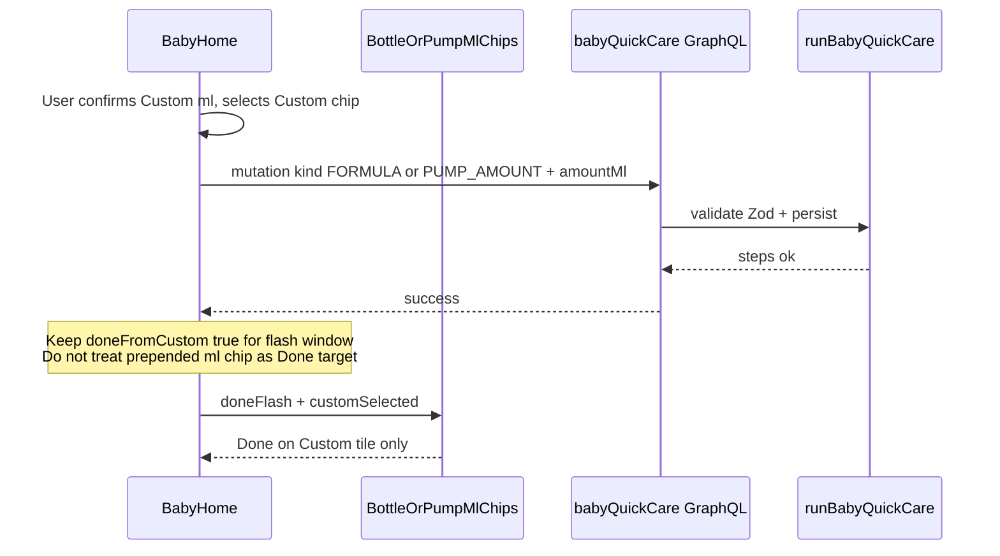
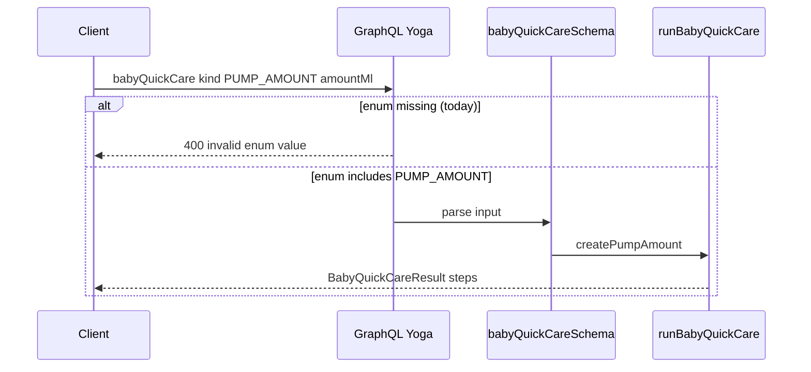

# Design: Baby home polish — controls + pump enum + quiet guideline

**Mode:** simple  
**Has API:** yes — add `PUMP_AMOUNT` to GraphQL `BabyQuickActionKind` only  
**Has DB:** no

## Decision 1: which design approach?

### Option 1 — Targeted polish on existing Option B home (recommended)

**What it is:**  
Keep current baby home layout and flows. Fix five gaps in place: optical centering on quick controls (idle + Done), shared height token `2 × tile + 3 × border`, Done flash on the Custom tile that was used (Bottle / Pump), GraphQL enum `PUMP_AMOUNT`, and one muted guideline block whose copy is **I. room-temp/sleep-safety (VN)** + **II. five development stages** from `01-guideline-content.md` (updated Gate B).

**Example:**  
Custom Bottle 150 ml → confirm modal → tap Custom chip → `babyQuickCare` FORMULA → Done paints on `data-bottle-ml="custom"` for the flash window (not the prepended 150 chip). Pump custom mirrors with `PUMP_AMOUNT`. Breast/Nap use `min-h-[calc(2*2.75rem+3px)]`. Guideline is one quiet scrollable block: shared **I** (nhiệt độ / phòng ngủ / SIDS) then **II** all five stages (no age filter).

**Pros:**

- Matches locked defaults; smallest change set
- Reuses Done-flash, height helper, feed-form `customSelected`, Zod/`runBabyQuickCare`
- Additive API change; no DB work

**Cons:**

- Height still CSS-token based (not live-measured) — fine if tile mins stay fixed
- EN guideline stays a short placeholder until a later translate pass

### Rejected alternative (≤3 lines)

Live-measure Bottle stack with ResizeObserver for Breast/Nap height, and/or age-highlight only the current stage, and/or auto-save from the Custom modal. Rejected: more JS/chrome, reopens settled product choices, fails locked defaults.

## Tradeoffs

One-line: Option 1 is cheaper and aligned with locked defaults; measure/filter/auto-save would reopen scope without fixing the enum or Done bugs faster.

## Recommendation

**Pick Option 1** — fix wiring, tokens, enum, and quiet content on the existing home. Do not redesign IA or change Custom confirm-then-tap-chip.

## Chosen design (user-approved)

<!-- Fill after Gate B -->

## Sequence diagram

### A. Custom Done flash (Bottle; Pump amount mirrors)



### B. Pump enum path (API)



## Contracts

### API contracts

| Item | Detail |
|------|--------|
| Method + path (or name) | GraphQL mutation `babyQuickCare(input: BabyQuickCareInput!)` — **enum extend only** |
| Auth / who can call | Existing baby write context (`requireBabyWriteWorkspace` / workspace session). **No `babyId` on input** — baby/workspace come from GraphQL context (unchanged). |
| Request fields | **Required:** `clientRequestId: String!` (idempotency key). **Required:** `action: BabyQuickActionInput!` — `action.kind` gains enum value `PUMP_AMOUNT`; for that kind Zod requires `amountMl` (same as FORMULA). **Optional:** `breastRunning`, `feedSessionEventId`. See `BabyQuickCareInput` in `lib/graphql/baby-typeDefs.ts`. |
| Success response | Full existing `BabyQuickCareResult` (unchanged shape): `steps: [BabyQuickCareStepResult!]!` (`step`, `wrote`, `event`), `replayed: Boolean!`, optional `openSleep`. Mirror `BABY_QUICK_CARE_MUTATION`. |
| Idempotency | Pump path keeps existing behavior: same `clientRequestId` → replay prior result with `replayed: true`, no second write (same as FORMULA / other kinds). |
| Errors | Missing enum → GraphQL 400 today; after fix, same Zod codes as FORMULA amount (`BABY_QUICK_AMOUNT_REQUIRED` etc.). Duplicate `clientRequestId` is success + `replayed`, not an error. |
| Downstream calls | Existing `runBabyQuickCare` → `createPumpAmount` (no change) |

**Change (additive):**

```graphql
enum BabyQuickActionKind {
  BREAST
  FORMULA
  PUMP_AMOUNT  # NEW — match Zod allowlist
  SLEEP
  DIAPER
}
```

**Events / other module APIs:** none.

### Database contracts

**N/A — Has DB no.** Pump amount already persists via existing feed/quick-care writes (`method: "pump"` + `amountMl`). No migration.

### Example queries

Valid `BabyQuickCareInput` (no `babyId`; workspace from context). Selection set mirrors `BABY_QUICK_CARE_MUTATION` / diaper yoga tests (`lib/graphql/baby-yoga.test.ts`).

```graphql
# Happy path — custom pump amount (must pass GraphQL enum + Zod)
mutation {
  babyQuickCare(input: {
    clientRequestId: "req-pump-custom-120"
    action: { kind: PUMP_AMOUNT, amountMl: 120 }
    breastRunning: null
  }) {
    replayed
    steps {
      step
      wrote
      event {
        id
        type
        occurredAt
        endedAt
        payload
      }
    }
  }
}
```

```graphql
# Parity — formula custom amount (unchanged contract)
mutation {
  babyQuickCare(input: {
    clientRequestId: "req-formula-custom-150"
    action: { kind: FORMULA, amountMl: 150 }
    breastRunning: null
  }) {
    replayed
    steps {
      step
      wrote
      event {
        id
        type
        occurredAt
        endedAt
        payload
      }
    }
  }
}
```

## Patterns to reuse

| Pattern | Why it fits | Reference |
|---------|-------------|-----------|
| Done flash timer (~2s) | Keep success flash window | `lib/baby-home-done-flash.ts` |
| Feed-form `customSelected` | Correct Custom Done wiring | `components/baby-feed-form.tsx` |
| Shared height token | One formula for big cards + small grids + skeleton | `lib/baby-home-control-height.ts` |
| GraphQL enum + yoga test | Mirror diaper enum coverage for `PUMP_AMOUNT` | `lib/graphql/baby-yoga.test.ts` |
| Quiet muted secondary copy | Guideline de-emphasis | DESIGN_GUIDE / `text-muted` |
| Skeleton parity | Zero CLS with guideline + height | `components/baby-page-skeleton.tsx` |

## UI / UX / mobile

- **UI concept (01b):** skipped (simple mode) — honor `01-idea.md` outcomes; do not invent new IA
- **80/20:** #1 quick care grid; #2 timers/open cues; guideline secondary (muted, one block)
- **Layout / hierarchy:**
  - **Centering:** Idle + Done — `items-center justify-center text-center` on quick faces. **Locked Done approach:** absolute-centered Done overlay on the face while CLS reserved idle slots (title/icon/value markers) stay in the layout so card height does not jump; the visible Done string is optically centered via the overlay, not left high in the label slot. Do not ship an alternate Done-centering approach.
  - **Height:** `BABY_HOME_BIG_CONTROL_MIN_H` / `BABY_HOME_SMALL_GRID_MIN_H` = **`2 × 2.75rem + 3 × 1px`** → `min-h-[calc(2*2.75rem+3px)]` (tile + tile + top + mid + bottom borders). Apply to Breast L/R, Nap, flush Bottle/Diaper/Pump grids, and skeleton
  - **Custom Done:** During flash after Custom-origin save, keep `doneFromCustom` / `*FromCustom`; pass `customSelected`; allow Done on Custom (`isCustom && customSelected`); do not flash the prepended ml chip. Diaper: N/A (no Custom tile)
  - **Quiet guideline:** Replace 4-accordion tips with **one** muted block from `01-guideline-content.md` (no age-highlight filter). Structure:
    1. **I. Tiêu chuẩn nhiệt độ và phòng ngủ** (shared): ideal room temp/humidity, normal body temp (axilla / rectal), SIDS safe-sleep rules
    2. **II. Năm giai đoạn** (0–1m … 12–24m). **Each stage keeps content-file subsections:** sleep; nutrition (bú/hút ± ăn dặm); WHO size; **y tế dự phòng** (vitamin / vaccine TCMR / vaccine dịch vụ / thuốc as present per stage); diaper notes — not headings alone with flattened bullets
    - Keep short medical caveat. **EN:** short quiet placeholder / caveat only — do **not** invent full EN translation
    - Ship user-provided VN text only; do not invent dosages or vaccine schedules beyond the content file
- **Loading / empty / error / success:** Existing quick-care errors; Done flash = success. Guideline has no separate empty state (static copy)
- **Skeleton parity:** Update `BabyHomeSkeleton` — control height token; guideline row mirrors one quiet block (not four `guideline-header` bars)
- **Mobile:** ≥44px hits unchanged; thumb-friendly grid kept
- **Accessibility:** Visible labels; focus rings via tokens; guideline readable muted contrast
- **Day-to-day:** Confirm-then-tap-chip Custom flow unchanged; only Done target + enum + polish

## Security design review (OWASP)

Trust boundaries:

- GraphQL edge validates enum before Zod/resolver; baby workspace auth unchanged
- Guideline copy is static i18n (no user HTML)

Abuse cases:

- Invalid `kind` / missing `amountMl` — reject at GraphQL or Zod (existing codes)
- Cross-workspace babyId — existing access checks (unchanged)

| OWASP | Status | Note |
|-------|--------|------|
| A01 Broken Access Control | pass | Reuse existing baby workspace auth on `babyQuickCare` |
| A02 Cryptographic Failures | N/A | No new secrets/crypto |
| A03 Injection | pass | Enum + typed `amountMl`; static guideline strings |
| A04 Insecure Design | pass | Additive enum; no auto-save widening attack surface |
| A05 Security Misconfiguration | N/A | No new config surface |
| A06 Vulnerable Components | N/A | No new deps |
| A07 Auth Failures | pass | Same session gate as today |
| A08 Software / Data Integrity | pass | Enum must match Zod allowlist (tests) |
| A09 Logging / Monitoring Failures | N/A | Existing notify filter; no new PII logs required |
| A10 SSRF | N/A | No outbound URL fetch |

Source: https://owasp.org/Top10/

## Challenges answered

- **Do we need this?** Yes — wrong Done, pump 400, uneven height, loud outdated tips hurt daily log trust.
- **What fails?** Custom pump blocked at GraphQL; caregivers see Done on the wrong chip; grid looks uneven; guideline competes with actions.
- **Is this overspecified?** No — five scoped fixes, one Option, locked defaults, no IA redesign.
