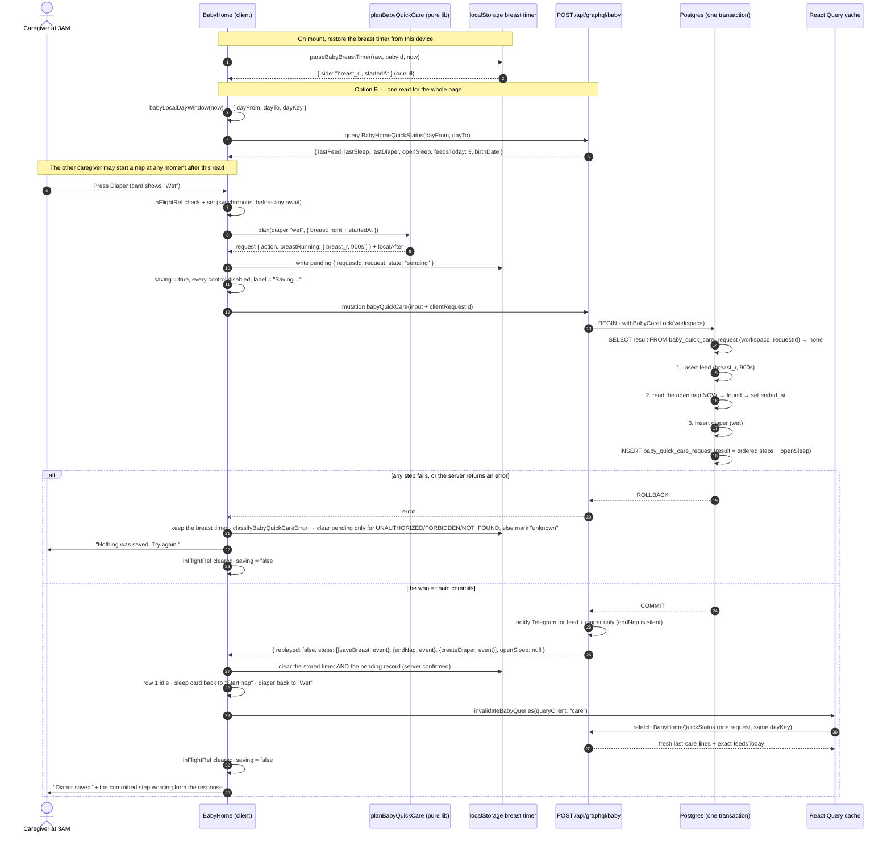

# Design: Baby home for fast night care

**Goal in one line:** turn `/baby` into a three-row quick-log page so a tired caregiver can record a breast feed, a bottle, a nap, or a diaper in one or two taps, with no page change and no wrong save.

**Scope:** front-end plus a small, contained server addition. **One small migration** — a new `baby_quick_care_request` table that makes the exactly-once promise durable (added in review round 2). Three new GraphQL fields: one read (`babyHomeQuickStatus`), one write for the ordered quick-care chain (`babyQuickCare`), and one write for the birthday (`updateBabyProfile`). The existing care mutations keep their input and output contracts exactly as they are and keep serving the full forms; the two sleep ones gain the shared nap lock inside their bodies, and the generic update/delete mutations take the same lock only when they touch a sleep row (review round 3).

**Chosen path — Option B (user decision, 2026-09-12).** Option A is kept below as the rejected alternative so the trade-off stays on record.

**Updated after design review round 1 (2026-09-12).** Ten findings were fixed in place. The biggest is that the auto-finalize chain moved from four client mutations to **one server mutation running in one transaction** — see "Auto-finalize runs on the server". Option B, the Custom ml modal, the birthday prompt, the fixed order, and the 6-hour stale timer are unchanged.

**Updated after design review round 2 (2026-09-12).** Seven more findings were fixed in place. Round 1 put a lock and a replay check on the new mutation only, which was not enough. Round 2 makes all of it real:

1. **One nap lock for every write path** — the full sleep forms take the same lock as quick care, so the order cannot be broken by a form save. See "One nap lock, every nap write path".
2. **Durable idempotency** — a new `baby_quick_care_request` row stores the full ordered result. The 10-minute `occurred_at` scan is gone, and so is its expiry. See "Exactly once is a stored result".
3. **The device remembers the press** — a pending-request record holds the whole action, with clear and retry rules. See "Pending request on the device".
4. **Midnight rolls over on its own** — a timer plus visibility and focus refresh move the day window at local midnight. See "The day window rolls over at local midnight".
5. **`expectedSteps` is gone** — the server's returned steps are the only step wording shown.
6. **Telegram matches today** — a feed, a diaper, and a started nap notify; an **ended** nap does not. Committed rows come back in the response, so no extra read is needed.
7. **Tasks gained real tests** — live-database concurrency and replay tests, reload tests for every action, midnight tests, and notify tests.

**Updated after design review round 3 (2026-09-12).** Four more findings were fixed in place. Round 2 got the shapes right but left four holes:

1. **Every nap writer now serializes, not just the sleep forms** — `updateBabyEvent` and `deleteBabyEvent` take the same lock when they touch a **sleep** row, so a correction that reopens or deletes an open nap can no longer race the quick chain. See "One nap lock, every nap write path".
2. **Pending persistence is fail-closed** — if the pending record cannot be written **and** read back, the request is **not** sent. The device keeps its values and shows a local save-blocked line. See "Pending request on the device".
3. **The failure classifier is code-based, not response-shape-based** — a 5xx, an internal error, `BAD_REQUEST`, and any unknown code are all **ambiguous** and keep the pending record. Only a small allowlist of pre-commit codes clears it. See "Classifying the outcome".
4. **An idle breast start returns empty `steps`** — pressing an idle breast with no open nap writes no row, stores an empty result, and starts the local timer. "Empty is impossible" is removed. See the API contract and "Auto-finalize rules".

Option B, the Custom ml modal, the birthday prompt and settings field, the fixed order, and the 6-hour stale timer are all unchanged.

---

## The page shape (same in both options)

| Row | Controls | Behaviour |
|-----|----------|-----------|
| **1** | Left breast · Right breast | Tap idle → timer starts in the title. Tap the same one → save the feed. Tap the other → save the running one, then start the other. **Idle subtitle:** shared next-feed (`next in …` / overdue). **Running:** elapsed only. |
| **2** | Bottle · Sleep · Diaper | Bottle and Diaper are stepper cards (`+` / value / `−`). The Bottle card has a fourth control — a **Custom** chip that opens a modal for an exact ml value. Sleep is one card that toggles Start nap / End nap. **Idle subtitles:** bottle shares next-feed with row 1; sleep shows next-nap from awake time; diaper shows next-diaper. **Running sleep:** elapsed only. |
| **3** | Last feed · Last nap · Last diaper | Feed line shows side or ml, time ago, and `n/N today`. Nap shows "Napping now" or last length + when it ended. Diaper shows the result + time ago. |
| **bottom** | Pending-save bar (only after an unconfirmed press) · Birth-date prompt (only when unset) | The bar offers Retry or Discard for a press whose outcome is unknown (added in review round 2). The prompt is one quiet line asking for the birthday, with a link to `/baby/settings` and a "Not now" that hides it for 7 days. Both sit below every care control so neither can shift the rows. |

---

## Next-due subtitles on care buttons (settled Gate 2 pause — 2026-09-12)

**Picks:** meaning A · intervals A (age table) · layout A (subtitle) · feed on L+R+bottle A.

**Due rule:** use the **earlier** bound of each guide range (start of the window). Format with the same compact duration helper as timers (`12m`, `1h 20m`). Labels: `home.nextIn` / `home.overdue` (EN+VI). Tick at least every 30s while visible; also refresh on `visibilitychange`.

**Clocks** (anchors are `BabyTimelineItem` fields — use `.at` / `.endedAt`, not a missing `occurredAt` on the timeline item):

| Kind | Anchor | Interval source | Hide when |
|------|--------|-----------------|-----------|
| Next feed (shared on L, R, bottle) | `lastFeed.at` | Age band + method mapping below | No `birthDate`, or no last feed |
| Next sleep | `lastSleep.endedAt` | Age awake-before-nap (earlier bound) | No `birthDate`, never ended a nap, or nap open / sleep running |
| Next diaper | `lastDiaper.at` | Age diaper interval (earlier bound) | No `birthDate`, or no last diaper |

**Feed method → interval** (`lastFeed.payload.method` → `lastFeedMethod` input):

| Method | Newborn (0–1 mo) | Older bands (and any age when not newborn-split) |
|--------|------------------|--------------------------------------------------|
| `breast_l` / `breast_r` | `feedBreastMinMs` (2h) | `feedDefaultMinMs` |
| `formula` | `feedFormulaMinMs` (3h) | `feedDefaultMinMs` |
| `pump` | **`feedDefaultMinMs`** (same as non-split feed) | `feedDefaultMinMs` |
| `null` (missing method) | **`feedDefaultMinMs`** | `feedDefaultMinMs` |
| any other / unknown string | **`feedDefaultMinMs`** | `feedDefaultMinMs` |

Implementers must not invent a fourth newborn interval. Pump, null, and unknown always use `feedDefaultMinMs`.

**Home clock for labels (client-only display):** one shared visible-page timer (≥30s) injects `now` into `babyNextFeedDue` / `babyNextSleepDue` / `babyNextDiaperDue` and `formatBabyNextDueLabel`. Recompute on that tick and on `visibilitychange` (and `focus` if the page already listens). Breast elapsed may still tick ~1s; next-due must not freeze until a refetch. No schema change — pure client display on top of existing `babyHomeQuickStatus`.

**Sub-minute copy:** `formatBabyDurationCompact` floors under 60s to `0m`, so a label can read `next in 0m` until the due instant flips to overdue. That is accepted; do not invent a special “soon” string this pass.

**Pure module (new):** `lib/baby-next-due.ts`

```ts
export type BabyNextDue =
  | { kind: "next"; dueAt: number; remainingMs: number }
  | { kind: "overdue"; dueAt: number; overdueMs: number }
  | { kind: "hidden" };

export function babyCareIntervalGuideForAge(ageDays: number | null): {
  feedBreastMinMs: number;
  feedFormulaMinMs: number;
  feedDefaultMinMs: number;
  sleepAwakeMinMs: number;
  diaperMinMs: number;
} | null; // null → no birthDate / unknown age
// ageDays >= 1095 → same intervals as the 1–3y band (hold last)

export function babyNextFeedDue(input: {
  now: number;
  ageDays: number | null;
  lastFeedAt: number | null; // from lastFeed.at
  lastFeedMethod: "breast_l" | "breast_r" | "formula" | "pump" | null;
  // unknown runtime strings → treat like null → feedDefaultMinMs
}): BabyNextDue;

export function babyNextSleepDue(input: {
  now: number;
  ageDays: number | null;
  lastSleepEndedAt: number | null; // from lastSleep.endedAt
  napOpen: boolean;
}): BabyNextDue; // napOpen or running → hidden (UI shows elapsed instead)

export function babyNextDiaperDue(input: {
  now: number;
  ageDays: number | null;
  lastDiaperAt: number | null; // from lastDiaper.at
}): BabyNextDue;

/** vars must include { duration } — the only interpolation name for both keys */
export function formatBabyNextDueLabel(
  due: BabyNextDue,
  t: (key: "home.nextIn" | "home.overdue", vars: { duration: string }) => string,
): string | null;
```

**Age day bounds for frequency bands** (align with local calendar age; split 1 vs 2 months and 5 vs 6 months as the user table). **Separate from** ml bands in `lib/baby-age-guide.ts` — do not reuse those day cuts here.

| Age | Day upper (exclusive next) | Feed due | Sleep awake due | Diaper due |
|-----|----------------------------|----------|-----------------|------------|
| 0–1 month | 31 | breast 2h / formula 3h / else `feedDefaultMinMs` | 50m | 2h |
| 1–<2 months | 61 | 2.5h | 60m | 2h |
| 2–<3 months | 91 | 2.5h | 1.5h | 2h |
| 3–4 months | 152 | 3.5h | 1.5h | 3h |
| 5–<6 months | 183 | 4h | 2h | 3h |
| 6–<7 months | 213 | 4h | 2h | 3h |
| 7–12 months | 365 | 4h | 3h | 3h |
| 1–3 years | 1095 | 3h | 5h | 4h |
| over 3 years (`ageDays >= 1095`) | — | hold last band | hold last | hold last |

**Data:** `babyHomeQuickStatus.lastFeed.at` + `lastFeed.payload.method` (already on `BabyTimelineItem`) drive next-feed. `lastSleep.endedAt` / `openSleep` drive next-nap. `lastDiaper.at` drives next-diaper. **Client-only display** — no new mutation; `babyQuickCare` / `babyHomeQuickStatus` schemas unchanged.

**Skeleton:** each care card idle state includes a short subtitle bar placeholder in `BabyHomeSkeleton` at the **same height** as the live next-due line (same task as the row UI).

**Non-goals:** solids meal schedules; editable interval settings this pass; next-due on row 3 (row 3 stays last-care + `n/N`).

Four home link CTAs are removed. The full forms and Measure stay in the Baby hamburger menu (`lib/app-section-nav.ts` already lists all of them — nothing to add there).

---

## Option A — Client-only home, pure rules in `lib/`, existing API untouched — **REJECTED**

> Not chosen. Kept for the record. The pure `lib/` rule modules described here are **still part of the chosen design** — only the data-reading part was replaced by the server query in Option B.
>
> **Do not build from the code sample below.** Design review round 1 found that running the chain as separate client mutations is not race-safe. The chain now runs in one server transaction — see "Auto-finalize runs on the server". The stepper, diaper cycle, and breast timer modules are unaffected.

### What it is

Rewrite `components/baby-home.tsx` into the three rows. Every rule that can go wrong (age band, ml stepper, diaper cycle, timer restore, auto-finalize order) becomes a **pure function in `lib/`** with its own `node:test` unit test. The component only wires state and calls the four mutations that already ship.

Home reads three things, all from queries that already exist:

- `babyLastCareStatusQueryOptions()` — last feed / nap / diaper (already wired today).
- `babyProfileQueryOptions()` — `birthDate` for the age band. The GraphQL document **already selects `birthDate`**; only the TypeScript return type needs widening.
- A new client-side query for **today's feed count**, using the existing `babyTimeline(from, to)` field with a local-day window.

Open nap comes from the existing `babyOpenSleep` query (same one the sleep form uses).

### Example

```ts
// lib/baby-quick-care-plan.ts — the whole auto-finalize rule, pure and testable
export function planBabyQuickCareSteps(
  action: BabyQuickAction,
  state: { breast: { side: BabyBreastSide; startedAt: number } | null; napOpen: boolean; now: number },
): BabyQuickCareStep[] {
  const steps: BabyQuickCareStep[] = [];

  // 1. Always finalize an open breast timer first.
  if (state.breast) {
    steps.push({
      step: "saveBreast",
      side: state.breast.side,
      durationSec: Math.max(1, Math.floor((state.now - state.breast.startedAt) / 1000)),
    });
  }

  // 2. Then close an open nap (a feed or a diaper means the nap is over).
  if (state.napOpen) steps.push({ step: "endNap" });

  // 3. Then the action the caregiver actually pressed.
  if (action.kind === "sleep" && !state.napOpen) steps.push({ step: "startNap" });
  if (action.kind === "formula") steps.push({ step: "createFormula", amountMl: action.amountMl });
  if (action.kind === "diaper") steps.push({ step: "createDiaper", kind: action.kind2 });
  if (action.kind === "breast" && state.breast?.side !== action.side) {
    steps.push({ step: "startBreast", side: action.side });
  }
  return steps;
}
```

```ts
// components/baby-home.tsx — the component is a thin runner
for (const step of planBabyQuickCareSteps(action, snapshot)) {
  await runBabyQuickCareStep(step);   // throws → stop the chain, show which step failed
  commitLocal(step);                  // clear the timer / flip the sleep label
}
await invalidateBabyQueries(queryClient, "care");
```

### Pros

- **No server work at all.** GraphQL schema, Zod validators, resolvers, notify, and Telegram stay exactly as they are. Smallest blast radius.
- **Everything risky is unit-testable.** The repo has no React testing library, so pure `lib/` functions are the only way to test the stepper, the diaper cycle, the timer restore, and the auto-finalize order at all. This option puts 100% of that logic where tests can reach it.
- **Day boundary is correct.** "Today" means the caregiver's local midnight. Only the client knows the phone's timezone, so computing the window on the client is the honest place for it.
- **Matches the house style.** `lib/baby-care-session-state.ts` and `lib/baby-care-save-navigate.ts` already do exactly this: rules in `lib/`, wiring in the component.

### Cons

- **Three or four requests on first paint** instead of one (last-care walk, profile, today window, open nap). They run in parallel and all are cached, but a cold 3G load shows more skeleton.
- **Today's feed count is a page walk, not a `COUNT(*)`.** A very busy day could exceed the fetched window, so the count needs an honest "partial" form (`3+ today`).
- **No server guard on ml.** A bad client could still post any positive `amountMl`. Same as today — the age band stays a UI-only guide.

---

## Option B — Add one server query `babyHomeQuickStatus` — **CHOSEN**

### What it is

Same three rows, but add **one new GraphQL query** that returns everything home needs in a single round-trip: last feed / nap / diaper, today's feed count computed in SQL, the open nap, and `birthDate`. Home makes one request instead of four.

The pure `lib/` rules from Option A **stay exactly as designed** — steppers, breast timer store, and the auto-finalize planner are still client-side, still pure, still unit-tested. Option B only changes **where home reads its data from**.

### Pros

- **One round-trip, one loading state.** Cleanest first paint and the simplest skeleton.
- **Exact feed count.** `count(*)` is always right, never "partial", no page-walk cap, no `n+ today` wording.
- **Cheaper last-care read.** Three indexed `ORDER BY … LIMIT 1` reads beat walking up to 150 timeline rows on the client.
- **No cache-slot collision.** Home stops sharing the `babyTimeline` key space with Insights, so the `babyKeys.today(dayKey)` workaround is not needed.

### Cons (accepted)

- **Real server scope.** New typedef, resolver, service function, Zod input schema, error mapping, server unit tests, and a `baby-yoga.test.ts` wiring test. Review round 2 added one small migration on top of that — see "Exactly once is a stored result".
- **The client still sends the day window.** The server cannot know the phone's timezone, so `dayFrom` / `dayTo` come from the client. The server owns the *count*, not the definition of "today".
- **Two read paths for the same rows.** Insights keeps using `babyTimeline`; home uses the new field. `careSummary()` is shared so the wording stays identical.

---

## Chosen design (user, 2026-09-12)

**Option B.** Concretely, the shipped design is:

| Layer | What it is |
|-------|------------|
| **Server read** | New `babyHomeQuickStatus(dayFrom, dayTo)` query — last feed / nap / diaper, `openSleep`, exact `feedsToday`, `birthDate`. One round-trip. |
| **Server write — care** | New `babyQuickCare(input)` mutation. It runs the fixed order (save breast → end nap → pressed action) **on the server, in one transaction, against current rows**. Added in review round 1 to close the two-caregiver race. |
| **Server write — profile** | New `updateBabyProfile(input)` mutation so `birthDate` can be set and changed. Nothing can write it today. |
| **Shared nap lock** | One helper, `withBabyCareLock(workspaceId, fn)`. Taken by `babyQuickCare` **and** by `startBabySleep` / `endBabySleep`, so every path that can start or end a nap runs one at a time per family. Added in review round 2. |
| **Client rules** | Unchanged from Option A: pure `lib/` modules for the ml stepper, diaper cycle, breast timer store, and the quick-care planner. The planner now builds the **request** and the local follow-up instead of a list of network calls. A new pending-request store remembers the press across a reload. |
| **Existing care mutations** | **Contracts unchanged** — same inputs, same outputs, same errors. `startBabySleep` and `endBabySleep` gain the shared nap lock inside their bodies; `updateBabyEvent` / `deleteBabyEvent` take the same lock **only when they touch a sleep row** (review round 3); `createBabyFeed`, `createBabyDiaper`, and feed/diaper corrections are untouched. The full forms at `/baby/feed`, `/baby/sleep`, `/baby/diaper` keep working exactly as they do today. Home no longer calls any of them. |
| **Database** | **One migration** (`0039_baby_quick_care_request.sql`): a new `baby_quick_care_request` table holding the full ordered result for a request id, with RLS like every other workspace table. `birth_date` already exists as nullable `text` and needs no change. |

**Why the earlier Option A recommendation was overridden:** the first draft judged the extra server surface as not worth it. Two things changed that. The birth-date decision (below) needs a **write** mutation anyway, so the server is being touched regardless — the incremental cost of a read field next to it is small. And the exact `feedsToday` count removes the whole "partial / `n+ today`" concept, which was a real piece of caregiver-facing wording nobody wanted to explain at 3AM.

**What we accept in exchange:** slightly more work before the UI can be wired, and one more resolver on the Baby surface. Mitigated by ordering the server tasks first (Tasks 5a and 5b) so the UI is never blocked mid-build.

### One read means one failure mode — handle it in two halves

With everything behind a single query, a failed read used to be four separate problems and is now one. It must **not** take the page down:

| Control | On a failed `babyHomeQuickStatus` read |
|---------|----------------------------------------|
| Breast L / R | **Stay usable.** The timer lives in `localStorage`, so the server has nothing to say about it. |
| Bottle | **Stay usable** on the fallback band (60–150, default 120), because the age is unknown. |
| Diaper | **Stay usable.** Nothing about a diaper depends on the read. |
| Sleep | **Fail closed** with a Retry, exactly as `components/baby-sleep-form.tsx` does today. Without `openSleep` we cannot tell Start from End, and guessing would create a second nap or end the wrong one. |
| Row 3 | Short error line in place of the three answer lines. |
| Birth-date prompt | Hidden — we do not know whether the birthday is set. |

---

## Tradeoffs

| Axis | Option A — client-only (rejected) | **Option B — new server query (chosen)** |
|------|------------------------|------------------------------|
| Server changes | None | Typedef + resolver + service + Zod + tests, plus (after review round 2) one shared nap lock and one additive migration |
| Requests on first paint | 3–4 (parallel, cached) | 1 |
| Feed count accuracy | Page walk, honest `n+` when capped | Exact `count(*)` |
| Timezone correctness | Client computes local day | Client still sends the window |
| Unit-test reach | Full (all rules pure in `lib/`) | Full client + new server tests |
| Files touched | ~10 client files | ~16 client + server files |
| Risk of breaking today's Baby pages | Low | Medium (shared resolver surface) |
| Time to a working night flow | Fast | Slower — UI waits on the contract |

---

## First-draft recommendation (superseded)

The first draft of this design recommended Option A, on the grounds that the timezone benefit did not hold and that the real risk was interaction logic rather than data fetching. That reasoning is still on record above in Option A's Pros. It was **superseded by the user's Option B decision on 2026-09-12** — see "Chosen design". The interaction-logic point was not lost: every pure `lib/` rule module from Option A is still in the build plan.

---

## Sub-decision: how "custom ml" works on home — **settled**

**Decision (user, 2026-09-12):**

- The normal home `+` / `−` band stepper moves in **multiples of 10 and stays inside the age band**. It clamps at the band edges.
- A separate, explicit **Custom** control opens a **modal** where the caregiver types an exact ml value. This is the only custom path on home.
- After a successful bottle save the value **returns to the age-band default**. Custom is never sticky.

**Why a modal and not "step past the band edge" (the first draft's A2):** stepping past the edge silently turns the band hint into a lie and hides the fact that the value left the guide. The explicit Custom control makes leaving the band a deliberate act, and a typed value reaches 95 ml — which the multiples-of-10 stepper never could. The cost is one extra target on the tightest row, handled by the geometry below.

**Rejected alternatives:** A1 long-press the number (long-press is already `+` / `−` auto-repeat, and it has no keyboard equivalent), A2 step past the band edge (above).

### Constants

```ts
export const BABY_FORMULA_STEP_ML = 10;
export const BABY_FORMULA_HARD_MIN_ML = 10;   // Custom modal floor
export const BABY_FORMULA_HARD_MAX_ML = 300;  // Custom modal ceiling
```

### Band stepper behaviour

```ts
// Age band for a 10-week baby: 120–150 ml, default 140.
stepBabyFormulaMl(140, +1, band)  // → 150
stepBabyFormulaMl(150, +1, band)  // → 150  (clamped at band max — no custom drift)
stepBabyFormulaMl(120, -1, band)  // → 120  (clamped at band min)
```

The stepper never leaves the band, so `+` / `−` can only ever show a value the age guide already allows. Keyboard and screen reader use the same two buttons, so nothing is lost.

### Custom ml modal contract

**Where the opener lives:** a fourth sibling button inside the bottle card, a small chip at the bottom, under `−`. Label `home.formulaCustomOpen` ("Custom ml"). It is a normal button, not a mode toggle — nothing can get stuck.

**Which modal:** the repo primitive [`components/ui/modal.tsx`](../../../components/ui/modal.tsx). It renders a native `<dialog>` and calls `showModal()`, so the browser gives the focus trap, the dimmed backdrop, and `aria-modal="true"` for free. The primitive turns the native `cancel` event (Escape) into `onClose`, and its title row renders a ✕ close button that also calls `onClose`. **Do not hand-roll a focus trap.**

**What the primitive does not do — corrected in review round 1.** `components/ui/modal.tsx` has **no backdrop-click handler**. Clicking outside the dialog does nothing. The earlier draft promised backdrop-to-cancel; that promise is removed from this contract and from the tests. Changing the shared primitive would change behaviour for every other caller (`components/loan-pay-modal.tsx` and the rest) and is out of scope for this pass. Leaving it as-is is also the safer night behaviour: a stray thumb on the dimmed area cannot lose a typed amount.

So the Custom modal has exactly **three** ways out: **Escape**, the **✕** in the title row, and the **Cancel** button. All three call the same `closeCustom`.

```tsx
<Modal open={customOpen} onClose={closeCustom} title={t("home.customMlTitle")}>
  <form onSubmit={confirmCustom} className="grid gap-4">
    <Field
      label={t("home.customMlLabel")}
      hint={t("home.customMlHint")}          // "Whole ml, 10 to 300"
      error={customError ? t(customError) : undefined}
    >
      <Input
        ref={customInputRef}
        inputMode="numeric"
        autoComplete="off"
        value={customRaw}
        onChange={(e) => setCustomRaw(e.target.value)}
        aria-invalid={customError ? true : undefined}
      />
    </Field>
    <div className="flex justify-end gap-3">
      <Button type="button" variant="ghost" size="lg" onClick={closeCustom}>
        {t("common.cancel")}
      </Button>
      <Button type="submit" size="lg">{t("home.customMlUse")}</Button>
    </div>
  </form>
</Modal>
```

**Confirm sets the value; it does not save the feed.** Gate 1's core rule is that changing a value and saving a care event are two different targets, and there is no Undo. So `home.customMlUse` ("Use this amount") closes the modal, puts the value on the bottle card, shows the **Custom** chip in place of the band hint, and **moves focus to the card's centre save button** — so the very next tap is the save. One extra tap, zero chance of a typo becoming a saved feed.

**Cancel keeps the previous value.** Cancel button, Escape, and the title-row ✕ all route through the same `onClose`. The card is untouched. A backdrop click does nothing — the modal stays open.

**Keyboard:** the input is focused and its text selected when the modal opens. `Enter` submits the form (= Confirm). `Escape` cancels. `Tab` cycles inside the dialog only — the native `<dialog>` guarantees that.

**How it is tested.** `Modal` renders through `createPortal` and returns `null` until it is mounted in a browser, so `renderToStaticMarkup` sees an empty string. A "modal markup" unit test would therefore assert nothing. Split it:

- **Unit:** the modal **body** is its own exported component (`BabyCustomMlForm`), rendered directly without the `Modal` wrapper. That test proves the input, the Cancel button, the Confirm button, the error message, and `aria-invalid`.
- **e2e:** Playwright proves the dialog itself — it opens, Escape and ✕ and Cancel each close it, a backdrop click does **not** close it, and focus lands on the card's centre save button after Confirm.

**Validation is a pure function**, so it is unit-testable without a browser:

```ts
// lib/baby-quick-value-steppers.ts
export type BabyCustomMlResult =
  | { ok: true; ml: number }
  | { ok: false; reasonKey: string };   // an i18n key, not a sentence

/** Trims, then accepts only a whole positive number inside the hard bounds. */
export function parseBabyCustomMl(raw: string): BabyCustomMlResult;
```

| Input | Result |
|-------|--------|
| `"95"` | `{ ok: true, ml: 95 }` — odd values are the whole point |
| `" 120 "` | `{ ok: true, ml: 120 }` |
| `""` / `"abc"` / `"12abc"` | `home.customMlInvalid` |
| `"12.5"` | `home.customMlWhole` — whole ml only, so the saved number always matches what was typed |
| `"0"` / `"-30"` | `home.customMlInvalid` |
| `"5"` | `home.customMlTooLow` (below 10) |
| `"400"` | `home.customMlTooHigh` (above 300) |
| `"1e3"` / `"Infinity"` / `"NaN"` | `home.customMlInvalid` |

**Error presentation:** Confirm is **never disabled**. A bad value shows the inline `Field` error, sets `aria-invalid`, and keeps focus in the input. A disabled button with no explanation is the worst possible 3AM feedback.

**Not sticky:** after the bottle feed saves successfully, the value resets to `babyFormulaDefaultMl(band)` and the Custom chip disappears.

**Still no server whitelist.** `createBabyFeedSchema.amountMl` accepts any positive number, unchanged. The 10–300 bounds are a caregiver guard rail, not a security control. Same as today — see Risks.

---

## Sub-decision: stepper geometry on the card

Gate 1 settled "`+` above the value, `−` below". Keeping that shape also solves a design-guide hard rule.

- **Chosen — diaper card:** one card, three sibling buttons stacked vertically — `+` (min-h-14, 56 px) / centre save (min-h-20, 80 px, icon + value + label) / `−` (min-h-14, 56 px).
- **Chosen — bottle card:** the same three, plus a fourth sibling at the bottom — the **Custom** chip (min-h-11, 44 px).
- **Why:** the design guide forbids two *extended* hit areas overlapping. Every one of these controls is already at least 44 px tall on its own, so **none of them needs `fx-hit-40`** and no extended area exists to overlap. Side-by-side `+` and `−` on a one-third-width card would have forced two extended 44 px areas into ~48 px of space.
- **Why not side by side:** closer to the thumb, but it breaks the hit-area rule and eats the width the Vietnamese label needs.
- **Row height:** the bottle card is ~44 px taller than the other two. Row 2 cards stretch to the tallest, so sleep and diaper grow to match. That is intentional — equal-height cards are easier to hit than ragged ones. The skeleton must use the same stretched height.

---

## Sub-decision: missing birth date — **settled**

**Decision (user, 2026-09-12):** do not lean on the fallback band forever. **Prompt** the caregiver to add the birthday, and make the birthday **changeable on `/baby/settings`**. Home stays fully usable while it is unset.

### What exists today

`birth_date` is a nullable `text` column on `baby_profile` (`db/schema/baby.ts`) and `Baby.birthDate` is exposed on the GraphQL read (`lib/graphql/baby-typeDefs.ts`). **Nothing can write it.** There is no `updateBabyProfile` mutation, no Zod schema, no service function, and no UI field — `components/baby-settings-page.tsx` only has language and Telegram. Confirmed by reading `features/baby/server/profile.ts`, `lib/graphql/baby-resolvers.ts`, and `lib/validators/baby.ts`.

So the write contract has to be designed. It is new, and it is small.

### New GraphQL write

**Input scope — `birthDate` only (corrected in review round 1).** The earlier draft also accepted `displayName`, which this pass does not need and does not test. Editing the baby's name is a separate feature with its own UI and its own rules. An input with no fields at all is rejected, so a no-op request can never bump `updated_at`.

```graphql
input UpdateBabyProfileInput {
  """Calendar date as YYYY-MM-DD. Explicit null clears it. The field is required:
  an input with no fields is rejected."""
  birthDate: String
}

type Mutation {
  updateBabyProfile(input: UpdateBabyProfileInput!): BabyProfile!
}
```

GraphQL keeps "absent" and "explicit null" apart on an input object, so the resolver reads `Object.hasOwn(input, "birthDate")` to tell "clear it" from "you sent nothing".

**Calendar-date parsing is one shared pure function.** `Date.parse` is not a date validator: JavaScript normalises `2026-02-30` to March 2 and `2023-02-29` to March 1, so an impossible birthday would be stored and would then pick the wrong age band. Validate the three calendar parts and round-trip them exactly.

```ts
// lib/baby-calendar-date.ts — used by the server check AND by the age calculation
export type BabyCalendarDate = { year: number; month: number; day: number };

/** Accepts only a real YYYY-MM-DD date. Round-trips through UTC (no DST) to
 *  reject 2026-02-30, 2026-04-31, 2023-02-29, 2100-02-29 and friends. */
export function parseBabyCalendarDate(raw: string | null | undefined): BabyCalendarDate | null {
  if (typeof raw !== "string") return null;
  const m = /^(\d{4})-(\d{2})-(\d{2})$/.exec(raw.trim());
  if (!m) return null;
  const year = Number(m[1]), month = Number(m[2]), day = Number(m[3]);
  const utc = new Date(Date.UTC(year, month - 1, day));
  if (
    utc.getUTCFullYear() !== year ||
    utc.getUTCMonth() !== month - 1 ||
    utc.getUTCDate() !== day
  ) return null;                       // the parts did not survive the round trip
  return { year, month, day };
}

/** Whole days since the epoch for a calendar date. UTC has no DST, so this is exact. */
export function babyCalendarDayNumber(d: BabyCalendarDate): number {
  return Math.round(Date.UTC(d.year, d.month - 1, d.day) / 86_400_000);
}
```

| Input | Result |
|-------|--------|
| `"2024-02-29"` | valid — 2024 is a leap year |
| `"2023-02-29"` | `null` — 2023 is not |
| `"2100-02-29"` | `null` — century rule, not a leap year |
| `"2026-02-30"`, `"2026-04-31"`, `"2026-13-01"`, `"2026-00-10"` | `null` |
| `"2026-7-4"`, `"04/07/2026"`, `"2026-07-04T00:00:00Z"` | `null` — format |

**Zod** — `lib/validators/baby.ts`, next to the existing schemas. Every message is a **stable token**, never a sentence, because the client maps the token to local text:

```ts
export const babyBirthDateSchema = z
  .string()
  .trim()
  .refine((v) => parseBabyCalendarDate(v) !== null, "BABY_BIRTH_DATE_INVALID");

export const updateBabyProfileSchema = z
  .object({
    // Present-and-null clears the birthday. Absent is rejected below.
    birthDate: babyBirthDateSchema.nullable(),
  })
  .superRefine((val, ctx) => {
    if (val.birthDate == null) return;
    const day = babyCalendarDayNumber(parseBabyCalendarDate(val.birthDate)!);
    // One day of slack: a caregiver ahead of UTC can legitimately be on "tomorrow".
    const todayUtc = Math.floor(Date.now() / 86_400_000);
    if (day > todayUtc + 1) {
      ctx.addIssue({ code: "custom", message: "BABY_BIRTH_DATE_FUTURE", path: ["birthDate"] });
    }
    if (day < todayUtc - 10 * 366) {
      ctx.addIssue({ code: "custom", message: "BABY_BIRTH_DATE_TOO_OLD", path: ["birthDate"] });
    }
  });
```

An input object with no `birthDate` key fails the required check and produces `BABY_BIRTH_DATE_REQUIRED` — no silent `updated_at` bump.

**Service** — `features/baby/server/profile.ts`:

```ts
export async function updateBabyProfile(
  workspaceId: string,
  userSub: string,
  raw: unknown,
): Promise<BabyProfileRow> {
  const input = parseOrThrow(updateBabyProfileSchema, raw);
  const baby = await ensureBabyProfile(workspaceId);   // profile always exists first
  const [row] = await db
    .update(babyProfile)
    .set({ birthDate: input.birthDate, updatedAt: new Date() })
    .where(eq(babyProfile.id, baby.id))
    .returning();
  return row;
}
```

**Resolver** — same shape as every other Baby write: `requireBabyWriteWorkspace(ctx)` (not the read-only `requireBabyWorkspace`), `runInWorkspace`, `serializeProfile`, `mapServiceError(e, ctx.requestId)`. No Telegram notify — a profile edit is not a care event.

### Error contract — tokens in, local words out

**The raw server message is not showable.** `parseOrThrow` throws `Validation failed: <Zod issues as JSON>`, and `mapServiceError` matches the `Validation failed` prefix and passes that whole string through as code `BAD_REQUEST`. Printing it on a field would show a JSON blob in both languages.

We do **not** change `mapServiceError` — it is shared by Money, Loans, and Investments. Instead the server puts a stable token in the Zod message, and one small pure function on the client turns the token into an i18n key:

```ts
// lib/baby-birth-date-errors.ts
export const BABY_BIRTH_DATE_ERROR_KEYS = {
  BABY_BIRTH_DATE_REQUIRED: "settings.birthDateRequired",
  BABY_BIRTH_DATE_INVALID: "settings.birthDateInvalid",
  BABY_BIRTH_DATE_FUTURE: "settings.birthDateFuture",
  BABY_BIRTH_DATE_TOO_OLD: "settings.birthDateTooOld",
} as const;

/** Finds the first known token inside a server message. Anything else — network
 *  failure, UNAUTHORIZED, an unmapped error — returns the generic key. Raw
 *  server or GraphQL text is never rendered. */
export function babyBirthDateErrorKey(message: unknown): string;
```

| Server message contains | Field shows (en) | Field shows (vi) |
|-------------------------|------------------|------------------|
| `BABY_BIRTH_DATE_INVALID` | "That is not a real date." | "Ngày này không có thật." |
| `BABY_BIRTH_DATE_FUTURE` | "The birthday cannot be in the future." | "Ngày sinh không thể ở tương lai." |
| `BABY_BIRTH_DATE_TOO_OLD` | "That birthday is too far back." | "Ngày sinh quá xa trong quá khứ." |
| `BABY_BIRTH_DATE_REQUIRED` | "Pick a birthday first." | "Hãy chọn ngày sinh trước." |
| anything else, or a network failure | "Could not save the birthday. Try again." | "Không lưu được ngày sinh. Thử lại." |

The same token-to-key mapper is reused by the home prompt if a save is ever retried from there. The tokens are asserted in the server test **and** in the client test, so renaming one without the other fails a test.

### Settings UI

`components/baby-settings-page.tsx` gets a new `SettingsSection id="baby-profile"` **above** the language section:

- `Field label={t("settings.birthDate")}` wrapping `<Input type="date" max={todayIso} />`, prefilled from `babyProfileQueryOptions()`.
- One `Save` button, disabled while the transition is pending, following the exact `startTransition` + `notify.success` / `notify.error` pattern the Telegram block already uses.
- On success: `invalidateBabyQueries(queryClient, "care")` — that scope already refreshes `babyKeys.profile()` **and** the whole `["baby","timeline"]` prefix, so home's quick status picks up the new band on the next visit.
- Clearing the field sends `birthDate: null`, which is a valid "I do not know yet".

`<input type="date">` gives the native picker and the platform's own accessible date entry. No custom calendar.

### Home prompt

When `babyHomeQuickStatus.birthDate` is `null`, home shows one quiet line **after row 3, at the very bottom of the page**:

```
Add the birthday to see feed amounts for the age.   [Add birthday]  [Not now]
```

- **`Add birthday`** is a link to `/baby/settings#baby-profile`.
- **`Not now`** hides the line for 7 days on this device (`localStorage` key `baby.birthDatePrompt.dismissedUntil`, written in a `try/catch` like `components/baby-locale-provider.tsx`). It comes back after that — the whole point of the decision is that the gap does not stay silent forever.
- **Why below row 3:** it is conditional content that appears only after data loads. Anywhere higher would push the six care controls down mid-load, which is exactly the layout shift the skeleton rules forbid. As the last element it shifts nothing, so `BabyHomeSkeleton` does not need to reserve space for it.
- It is a plain informational line, not an error and not a blocking dialog. Nothing on home is disabled by a missing birthday.

### Interim behaviour while `birthDate` is null

| Surface | Behaviour |
|---------|-----------|
| Bottle band stepper | `BABY_FEED_GUIDE_FALLBACK` — 60–150 ml, default 120, step 10, clamped to that range |
| Bottle band hint | Shows the plain range with no age wording |
| Custom ml modal | Works normally, full 10–300 range |
| Row 3 feed line | `n today`, with no `/N` (there is no age, so there is no guide max) |
| Everything else | Unchanged — breast, sleep, diaper are all age-independent |

---

## Auto-finalize rules — **confirmed by the user (2026-09-12)**

One fixed order for every action: **save the open breast feed → end the open nap → run what was pressed.**

This resolves the wording in `02-analysis.md`. The table there says "end nap first" and also gives the explicit diaper order as `breast save → nap end → diaper create`. "First" means *before the pressed action*, not before the breast save. The explicit example wins, and the same order is used everywhere so there is only one rule to remember and test.

| Pressed | Breast timer running | Nap open | Steps in order |
|---------|----------------------|----------|----------------|
| Breast L | none | no | `startBreast(L)` |
| Breast L | none | yes | `endNap` → `startBreast(L)` |
| Breast L | L | no | `saveBreast(L)` |
| Breast L | L | yes | `saveBreast(L)` → `endNap` |
| Breast L | R | no | `saveBreast(R)` → `startBreast(L)` |
| Breast L | R | yes | `saveBreast(R)` → `endNap` → `startBreast(L)` |
| Bottle | R | yes | `saveBreast(R)` → `endNap` → `createFormula(ml)` |
| Sleep (idle) | R | no | `saveBreast(R)` → `startNap` |
| Sleep (running nap) | R | yes | `saveBreast(R)` → `endNap` |
| Diaper | R | yes | `saveBreast(R)` → `endNap` → `createDiaper(kind)` |

**Reading the table after review round 1.** The order is unchanged and still the single rule everyone tests against. Two clarifications:

- `startBreast` writes **no database row**. It only starts a timer in `localStorage`, so it never appears in the server chain. The client does it after the server confirms.
- The "Nap open" column is what the **server** sees inside its transaction, not what the client had cached. That is the whole point of the next section.
- The first row — **idle breast, no timer, no open nap** — has **no server step at all**. `startBreast` is local-only, and there is no breast to save and no nap to end. The server still runs (a nap could have opened since the client's read), but when it finds nothing to do it commits an **empty `steps` result** and the client just starts the local timer. Empty `steps` is a normal outcome, not an error — see the API contract. (Corrected in review round 3.)

---

## Auto-finalize runs on the server — **changed in review round 1**

### The problem with four client mutations

The first draft planned the chain on the client from a cached `openSleep`, then fired up to three separate mutations. Two things break that:

- **Stale state.** The other caregiver can start a nap after home's read and before the press lands. The chain then skips `endNap`, and a feed is recorded with a nap still open. The confirmed order is not actually guaranteed.
- **A gap between every step.** Even with a fresh read, three separate requests leave a check-then-act window at each hop, and a failure halfway leaves a half-done chain the caregiver has to untangle at 3AM with no Undo.

### The fix: one mutation, one transaction

**`babyQuickCare` sends what was pressed, not what to do.** The client sends the pressed action plus the breast timer it is holding. The server decides the order, reads the current rows, and writes them all in one transaction.

```
client  →  { action: pressed, breastRunning: { side, durationSec } | null, clientRequestId }
server  →  BEGIN
             withBabyCareLock( workspace )             -- the ONE nap lock (see below)
             SELECT result FROM baby_quick_care_request -- durable replay, no time limit
               WHERE workspace_id = $1 AND request_id = $2
             1. save the breast feed, if one was sent
             2. read the open nap NOW, end it if there is one
             3. run the pressed action
             INSERT INTO baby_quick_care_request (…, result)  -- store the ordered result
           COMMIT
        →  { replayed, steps: [{ step, event }], openSleep }
```

**All-or-nothing, not stop-on-failure.** This replaces the earlier "the chain stops and earlier steps stay saved" rule. If any step fails the transaction rolls back and **nothing** is saved — not the care rows and not the request record. The message is one plain line: *"Nothing was saved. Try again."* The client keeps the running breast timer and the pending-request record until the server confirms, so a rolled-back chain loses nothing and the same press retries cleanly. This is strictly better than a half-done chain with no Undo.

**A second press of a nap that is already open is not an error.** The server reads the current nap inside the lock, so the old `startNap → CONFLICT → treat as success` dance is gone. There is no window in which the server can see a nap it did not just read.

---

## One nap lock, every nap write path — **changed in review round 2**

### What round 1 got wrong

Round 1 put `pg_advisory_xact_lock` inside `babyQuickCare` only. `startBabySleep` and `endBabySleep` (`features/baby/server/care-events.ts`) do not take it and do not run inside a transaction at all. So this sequence was still possible:

1. Quick care takes the lock and reads the open nap → none.
2. The other caregiver's `/baby/sleep` form calls `startBabySleep`. It does not wait for the lock, so it inserts an open nap right there.
3. Quick care writes the pressed diaper.

Result: a diaper saved with a nap left open — exactly the order failure the whole server move was supposed to fix. **A fresh read alone does not make this safe.** A read is only safe if every writer that could change what was read is holding the same lock.

### The rule

**One lock, one key, every path that can start or end a nap.**

```ts
// features/baby/server/care-lock.ts
/** The one concurrency rule for naps. Every writer that can start or end a nap
 *  runs inside this. One key per workspace, so two caregivers in the same
 *  family queue instead of interleaving. Released on COMMIT or ROLLBACK. */
export const BABY_CARE_LOCK_SUFFIX = ":baby-care";

export async function withBabyCareLock<T>(
  workspaceId: string,
  run: (tx: BabyCareTx) => Promise<T>,
  deps: BabyCareLockDeps = defaultCareLockDeps(),
): Promise<T> {
  return deps.transaction(async (tx) => {
    await deps.acquire(tx, workspaceId);   // SELECT pg_advisory_xact_lock(hashtext($1 || ':baby-care'))
    return run(tx);
  });
}
```

| Path | Takes the lock? | Why |
|------|-----------------|-----|
| `babyQuickCare` | **Yes** | It reads the open nap and then writes against that read. |
| `startBabySleep` (full form) | **Yes** | It reads the open nap, then inserts. Classic check-then-act. |
| `endBabySleep` (full form) | **Yes** | It reads the open nap (or a nap by id), then updates it. |
| `createBabyFeed` (full form) | No | It never reads or writes a nap. Nothing to serialize. |
| `createBabyDiaper` (full form) | No | Same. |
| `updateBabyEvent` / `deleteBabyEvent` **on a sleep row** | **Yes** | Changed in review round 3. See below — either one can change the open-nap answer. |
| `updateBabyEvent` / `deleteBabyEvent` **on a feed or diaper row** | No | A feed or diaper correction never touches nap state, so it keeps today's lock-free path. |

**What changes in the existing sleep mutations, and what does not.** Their GraphQL inputs, outputs, and error codes stay byte-for-byte the same. The only change is that the body runs inside `withBabyCareLock`, using the transaction handle for its reads and writes instead of the bare `db`. `assertCanStartSleep`, `requireOpenSleepForEnd`, and `rethrowOpenSleepConflict` all stay, because the unique open-nap index is still the last line of defence. This is the smallest change that makes the promise true, and it is called out in the Tasks boundaries because it touches existing care mutations.

### The correction mutations can change nap state too — **changed in review round 3**

Round 2 left `updateBabyEvent` and `deleteBabyEvent` outside the lock and claimed they "cannot create or remove the open-nap answer". Reading the code (`features/baby/server/care-events.ts`) shows that is false:

- **`updateBabyEvent`** applies `endedAt: input.endedAt ? new Date(...) : null` when `endedAt` is present. So a correction can set a **sleep** row's `ended_at` back to `null` — that **reopens a nap**. If that lands between the quick chain's in-transaction nap read and its write, the chain can commit a feed or diaper with a nap freshly reopened, or two naps can end up open.
- **`deleteBabyEvent`** deletes any row by id, including an **open sleep** row. Deleting the exact nap the chain just read as open changes the answer under it.

**The rule.** Both mutations first read the target row's **`type`** (which is immutable — no mutation can change a row's type), then:

- If the row is a **sleep** row, run the read-modify-write (or the delete) **inside `withBabyCareLock(workspaceId, …)`**, using the transaction handle. It now serializes with `babyQuickCare` and the sleep forms.
- If the row is a **feed or diaper** row, keep today's direct, lock-free path. Those corrections cannot touch nap state.

Because a row's type never changes, classifying it with a cheap pre-read outside the lock is safe: a feed row can never become a sleep row between the pre-read and the write. This keeps the common correction (a mistyped ml, a wrong diaper kind) lock-free while closing the one race that mattered.

**Why not lock everything.** Locking every correction would serialize unrelated feed and diaper edits behind naps for no benefit. The reviewer explicitly allowed keeping non-sleep updates and deletes outside the lock, so we do.

**How it is proved.** Two live-database race tests (the `{ skip: !hasDb }` shape): a quick-care chain against an `updateBabyEvent` that reopens a sleep row, and a quick-care chain against a `deleteBabyEvent` that removes an open sleep row. Both must serialize — never a diaper committed alongside a reopened nap, and never a chain that half-ends a nap another writer already deleted. Stubbed call-order tests cannot prove this; only the live tests do.

**Why an advisory lock and not row locks.** There is no row to lock when there is no open nap, so `SELECT … FOR UPDATE` cannot protect "there is no nap yet". A workspace-keyed advisory lock covers both the empty and the non-empty case with one rule. `pg_advisory_xact_lock` is released automatically on COMMIT or ROLLBACK, so a crashed request cannot leave a family stuck. Reference: [PostgreSQL advisory locks](https://www.postgresql.org/docs/current/explicit-locking.html#ADVISORY-LOCKS).

**Cost.** One lock key per workspace, and each locked transaction is at most three short indexed writes on one family's rows. The only thing that can ever queue is the other caregiver in the same family pressing at the same second.

**How it is proved.** Stubbed call-order tests are kept, but they cannot prove a lock. The lock is proved by **live-database tests** against a real Postgres (`DATABASE_URL` set, the same `{ skip: !hasDb }` shape `lib/workspace-reset.test.ts` already uses): two overlapping quick-care chains, and a quick-care chain overlapping a full-form `startBabySleep`. See the Test plan.

---

## Exactly once is a stored result — **changed in review round 2**

### What round 1 got wrong

Round 1 looked for the request id by scanning care rows: any row in the last 10 minutes whose `payload->>'quickRequestId'` matched. Three things break that:

- **Ending a nap does not move `occurred_at`.** `endNap` merges the id into a sleep row that may have started hours ago. A retry of a nap-only press therefore finds nothing and writes again.
- **A multi-step chain cannot be rebuilt.** Even when some rows are found, the old nap row falls outside the window, so the reconstructed `steps` are not the same steps.
- **No step name and no order are stored.** The rows carry an id, not "this was step 2, and it was `endNap`".
- **A 10-minute expiry is not "exactly once".** It is "exactly once if you retry fast enough".

### The fix: store the answer, keyed by the request

One new table. The chain writes its **full ordered result** into it inside the same transaction, and the replay check is a single primary-key-shaped lookup with **no time filter**.

```sql
-- db/migrations/0039_baby_quick_care_request.sql
CREATE TABLE "baby_quick_care_request" (
  "id"          uuid PRIMARY KEY DEFAULT gen_random_uuid() NOT NULL,
  "workspace_id" uuid NOT NULL,
  "baby_id"     uuid NOT NULL,
  "request_id"  text NOT NULL,
  "result"      jsonb NOT NULL,
  "created_at"  timestamp with time zone DEFAULT now() NOT NULL
);
```

| Column | Why it exists |
|--------|---------------|
| `workspace_id` | Scope. Part of the unique key, and the RLS predicate. |
| `baby_id` | Lets a workspace switch or a profile delete cascade cleanly. |
| `request_id` | The `clientRequestId` the device sent. Trimmed, 8–64 characters. |
| `result` | The whole answer: every step in order, with its committed row, plus the `openSleep` after the chain. Enough to return an identical response with no care-row reads at all. |
| `created_at` | For the retention chore below, and for support questions. |

**The lookup, and why it always works.** `SELECT result FROM baby_quick_care_request WHERE workspace_id = $1 AND request_id = $2`. It does not care what the chain did, how old the ended nap was, or whether a row's `occurred_at` moved. If the row exists, the press already committed; return the stored result with `replayed: true` and write nothing. If it does not exist, the press has never committed, because the record and the care rows commit together.

**The unique index is the backstop.** `CREATE UNIQUE INDEX baby_quick_care_request_uq ON baby_quick_care_request (workspace_id, request_id);` The lock already serializes chains, so the insert should never conflict. If it ever does — a lock key collision from `hashtext`, a future code path that forgets the lock — the service catches the unique violation with the existing `isPgUniqueViolation` helper (`lib/pg-unique.ts`), rolls back, re-reads the stored result, and returns it as a replay. A duplicate care row cannot be produced either way.

**Stored shape.** Locale-free and ISO-stringed, so a replay can be answered in any language without a re-read:

```json
{
  "v": 1,
  "steps": [
    { "step": "saveBreast",  "event": { "id": "…", "type": "feed",   "occurredAt": "2026-09-12T05:18:00.000Z", "endedAt": null, "payload": { "method": "breast_r", "durationSec": 900 } } },
    { "step": "endNap",      "event": { "id": "…", "type": "sleep",  "occurredAt": "2026-09-12T04:30:00.000Z", "endedAt": "2026-09-12T05:18:00.000Z", "payload": {} } },
    { "step": "createDiaper","event": { "id": "…", "type": "diaper", "occurredAt": "2026-09-12T05:18:00.000Z", "endedAt": null, "payload": { "kind": "wet" } } }
  ],
  "openSleep": null
}
```

`v` is a version marker. A record written by an older shape is treated as "found, but not replayable": the service returns the stored steps it can read and never writes new care rows. Nothing in this pass writes `v: 0`, so this is only future insurance.

**An empty result is still stored and still replays (review round 3).** An idle breast start with no open nap writes no care row, so its `steps` is `[]`. The service still inserts one `baby_quick_care_request` row for that press, with `{ "v": 1, "steps": [], "openSleep": null }`. A retry of that id therefore returns `replayed: true` with empty `steps` and writes nothing — the same exactly-once guarantee, even when the answer is "nothing needed doing". The client treats empty `steps` as a normal success and just starts the local timer.

**`payload.quickRequestId` stays, as a trace key only.** Every care row the chain writes still carries it, because it makes a support question ("which press made this row?") answerable with one query. It is **never** read for the replay decision. Stated here so nobody re-adds the scan.

**No expiry.** The promise is now "one press writes one set of rows, forever", not "for ten minutes". The retention cost is one small row per press — a busy family logs maybe 30 presses a day, so a year is around 11,000 rows. Pruning is **not** built in this pass; it is written down as a follow-up chore (delete rows older than 90 days) in Risks, and it is safe to do because the device drops its own pending record long before that.

**What is still not guaranteed, said plainly.** If the outcome of a press is unknown (the response was lost) and the caregiver chooses **Discard** instead of **Retry**, nothing is written for that press. That is a missed save, never a duplicate — the safe direction when there is no Undo. And a retry of a press that never committed is stamped with the server's new "now", so a retry an hour later records the feed an hour late. The device therefore stops offering Retry after 30 minutes; see the next section.

---

## Pending request on the device — **new in review round 2**

### What round 1 got wrong

Round 1 said the request id lived "beside the timer", which only covered breast. A reload during a bottle, diaper, or sleep press left the device with an id and no idea what the press was, so it could not retry and could not tell the caregiver anything. The promise "a reload mid-save cannot duplicate a press" was true, but the useful half — "and the press is not silently lost" — was not designed.

### The record

One pure module, one `localStorage` key, one record at a time. The in-flight ref lock guarantees there is never a second concurrent press to store.

```ts
// lib/baby-quick-care-pending.ts
export const BABY_QUICK_PENDING_KEY = "baby.quickCare.pending.v1";
/** Past this age a retry would stamp the care row far from when it happened. */
export const BABY_QUICK_PENDING_RETRY_MAX_AGE_MS = 30 * 60 * 1000;

export type BabyQuickPendingState = "sending" | "unknown";

export type BabyQuickPending = {
  babyId: string;
  requestId: string;
  /** The exact request that went on the wire — action and breast snapshot. */
  request: BabyQuickCareRequest;
  state: BabyQuickPendingState;
  startedAt: number;
};

export function serializeBabyQuickPending(p: BabyQuickPending): string;

/** Wrong baby → null, same rule as the breast timer. Malformed → null. */
export function parseBabyQuickPending(
  raw: string | null,
  ctx: { babyId: string },
): BabyQuickPending | null;

export type BabyQuickPendingView =
  | { kind: "none" }
  /** Show the bar with Retry + Discard. Retry resends `request` and `requestId`. */
  | { kind: "retryable"; pending: BabyQuickPending }
  /** Too old to stamp at "now". Show the check-the-timeline bar with Discard only. */
  | { kind: "tooOld"; pending: BabyQuickPending };

export function babyQuickPendingView(
  pending: BabyQuickPending | null,
  now: number,
): BabyQuickPendingView;
```

### Write, clear, retry — the exact rules

| Moment | What happens to the record |
|--------|---------------------------|
| Press accepted (right after the in-flight ref is set, **before** the request leaves) | Written with `state: "sending"`, holding the **full** request: the action with its `side` / `amountMl` / `diaperKind`, the breast snapshot as `{ side, durationSec }`, and the request id. **Then read straight back and verified** (see "Fail-closed persistence"). Only a verified write lets the request leave. |
| The write throws, or the read-back does not match | **Nothing is sent.** The in-flight ref is released, the breast timer and card values are left exactly as they were, and a local `home.saveBlocked` line asks the caregiver to use the full form. No `clientRequestId` goes on the wire, so nothing can commit unrecorded. (Added in review round 3.) |
| Response arrives, `replayed: false` | **Cleared.** |
| Response arrives, `replayed: true` | **Cleared.** A replay is a confirmed outcome. |
| Server error that **proves nothing committed** — code in the definite-no-commit allowlist (`UNAUTHORIZED`, `FORBIDDEN`, `NOT_FOUND`) | **Cleared.** These codes are only ever raised **before** the transaction commits. Show the failure line; the caregiver presses again if they still want it. |
| Any other server error — `BAD_REQUEST`, `CONFLICT`, `DB_UNAVAILABLE`, an internal/5xx error, or an unrecognised code — or a network error, timeout, abort, or the tab closing mid-flight | **Kept**, flipped to `state: "unknown"`. The outcome is ambiguous, so the safe move is to keep the replay path. (Widened in review round 3 — see "Classifying the outcome".) |
| Home mounts and finds a record | `babyQuickPendingView` decides: under 30 minutes → the **Retry / Discard** bar; older → the **"we could not confirm this — check the timeline"** bar with Discard only. |
| Retry pressed | Resends the **stored** `request` with the **same** `requestId`. Never the current card value. |
| Discard pressed | **Cleared**, and the breast timer is left exactly as it is. |

**A new press always gets a new id.** `newBabyQuickRequestId()` runs once per accepted press. Retry never mints an id, and the card's current value never reaches a retry — so a changed ml value can never ride an old id. That is the whole reason the record stores the request instead of pointing at live component state.

**The breast timer and the record are cleared together.** Both are confirmed by the same response. A kept record with `state: "unknown"` therefore always has its matching running timer, so a retry sends the original `durationSec`, not a longer one recomputed from `Date.now()`.

**Why the bar and not an automatic retry.** An automatic retry on mount would fire without the caregiver looking, and at 3AM a silent write is worse than a visible question. The bar is one quiet line above row 3 with two buttons, using the same tokens as the rest of the page, and it never disables a care control.

**Retry is safe by construction.** Same id → either the durable record answers it (`replayed: true`, nothing new written) or the press never committed and the chain runs exactly once. There is no third case.

### Fail-closed persistence — **new in review round 3**

Round 2 said the record is "written before the request leaves" but never said what happens when the write fails. `localStorage.setItem` can throw — a full quota, a locked-down private-mode profile, storage disabled by policy — and a value can also be silently dropped. If the request went out anyway, a reload could not show the Retry bar, and an unknown press would be lost with no way back. That breaks the "never silently lost" promise.

**The rule: persist, verify, then send. Otherwise do not send.**

1. Set the in-flight ref.
2. `try` to write the pending record.
3. **Read it straight back** and parse it with `parseBabyQuickPending(raw, { babyId })`.
4. Verify the parsed record is the **same** press — the same `requestId` and the same serialized `request`. The simplest check is `serializeBabyQuickPending(parsed) === serializeBabyQuickPending(record)`.
5. **Only if step 4 passes** does `babyQuickCare` go on the wire.
6. If the write threw **or** the read-back did not match: **do not send**. Release the in-flight ref, leave the breast timer and both card values exactly as they are, and show one local line, `home.saveBlocked` ("Could not save safely on this device — use the full form"). Nothing is lost, because nothing was sent.

This is the same fail-closed spirit as the sleep card: when the device cannot guarantee a safe, recoverable save, it refuses the shortcut instead of risking an unrecorded write. The full forms at `/baby/feed` and friends remain reachable from the menu.

The write-and-verify is a thin impure wrapper in the component (it touches `localStorage`); its two pure halves — `serializeBabyQuickPending` and `parseBabyQuickPending` — are already unit-tested. The "storage throws" and "read-back is wrong" branches are proved in Playwright by forcing `setItem` to throw and by returning a wrong value, then asserting **no** `babyQuickCare` request left the page and the save-blocked line showed.

### Classifying the outcome — **new in review round 3**

Round 2's clear rule said "a GraphQL error came back → definite, clear it". That is wrong in this repo. `mapServiceError` (`lib/graphql/map-service-error.ts`) is the shared error mapper for Money, Loans, and Investments, and its **catch-all turns every unhandled/unknown error into `BAD_REQUEST`** (`gqlErr("Request failed", "BAD_REQUEST")`). An internal error thrown **after** the transaction committed — while serializing the response, or in the post-commit notify — reaches the client as `BAD_REQUEST`. Clearing the pending record on `BAD_REQUEST` would then drop the only replay path for a press that **did** commit.

So the classifier is keyed by **trusted error code**, and it clears only for codes that are raised **exclusively before** the quick-care transaction can commit:

```ts
// lib/baby-quick-care-outcome.ts — pure, unit-tested
/** Codes raised only before babyQuickCare commits, under the shared
 *  mapServiceError. A response with one of these proves no care row was
 *  written, so the pending record is safe to clear. BAD_REQUEST is NOT here:
 *  mapServiceError also uses it as the catch-all for unknown post-commit
 *  errors, so it is not proof of "nothing committed". */
export const BABY_QUICK_DEFINITE_NO_COMMIT_CODES = [
  "UNAUTHORIZED",
  "FORBIDDEN",
  "NOT_FOUND",
] as const;

export type BabyQuickErrorClass = "definiteNoCommit" | "ambiguous";

/** Reads the GraphQL error's `extensions.code`. An allowlisted code →
 *  "definiteNoCommit" (clear). Everything else — BAD_REQUEST, CONFLICT,
 *  DB_UNAVAILABLE, INTERNAL_SERVER_ERROR, any 5xx, an unknown code, or no
 *  code at all (network error, timeout, abort) → "ambiguous" (keep). */
export function classifyBabyQuickCareError(error: unknown): BabyQuickErrorClass;
```

| Outcome | Class | Pending record |
|---------|-------|----------------|
| Response body arrived (`replayed` either value) | committed | Cleared |
| `UNAUTHORIZED` / `FORBIDDEN` / `NOT_FOUND` | definiteNoCommit | Cleared |
| `BAD_REQUEST` (real validation **or** the catch-all) | ambiguous | Kept as `"unknown"` |
| `CONFLICT`, `DB_UNAVAILABLE`, `INTERNAL_SERVER_ERROR`, any 5xx, unknown code | ambiguous | Kept as `"unknown"` |
| Network error, timeout, abort, tab closed | ambiguous | Kept as `"unknown"` |

**Trade-off, stated plainly.** Because `BAD_REQUEST` is ambiguous, a genuinely malformed request (a client bug the real UI should never produce) keeps a pending record and offers Retry until it ages past 30 minutes, then falls to Discard. That is the safe direction — a stuck-but-recoverable bar, never a lost commit. Making validation errors distinguishable would mean changing the shared `mapServiceError`, which is out of scope and forbidden by the Tasks boundaries.

**One classifier, everywhere.** The client mutation wiring (Task 5), the pending clear rule (Task 4a), and the e2e cases (Task 12) all call `classifyBabyQuickCareError` — no second copy of "is this definite?" anywhere.

### Skeleton note

The pending bar is **conditional content read from `localStorage` after mount**, so it must not push the care rows down. It renders **between row 3 and the birth-date prompt**, below every care control — the same reasoning as the birth-date prompt, and the skeleton draws nothing for it.

---

## The day window rolls over at local midnight — **new in review round 2**

### What round 1 got wrong

Round 1 fixed the *bounds* (`[local midnight, next local midnight)`) but not the *clock*. `babyHomeQuickStatusQueryOptions(now)` only changes when something re-renders. A home page left open on a bedside phone through 00:00 keeps yesterday's `dayKey`, so it keeps showing yesterday's `feedsToday` and yesterday's `n/N today` — the one number the caregiver uses to decide the next bottle.

### The fix

```ts
// lib/baby-home-day-window.ts
/** Milliseconds from `now` to the next local midnight. Never returns 0 or a
 *  negative number — the caller arms a timer with it, so the floor is 1000 ms.
 *  A local day is 23, 24, or 25 hours; this is derived from the calendar parts,
 *  not from adding 24 hours. */
export function msUntilNextLocalMidnight(now: Date): number;
```

The home component holds the window in state and re-arms after each rollover:

```tsx
const [day, setDay] = useState(() => babyLocalDayWindow(new Date()));

useEffect(() => {
  let timer: ReturnType<typeof setTimeout>;
  const roll = () => {
    const next = babyLocalDayWindow(new Date());
    // Same key → setState with an equal object is skipped by the guard below.
    setDay((prev) => (prev.dayKey === next.dayKey ? prev : next));
    timer = setTimeout(roll, msUntilNextLocalMidnight(new Date()) + 1_000);
  };
  timer = setTimeout(roll, msUntilNextLocalMidnight(new Date()) + 1_000);

  // Backup: a sleeping phone throttles timers, so also check when the screen
  // or the tab comes back. Cheap — it only recomputes a date.
  const onWake = () => roll();
  document.addEventListener("visibilitychange", onWake);
  window.addEventListener("focus", onWake);
  return () => {
    clearTimeout(timer);
    document.removeEventListener("visibilitychange", onWake);
    window.removeEventListener("focus", onWake);
  };
}, []);
```

- **One second of slack** past midnight, so a timer that fires a hair early does not compute yesterday's key and immediately re-arm for 0 ms.
- **The `dayKey` guard** means an early or duplicated wake-up is free: same key, same state object, no refetch.
- **A new `dayKey` is a new React Query key**, so the fresh day fetches on its own with no manual invalidation. Yesterday's entry ages out of the cache normally.
- **Same three signals the breast timer already uses** (`visibilitychange`, plus `focus`), so there is one wake-up story on the page, not two.

**Tested with:** a `now` one millisecond before midnight (returns the 1000 ms floor, not 1 ms), a 23-hour local day, a 25-hour local day, a fixed-offset zone, and an e2e run that moves the browser clock across midnight with an open page and asserts the second read carries the new `dayFrom` / `dayTo`.

---

## Telegram matches what the app does today — **corrected in review round 2**

Round 1 said "Telegram is unchanged" and also "notify once per committed step". Those disagree. Reading `lib/graphql/baby-resolvers.ts`:

| Existing mutation | Notifies today? | Summary used today |
|-------------------|-----------------|--------------------|
| `createBabyFeed` | Yes, `kind: "feed"` | `careSummary("feed", input, locale)` |
| `createBabyDiaper` | Yes, `kind: "diaper"` | `careSummary("diaper", input, locale)` |
| `startBabySleep` | Yes, `kind: "sleep"` | `t("summary.sleepStarted", locale)` |
| `endBabySleep` | **No** | — |

So "unchanged" means `babyQuickCare` notifies for exactly three of its five step names:

| Step | Notify | `kind` | Summary |
|------|--------|--------|---------|
| `saveBreast` | Yes | `feed` | `careSummary("feed", event.payload, locale, event.endedAt, event.occurredAt)` |
| `createFormula` | Yes | `feed` | same |
| `createDiaper` | Yes | `diaper` | `careSummary("diaper", event.payload, locale)` |
| `startNap` | Yes | `sleep` | `t("summary.sleepStarted", locale)` |
| `endNap` | **No** | — | Matches `endBabySleep`. A nap ending has never been announced, and quick care is not the place to start. |
| any step, when `replayed: true` | **No** | — | The messages already went out. |

**Small open option, not a blocker.** If the family would rather hear about a nap ending, that is a one-line change in this resolver plus the same line in `endBabySleep`, and it should be decided as a product choice — not slipped in through a quick-log redesign. Until someone asks, quick care stays silent on `endNap`.

**The response carries the rows, so no second read is needed.** `BabyQuickCareStepResult` returns the committed `BabyCareEvent`, not just an id, so the resolver builds every summary from what the service already returned. `careSummary()` is the same function the timeline and the existing mutations use, so the family chat wording cannot drift.

---

## What still runs on the client, and what exactly is promised

### What still runs on the client

| Piece | Where it lives | Why |
|-------|----------------|-----|
| The breast timer itself | `localStorage`, this device only | Gate 1. There is no server breast session. |
| Starting the *other* breast after a switch | Client, after the server confirms | `startBreast` writes no row. It only sets a local timer. |
| The pending-request record | `localStorage`, this device only | Lets a reload retry the exact press instead of guessing. See "Pending request on the device". |
| The local day window and its midnight timer | Client | Only the phone knows its timezone. See "The day window rolls over at local midnight". |
| The in-flight lock | A `useRef` checked and set before the first `await` | Closes the two-tap window that a React `saving` state cannot. |

**No step preview on the client — `expectedSteps` is removed (review round 2).** Round 1 kept a client-built step list for labels, computed from the cached `napOpen`, and admitted it could be wrong. Nothing in the success criteria needs it, and a wrong preview is a false promise to a tired caregiver. So:

- While saving, every control shows one generic state: `home.saving` ("Saving…"). No step names.
- After the response, the confirmation names the steps the **server** committed, using `babyQuickCareStepMessageKey` over the returned `steps`.
- `planBabyQuickCare` returns `{ request, localAfter }` only. There is exactly one order model, and it lives on the server.

### Duplicate guard — what exactly is promised

Three layers, and they cover different failures:

1. **Synchronous ref lock on the device.** `if (inFlightRef.current) return; inFlightRef.current = true;` at the very top of the handler, before any `await` and before `setSaving(true)`. React sets `disabled` a render later, so the ref is the only thing that stops the second tap of a double tap. Cleared in a `finally`.
2. **A pending record written — and verified — before the request leaves.** Holds the request id and the full action, so a reload knows what the press was and can retry that exact press. It is read straight back and checked before the request goes out; if it cannot be stored and verified, the request is **not sent** (fail-closed — see "Fail-closed persistence"). Cleared only on a confirmed outcome or a definite-no-commit code.
3. **`clientRequestId` against a durable record.** One fresh id per press (`crypto.randomUUID()`), reused only by a retry of that same press. The server stores the ordered result under `(workspace_id, request_id)` in the same transaction as the care rows, so a second arrival of that id returns the first result and writes nothing — with no time limit.

**The guarantee:** one press records **at most** one set of care rows — exactly one when there is something to write, and none for an idle breast start that only needs the local timer. A double tap, a network retry, a reload mid-save, or a retry the next morning all land on the same stored result, including a stored **empty** result.

**What is deliberately not guaranteed:** if a press outcome is unknown and the caregiver picks **Discard**, nothing is written for that press. Missing a save is the safe direction when there is no Undo. And a retry of a press that never committed is stamped at the server's new "now", which is why Retry stops being offered after 30 minutes.

**All controls are still disabled for the whole chain.** One `saving` flag drives the visible disabled state, no per-control flags. There is no Undo (Gate 1).

---

## Sequence diagram — main flow with auto-finalize



A replay takes the same success branch: `replayed: true`, the same `steps` read straight out of `baby_quick_care_request`, no new rows, no Telegram message. The caregiver sees one save, which is what happened.

If the tab is closed between the request and the response, the next mount reads the pending record and shows the Retry bar. Retry resends the same id, hits the stored result, and reports one save.

---

## API contracts

### GraphQL — new write: `babyQuickCare` (the ordered chain)

Home sends **one** mutation per press. The four existing care mutations are untouched and still serve the full forms at `/baby/feed`, `/baby/sleep`, `/baby/diaper`.

```graphql
enum BabyQuickActionKind { BREAST, FORMULA, SLEEP, DIAPER }

input BabyQuickActionInput {
  kind: BabyQuickActionKind!
  """Required for BREAST."""
  side: String
  """Required for FORMULA. Positive, same rule as createBabyFeed."""
  amountMl: Float
  """Required for DIAPER: wet | dirty | mixed."""
  diaperKind: String
}

input BabyQuickBreastInput {
  """breast_l | breast_r — the timer this device is holding."""
  side: String!
  """Whole seconds from the device timer, at least 1."""
  durationSec: Int!
}

input BabyQuickCareInput {
  action: BabyQuickActionInput!
  """The running breast timer to finalize first, or null."""
  breastRunning: BabyQuickBreastInput
  """One fresh id per press. A replay of the same id writes nothing."""
  clientRequestId: String!
}

type BabyQuickCareStepResult {
  """saveBreast | endNap | startNap | createFormula | createDiaper"""
  step: String!
  """The committed row itself, not just its id. Corrected in review round 2:
  the resolver needs type, payload, occurredAt, and endedAt to build the
  Telegram summary with careSummary(), and the client uses it for the
  confirmation line — neither should cost a second read."""
  event: BabyCareEvent!
}

type BabyQuickCareResult {
  """Rows committed, in the order they ran. May be empty: an idle breast start
  with no open nap writes no row and just starts the local timer. An empty
  result is still stored under the request id and still replays as empty."""
  steps: [BabyQuickCareStepResult!]!
  """True when this id had already been committed — nothing new was written.
  Answered from baby_quick_care_request, with no time limit."""
  replayed: Boolean!
  """The open nap after the chain, or null. Drives the sleep card label."""
  openSleep: BabyCareEvent
}

type Mutation {
  babyQuickCare(input: BabyQuickCareInput!): BabyQuickCareResult!
}
```

`occurredAt` is never sent, so the server stamps its own "now" for every row. That matches Q3 (a breast feed is stamped at save time).

**Zod input** — `lib/validators/baby.ts`:

```ts
export const babyQuickCareSchema = z
  .object({
    action: z.object({
      kind: z.enum(["BREAST", "FORMULA", "SLEEP", "DIAPER"]),
      side: babyBreastSideSchema.optional(),          // breast_l | breast_r
      amountMl: z.number().positive().optional(),
      diaperKind: babyDiaperKindSchema.optional(),
    }),
    breastRunning: z
      .object({
        side: babyBreastSideSchema,
        durationSec: z.number().int().positive(),
      })
      .nullable()
      .optional(),
    clientRequestId: z.string().trim().min(8).max(64),
  })
  .superRefine((v, ctx) => {
    const need = (ok: boolean, message: string, path: string) => {
      if (!ok) ctx.addIssue({ code: "custom", message, path: ["action", path] });
    };
    if (v.action.kind === "BREAST") need(!!v.action.side, "BABY_QUICK_SIDE_REQUIRED", "side");
    if (v.action.kind === "FORMULA") need(v.action.amountMl != null, "BABY_QUICK_AMOUNT_REQUIRED", "amountMl");
    if (v.action.kind === "DIAPER") need(!!v.action.diaperKind, "BABY_QUICK_DIAPER_REQUIRED", "diaperKind");
  });
```

**Service** — new file `features/baby/server/quick-care.ts`:

```ts
export type BabyQuickCareStep = {
  step: BabyQuickCareStepName;
  /** The whole committed row. The resolver needs it for careSummary(). */
  event: BabyCareEventRow;
};

export type BabyQuickCareResultRow = {
  steps: BabyQuickCareStep[];
  replayed: boolean;
  openSleep: BabyCareEventRow | null;
};

export async function runBabyQuickCare(
  workspaceId: string,
  userSub: string,
  raw: unknown,
  deps: BabyQuickCareDeps = defaultQuickCareDeps(),
): Promise<BabyQuickCareResultRow>;
```

Inside `withBabyCareLock(workspaceId, async (tx) => { … })` — one transaction, lock first — in this order:

1. **Lock.** `SELECT pg_advisory_xact_lock(hashtext(${workspaceId} || ':baby-care'))`, taken by the shared helper. The **same** key the full sleep forms take, so no nap writer can slip between the read and the write. Released on COMMIT or ROLLBACK.
2. **Durable replay check.** `SELECT result FROM baby_quick_care_request WHERE workspace_id = $1 AND request_id = $2`. If a row exists, return its stored `steps` and `openSleep` with `replayed: true` and write nothing. No `occurred_at` filter and no time window — a nap started three hours ago replays as correctly as a diaper from one second ago.
3. **`saveBreast`** — only when `breastRunning` is present. Insert `type='feed'`, `payload = { method: side, durationSec, quickRequestId }`.
4. **`endNap`** — re-read the open nap **inside the transaction** with `findOpenSleepTx(tx, …)`. If there is one, set `ended_at = now()` and merge `quickRequestId` into its payload. This read plus the shared lock is the whole fix: the cached `openSleep` the client had is never consulted, and nothing else can write a nap while it runs.
5. **The pressed action:**

| Pressed | What step 5 does |
|---------|------------------|
| `BREAST` | Nothing. The feed for the running side (if any) was step 3; starting the new side is a local timer with no row. When there was no running side and no nap to end, the chain writes **no** care row and `steps` stays empty. |
| `FORMULA` | Insert `type='feed'`, `payload = { method: "formula", amountMl, quickRequestId }`. |
| `DIAPER` | Insert `type='diaper'`, `payload = { kind, quickRequestId }`. |
| `SLEEP` | If step 4 ended a nap, that **was** the pressed action — stop. Otherwise insert an open nap (`type='sleep'`, `ended_at = null`). |

6. **Re-read the open nap** after the writes and keep it, so the sleep card gets the true label with no second request.
7. **Store the result — always, even when empty.** Insert one `baby_quick_care_request` row with the ordered `steps` (step name plus the serialized committed row) and the `openSleep` snapshot, in the **same transaction**. When the chain wrote no care row (an idle breast start with no open nap), `steps` is `[]` and the row is still stored, so the same id replays as an empty result and never re-runs. A unique violation on `(workspace_id, request_id)` — which the lock should make impossible — is caught with `isPgUniqueViolation` from `lib/pg-unique.ts`, rolled back, and answered by re-reading the stored result as a replay.

`payload.quickRequestId` rides inside the existing jsonb column as a **trace key only**. It is never read for the replay decision, and it is still ignored by `careSummary()`, the timeline, and the edit forms.

**Resolver** — `requireBabyWriteWorkspace(ctx)`, `runInWorkspace`, `localeOf(ctx)`, `mapServiceError(e, ctx.requestId)`. After the service returns, and only when `replayed === false`, call `scheduleNotifyBabyCareCreated` for the notifying steps only — `saveBreast`, `createFormula`, `createDiaper`, `startNap` — building each summary from the returned `event` with the same `careSummary()` / `t("summary.sleepStarted")` wording the existing mutations use. **`endNap` sends nothing**, matching `endBabySleep`. See "Telegram matches what the app does today".

### GraphQL — new read: `babyHomeQuickStatus` (Option B)

Added to `lib/graphql/baby-typeDefs.ts`. `BabyTimelineItem` and `BabyCareEvent` already exist, so only one new object type is needed.

```graphql
type BabyHomeQuickStatus {
  """Most recent closed or open feed. Null when nothing was ever logged."""
  lastFeed: BabyTimelineItem
  lastSleep: BabyTimelineItem
  lastDiaper: BabyTimelineItem
  """The single open nap, or null. Same row babyOpenSleep returns."""
  openSleep: BabyCareEvent
  """Exact count of feed rows in the half-open window [dayFrom, dayTo)."""
  feedsToday: Int!
  """YYYY-MM-DD, or null when the caregiver has not set it yet."""
  birthDate: String
}

type Query {
  """
  One-shot read for the Baby home quick-log page.
  dayFrom / dayTo are the caller's local day window — the server cannot know
  the phone's timezone, so the client computes and sends it.
  The window is HALF-OPEN: dayFrom is local midnight, dayTo is the NEXT local
  midnight. Both are fixed by the calendar day, never by "now".
  """
  babyHomeQuickStatus(dayFrom: String!, dayTo: String!): BabyHomeQuickStatus!
}
```

**The window is half-open — corrected in review round 1.** The first draft put "now" in `dayTo` while the React Query key held only `dayKey`. A feed saved after the first read then fell outside the cached upper bound, so a refetch could return the same low count and `n/N today` would be quietly wrong. With `[local midnight, next local midnight)` the two bounds are a pure function of `dayKey`, so the cache key fully determines the window and every refetch counts the whole day. Crossing midnight changes `dayKey`, which is a different key and a fresh query — no stale day can linger.

**Zod input** — `lib/validators/baby.ts`, same style as `babyTimelineInputSchema`:

```ts
export const babyHomeQuickStatusInputSchema = z
  .object({
    dayFrom: z.string().datetime({ offset: true }),
    dayTo: z.string().datetime({ offset: true }),
  })
  .superRefine((val, ctx) => {
    const from = Date.parse(val.dayFrom);
    const to = Date.parse(val.dayTo);
    if (from >= to) {
      ctx.addIssue({ code: "custom", message: "dayFrom must be before dayTo", path: ["dayFrom"] });
    }
    // A local day is 23, 24, or 25 hours. Anything wider is not one day.
    if (to - from > 26 * 60 * 60 * 1000) {
      ctx.addIssue({ code: "custom", message: "window must be one day", path: ["dayTo"] });
    }
  });
```

**Service** — new file `features/baby/server/home-quick-status.ts`:

```ts
export type BabyHomeQuickStatusRow = {
  lastFeed: BabyTimelineItem | null;
  lastSleep: BabyTimelineItem | null;
  lastDiaper: BabyTimelineItem | null;
  openSleep: BabyCareEventRow | null;
  feedsToday: number;
  birthDate: string | null;
};

export async function getBabyHomeQuickStatus(
  workspaceId: string,
  raw: unknown,
  locale: BabyLocale = "en",
): Promise<BabyHomeQuickStatusRow>;
```

Inside, five small reads, all on indexes that already exist:

1. `ensureBabyProfile(workspaceId)` → `id` and `birthDate`.
2–4. One `ORDER BY occurred_at DESC, id DESC LIMIT 1` per type (`feed`, `sleep`, `diaper`).
5. `count(*)` of `type = 'feed'` where `occurred_at >= dayFrom AND occurred_at < dayTo`.

**Reuse `careSummary()`** from `features/baby/server/timeline.ts` for the `summary` string, with the same `(type, payload, locale, endedAt, occurredAt)` arguments the timeline resolver passes. If home built its own wording, row 3 would drift away from the timeline and the Telegram messages. `openSleep` reuses `findOpenSleep(workspaceId, babyId)` from `features/baby/server/care-events.ts` — do not write a second open-nap query.

**Resolver** — `requireBabyWorkspace(ctx)` (read-only is enough), `runInWorkspace`, `localeOf(ctx)`, `mapServiceError(e, ctx.requestId)`. Exactly the shape `babyTimeline` already uses.

**Count cast:** `count(*)::int` is correct here. The `::int` ban in `AGENTS.md` is about `SUM` over `*_minor` bigint columns — a row count of feeds cannot approach int4.

### GraphQL — new write: `updateBabyProfile`

Full contract in "Sub-decision: missing birth date". Summary:

| Step | Document | Variables |
|------|----------|-----------|
| set / change birthday | `mutation UpdateBabyProfile($input: UpdateBabyProfileInput!)` | `{ input: { birthDate: "2026-07-04" } }` |
| clear birthday | same | `{ input: { birthDate: null } }` |

Guarded by `requireBabyWriteWorkspace(ctx)`. No Telegram notify.

### Client module contracts (new pure `lib/` files)

```ts
// lib/baby-age-guide.ts — caregiver guide, explicitly not medical advice
export type BabyFeedGuideBand = {
  labelKey: string;      // e.g. "guide.band1to4Weeks"
  mlMin: number;         // multiple of 10
  mlMax: number;         // multiple of 10
  feedsMin: number;
  feedsMax: number;      // the N in "n/N today"
};

/** Whole LOCAL calendar days between the birthday and today in the caregiver's
 *  own timezone — not elapsed 24-hour blocks. Both sides are reduced to
 *  calendar parts and compared through UTC day numbers, so a DST shift can
 *  never move the age by a day. Returns null for a missing, malformed,
 *  impossible, or future date; the caller then uses the fallback band. */
export function babyAgeInDays(birthDate: string | null, now: Date): number | null;
export function babyFeedGuideForAge(ageDays: number | null): BabyFeedGuideBand;
export function babyFormulaSnapList(band: BabyFeedGuideBand): number[];
export function babyFormulaDefaultMl(band: BabyFeedGuideBand): number;   // mid-band, rounded to 10, clamped

/** No birthDate → a stopgap band so the page is never unusable. The caregiver
 *  is prompted to add the birthday; this is not the resting state. */
export const BABY_FEED_GUIDE_FALLBACK: BabyFeedGuideBand;  // 60–150 ml, default 120, no feeds/day cap
```

Reference implementation of the age rule, so there is one definition and no drift:

```ts
import { babyCalendarDayNumber, parseBabyCalendarDate } from "@/lib/baby-calendar-date";

export function babyAgeInDays(birthDate: string | null, now: Date): number | null {
  const born = parseBabyCalendarDate(birthDate);
  if (!born) return null;
  // now.getFullYear() / getMonth() / getDate() are LOCAL — that is the point.
  const today = { year: now.getFullYear(), month: now.getMonth() + 1, day: now.getDate() };
  const days = babyCalendarDayNumber(today) - babyCalendarDayNumber(born);
  return days < 0 ? null : days;      // a future birthday behaves like "not set"
}
```

| Case | Expected |
|------|----------|
| Born `2026-07-04`, local `2026-07-04 23:59` | `0` |
| Born `2026-07-04`, local `2026-07-05 00:01` | `1` — the band can change at local midnight, and that is correct |
| A DST spring-forward night (23-hour local day) | still exactly `+1` |
| A DST fall-back night (25-hour local day) | still exactly `+1` |
| Born tomorrow | `null` → fallback band, same as unset |
| `"2026-02-30"` | `null` — the calendar parser rejects it before any age maths |

```ts
// lib/baby-birth-date-prompt.ts — pure rule for the home prompt
export const BABY_BIRTH_DATE_PROMPT_KEY = "baby.birthDatePrompt.dismissedUntil";
export const BABY_BIRTH_DATE_PROMPT_SNOOZE_MS = 7 * 24 * 60 * 60 * 1000;

/** Show only when the birthday is unset and any dismissal has expired. */
export function shouldShowBabyBirthDatePrompt(input: {
  birthDate: string | null;
  dismissedUntil: number | null;
  now: number;
}): boolean;

export function babyBirthDatePromptDismissUntil(now: number): number;
```

Bands from `02-analysis.md`, expressed as upper day bounds so the lookup is one pass:

| Age | Day upper bound | ml | feeds/day |
|-----|-----------------|----|-----------|
| 0–1 week | 7 | 30–60 | 8–12 |
| 1–4 weeks | 28 | 60–120 | 6–8 |
| 1–2 months | 61 | 90–120 | 6–7 |
| 2–3 months | 91 | 120–150 | 5–6 |
| 3–6 months | 183 | 150–180 | 5–5 |
| 6–9 months | 274 | 180–240 | 4–5 |
| 9–12 months | 365 | 180–240 | 3–4 |
| 12–18 months | 548 | 120–180 | 2–3 |
| 18–24 months | 730 | 120–180 | 1–2 |
| over 24 months | — | 120–180 | 1–2 (last band held) |

```ts
// lib/baby-quick-value-steppers.ts
export const BABY_FORMULA_STEP_ML = 10;
export const BABY_FORMULA_HARD_MIN_ML = 10;
export const BABY_FORMULA_HARD_MAX_ML = 300;
export const BABY_DIAPER_CYCLE = ["wet", "dirty", "mixed"] as const;

/** Moves by 10 and CLAMPS at the band edges — the stepper never leaves the band. */
export function stepBabyFormulaMl(current: number, dir: 1 | -1, band: BabyFeedGuideBand): number;

/** True only for a value the Custom modal produced (outside the band). */
export function isBabyFormulaCustom(ml: number, band: BabyFeedGuideBand): boolean;

/** Custom modal input. Whole ml only, inside the hard bounds. */
export type BabyCustomMlResult =
  | { ok: true; ml: number }
  | { ok: false; reasonKey: string };
export function parseBabyCustomMl(raw: string): BabyCustomMlResult;

export function stepBabyDiaperKind(current: BabyDiaperKind, dir: 1 | -1): BabyDiaperKind; // wraps
```

```ts
// lib/baby-breast-timer-store.ts — same-device persistence only (Gate 1)
export const BABY_BREAST_TIMER_STORAGE_KEY = "baby.breastTimer.v1";
export const BABY_BREAST_TIMER_STALE_MS = 6 * 60 * 60 * 1000;

export type BabyBreastTimer = { babyId: string; side: BabyBreastSide; startedAt: number };

export function serializeBabyBreastTimer(timer: BabyBreastTimer): string;

/** Wrong baby → null (workspace switch must not show another baby's timer).
 *  Older than the stale window → still returned with `stale: true`; never
 *  silently thrown away, because that would lose a real feed. */
export function parseBabyBreastTimer(
  raw: string | null,
  ctx: { babyId: string; now: number },
): { timer: BabyBreastTimer; stale: boolean } | null;

export function babyBreastElapsedSec(startedAt: number, now: number): number;
```

```ts
// lib/baby-quick-care-plan.ts — builds the request, not a list of network calls
export type BabyQuickCareStepName =
  | "saveBreast" | "endNap" | "startNap" | "createFormula" | "createDiaper";

/** What goes on the wire. The server decides the order and re-reads the nap. */
export type BabyQuickCareRequest = {
  action: BabyQuickAction;
  breastRunning: { side: BabyBreastSide; durationSec: number } | null;
};

/** What the client changes locally, only after the server confirms. */
export type BabyQuickLocalAfter = {
  clearBreastTimer: boolean;
  startBreastSide: BabyBreastSide | null;   // startBreast writes no row
};

/** Builds the request and the local follow-up. Nothing else.
 *  `napOpen` is NOT a parameter any more (review round 2): the server reads the
 *  nap inside its own locked transaction, so the client has no use for a cached
 *  copy and no business previewing an order it does not own. */
export function planBabyQuickCare(
  action: BabyQuickAction,
  state: { breast: { side: BabyBreastSide; startedAt: number } | null; now: number },
): {
  request: BabyQuickCareRequest;
  localAfter: BabyQuickLocalAfter;
};

/** Message key for the plain-words name of a step the SERVER committed. Fed
 *  from the response's `steps`, never from a client guess. */
export function babyQuickCareStepMessageKey(step: BabyQuickCareStepName): string;
```

**`expectedSteps` is gone (review round 2).** There is one order model and it lives in `runBabyQuickCare`. The auto-finalize table is now tested in two places that cannot disagree: the client test asserts the `request` and `localAfter` columns, and the server test asserts the ordered write calls — both reading the **same shared table fixture**.

```ts
// lib/baby-home-day-window.ts
/** The caregiver's local calendar day as a HALF-OPEN window:
 *  from = local midnight, to = the NEXT local midnight, both ISO with offset.
 *  Neither bound depends on "now" beyond picking the day, so the same dayKey
 *  always produces the same window — the React Query key is complete.
 *  dayKey is "YYYY-MM-DD" in local time. */
export function babyLocalDayWindow(now: Date): { from: string; to: string; dayKey: string };

/** Milliseconds until the next local midnight, from the calendar parts — so a
 *  23-hour or 25-hour local day is handled. Floored at 1000 ms so the rollover
 *  timer can never be armed with 0. Added in review round 2. */
export function msUntilNextLocalMidnight(now: Date): number;
```

The client no longer counts feeds — `feedsToday` arrives exact from the server. Only the window calculation stays on the client, because only the phone knows its timezone, and it re-arms itself at local midnight (see "The day window rolls over at local midnight").

```ts
// lib/baby-quick-care-request-id.ts
/** One fresh id per accepted press. A retry reuses the id stored in the pending
 *  record; nothing else ever reuses one. */
export function newBabyQuickRequestId(): string;   // crypto.randomUUID()
```

The id is no longer stored under its own key. It lives inside the pending record (`lib/baby-quick-care-pending.ts`, above), together with the action it belongs to — a bare id with no action was the round-2 finding.

### Changes to existing client modules

| File | Change | Why |
|------|--------|-----|
| `lib/baby-query-options.ts` | Add `babyKeys.homeQuick(dayKey)` = `["baby", "timeline", "homeQuick", dayKey]` | Stays under the `["baby","timeline"]` prefix so `invalidateBabyQueries(…, "care")` refreshes it, but **cannot collide** with the Insights infinite query at `babyKeys.timeline(from, to)`. Those two hold different shapes and would corrupt each other. |
| `lib/baby-query-options.ts` | Add `babyHomeQuickStatusQueryOptions(now)` — sends `babyHomeQuickStatus(dayFrom, dayTo)` from `babyLocalDayWindow(now)` | The single home read |
| `lib/baby-query-options.ts` | Widen `babyProfileQueryOptions()` result type to `{ id, displayName, birthDate: string \| null }` | The settings birth-date field reads it; the document already asks for `birthDate` and only the type hides it |
| `lib/baby-query-options.ts` | Add `babyQuickCareMutationOptions()` — sends the `BabyQuickCare` document with the request from `planBabyQuickCare` plus a `clientRequestId` | One mutation per press. Injectable request function, so it is testable without a network. |
| `lib/baby-care-save-navigate.ts` | Add `homeQuick: "stay"` to `BABY_CARE_AFTER_SAVE` | Locks "a save on home never navigates" in a unit test |
| `features/baby/server/care-events.ts` | `startBabySleep` and `endBabySleep` run their bodies inside `withBabyCareLock`, reading and writing through the transaction handle | The one concurrency rule has to cover every nap writer. Inputs, outputs, and error codes are unchanged — this is the only edit to an existing care mutation in this pass, and Tasks call it out explicitly |
| `lib/baby-home-actions.ts` + `lib/baby-home-actions.test.ts` | Delete | Q2 = B: the four home CTAs go away; the menu already has all of them |
| `lib/baby-last-care-status.ts` + `babyLastCareStatusQueryOptions` | **Keep, do not delete** | Still used elsewhere. Home simply stops calling it. Removing it is out of scope for this pass. |

### Accessibility contract for a stepper card

Nested `<button>` is invalid HTML, so a card is **one container with sibling buttons** — three for diaper, four for the bottle:

```tsx
<div role="group" aria-labelledby="baby-quick-bottle-label" className="rounded-[var(--radius-md)] …">
  <button type="button" aria-label={t("home.formulaMore")} onClick={() => step(+1)} className="min-h-14 …">+</button>
  <button ref={saveRef} type="button" onClick={saveFormula} disabled={saving} className="min-h-20 fx-press …">
    <IconBabyFeed aria-hidden />
    <span id="baby-quick-bottle-label">{t("home.formula")}</span>
    <span className="tabular-nums">{ml} ml</span>
  </button>
  <button type="button" aria-label={t("home.formulaLess")} onClick={() => step(-1)} className="min-h-14 …">−</button>
  {/* bottle only — opens the Custom ml modal */}
  <button
    type="button"
    onClick={openCustom}
    aria-haspopup="dialog"
    className="min-h-11 rounded-[var(--radius-sm)] …"
  >
    {t("home.formulaCustomOpen")}
  </button>
  <p aria-live="polite" className="sr-only">{ml} ml{isCustom ? ` · ${t("home.formulaCustom")}` : ""}</p>
</div>
```

- Every value change is announced once, politely, through one `aria-live` region per card — including a value that came from the Custom modal.
- Long-press auto-repeat is a touch nicety only. `+` / `−` reach every band value in single steps, so keyboard and screen reader lose nothing.
- The Custom opener carries `aria-haspopup="dialog"` so assistive tech announces that a dialog is coming.
- Card min heights: `+` and `−` 56 px, centre 80 px, Custom chip 44 px. Keeps the existing e2e floor of 56 px for the care controls; the Custom chip is not a care control, so the e2e geometry check must scope itself to the six care controls rather than to every button in the card.
- **No `fx-hit-40` anywhere on these cards.** Every control is already ≥ 44 px tall, so extending a hit area would only create the overlap the design guide forbids.

---

## Database contracts

**One migration: `0039_baby_quick_care_request.sql`.** No change to any existing table, column, index, or enum value.

| Table | Columns used | How |
|-------|--------------|-----|
| `baby_profile` | `id`, `birth_date`, `updated_at` | Read for the age band, and now **written** by `updateBabyProfile`. `birth_date` is `text`, nullable — null is a normal case, handled by the fallback band and the home prompt. Stored as `YYYY-MM-DD`. No schema change. |
| `baby_care_event` | `type`, `occurred_at`, `ended_at`, `payload`, `workspace_id`, `baby_id` | Breast and bottle → `type='feed'` with `payload.durationSec` or `payload.amountMl`. Diaper → `type='diaper'` with `payload.kind`. Nap → `type='sleep'`, open while `ended_at IS NULL`. Rows written by `babyQuickCare` also carry `payload.quickRequestId` as a **trace key** — an extra jsonb key, no schema change, ignored by `careSummary()`, the timeline, and the edit forms, and never read for the replay decision. |
| `baby_quick_care_request` | **new table** | One row per committed press. Holds the ordered result so a replay of the same `clientRequestId` returns the identical answer with no care-row reads. Written inside the same transaction as the care rows. |

### New table — `baby_quick_care_request` (review round 2)

**Why a table and not a jsonb scan.** The round-1 design looked for the request id inside `baby_care_event.payload` within a 10-minute `occurred_at` window. Ending a nap does not move `occurred_at`, so an old nap row fell outside the window and a nap-only retry wrote a second row. Care rows also carry no step name and no order, so a multi-step chain could not be rebuilt. Storing the answer once, keyed by the request, removes all three problems and the expiry with them.

**Drizzle schema** — added to `db/schema/baby.ts` next to the existing baby tables:

```ts
export type BabyQuickCareStoredResult = {
  v: 1;
  steps: {
    step: "saveBreast" | "endNap" | "startNap" | "createFormula" | "createDiaper";
    event: {
      id: string;
      type: "feed" | "diaper" | "sleep";
      occurredAt: string;      // ISO
      endedAt: string | null;  // ISO
      payload: BabyCarePayload;
    };
  }[];
  openSleep: { id: string; occurredAt: string; endedAt: string | null } | null;
};

export const babyQuickCareRequest = pgTable(
  "baby_quick_care_request",
  {
    id: uuid("id").primaryKey().defaultRandom(),
    workspaceId: uuid("workspace_id")
      .notNull()
      .references(() => workspace.id, { onDelete: "cascade" }),
    babyId: uuid("baby_id")
      .notNull()
      .references(() => babyProfile.id, { onDelete: "cascade" }),
    requestId: text("request_id").notNull(),
    result: jsonb("result").$type<BabyQuickCareStoredResult>().notNull(),
    createdAt: timestamp("created_at", { withTimezone: true })
      .defaultNow()
      .notNull(),
  },
  (t) => [
    uniqueIndex("baby_quick_care_request_uq").on(t.workspaceId, t.requestId),
    index("baby_quick_care_request_created_idx").on(t.createdAt),
  ],
);
```

**Migration SQL** — same shape as `0038_baby_vaccine.sql`, including the workspace RLS policy every other table in this schema has:

```sql
CREATE TABLE "baby_quick_care_request" (
	"id" uuid PRIMARY KEY DEFAULT gen_random_uuid() NOT NULL,
	"workspace_id" uuid NOT NULL,
	"baby_id" uuid NOT NULL,
	"request_id" text NOT NULL,
	"result" jsonb NOT NULL,
	"created_at" timestamp with time zone DEFAULT now() NOT NULL
);--> statement-breakpoint
ALTER TABLE "baby_quick_care_request" ADD CONSTRAINT "baby_quick_care_request_workspace_id_workspace_id_fk" FOREIGN KEY ("workspace_id") REFERENCES "public"."workspace"("id") ON DELETE cascade ON UPDATE no action;--> statement-breakpoint
ALTER TABLE "baby_quick_care_request" ADD CONSTRAINT "baby_quick_care_request_baby_id_baby_profile_id_fk" FOREIGN KEY ("baby_id") REFERENCES "public"."baby_profile"("id") ON DELETE cascade ON UPDATE no action;--> statement-breakpoint
CREATE UNIQUE INDEX "baby_quick_care_request_uq" ON "baby_quick_care_request" USING btree ("workspace_id","request_id");--> statement-breakpoint
CREATE INDEX "baby_quick_care_request_created_idx" ON "baby_quick_care_request" USING btree ("created_at");--> statement-breakpoint
ALTER TABLE "baby_quick_care_request" ENABLE ROW LEVEL SECURITY;--> statement-breakpoint
ALTER TABLE "baby_quick_care_request" FORCE ROW LEVEL SECURITY;--> statement-breakpoint
CREATE POLICY baby_quick_care_request_workspace_rls ON baby_quick_care_request
  USING (workspace_id = app_current_workspace_id())
  WITH CHECK (workspace_id = app_current_workspace_id());
```

Generated with `npm run db:generate` and applied with `npm run db:migrate`, exactly like the two existing baby migrations. The RLS block is hand-added after generation, the same way `0038` did it — drizzle-kit does not emit policies here.

**Size.** One small row per press. A busy family logs on the order of 30 presses a day, so a year is roughly 11,000 rows of a few hundred bytes each. **No pruning is built in this pass.** The follow-up chore is one scheduled `DELETE … WHERE created_at < now() - interval '90 days'`, which is safe because the device drops its own pending record after 30 minutes. Listed in Risks.

Indexes relied on, all already present in `db/schema/baby.ts`:

- `baby_care_event_workspace_occurred_idx` on `(workspace_id, occurred_at)` — serves the `feedsToday` count and the three last-of-type reads.
- `baby_care_event_baby_type_idx` on `(baby_id, type)` — helps the per-type "latest row" reads.
- `baby_care_event_open_sleep_uq` on `(baby_id) WHERE type='sleep' AND ended_at IS NULL` — the single open nap. It is the backstop that makes a double `startNap` fail instead of creating two naps. With the shared lock in place neither `babyQuickCare` nor the sleep forms should ever hit it, but it stays as the last line of defence.
- `baby_profile_workspace_uq` on `(workspace_id)` — one profile per workspace, so `updateBabyProfile` can never touch two rows.

**Why `birth_date` stays `text` and does not become a `date` column:** the column already exists and already holds `text`. Changing its type is a migration this pass does not need. The Zod schema pins the format to `YYYY-MM-DD`, which sorts and parses correctly as text.

**Concurrency guard — one lock, no schema change.** `pg_advisory_xact_lock(hashtext(workspace_id || ':baby-care'))` serializes every nap writer per family for the life of the transaction: `babyQuickCare`, `startBabySleep`, `endBabySleep`, and (review round 3) `updateBabyEvent` / `deleteBabyEvent` **when they touch a sleep row**. It is a transaction-scoped lock, not a row or table lock, so it needs no schema change and is released on COMMIT or ROLLBACK. `createBabyFeed`, `createBabyDiaper`, and feed/diaper corrections do not take it, because they never read or write a nap. Full detail in "One nap lock, every nap write path".

**Remaining gaps, stated plainly:**

- **Feed and diaper corrections stay lock-free.** `updateBabyEvent` and `deleteBabyEvent` only take the lock for **sleep** rows (review round 3), because only a sleep-row edit can change the open-nap answer. A mistyped ml or wrong diaper kind is corrected on today's direct path, which is correct because those edits cannot touch nap state.
- **The stored result grows forever until a pruning chore is added.** Written above, and in Risks.
- **`hashtext` is 32-bit**, so two different workspaces can share a lock key. The only effect is that two unrelated families occasionally queue behind each other for a few milliseconds. Correctness is unaffected.

---

## Example queries

**The one home read** — what `babyHomeQuickStatusQueryOptions(now)` sends:

```graphql
query BabyHomeQuickStatus($dayFrom: String!, $dayTo: String!) {
  babyHomeQuickStatus(dayFrom: $dayFrom, dayTo: $dayTo) {
    lastFeed { id type at endedAt payload summary }
    lastSleep { id type at endedAt payload summary }
    lastDiaper { id type at endedAt payload summary }
    openSleep { id occurredAt endedAt }
    feedsToday
    birthDate
  }
}
```
```json
{
  "dayFrom": "2026-09-12T00:00:00.000+07:00",
  "dayTo": "2026-09-13T00:00:00.000+07:00"
}
```

`dayTo` is the **next** local midnight, not "now". Both bounds come from `dayKey = "2026-09-12"`, so the query key and the window always agree.

Response:

```json
{
  "data": {
    "babyHomeQuickStatus": {
      "lastFeed": { "id": "…", "type": "feed", "at": "2026-09-12T05:18:00.000Z",
                    "endedAt": null, "payload": { "method": "breast_r", "durationSec": 900 },
                    "summary": "Feed (Breast R) · 15m" },
      "lastSleep": { "id": "…", "type": "sleep", "at": "2026-09-12T05:18:00.000Z",
                     "endedAt": null, "payload": {}, "summary": "Sleep" },
      "lastDiaper": { "id": "…", "type": "diaper", "at": "2026-09-12T04:40:00.000Z",
                      "endedAt": null, "payload": { "kind": "wet" }, "summary": "Diaper (wet)" },
      "openSleep": { "id": "…", "occurredAt": "2026-09-12T05:18:00.000Z", "endedAt": null },
      "feedsToday": 3,
      "birthDate": "2026-07-04"
    }
  }
}
```

**Latest row per type** — three reads, one per type, all indexed:

```sql
SELECT * FROM baby_care_event
WHERE workspace_id = $1 AND baby_id = $2 AND type = $3   -- 'feed' | 'sleep' | 'diaper'
ORDER BY occurred_at DESC, id DESC
LIMIT 1;
```

**Exact `feedsToday`** — the count that replaced the client page walk:

```sql
SELECT count(*)::int AS n
FROM baby_care_event
WHERE workspace_id = $1
  AND type = 'feed'
  AND occurred_at >= $2   -- dayFrom, local midnight
  AND occurred_at <  $3;  -- dayTo, the NEXT local midnight (exclusive)
```

```ts
// features/baby/server/home-quick-status.ts — Drizzle form
const [feeds] = await db
  .select({ n: sql<number>`count(*)::int` })
  .from(babyCareEvent)
  .where(
    and(
      eq(babyCareEvent.workspaceId, workspaceId),
      eq(babyCareEvent.type, "feed"),
      gte(babyCareEvent.occurredAt, new Date(input.dayFrom)),
      lt(babyCareEvent.occurredAt, new Date(input.dayTo)),   // lt, not lte
    ),
  );
```

`lt` on the upper bound is what makes the count exact. A feed saved one second after the first home read is still inside `[midnight, next midnight)`, so the refetch that follows every quick save returns the higher number.

**Open nap check on the read path** — reuses `findOpenSleep`, unchanged:

```sql
SELECT * FROM baby_care_event
WHERE workspace_id = $1 AND baby_id = $2 AND type = 'sleep' AND ended_at IS NULL
ORDER BY occurred_at DESC
LIMIT 1;
```

**Open nap check on the write path** — the same query, but run **inside** the quick-care transaction, after the advisory lock. This is the read that makes the order safe:

```sql
BEGIN;
-- the ONE nap lock. startBabySleep and endBabySleep take the same key.
SELECT pg_advisory_xact_lock(hashtext($1 || ':baby-care'));   -- $1 = workspace_id

-- exactly-once: has this press already been committed? No time filter.
SELECT result FROM baby_quick_care_request
WHERE workspace_id = $1 AND request_id = $2;
-- found → return result.steps / result.openSleep with replayed = true, write nothing.

-- 1. finalize the breast timer the device was holding
INSERT INTO baby_care_event (workspace_id, baby_id, type, occurred_at, payload, source, …)
VALUES ($1, $3, 'feed', now(),
        jsonb_build_object('method','breast_r','durationSec',900,'quickRequestId',$2), 'web', …)
RETURNING id, type, occurred_at, ended_at, payload;

-- 2. the nap as it is RIGHT NOW, not as the client cached it
SELECT id FROM baby_care_event
WHERE workspace_id = $1 AND baby_id = $3 AND type = 'sleep' AND ended_at IS NULL
ORDER BY occurred_at DESC LIMIT 1;

UPDATE baby_care_event SET ended_at = now(), payload = payload || jsonb_build_object('quickRequestId',$2)
WHERE id = $4
RETURNING id, type, occurred_at, ended_at, payload;

-- 3. the pressed action
INSERT INTO baby_care_event (…) VALUES ($1, $3, 'diaper', now(),
        jsonb_build_object('kind','wet','quickRequestId',$2), 'web', …)
RETURNING id, type, occurred_at, ended_at, payload;

-- 4. store the whole ordered answer, in THIS transaction
INSERT INTO baby_quick_care_request (workspace_id, baby_id, request_id, result)
VALUES ($1, $3, $2, $5::jsonb);   -- $5 = { v: 1, steps: [...in order...], openSleep: null }
COMMIT;
```

Every step `RETURNING`s its row, so the resolver has what `careSummary()` needs and the stored `result` is built without a single extra read.

**Replaying the same press** — one lookup, nothing written:

```sql
BEGIN;
SELECT pg_advisory_xact_lock(hashtext($1 || ':baby-care'));
SELECT result FROM baby_quick_care_request
WHERE workspace_id = $1 AND request_id = $2;   -- hit
COMMIT;   -- no INSERT, no UPDATE, no Telegram
```

**Birthday saved from `/baby/settings`:**

```graphql
mutation UpdateBabyProfile($input: UpdateBabyProfileInput!) {
  updateBabyProfile(input: $input) { id displayName birthDate }
}
```
```json
{ "input": { "birthDate": "2026-07-04" } }
```
```sql
UPDATE baby_profile
SET birth_date = $1, updated_at = now()
WHERE id = $2
RETURNING *;
```

**One press, one mutation** — the diaper press from the sequence diagram, with a breast timer running and a nap open:

```graphql
mutation BabyQuickCare($input: BabyQuickCareInput!) {
  babyQuickCare(input: $input) {
    replayed
    steps {
      step
      event { id type occurredAt endedAt payload }
    }
    openSleep { id occurredAt endedAt }
  }
}
```
```json
{
  "input": {
    "action": { "kind": "DIAPER", "diaperKind": "wet" },
    "breastRunning": { "side": "breast_r", "durationSec": 900 },
    "clientRequestId": "5f2b1c1e-6a2e-4f4f-9a1e-6c0a2b7d9e31"
  }
}
```

Response — three rows committed together, in the confirmed order:

```json
{
  "data": {
    "babyQuickCare": {
      "replayed": false,
      "steps": [
        { "step": "saveBreast",   "event": { "id": "…", "type": "feed",   "occurredAt": "2026-09-12T05:18:00.000Z", "endedAt": null, "payload": { "method": "breast_r", "durationSec": 900 } } },
        { "step": "endNap",       "event": { "id": "…", "type": "sleep",  "occurredAt": "2026-09-12T04:30:00.000Z", "endedAt": "2026-09-12T05:18:00.000Z", "payload": {} } },
        { "step": "createDiaper", "event": { "id": "…", "type": "diaper", "occurredAt": "2026-09-12T05:18:00.000Z", "endedAt": null, "payload": { "kind": "wet" } } }
      ],
      "openSleep": null
    }
  }
}
```

Telegram sends **two** messages for this press: the feed and the diaper. The ended nap is silent, matching `endBabySleep`.

**The same press sent twice** — a double tap that got past the ref lock, a network retry, a Retry from the pending bar, or a retry the next morning. Same `clientRequestId`, so the stored result answers it and nothing new is written:

```json
{ "data": { "babyQuickCare": { "replayed": true, "steps": [ … the same three, byte-for-byte … ], "openSleep": null } } }
```

No Telegram message on a replay, and no care row. The client treats it exactly like a first success: clear the timer, clear the pending record, show one confirmation.

**A nap-only replay, which round 1 got wrong.** A caregiver ends a nap that started at 02:00, the response is lost, and they press Retry at 05:20. The old 10-minute `occurred_at` scan would not have found the 02:00 sleep row and would have written a second chain. The stored record finds it immediately:

```json
{ "data": { "babyQuickCare": { "replayed": true,
  "steps": [ { "step": "endNap", "event": { "id": "…", "type": "sleep", "occurredAt": "2026-09-12T02:00:00.000Z", "endedAt": "2026-09-12T05:18:00.000Z", "payload": {} } } ],
  "openSleep": null } } }
```

**Bottle at a band value** — nothing open, so one row:

```json
{
  "input": {
    "action": { "kind": "FORMULA", "amountMl": 140 },
    "breastRunning": null,
    "clientRequestId": "…"
  }
}
```

**Bottle from the Custom modal** — an exact value the stepper could never reach:

```json
{ "input": { "action": { "kind": "FORMULA", "amountMl": 95 }, "breastRunning": null, "clientRequestId": "…" } }
```

**Pressing the other breast** — the server saves the running side and writes nothing else; the client starts the new timer from `localAfter`:

```json
{
  "input": {
    "action": { "kind": "BREAST", "side": "breast_l" },
    "breastRunning": { "side": "breast_r", "durationSec": 900 },
    "clientRequestId": "…"
  }
}
```
→ `steps: [{ "step": "saveBreast", … }]`.

**Row 3 lines that result (English):**

```
Last feed    Breast R · 25 min ago · 3/6 today
Last nap     Napping now · 25 min
Last diaper  Wet · 1 hr ago
```

No `birthDate` on file — no `/N`, plus the prompt line at the bottom of the page:

```
Last feed    Breast R · 25 min ago · 3 today

Add the birthday to see feed amounts for the age.   [Add birthday]  [Not now]
```

Busy day — the count is exact, never `12+`:

```
Last feed    Formula 140 ml · Just now · 12/6 today
```

`n` above `N` is normal and is shown plainly. No warning, no colour change, no advice wording — the guide is information, not a limit.

---

## UI, skeleton, and i18n

**Layout — no hardcoded breakpoints.** `@container` on the page wrapper; each row is an intrinsic grid.

```css
/* row 1 — two breast cards */
grid-template-columns: repeat(auto-fit, minmax(min(100%, 8rem), 1fr));
/* row 2 — bottle, sleep, diaper; falls to 2+1 then 1 on narrow containers */
grid-template-columns: repeat(auto-fit, minmax(min(100%, 6rem), 1fr));
```

**Tokens and motion.** Card surfaces `rounded-[var(--radius-md)]`; the `+` / `−` / Custom chips `rounded-[var(--radius-sm)]`. `fx-press` on every card, `fx-fade-in` on the page, `IconSwap` for the breast and sleep play/stop glyph. Transitions name their properties (`transition-[opacity,transform]`, `transition-colors`). No motion library. Verify in light and dark from `/settings`.

**Skeleton parity (mandatory), row by row.** `BabyHomeSkeleton` in `components/baby-page-skeleton.tsx` currently draws the old strip plus four buttons. The repo rule is that the skeleton changes in the **same task** as the UI, so each row task owns its own skeleton block: row 1 two 176 px cards → row 2 three cards at the **stretched** height (bottle is the tallest because of the Custom chip, so all three skeleton cards use that height) → row 3 three text lines. Same grid templates, same gaps, same radii, same order as live. `app/(shell)/baby/loading.tsx` picks it up unchanged. A later task only re-checks the whole page for parity; it is not where the skeleton first appears.

Three things the skeleton deliberately does **not** draw, because all three sit below every care control and therefore shift nothing: the **pending-save bar**, the birth-date prompt line, and the Custom ml modal. Bottom-of-page order is fixed: row 1 → row 2 → row 3 → pending bar → birth-date prompt.

**i18n.** `messages/baby/en.ts` is the key source and `messages/baby/vi.ts` is typed against it, so both files change together or typecheck fails.

Home keys: `home.quickHeading`, `home.breastL`, `home.breastR`, `home.tapToStart`, `home.tapToSave`, `home.formula`, `home.formulaMore`, `home.formulaLess`, `home.formulaCustom`, `home.formulaBand`, `home.sleepStart`, `home.sleepEnd`, `home.napNow`, `home.diaper`, `home.diaperNext`, `home.diaperPrev`, `home.nextIn`, `home.overdue`, `home.feedsToday`, `home.feedsTodayNoGuide`, `home.saving`, `home.savedFeed`, `home.savedDiaper`, `home.chainFailed`, `home.saveBlocked`, `home.stepSaveBreast`, `home.stepEndNap`, `home.stepStartNap`, `home.stepCreateFormula`, `home.stepCreateDiaper`, `home.timerStaleNote`, `home.napCheckFailed`.

**Next-due i18n (single duration var):** both locales use the same interpolation name `{duration}` (compact string from `formatBabyDurationCompact`).

| Key | EN example | VI example |
|-----|------------|------------|
| `home.nextIn` | `next in {duration}` | `còn {duration}` |
| `home.overdue` | `{duration} overdue` | `trễ {duration}` |

`formatBabyNextDueLabel` always passes `{ duration }` — never a different var name.

`home.saveBlocked` (review round 3) is the fail-closed line shown when the device cannot store the pending record, e.g. "Could not save safely on this device — use the full form." It never blames the caregiver.

`home.chainFailed` is now the whole failure story — *"Nothing was saved. Try again."* — because the chain is all-or-nothing. `home.stepStartBreast` is **not** added: starting a breast timer writes no row and is never reported as a saved step.

`home.saving` is the **only** wording shown while a chain is in flight. The `home.stepX` keys are used **after** the response, over the server's returned `steps` — never as a preview (`expectedSteps` was removed in review round 2).

Pending-save bar keys (review round 2): `home.pendingTitle` ("We could not confirm your last save."), `home.pendingRetry` ("Try again"), `home.pendingDiscard` ("Discard"), `home.pendingTooOld` ("This was too long ago to save now. Check the timeline."), `home.pendingTimelineLink` ("Open the timeline").

Custom ml modal keys: `home.formulaCustomOpen` ("Custom ml"), `home.customMlTitle`, `home.customMlLabel`, `home.customMlHint` ("Whole ml, 10 to 300"), `home.customMlUse` ("Use this amount"), `home.customMlInvalid`, `home.customMlWhole`, `home.customMlTooLow`, `home.customMlTooHigh`. `common.cancel` and `common.save` already exist — reuse them.

Birth-date keys: `home.birthDatePrompt`, `home.birthDateAdd`, `home.birthDateNotNow`, `settings.babyProfile`, `settings.birthDate`, `settings.birthDateHint`, `settings.birthDateSaved`.

Birth-date **error** keys, one per server token plus a generic fallback: `settings.birthDateRequired`, `settings.birthDateInvalid`, `settings.birthDateFuture`, `settings.birthDateTooOld`, `settings.birthDateSaveFailed`. A raw server or GraphQL message is never rendered — see the error contract above.

Vietnamese labels are long — the card centre must wrap, never truncate a care word.

Removed keys: `home.logFeed`, `home.logNap`, `home.logDiaper`, `home.logMeasure`. `home.feedsTodayPartial` is **not** added — the server count is exact, so there is no partial state. Check for other readers before deleting; `lib/app-section-nav.ts` uses its own English strings, so it is unaffected.

---

## Test plan

| Layer | What it proves | Where |
|-------|----------------|-------|
| Unit | Calendar-date parse: leap years, month lengths, `2026-02-30`, `2100-02-29`, bad formats | `lib/baby-calendar-date.test.ts` |
| Unit | Age → band, snap list, mid-band default, null `birthDate` → fallback | `lib/baby-age-guide.test.ts` |
| Unit | Age is a **local calendar-day** difference: 23:59 vs 00:01 across local midnight, a spring-forward day, a fall-back day, a future birthday → `null` | `lib/baby-age-guide.test.ts` |
| Unit | **Next-due clocks:** band edges; newborn breast 2h / formula 3h; **pump / null / unknown → `feedDefaultMinMs`**; sleep from `endedAt` + `napOpen` hide; diaper; **`ageDays >= 1095` holds 1–3y**; `formatBabyNextDueLabel` with `{duration}`; injected `now` (no real clock) | `lib/baby-next-due.test.ts` |
| Unit | Stepper moves by 10 and **clamps at both band edges**; diaper cycle wraps both ways | `lib/baby-quick-value-steppers.test.ts` |
| Unit | `parseBabyCustomMl` — every row of the validation table, including `"95"`, `"12.5"`, `"1e3"`, `"0"`, `"5"`, `"400"` | `lib/baby-quick-value-steppers.test.ts` |
| Unit | Timer round-trip, wrong-baby → null, stale flag set but timer kept, elapsed from timestamps | `lib/baby-breast-timer-store.test.ts` |
| Unit | Every row of the auto-finalize table against `request` + `localAfter`, from the **shared table fixture** the server test also reads, plus "same side pressed twice" and "no open sessions". No `expectedSteps` — it was removed | `lib/baby-quick-care-plan.test.ts` |
| Unit | `babyLocalDayWindow` — `from` at local midnight, `to` at the **next** local midnight, ISO with an offset, stable `dayKey`, and the same `dayKey` always yields the same window (DST days included) | `lib/baby-home-day-window.test.ts` |
| Unit | **`msUntilNextLocalMidnight`** — one millisecond before midnight returns the 1000 ms floor (never 0 or negative); a 23-hour and a 25-hour local day both land on the next local midnight, not on `now + 24h`; a fixed-offset zone agrees | `lib/baby-home-day-window.test.ts` |
| Unit | **Pending record:** serialize / parse round-trip for every action shape (breast, bottle, sleep, diaper) including the breast snapshot; a different `babyId` → `null`; malformed JSON → `null`; `babyQuickPendingView` gives `retryable` under 30 minutes and `tooOld` over it | `lib/baby-quick-care-pending.test.ts` |
| Unit | **Verify-before-send equality:** `serializeBabyQuickPending(parse(serialize(record))) === serialize(record)` for every action shape, so the fail-closed read-back check has an exact comparison to lean on | `lib/baby-quick-care-pending.test.ts` |
| Unit | **Outcome classifier (review round 3):** `classifyBabyQuickCareError` → `definiteNoCommit` for `UNAUTHORIZED` / `FORBIDDEN` / `NOT_FOUND`; `ambiguous` for `BAD_REQUEST`, `CONFLICT`, `DB_UNAVAILABLE`, `INTERNAL_SERVER_ERROR`, an unknown code, and no code at all (network / timeout / abort). A test names `BAD_REQUEST` explicitly, because the shared mapper uses it as the catch-all | `lib/baby-quick-care-outcome.test.ts` |
| Unit | `babyBirthDateErrorKey` maps each token to its key, and a Zod JSON blob or a network failure falls back to the generic key | `lib/baby-birth-date-errors.test.ts` |
| Unit | `babyKeys.homeQuick` sits under the timeline prefix and differs from `babyKeys.timeline`; `BABY_CARE_AFTER_SAVE.homeQuick === "stay"` | `lib/baby-query-options.test.ts`, `lib/baby-care-save-navigate.test.ts` |
| Unit (server) | `babyHomeQuickStatusInputSchema` rejects a missing / non-ISO / equal / reversed / over-26-hour window; `getBabyHomeQuickStatus` returns nulls on an empty workspace, counts with `< dayTo`, and reuses `careSummary` wording | `features/baby/server/home-quick-status.test.ts` |
| Unit (server) | **Count refreshes:** with a stubbed store, read once → insert a feed later the same local day → read again with the same `dayFrom` / `dayTo` → the count goes up | `features/baby/server/home-quick-status.test.ts` |
| Unit (server) | **`runBabyQuickCare` order:** every row of the auto-finalize table, asserted from the recorded write calls in order | `features/baby/server/quick-care.test.ts` |
| Unit (server) | **Concurrent nap:** the client sends `napOpen: false` (or nothing), but the stubbed in-transaction read finds an open nap → `endNap` still runs before the pressed action | `features/baby/server/quick-care.test.ts` |
| Unit (server) | **Concurrent nap, the other way:** the client thinks a nap is open but the in-transaction read finds none → no `endNap` step, and a pressed Sleep starts a nap instead of ending one | `features/baby/server/quick-care.test.ts` |
| Unit (server) | **Idle breast start (review round 3):** a `BREAST` press with `breastRunning: null` and no open nap writes **no** care row, returns empty `steps`, and still stores one `baby_quick_care_request` row with `steps: []`. A second call with the same id returns `replayed: true` with empty `steps` and writes nothing. No Telegram call fires | `features/baby/server/quick-care.test.ts` |
| Unit (server) | **Exactly once:** the same `clientRequestId` twice returns `replayed: true`, the same ordered `steps`, zero new writes, and zero Telegram calls — answered from the stored record, with no `occurred_at` filter anywhere in the lookup | `features/baby/server/quick-care.test.ts` |
| Unit (server) | **Replay of an old nap:** the stored record holds an `endNap` step whose sleep row started hours ago. A replay still returns it. This is the exact round-1 bug, so it gets its own named test | `features/baby/server/quick-care.test.ts` |
| Unit (server) | **Replay of every action shape:** breast-only, bottle-only, diaper-only, sleep-start, sleep-end, and the full three-step chain each replay to an identical ordered result | `features/baby/server/quick-care.test.ts` |
| Unit (server) | **Unique-violation fallback:** a stubbed insert of the request record throws a PG unique violation → the service rolls back, re-reads the stored result, and returns it as a replay instead of erroring | `features/baby/server/quick-care.test.ts` |
| Unit (server) | **Result record shape:** the stored `result` is `v: 1`, holds every step in order with its serialized row, and holds the `openSleep` snapshot — enough to rebuild the response with zero care-row reads | `features/baby/server/quick-care.test.ts` |
| Unit (server) | **All-or-nothing:** a failing pressed-action write rolls back, so no feed row, no nap end, and **no request record** survive | `features/baby/server/quick-care.test.ts` |
| Unit (server) | **Telegram per action:** `saveBreast` → one `feed`, `createFormula` → one `feed`, `createDiaper` → one `diaper`, `startNap` → one `sleep`, **`endNap` → none**. The three-step chain sends exactly two. Every summary comes from `careSummary()` over the returned `event` | `features/baby/server/quick-care.test.ts` |
| Unit (server) | **Telegram on replay:** zero calls for every action shape | `features/baby/server/quick-care.test.ts` |
| Unit (server) | **Lock coverage:** `withBabyCareLock` acquires before the callback runs, uses the `:baby-care` key, and is the first statement in the transaction. `startBabySleep` and `endBabySleep` both go through it; `createBabyFeed` and `createBabyDiaper` do not | `features/baby/server/care-lock.test.ts`, `features/baby/server/care-events.test.ts` |
| **Live database** | **Two quick chains race.** Real Postgres (`DATABASE_URL` set, `{ skip: !hasDb }` like `lib/workspace-reset.test.ts`). Fire two `runBabyQuickCare` calls at once in one workspace — one pressing Diaper, one pressing Sleep — and assert the end state is consistent: never two open naps, never a diaper committed while a nap the chain should have ended is still open | `features/baby/server/quick-care.db.test.ts` |
| **Live database** | **Quick chain races the full form.** Start `runBabyQuickCare` (pressing Diaper) and `startBabySleep` at the same moment and assert they serialize: either the nap starts and the chain then ends it, or the chain finishes and the nap starts after. Never a diaper with a nap left open. This is the round-2 finding, and a stubbed test cannot prove it | `features/baby/server/quick-care.db.test.ts` |
| **Live database** | **Quick chain races a nap reopen (review round 3).** Start `runBabyQuickCare` (pressing Diaper) and an `updateBabyEvent` that sets an ended sleep row's `ended_at` back to `null` at the same moment, and assert they serialize behind the shared lock — never a diaper committed alongside a freshly reopened nap, never two open naps | `features/baby/server/care-events.db.test.ts` |
| **Live database** | **Quick chain races a nap delete (review round 3).** Start `runBabyQuickCare` (pressing Diaper, nap open) and a `deleteBabyEvent` on that open sleep row at the same moment, and assert they serialize — the chain either ends the nap it read or finds it already gone, and the end state is consistent | `features/baby/server/care-events.db.test.ts` |
| **Live database** | **Durable replay.** Commit a chain, then call again with the same `clientRequestId` and assert `replayed: true`, an identical ordered result, and an unchanged `count(*)` on `baby_care_event`. Repeat after updating the row's `created_at` to 30 days earlier — still a replay, because there is no expiry | `features/baby/server/quick-care.db.test.ts` |
| **Live database** | **Unique key holds.** Two concurrent calls with the **same** `clientRequestId` produce exactly one set of care rows and one `baby_quick_care_request` row | `features/baby/server/quick-care.db.test.ts` |
| Unit (db) | The new table is in `db/schema/baby.ts`, the migration file exists with RLS enabled, forced, and a workspace policy, and `db/migrations/meta/_journal.json` lists it | `db/schema/baby.test.ts` |
| Unit (server) | `babyQuickCareSchema` requires `side` for BREAST, `amountMl` for FORMULA, `diaperKind` for DIAPER, and a `clientRequestId` of 8–64 characters | `lib/validators/baby.test.ts` |
| Unit (server) | `updateBabyProfileSchema` — accepts `2026-07-04` and `2024-02-29`; rejects `04/07/2026`, `2026-7-4`, `2026-02-30`, `2023-02-29`, `2100-02-29`, a future date, a date 20 years back, and an input with no `birthDate` key; explicit `null` clears | `lib/validators/baby.test.ts` |
| Unit (server) | Every rejection message is one of the stable tokens, spelled the same way `BABY_BIRTH_DATE_ERROR_KEYS` expects | `lib/validators/baby.test.ts` |
| Unit (server) | Yoga wiring: `babyHomeQuickStatus`, `babyQuickCare`, and `updateBabyProfile` resolve through the real schema with stubbed services | `lib/graphql/baby-yoga.test.ts` |
| Unit (markup) | `BabyHomeContent` renders all three rows in order, no `<button>` inside `<button>`, no `href="/baby/feed"` left, error state still shows the controls, the birth-date prompt shows only when `birthDate` is null | `components/baby-home.test.ts` |
| Unit (markup) | **Next-due subtitles:** idle L+R+bottle share one next-feed string; sleep/diaper idle show next lines; hide with no birthDate / no last event; running breast/sleep show elapsed only; skeleton idle cards include the subtitle bar placeholder | `components/baby-home.test.ts`, `components/baby-page-skeleton` checks in Tasks 8/9 |
| Unit (markup) | `BabyCustomMlForm` on its own — one input, Cancel, Confirm, and the error state with `aria-invalid`. **Not** wrapped in `Modal`, which renders nothing on the server | `components/baby-custom-ml-modal.test.ts` |
| e2e | Tap breast → timer runs → tap again saves; switch sides saves the first; bottle `+`/`−` then save; diaper cycle then save; sleep toggle; a diaper press with both sessions open sends **one** `BabyQuickCare` whose `steps` come back in the confirmed order; a failed chain saves nothing and keeps the timer; reload keeps the running timer; care controls ≥ 56 px and in top-to-bottom order; EN and VI | `e2e/baby-care.spec.ts` |
| e2e | **Next-due subtitles (01 criteria):** idle L+R+bottle share one next-feed string; idle sleep next-nap from ended sleep / hide while napping; idle diaper next-diaper; all next-due hidden with no birthDate. Markup + Task 1b unit also cover these | `e2e/baby-care.spec.ts` |
| e2e | **Exactly once:** double-tap a care control and confirm exactly one `BabyQuickCare` request leaves the page; then replay the same `clientRequestId` and confirm the card still reads as one save | `e2e/baby-care.spec.ts` |
| e2e | **Reload mid-save, every action:** drop the `BabyQuickCare` response, reload, and confirm the pending bar appears for a **bottle**, a **diaper**, a **sleep** press, and a **breast** press. Retry resends the **same** `clientRequestId` **and the same action and `durationSec`** — asserted on the intercepted request body, not just the count | `e2e/baby-care.spec.ts` |
| e2e | **Pending clear rules (code-based, review round 3):** a `NOT_FOUND` / `UNAUTHORIZED` / `FORBIDDEN` response clears the bar and shows the failure line; a `BAD_REQUEST`, a 5xx, and a network failure each **keep** it as `unknown`; a successful Retry (answered `replayed: true`) clears it and shows one confirmation; Discard clears it and leaves a running breast timer alone | `e2e/baby-care.spec.ts` |
| e2e | **Fail-closed persistence (review round 3):** force `localStorage.setItem` to throw (and, separately, to store a wrong value) on `/baby`, press a care control, and assert **no** `BabyQuickCare` request leaves the page, the `home.saveBlocked` line shows, and the breast timer and card values are unchanged | `e2e/baby-care.spec.ts` |
| e2e | **Idle breast start (review round 3):** with no timer and `openSleep: null`, tap an idle breast; the mocked `BabyQuickCare` answers empty `steps`; the local timer starts, one confirmation shows, no duplicate on a replayed retry | `e2e/baby-care.spec.ts` |
| e2e | **Pending too old:** seed a pending record older than 30 minutes and confirm the bar offers only the timeline link and Discard — no Retry, so a very old press cannot be stamped at "now" | `e2e/baby-care.spec.ts` |
| e2e | **Changed value cannot reuse an id:** leave a pending bottle at 120 ml, step the card to 150 ml, press Retry, and confirm the request carries **120** with the stored id. Then press the card itself and confirm a **new** id with 150 | `e2e/baby-care.spec.ts` |
| e2e | **Midnight rollover:** open home just before local midnight with `page.clock`, move the clock past midnight **without touching the page**, and confirm a second `BabyHomeQuickStatus` fires with the **new** `dayFrom` / `dayTo`. Repeat on a 23-hour and a 25-hour local day timezone | `e2e/baby-care.spec.ts` |
| e2e | **No step preview:** while a chain is in flight the page shows only the generic saving wording; step names appear **only** after the response and match the mocked `steps` | `e2e/baby-care.spec.ts` |
| e2e | **Count refresh:** mock `feedsToday: 3` for the first read and `4` for the refetch, save a bottle, and confirm row 3 moves from `3/…` to `4/…` with the same `dayFrom` / `dayTo` on both requests | `e2e/baby-care.spec.ts` |
| e2e | **Custom ml modal:** open it, type `95`, Confirm → the card shows 95 with the Custom chip; save posts `amountMl: 95`; the value resets to the age default; Cancel, Escape, and the ✕ each leave the value alone; **a backdrop click does not close it**; a bad value shows the inline error and the modal stays open | `e2e/baby-care.spec.ts` |
| e2e | **Birth date:** with `birthDate: null` the prompt shows and links to settings; "Not now" hides it; saving a birthday in `/baby/settings` posts `updateBabyProfile` and the bottle default changes to the new band | `e2e/baby-care.spec.ts` |
| e2e | **Birth-date errors:** force each server token and confirm the field shows the matching local sentence in English and Vietnamese, with no JSON and no GraphQL text on screen | `e2e/baby-care.spec.ts` |
| Manual (timed) | The 90%-within-5-seconds metric from `01-idea.md`, run to the low-light script below | `06-test-log.md` |

**e2e that must be rewritten, not just extended:** the current spec asserts `link` roles named "Log feed" / "Log nap" / "Log diaper" / "Log measurement" on home and that they navigate (roughly lines 48–130). Those links are gone under Q2 = B, so those tests move to the hamburger menu instead. The GraphQL `page.route` mocks also change shape — home now answers one `BabyHomeQuickStatus` read, and every quick save is one `BabyQuickCare` mutation instead of up to three separate care mutations.

### Low-light timed check — the script for the 90% / 5 s metric

Automated tests prove correctness, not speed in the dark. `01-idea.md` promises **at least 90% of attempts completed correctly within 5 seconds**, so that needs one short, repeatable manual run. Nothing here needs special equipment.

**Setup**

- One phone, held in one hand, thumb only. Record the model in the log.
- Room lights off, screen brightness at the lowest setting, dark theme on.
- Signed in to a workspace that already has a birthday set, a bottle band, and some care history, so row 3 is not empty.
- A second person holds a stopwatch. Optional but better: screen-record and read the times back afterwards.

**The 20 attempts** — five of each, shuffled so the tester cannot anticipate:

| Attempt type | What the tester is told |
|--------------|-------------------------|
| Breast | "Record a 10-second left-breast feed." (start, wait, stop) |
| Bottle | "Record 140 ml." (or whatever is two steps from the default) |
| Sleep | "Start a nap." / "End the nap." |
| Diaper | "Record a dirty diaper." |

**Timing.** Start the clock when the phone is handed over with `/baby` already open. Stop it when the success message appears. A mid-flow page change, a wrong saved value, or a correction afterwards counts as **failed**, no matter how fast it was.

**Pass rule.** At least **18 of 20** attempts correct **and** under 5 seconds. Record every attempt time, the failures with a one-line reason, the device, the date, and the language (run the whole set once in English and once in Vietnamese). A fail is not a blocker by itself — it is a finding for the next design round.

---

## Challenges answered

**"Two taps could save twice."** A React `saving` state does not help here — `disabled` only lands on the next render, so both taps of a real double tap enter the handler. Three guards instead: a synchronous `inFlightRef` checked and set before any `await`, a pending record written before the request leaves, and a `clientRequestId` whose result the server has stored. One press records exactly one set of rows, forever. No Undo, per Gate 1.

**"Another caregiver could start a nap while I am pressing."** That is exactly why the chain moved to the server. The open nap is read inside the transaction, after the lock, so the nap that exists at write time is the one that gets ended — never the one the phone happened to have cached.

**"But the sleep form does not take that lock."** It does now. `startBabySleep` and `endBabySleep` run inside the same `withBabyCareLock`, because a fresh read is only safe when every writer that could change it holds the same lock. Their inputs, outputs, and errors are unchanged. Proved by live-database race tests, not by stubs.

**"A reload mid-save loses the press."** The device writes a pending record — the request id **and** the full action — before the request leaves, and clears it only on a confirmed outcome. After a reload, one quiet bar offers Retry (same id, same action) or Discard. Retry is safe because the server answers a known id from its stored result.

**"A page left open overnight shows yesterday's count."** A timer armed for the next local midnight recomputes the day window and its query key, with `visibilitychange` and `focus` as the backup for a phone that throttled the timer. A new `dayKey` is a new query, so the day rolls over with no manual invalidation.

**"A retry hours later would record the feed at the wrong time."** If the press did commit, the replay returns the original rows with their original timestamps. If it never committed, a retry would be stamped at "now" — so the device stops offering Retry after 30 minutes and points at the timeline instead.

**"A half-done chain would be confusing."** There is no half-done chain any more. The transaction commits all steps or none, and the breast timer stays in `localStorage` until the server confirms, so a failure costs nothing but a second press.

**"A timer counter will drift after phone lock."** Nothing counts. Only `startedAt` is stored; elapsed is always `Date.now() - startedAt`. A `visibilitychange` listener recomputes the moment the screen returns, so the number is right on the first frame the caregiver sees.

**"Two tabs could show two different timers."** Both tabs read the same `localStorage` key on mount and both listen to the `storage` event, so a save in one tab clears the other. No `BroadcastChannel` needed — Gate 1 only asks for same-device survival.

**"A workspace switch could show the wrong baby's timer."** The stored record carries `babyId`. `parseBabyBreastTimer` returns `null` on a mismatch.

**"A three-day-old timer would look absurd."** Anything older than 6 hours is flagged `stale`. The card still shows it and Save still works, with a note giving the start clock time. Silently deleting it would lose a real feed.

**"Nested buttons."** Each stepper card is a `role="group"` container with sibling buttons — three for diaper, four for the bottle. The unit test asserts the rendered markup has no `<button` inside an unclosed `<button`.

**"Two 44 px hit areas would overlap."** Nothing uses `fx-hit-40` on these cards, because every control is already at least 44 px tall on its own. With no extended areas, there is nothing to overlap. `+` and `−` are still stacked at opposite ends with the 80 px save target between them.

**"Three cards will not fit on a small phone."** `repeat(auto-fit, minmax(min(100%, 6rem), 1fr))` fits three at 360 px and drops to 2+1 then 1 by itself. Container queries, not viewport media queries.

**"Long-press has no keyboard equivalent."** Correct, and it does not need one. `+` / `−` in single steps reach every value in the band. Anything outside the band comes from the Custom modal, which is a normal button and a normal text input.

**"Typing a number at 3AM is slow."** Yes — which is why it is not the normal path. The band stepper is two taps for the usual amount. The Custom modal exists for the rarer exact amount, and it is opt-in: the caregiver has to press Custom to see it.

**"The Custom modal could save the wrong amount from a typo."** Confirm only sets the value on the card; it does not save a feed. The caregiver sees the number on the card and then presses the centre save target. Change and save stay two separate actions, exactly as Gate 1 requires with no Undo.

**"Row 3 could go stale after a quick save."** Every chain ends with `invalidateBabyQueries(queryClient, "care")`, which invalidates the whole `["baby","timeline"]` prefix plus the profile — and `babyKeys.homeQuick(dayKey)` sits under that prefix, so the one home read refetches.

**"A caregiver could never notice the missing birthday."** The prompt line reappears every 7 days until the birthday is set, and `/baby/settings` can change it at any time. The fallback band is a stopgap, not the resting state.

**"Telegram will get noisier."** Yes, in volume. Quick saves go through the same `features/baby/server/notify.ts` as the forms, with the same `careSummary()` wording, and an ended nap stays silent exactly as it is today. Non-goal says no Telegram behaviour changes, so the extra volume is accepted, not fixed.

**"The bottle guide could read like medical advice."** No "recommended" or "should" wording anywhere. The card shows a plain range hint for the age; row 3 shows a plain count. Custom values are always allowed and never warned about.

---

## Risks

| Risk | Severity | Handling |
|------|----------|----------|
| Double write from very fast taps | Low | Synchronous `inFlightRef` before any `await`, a pending record written before the request leaves, and a `clientRequestId` whose ordered result the server has stored under a unique key. Was Medium before review round 1. |
| **Replay after any delay** | Low | Was the 10-minute scan; now a durable `(workspace_id, request_id)` lookup with no expiry, stored in the same transaction as the care rows. A retry the next morning replays correctly. Fixed in review round 2. |
| **A press with an unknown outcome is discarded** | Low | Nothing is written for it — a missed save, never a duplicate, which is the safe direction with no Undo. The caregiver sees the bar and chooses, and the full forms can still add it by hand. |
| **A retry older than 30 minutes would be stamped at "now"** | Low | The device stops offering Retry past `BABY_QUICK_PENDING_RETRY_MAX_AGE_MS` and points at the timeline instead, so a stale press cannot land with a wrong time. |
| Whole chain fails and nothing is saved | Low | All-or-nothing by design. The breast timer and the pending record both stay on the device until the server confirms, so the same press retries cleanly. One plain message: "Nothing was saved. Try again." |
| **Nap lock held too long** | Low | Each locked transaction is at most three short indexed writes on one family's rows. One key per workspace, so the only thing that can queue is the other caregiver's press. Released automatically on COMMIT or ROLLBACK. |
| **Quick save racing a full-form sleep save** | Low | Was the round-2 finding. Both now take the same `withBabyCareLock`, so they serialize, and the open-nap unique index remains the backstop. Proved by live-database race tests. |
| **Existing sleep mutations now run inside a transaction** | Medium | The change is mechanical — the same reads and writes through a `tx` handle instead of `db`, inside the lock. Inputs, outputs, and error codes are unchanged, and `assertCanStartSleep` / `requireOpenSleepForEnd` / `rethrowOpenSleepConflict` all stay. The existing `/baby/sleep` e2e coverage is the regression net, and Tasks call this change out explicitly rather than letting it ride along. |
| **A sleep-row correction races the quick chain** | Low | Was the round-3 finding. `updateBabyEvent` can reopen a nap (`ended_at → null`) and `deleteBabyEvent` can remove an open nap. Both now take the shared `withBabyCareLock` when the target is a sleep row, so they serialize with the chain. Feed and diaper corrections stay lock-free because they cannot touch nap state. Proved by live-database race tests. |
| **A pending press cannot be stored on the device** | Low | Fail-closed (review round 3): if the pending record cannot be written and read back, `babyQuickCare` is not sent, the local values are kept, and a save-blocked line points at the full form. No unrecorded write can happen. |
| **An error after commit reaches the client as `BAD_REQUEST`** | Low | `mapServiceError` collapses unknown post-commit errors to `BAD_REQUEST`, so the classifier treats `BAD_REQUEST` (and any 5xx / unknown code) as ambiguous and keeps the replay path. Only `UNAUTHORIZED` / `FORBIDDEN` / `NOT_FOUND` clear the pending record. See "Classifying the outcome". |
| **The request table grows forever** | Low | One small row per press — roughly 11,000 a year for a busy family. No pruning is built here. Follow-up chore: a scheduled `DELETE … WHERE created_at < now() - interval '90 days'`, safe because the device drops its pending record after 30 minutes. |
| **A migration is now in scope** | Medium | One additive table, no change to any existing table, column, index, or enum. Same shape as `0038_baby_vaccine.sql` including RLS enabled, forced, and a workspace policy. Nothing reads it except the new service, so a failed rollout degrades to "quick care is unavailable", not "care data is wrong". |
| **Home page left open across midnight** | Low | Was the round-2 finding. A midnight timer plus `visibilitychange` and `focus` recompute the day window and its query key; a `dayKey` guard makes an early or repeated wake-up free. |
| **New resolver on a shared surface (Option B)** | Medium | `babyHomeQuickStatus` reuses `careSummary` and `findOpenSleep` instead of writing new read logic, so wording and open-nap rules cannot drift. Server tasks land first with their own tests, plus a `baby-yoga.test.ts` wiring test, before any UI work depends on them. |
| **New care write on a shared surface (`babyQuickCare`)** | Medium | It writes the same row shapes the existing mutations write, reuses `careSummary()` for Telegram, and adds one ignored jsonb trace key. `createBabyFeed` and `createBabyDiaper` are untouched. Injectable deps unit-test the order, the replay, the notify rules, and the fresh-nap read; the **lock** is proved separately by live-database race tests, because a stub cannot prove a lock. |
| Wrong birthday stored (impossible date) | Low | `parseBabyCalendarDate` round-trips the calendar parts, so `2026-02-30` and `2023-02-29` are rejected. The same function backs the age calculation, so the check and the use can never disagree. |
| Raw server text shown on a field | Low | The server emits stable tokens; `babyBirthDateErrorKey` maps them to local English or Vietnamese. Anything unrecognised falls back to one generic sentence. |
| **New write on the profile (`updateBabyProfile`)** | Medium | Guarded by `requireBabyWriteWorkspace`, scoped by `runInWorkspace`, and the profile table has a unique index on `workspace_id`, so a request can never touch another family's row. Date format and range are pinned in Zod, not in the UI. |
| Home key colliding with the Insights infinite query | Low | Separate `babyKeys.homeQuick(dayKey)`, unit-tested to be different from `babyKeys.timeline(from, to)` while staying under the same invalidation prefix. |
| Custom ml has no server bound | Low | `createBabyFeedSchema.amountMl` still accepts any positive number. The 10–300 range is a caregiver guard rail only. Unchanged from today; a server whitelist stays out of scope. |
| Existing e2e home-CTA tests break | Low | Rewritten in the same change; the design lists exactly which tests move, and the GraphQL mocks change to one `BabyHomeQuickStatus` operation. |
| Skeleton drift causing layout shift | Low | `BabyHomeSkeleton` rewritten in the same task as the rows, using the stretched row-2 height. Parity is a review checkpoint. |
| Vietnamese labels overflowing three cards in one row | Low | Container-query grid wraps by itself; card centres wrap text instead of truncating. The Custom chip is short in both languages ("Custom ml" / "Tùy chỉnh"). Checked in the VI e2e pass. |

---

## Settled — no open questions

All four questions from the design draft were answered by the user on 2026-09-12.

1. **Auto-finalize order — confirmed.** One fixed order everywhere: `save breast → end nap → pressed action`. No exception for feeds.
2. **Custom ml — decided, and changed from the draft.** The band stepper stays on multiples of 10 **inside the band**. An explicit **Custom** control opens a **modal** for an exact value (whole ml, 10–300). Stepping past the band edge is no longer the custom path. After a successful save the value returns to the age-band default.
3. **Stale timer window — confirmed at 6 hours.** The timer is flagged, shown with its start clock time, and still saveable. Never silently dropped.
4. **Missing `birthDate` — decided, and changed from the draft.** The fallback band is only a stopgap. Home shows a prompt to add the birthday (dismissible for 7 days), and the birthday is editable on `/baby/settings` through the new `updateBabyProfile` mutation. Home stays fully usable while it is unset.

**Architecture — decided:** Option B. `babyHomeQuickStatus` is the single home read; the pure `lib/` rule modules stay.

### Changed by design review round 1 (2026-09-12) — no user decision needed

None of these reopen a settled choice. They fix ways the first draft could save the wrong thing.

1. **Auto-finalize moved to the server** as `babyQuickCare` — one mutation, one transaction, a workspace advisory lock, and the open nap re-read inside the transaction. The order is unchanged; only the place it is decided changed. Failure is now all-or-nothing instead of stop-mid-chain.
2. **Exactly once** is now a real promise: a synchronous in-flight ref on the device plus a `clientRequestId` the server replays. Residual risk (the 10-minute replay window, no unique index without a migration) is written down in Risks. **Superseded by round 2** — the window and the risk are both gone; see item 2 below.
3. **"Today" is a half-open local-day window** `[local midnight, next local midnight)`, so the cache key fully determines the window and the feed count is genuinely exact.
4. **The birthday is validated as a real calendar date** by one shared pure function, used by both the server check and the age calculation.
5. **Age is a local calendar-day difference**, so midnight and daylight-saving changes cannot shift the band.
6. **Birth-date errors are stable tokens** mapped to local English and Vietnamese text. No raw server or GraphQL string ever reaches a field.
7. **`updateBabyProfile` takes `birthDate` only**, and an input with no fields is rejected.
8. **The Custom modal drops backdrop-to-cancel**, because `components/ui/modal.tsx` has no backdrop handler. Escape, ✕, and Cancel remain. The shared primitive is not changed.
9. **The modal body is unit-tested on its own**, because `Modal` renders nothing under `renderToStaticMarkup`.
10. **Skeleton parity moved into each row task**, and a timed low-light script was added for the 90% / 5 s metric.

### Changed by design review round 2 (2026-09-12) — no user decision needed

Round 1 added the right pieces in the wrong scope. These seven fixes make them real. None reopens a settled choice: Option B, the Custom ml modal, the birthday prompt and settings field, the fixed order, and the 6-hour stale timer are untouched.

1. **One nap lock for every nap write path.** `startBabySleep` and `endBabySleep` now take the same `withBabyCareLock` as `babyQuickCare`. Their contracts do not change. A fresh read is only safe when every writer that could change it holds the same lock. Proved by live-database race tests.
2. **Durable idempotency.** The 10-minute `payload->>'quickRequestId'` scan is replaced by a new `baby_quick_care_request` table storing the full ordered result under `(workspace_id, request_id)`, written in the same transaction as the care rows. No expiry, and an old ended nap replays correctly. **This adds one migration** — the only scope change in this round.
3. **A real pending-request record on the device.** Holds the request id **and** the full action for bottle, diaper, sleep, and breast, with explicit write / clear / retry rules and a visible Retry-or-Discard bar. Retry resends the stored request, never the current card value.
4. **Automatic local-midnight rollover.** `msUntilNextLocalMidnight` plus a re-arming timer, with `visibilitychange` and `focus` as the backup, so an open page stops showing yesterday's feed count.
5. **`expectedSteps` removed.** One order model, on the server. While saving, the page shows generic wording; step names come only from the server's returned `steps`.
6. **Telegram matched to today's behaviour.** A feed, a diaper, and a started nap notify; an **ended** nap does not, exactly like `endBabySleep`. Step results now return the committed `BabyCareEvent`, so summaries need no second read.
7. **Tests upgraded from stubs where stubs cannot prove anything.** Live-database concurrency and replay tests, replay tests per action shape, reload tests for every action, a midnight-rollover e2e with a controlled clock, and notify tests per step.

### Changed by design review round 3 (2026-09-12) — no user decision needed

Round 2 got the shapes right but left four holes. None reopens a settled choice.

1. **Sleep-row corrections now serialize.** `updateBabyEvent` and `deleteBabyEvent` take the shared lock when they touch a sleep row, because either can reopen or delete an open nap and race the chain. Feed and diaper corrections stay lock-free. Proved by live-database race tests.
2. **Pending persistence is fail-closed.** If the pending record cannot be written and verified, `babyQuickCare` is not sent; the device keeps its values and shows a save-blocked line. No unrecorded write is possible.
3. **The failure classifier is code-based.** Only `UNAUTHORIZED` / `FORBIDDEN` / `NOT_FOUND` clear the pending record. `BAD_REQUEST`, any 5xx, an internal error, and any unknown code are ambiguous and keep the replay path, because `mapServiceError` collapses unknown post-commit errors into `BAD_REQUEST`.
4. **An idle breast start returns empty `steps`.** It writes no care row, stores an empty result, and starts the local timer; the empty result replays like any other. "Empty is impossible" is removed.

**Honest limits after round 3:** a press with an unknown outcome that the caregiver discards writes nothing (a missed save, never a duplicate); Retry is not offered past 30 minutes because a retry is stamped at "now"; the request table has no pruning job yet; a genuinely malformed request (a client bug) keeps a recoverable Retry bar rather than clearing, because `BAD_REQUEST` cannot be trusted as proof of no commit under the shared mapper; and feed/diaper corrections intentionally stay outside the nap lock. All are in Risks.

---

**Tasks:** [`04-tasks.md`](04-tasks.md)
