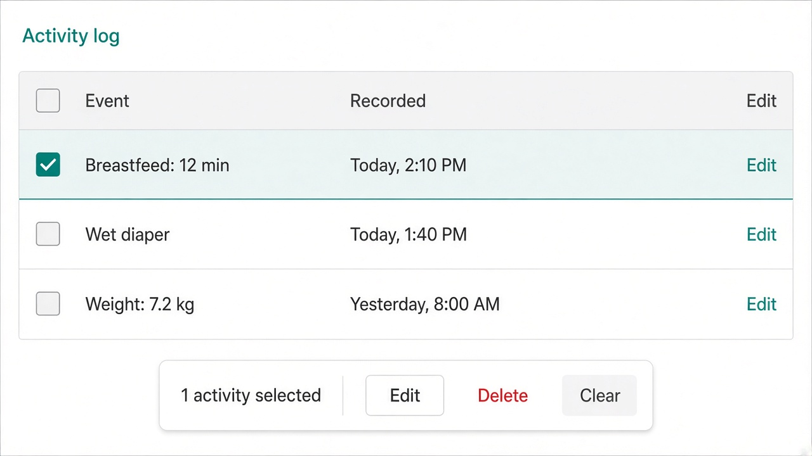
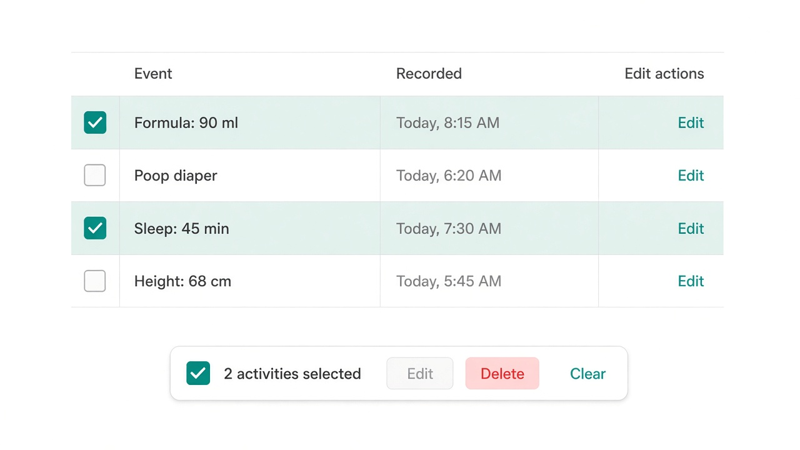

# UI concept (UI/UX designer): baby-insights-activity-log-money-parity

**Result:** done  
**Updated:** 2026-09-16  
**Has UI:** yes

## Sources followed

| Source | Applied? | Notes |
|--------|----------|-------|
| Project `docs/DESIGN_GUIDE.md` / AGENTS.md UI rules | yes | Tables: flat sharp shell, freeze after checkbox, `TableRowActions`, bulk bar only after selection; no Card around table; tokens; concentric radii on cards/bar |
| `clean-minimal-ui` skill | yes | Teal accent, off-white surfaces, hairline borders, 8px spacing, ≥44px hits |
| `frontend-ui-engineering` skill | yes | Loading / empty / error / skeleton parity; keyboard; no hover-only actions |
| Existing UI patterns in repo (list paths) | yes | `components/analytics-transactions-table.tsx`, `components/transaction-selection-bar.tsx`, `components/ui/table.tsx`, `components/ui/checkbox.tsx`, `components/baby-insights-dashboard.tsx` (Activity log), `components/baby-insights-edit-modal.tsx` |

## Concept depth

**lean** — one primary surface (Activity log table/cards + selection chrome) + ≥1 reference image.

## Align with Gate A (80/20)

| Item | From 01a / idea | How concept honors it |
|------|-----------------|------------------------|
| Important info/action #1 | Activity log rows (what happened + when) once panel is open | Event + recorded columns (desktop) / title + time (mobile cards) stay the scan target |
| Important info/action #2 | Leading checkbox + per-row Edit (desktop + mobile) | Always-visible checkbox column + `TableRowActions` Edit; cards get checkbox + Edit |
| Secondary (expand / modal / menu) | Full field edit in modal; multi-select Edit details; Insights filters; Clear on bar; panel expand | Edit modal for fields; selection bar only when `selectedCount > 0`; filters stay above Insights; expand gate unchanged |
| Top user journey | Open Insights → open Activity log → find → select → Edit/Delete → save → refresh | Explicit select + Edit (no whole-row open-edit) |
| Sensible defaults | No selection on open; select-all = visible window; empty = quiet | Same defaults; concept prefers selection-bar **Edit only when exactly 1 row selected** (multi = Delete / Clear) — Design must lock |

## Screen / surface map

| Surface | Purpose | Primary actions |
|---------|---------|-----------------|
| Activity log (expanded panel on `/baby/insights`) | Browse merged care + growth; select → Edit / Delete like Money | Checkbox / select-all (visible window); row Edit; selection bar Edit / Delete / Clear |

Secondary surfaces (not mocked in lean set): existing Insights filters/charts; `BabyInsightsEditModal`; confirm for delete — reuse, do not redesign.

## UI reference images (required for Gate A2; confirm at Gate B)

Draft visual mockups for **Gate A2** (UI look) approval, then confirm still match at **Gate B**. Store under `.my-docs/workflow/baby-insights-activity-log-money-parity/ui-refs/`.

| Surface | Variant (light / dark / mobile) | File path | Shown at Gate A2? | Confirmed at Gate B? |
|---------|---------------------------------|-----------|-------------------|----------------------|
| Activity log selectable table + selection bar | light desktop | `.my-docs/workflow/baby-insights-activity-log-money-parity/ui-refs/01-activity-log-selectable-light.png` | yes | |
| Activity log with multi-select + selection bar | light desktop | `.my-docs/workflow/baby-insights-activity-log-money-parity/ui-refs/02-activity-log-selection-bar-light.png` | yes | |

**Minimum met:** main primary surface (light). Second image stresses selection bar with more than one row selected.

Markdown previews (for humans opening this file):





### Wireframe (ASCII — primary surface)

```text
┌─ Activity log (expanded) ─────────────────────────────────────┐
│ [checkbox] Event                         Recorded      [Edit] │  ← header: select-all = visible window
│ [x]        Breastfeed · 12 min           Today 2:10 PM  Edit  │  ← selected row (teal wash)
│ [ ]        Wet diaper                    Today 1:40 PM  Edit  │
│ [ ]        Weight · 7.2 kg               Yesterday …    Edit  │
│ … show more / load more (unchanged)                           │
└───────────────────────────────────────────────────────────────┘
         ┌─ fixed bottom bar (when selected > 0) ─────────┐
         │ N activities selected  [Edit] [Delete] [Clear] │
         └────────────────────────────────────────────────┘
```

Baby columns stay **Event + Recorded** (plus checkbox + actions). No Money amount / category / account columns.

## Layout concept (plain words)

- **Hierarchy / eye flow:** Panel title control → table (or mobile cards) → show-more / load-more. When rows are selected, a fixed bottom bar becomes the temporary action strip (Money shape).
- **Core vs secondary:** Rows + checkbox + Edit are always on. Selection bar appears only after selection. Full field editing stays in the existing edit modal. Delete confirm stays a modal/dialog (high stakes), not inline on the bar.
- **Drop whole-row click-to-edit:** Checkbox and Edit are separate; row is not one big “open edit” hit target (Money pattern).
- **Concept default for multi-Edit (Gate A enhancement):** Selection-bar **Edit enabled only when exactly one row is selected**; with 2+ selected, bar shows Delete + Clear (Edit disabled or hidden). Architect locks final rule in Design.
- **Components to reuse** (from `components/ui/*` or feature patterns):

| Component / pattern | Where it already lives | Use for |
|---------------------|------------------------|---------|
| `Table` / `TableRow` `selected` / `freeze` after checkbox | `components/ui/table.tsx` | Desktop ledger chrome |
| `Checkbox` (incl. indeterminate header) | `components/ui/checkbox.tsx` | Row + select-all |
| `TableRowActions` Edit | `components/ui/table.tsx` + Money table | Per-row Edit |
| Selection bar (portal, fixed bottom) | `components/transaction-selection-bar.tsx` | Shape + placement; Baby copy (“activities” / EN+VI) |
| Selectable Money table interaction | `components/analytics-transactions-table.tsx` | Copy interaction shape only |
| Edit modal | `components/baby-insights-edit-modal.tsx` | Single-row edit / delete surface |
| Mobile `@md` cards | Current Activity log + Money cards | Checkbox + selected feel + Edit on cards |

## States

| State | Behavior |
|-------|----------|
| Loading | Skeleton mirrors checkbox + Event + Recorded + actions column (and mobile card controls); zero CLS |
| Empty | Quiet muted empty copy; **no** fake checkboxes or selection bar |
| Error | Existing load-error line in panel; no fake rows |
| Success | After save/delete: list + Insights refresh; selection clears or drops removed ids; routine toast/inline OK |

## Skeleton parity

`BabyInsightsPageSkeleton` / list skeleton must add:

- Leading checkbox placeholder column (`w-10`)
- Actions column / card Edit placeholder
- Same order as live: checkbox → event → recorded → actions  
  Match Money’s selectable skeleton pattern (`MoneyAnalyticsTransactionsTableSkeleton` `selectable`) without cloning Money amount columns.

## Mobile / a11y notes

- Thumb reach / ≥44px hits / no hover-only: Checkbox and Edit always usable on touch; `TableRowActions` always visible on touch + `focus-within` (existing primitive). Selection bar sits above safe-area inset.
- Labels, focus, contrast via tokens: Checkbox `aria-label` per row; toolbar `aria-label` for Baby actions; selected state uses accent wash **and** checked checkbox (not color alone); EN/VI Baby strings (not Money “transactions” copy).

## Style rules checklist

| Rule | Pass? | Note |
|------|-------|------|
| Semantic tokens (no hard-coded hex in feature UI) | yes | Accent wash via `TableRow` selected tokens |
| Concentric radii (`--radius-md` / `--radius-sm`) | yes | Bar outer `--radius-md`; mobile cards `--radius-sm`; table shell sharp |
| One accent; clean-minimal / project preset | yes | Teal selected feel like Money |
| Transition specificity (no `transition` shorthand) | yes | Follow existing primitives |
| Light + dark survive | yes | Lean mockups are light; Build must verify dark with same chrome |

## Out of scope for this concept

- Changing Money Transactions UI or copy
- Money Date / Category / Amount columns on Baby
- Inline cell editing
- Restyling other Baby lists
- New capture flows
- Dark / mobile reference images (lean; Build still ships dark + mobile parity)

## Handoff to Analyze / Design

What Architect must preserve (do not reinvent the UI concept):

1. **Money control parity on Activity log only:** leading checkbox + header select-all (visible window) + selected/hover row feel + per-row Edit + bottom selection bar (Edit / Delete / Clear) with Baby labels.
2. **Baby row content stays Event + when** (care/growth titles + summaries) — not Money ledger columns.
3. **Drop whole-row-open-edit**; separate select vs Edit like Money.
4. **Selection bar only when `selectedCount > 0`**; prefer Edit only for single selection until Design locks multi-Edit.
5. **Skeleton parity** for new checkbox/actions chrome in the same change; reuse `Table` / `Checkbox` / selection-bar shape; finish existing edit modal rather than a new edit language.
