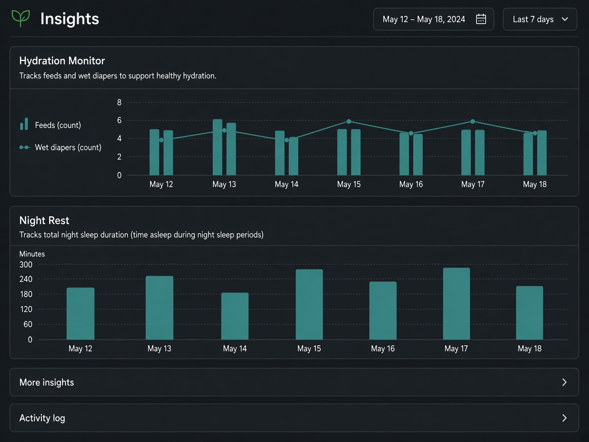
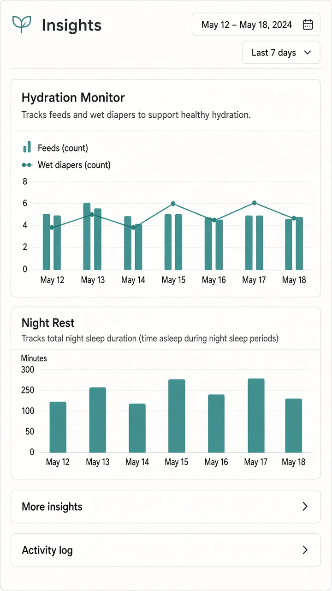
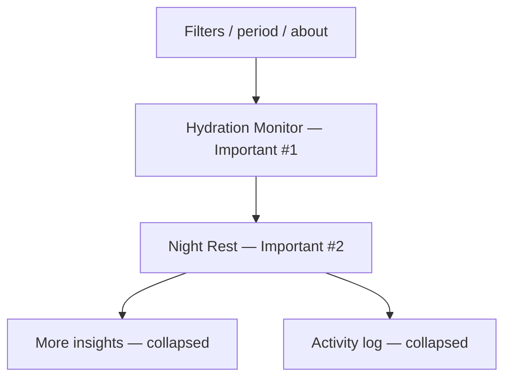

# UI concept (UI/UX designer): baby-insights-charts

**Result:** done  
**Updated:** 2026-09-14  
**Has UI:** yes

## Sources followed

| Source | Applied? | Notes |
|--------|----------|-------|
| Project `docs/DESIGN_GUIDE.md` / AGENTS.md UI rules | yes | Clean-minimal, teal accent, semantic tokens, visx charts, flat dashboard stack, More insights pattern |
| `clean-minimal-ui` skill | yes | Off-white / neutral-dark, hairline cards, 8px spacing |
| `frontend-ui-engineering` skill | yes | Loading / empty / error / skeleton parity / mobile hits |
| Existing UI patterns in repo | yes | `components/baby-insights-dashboard.tsx`, chart cards, `components/ui/alert.tsx`, Money “More insights” disclosure, table-style Insights chrome |

## Align with Gate 2-UI (80/20)

Locked product picks — **do not reopen.** Important #2 label is **Night Rest** (duration), not historical “Night Sleep Efficiency.”

| Item | From 01a / idea | How concept honors it |
|------|-----------------|------------------------|
| Important info/action #1 | Hydration Monitor + short purpose + light alert | Always-visible first chart card; alert only when helper returns `low_wet` |
| Important info/action #2 | Night Rest (duration / multi-block — not efficiency %) | Always-visible second chart card; never “% efficiency” |
| Secondary (expand / modal / menu) | More insights + Activity log + edit modal | Both disclosures **collapsed** on default; edit only from Activity log rows |
| Top user journey | Open Insights → read two charts → optional expand / edit | First paint answers hydration + last night’s rest |
| Sensible defaults | Today range; two charts; expands collapsed | Matches table-style today default + locked 80/20 |

## Screen / surface map

| Surface | Purpose | Primary actions |
|---------|---------|-----------------|
| Insights default (`/baby/insights`) | Answer hydration + night rest without expanding | Scan Hydration + Night Rest; change date/filters if needed |
| More insights (collapsed) | Pattern / wake / diaper / KPIs / legacy charts | Expand when caregiver wants deeper read |
| Activity log (collapsed) | Unified care + growth rows | Expand → open row → Money-style edit modal |
| Soft empty / partial | Honest thin or truncated data | Soft copy inside cards; no fake trends; no `low_wet` while `nextCursor` remains |

## UI reference images (required for Gate 2)

Draft visual mockups for Gate 2 approval. Store under `.my-docs/workflow/baby-insights-charts/ui-refs/`.

| Surface | Variant (light / dark / mobile) | File path | Shown at Gate 2? |
|---------|---------------------------------|-----------|------------------|
| Insights default (Hydration + Night Rest; expands collapsed) | light desktop | `ui-refs/01-default-light.png` | yes |
| Insights default | dark desktop | `ui-refs/02-default-dark.png` | yes |
| Insights default | light mobile | `ui-refs/03-default-mobile.png` | yes |

**ui-refs rule:** Drafts must match locked contracts (`01b` wireframe + `03-design`). Light (`01-default-light.png`) is the visual source of truth; dark and mobile must mirror the same charts (Hydration = feeds vs wet+mixed by day; Night Rest = night sleep minutes by day; More insights / Activity log collapsed). No oz-intake, fluid-%, goal chips, or topic filter rows.

Markdown previews (for humans opening this file):






### Wireframe (ASCII — locked default layout)

```text
┌─────────────────────────────────────────────────────────┐
│ Baby / Insights                    [filters] [period]   │
│ About / date range (existing chrome)                    │
├─────────────────────────────────────────────────────────┤
│ ┌─ Hydration Monitor ─────────────────────────────────┐ │
│ │ Short purpose line                                    │ │
│ │ [optional light Alert — low wet only when helper OK]  │ │
│ │ visx: feeds / formula vs wet+mixed diapers by day     │ │
│ └───────────────────────────────────────────────────────┘ │
│ ┌─ Night Rest ──────────────────────────────────────────┐ │
│ │ Short purpose (duration / multi-block — not % eff.)   │ │
│ │ visx: night sleep minutes by day                      │ │
│ └───────────────────────────────────────────────────────┘ │
│ ▶ More insights   (collapsed — KPIs + deferred charts)  │
│ ▶ Activity log    (collapsed — unified table)           │
└─────────────────────────────────────────────────────────┘
```

### Wireframe (mermaid — eye flow)



## Layout concept (plain words)

- **Hierarchy / eye flow:** Filters → Hydration → Night Rest → two collapsed disclosures. No count KPI strip and no Activity table on the default scroll path.
- **Core vs secondary:** Core = two chart cards with one short purpose line each. Secondary = More insights (insight KPIs, count KPIs, Pattern / Awake / Diaper, legacy charts) and Activity log + modal edit.
- **Components to reuse:**

| Component / pattern | Where it already lives | Use for |
|---------------------|------------------------|---------|
| Chart card + visx | Baby / Money Insights chart cards | Hydration dual series; Night Rest columns/line |
| `Alert` | `components/ui/alert.tsx` | Light hydration warning only |
| Disclosure / expand | Money “More insights”; Baby expand patterns | More insights + Activity log |
| Table (sharp, no card wrap) | Insights / Money ledgers | Activity log when expanded |
| Skeleton | `components/baby-page-skeleton.tsx` | Two chart slots + collapsed rows |
| Modal edit | Money edit-from-list | Care / growth corrections |

## States

| State | Behavior |
|-------|----------|
| Loading | Skeleton: two chart blocks + collapsed More insights / Activity log (zero CLS) |
| Empty | Soft copy inside chart (“need more logs” / “need more sleep logs”) — empty ≠ page error |
| Partial | Partial wording when `nextCursor` remains; **suppress** `low_wet` alert |
| Error | Existing section error + retry; modal inline validation |
| Success | Quiet close / light toast after edit (routine stakes) |

## Skeleton parity

Mirror live default exactly: period/filters → Hydration chart skeleton → Night Rest chart skeleton → two collapsed disclosure placeholders. Outer `rounded-[var(--radius-md)]`; nested chips `rounded-[var(--radius-sm)]`; tables sharp when Activity log expands later.

## Mobile / a11y notes

- Thumb reach / ≥44px hits / no hover-only: disclosure toggles and alert dismiss (if any) use `fx-hit-40` / Button `iconOnly` where needed.
- Labels, focus, contrast via tokens: chart titles + purpose as text; light + dark both readable; no color-only meaning on alerts.

## Style rules checklist

| Rule | Pass? | Note |
|------|-------|------|
| Semantic tokens (no hard-coded hex in feature UI) | yes | Concept uses DESIGN_GUIDE tokens only |
| Concentric radii (`--radius-md` / `--radius-sm`) | yes | Chart cards md; nested sm |
| One accent; clean-minimal / project preset | yes | Teal accent, quiet surfaces |
| Transition specificity (no `transition` shorthand) | yes | Follow existing primitives |
| Light + dark survive | yes | ui-refs include both |

## Out of scope for this concept

- Reopening Gate 2-UI product picks (default pair, KPI placement, Activity log behind expand).
- Designing expanded More insights / Activity log layouts in detail (contracts live in `03-design.md`).
- New chart libraries or marketing hero chrome.

## Handoff to Analyze / Design

What Architect must preserve (do not reinvent the UI concept):

1. Default first paint = **Hydration Monitor** then **Night Rest** only (+ existing filters/about).
2. **More insights** and **Activity log** start **collapsed**.
3. Night Rest is duration / multi-block — never labeled efficiency %.
4. Hydration light alert only when derive helper says so (and never while timeline `nextCursor` remains).
5. Skeleton parity with the two-chart + collapsed disclosures layout.
