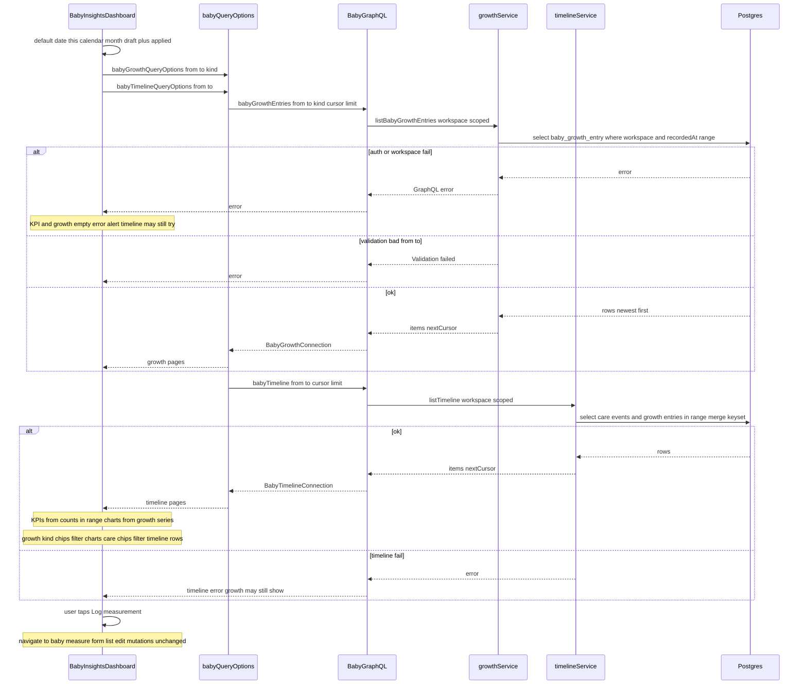

# Design: Baby Insights page (merge Growth + Timeline)

## Locked product / soft picks (do not reopen)

From Gate 1 + soft picks (2026-09-06):

1. Full Money Insights **pattern** (period chip, filters, KPI strip, chart grid) adapted to Baby — not Money ledger fields.
2. Section order: **Growth first**, then **timeline**; shared date filter; default **this month**.
3. Insights is **view-only**.
4. Route **`/baby/insights`**; remove `/baby/growth` and `/baby/timeline`.
5. One **Insights** nav item.
6. Design against **current** Baby UI.
7. Growth write = new capture route **`/baby/measure`** (list/edit OK there).
8. Filters = **date range + care/growth kind chips**.
9. Extend **`babyGrowthEntries`** with **`from` / `to`** on the server.
10. Redirects = Money pattern: **`next.config.ts` permanent redirects**; thin `redirect()` pages only if leftovers need them.

---

## Option A — One shared filter chrome (date + all chips Apply together)

**What it is:**
One Insights dashboard like Money/Loans: date range + Apply/Reset, then **one chip row** (care types + growth kinds), period chip, KPI strip, growth charts, then timeline. All chips sit in the shared toolbar. Apply commits **date and chips** together. Empty chip selection means “all.” `/baby/measure` is the write home (form + recent list with edit/delete). Insights only links out to Measure (no editors).

**Example:**
Caregiver opens `/baby/insights` → sees this month → taps chips **Feed** + **Weight** → Apply → KPIs/timeline show feeds (and growth rows if any); growth charts show weight only. “Log measurement” → `/baby/measure` → save → back `/baby` (same habit as feed).

**Pros:**

- Closest to Money’s “one filter bar, one Apply” mental model.
- One place to teach filters; skeleton mirrors one chrome block.
- Easy to explain in nav help copy.

**Cons:**

- Mixing care + growth chips in one Apply can over-filter: picking **Feed** may empty growth charts unless chips are carefully split into independent groups with different rules.
- More awkward rules (“care chips only hit timeline; growth chips only hit charts”) hidden behind one Apply.
- Harder to answer “show weight chart but all care events” without clearing chips.

## Option B — Shared date Apply; section-local kind chips

**What it is:**
Same Insights stack and shared **date** Apply/Reset + period chip + KPI strip. **Growth kind chips** live under the Growth heading and filter charts/list immediately. **Care type chips** live under the Timeline heading and filter the list immediately. Date still drives both sections. `/baby/measure` is the same write home (form + recent list/edit). Insights stays view-only with a clear “Log measurement” CTA.

**Example:**
Caregiver sets Sep 1–30 → Apply → sees KPIs for the month. Under Growth, taps **Weight** → charts/list show weight only; timeline still shows all care + growth in range. Under Timeline, taps **Diaper** → list narrows to diapers; weight chart unchanged.

**Pros:**

- Matches section order (growth then timeline) and avoids cross-section surprise.
- Maps cleanly to APIs: growth `kind` + `from`/`to`; timeline `from`/`to` + client (or later server) care-type filter.
- Better for tired caregivers: change chart kind without rethinking the whole page filter.

**Cons:**

- Slightly less “one Money filter bar” — chips are split (date chrome still matches Money/Loans).
- Two chip rows = a bit more UI surface and skeleton slots.
- Caregiver must look in two places to see all active kind filters (period chip can still summarize date only).

## Tradeoffs

| Factor | Option A | Option B |
|--------|----------|----------|
| Cost / time | Similar; more rules for chip→section mapping | Similar; slightly more layout/skeleton for two chip rows |
| Complexity | Hidden “which chip hits which section” rules | Clear ownership per section; date shared |
| Usability | One Apply; easy to over-filter both sections | Independent kinds; date shared — better review mix |
| Failure cases | Bad Apply clears useful charts; empty both sections | Date error hurts both; kind chip empty-state is local |

## Recommendation

**Pick Option B.**

Locked soft picks already require date + kind chips and growth-then-timeline. Section-local chips keep the Money **date / period / KPI / chart** chrome honest without forcing care chips to wipe growth charts. Growth’s existing single `kind` argument and timeline’s date range map 1:1. Measure stays the only write surface.

## Chosen design (user-approved)

**Option A — One shared filter chrome** (Gate 2, 2026-09-06).

Shared date Apply/Reset + one chip row (care types + growth kinds) Apply together; period chip; KPI strip; growth charts then timeline. Insights view-only. Write home `/baby/measure`. Growth API `from`/`to`. Money-style permanent redirects. Tasks 7–9 use **shared** chip placement (not section-local).

---

## Sequence diagram

Main flow for **recommended Option B**: open Insights → apply this-month date → load growth + timeline → filter kinds locally → optional navigate to Measure to write.



---

## Contracts

### API contracts

#### Changed: `Query.babyGrowthEntries`

| Item | Detail |
|------|--------|
| Method + path (or name) | GraphQL `babyGrowthEntries` on `/api/graphql/baby` |
| Auth / who can call | Same as today: signed-in user with Baby workspace |
| Request fields | `from: String` (optional, ISO datetime with offset); `to: String` (optional); existing `kind: String` (optional); `cursor: String` (optional); `limit: Int` (optional, 1–100, default 50) |
| Success response | Unchanged `BabyGrowthConnection { items, nextCursor }` — items with `recordedAt` inside `[from, to]` when those args are set |
| Errors | Validation failed (bad datetime / bad cursor / bad kind); auth/workspace errors via existing GraphQL mapping |
| Downstream calls | None (Postgres only) |

**Validator change:** `babyGrowthListInputSchema` gains optional `from` / `to` (same datetime rules as `babyTimelineInputSchema`). If both set, require `from <= to` (mirror timeline if it already does, or add the check in one place).

**Client:** `lib/baby-query-options.ts` — growth query keys and fetchers include `from` / `to`; Insights uses calendar-month defaults (reuse Money-style helper pattern from `lib/analytics-default-filters.ts` or a thin `babyInsightsDefaultRange()`).

#### Unchanged (reused): `Query.babyTimeline`

| Item | Detail |
|------|--------|
| Method + path (or name) | GraphQL `babyTimeline(from, to, cursor, limit)` |
| Auth / who can call | Unchanged |
| Request fields | Unchanged — Insights passes applied `from` / `to` (this month by default) instead of today-only bounds |
| Success response | Unchanged |
| Errors | Unchanged |
| Notes | **Option B care chips:** filter client-side on loaded items by `kind`/`type` for this pass (month-sized pages). Do **not** add a new timeline `types` arg unless e2e/volume proves paging breaks filtered views. |

#### Unchanged (reused): growth mutations

`createBabyGrowth` / `updateBabyGrowth` / `deleteBabyGrowth` stay as today. Callers move from Insights to `/baby/measure` only.

#### Events / other module APIs

- No Telegram / notify changes.
- No new REST routes; thin Next pages only: `/baby/insights`, `/baby/measure`, redirects for old paths.

### Database contracts

**No schema migration.** Tables stay `baby_growth_entry` and `baby_care_event`.

| Table | Purpose | Key fields used | Indexes / filters | Write owner | Read owners |
|-------|---------|-----------------|-------------------|-------------|-------------|
| `baby_growth_entry` | Measurements for charts + Measure CRUD | `workspace_id`, `kind`, `recorded_at`, values | Existing `baby_growth_entry_workspace_recorded_idx` (`workspace_id`, `recorded_at`); optional kind eq | Measure page via growth mutations | Insights growth + timeline merge |
| `baby_care_event` | Care rows in timeline + KPI counts | `workspace_id`, `type`, `occurred_at` | Existing `baby_care_event_workspace_occurred_idx` | Capture routes (unchanged) | Insights timeline + KPIs |

**Data ownership notes:**

- Insights is **read-only** in the UI.
- Writes for growth live only on `/baby/measure` (and existing GraphQL).
- Date filters use existing timestamptz indexes; no new index required for this pass.

### Example queries

```ts
// Example 1: Growth list for Insights (this month + optional kind)
const rows = await db
  .select()
  .from(babyGrowthEntry)
  .where(
    and(
      eq(babyGrowthEntry.workspaceId, workspaceId),
      gte(babyGrowthEntry.recordedAt, fromDate),
      lte(babyGrowthEntry.recordedAt, toDate),
      // when kind chip selected:
      eq(babyGrowthEntry.kind, "weight"),
    ),
  )
  .orderBy(desc(babyGrowthEntry.recordedAt), desc(babyGrowthEntry.id))
  .limit(50);
```

```ts
// Example 2: Timeline care side for Insights month (existing pattern)
const careRows = await db
  .select()
  .from(babyCareEvent)
  .where(
    and(
      eq(babyCareEvent.workspaceId, workspaceId),
      gte(babyCareEvent.occurredAt, fromDate),
      lte(babyCareEvent.occurredAt, toDate),
    ),
  )
  .orderBy(desc(babyCareEvent.occurredAt), desc(babyCareEvent.id))
  .limit(50);
```

```ts
// Example 3: Measure create (unchanged mutation path)
await db.insert(babyGrowthEntry).values({
  workspaceId,
  babyId,
  kind: "weight",
  recordedAt: new Date(recordedAtIso),
  valueNum: String(valueNum),
  unit: "kg",
  source: "web",
  createdByUserSub: userSub,
  updatedByUserSub: userSub,
});
```

---

## Page composition (recommended Option B)

**Stack order (live + skeleton):**

1. Date filters (`InsightsDateRangeFiltersBar` pattern) + Apply/Reset  
2. Period chip (“Showing this month · …”)  
3. KPI strip (honest counts only — e.g. feeds / sleep sessions / diapers in range; latest weight if any)  
4. Growth section: kind chips → chart card(s) → read-only recent measurements (link “Edit on Measure” or no row actions — prefer CTA only)  
5. Timeline section: care-type chips → infinite list for applied range (reuse timeline list UI; drop today-only hardcode)

**Nav:**

- Browse/review: Home, **Insights** (`analytics` icon)  
- Capture: Feed, Sleep, Diaper, **Measure**  
- Configure: Settings  

**Routes:**

- Add `app/(shell)/baby/insights/` (+ `loading.tsx` skeleton parity)  
- Add `app/(shell)/baby/measure/` (+ skeleton) — form + recent list/edit/delete (moved from current growth page)  
- Remove growth/timeline page modules after redirects  
- `next.config.ts`: permanent `/baby/growth` → `/baby/insights`, `/baby/timeline` → `/baby/insights`  
- Update `lib/app-section-nav.ts`, `lib/baby-app-header.ts`, i18n EN/VI, Home CTA (`BABY_HOME_ACTIONS` + measure)  
- E2E: Insights load + redirect + measure add path

**KPIs (do not invent finance metrics):**

- Derive from fetched timeline/growth in the applied range (client).  
- If a count is zero, show `0` — do not invent placeholders.  
- Skip empty “fake” KPI slots rather than pad with nonsense.

---

## Challenges answered

- **Do we need this?** Yes for Gate 1: one review surface aligned with Money Insights; two nav review items cost tired caregivers. Soft picks already closed write placement and API date filter.
- **What fails?** Bad/empty date range → validation or empty sections (show empty states, not errors). Growth API without `from`/`to` would lie about “this month” — that is why the server extension is locked. Client-only care chips can miss filtered rows behind pagination — accept for v1; extend timeline filters later if needed. Parallel **baby-pages-money-pattern** may conflict on shared Baby files — rebase, do not wait.
- **Is this overspecified?** No new KPI GraphQL, no schema migration, no timeline `types` arg in v1, no WHO percentiles. Measure reuses existing growth mutations. Insights reuses Loans-style date bar + Baby chart/list pieces.

---

## ADR

**N/A** — extends existing Baby GraphQL query args and follows shipped Money/Loans Insights patterns; not a new API architecture or data model.

---

*Design draft 2026-09-06. Awaiting Gate 2 pick (Option A vs B).*
