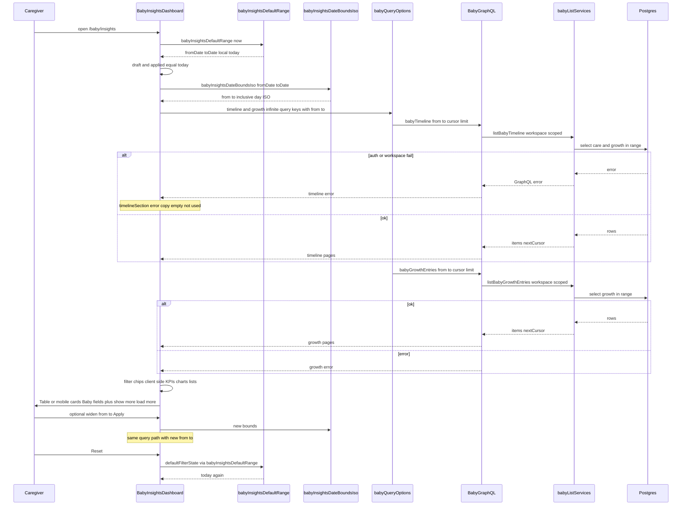

# Design: Baby Insights table style + default today

**Has UI:** yes  
**ADR:** N/A — local UI chrome + default-range helper; no framework, schema, or public API architecture change.

## Locked product picks (from Analyze + parent defaults)

Do not reopen unless Gate 2 rejects them:

1. Restyle **both** care timeline and growth lists.
2. Visual chrome + existing show-more / load-more only (no Money sort / bulk / pagination).
3. Default **today** for the **whole** Insights page (KPIs, charts, lists).
4. Keep Baby row fields (do not reshape to Money Date / Category / Amount).
5. Client-only today default — **no** new URL `from`/`to` sync this pass.
6. Reset rebuilds from the same helper → Reset returns to **today**.
7. Money Transactions / Money Insights defaults stay unchanged.
8. Sparse/empty today KPIs and charts are expected; empty list ≠ hard error.

---

## Decision 1 — How we ship Table chrome + today default

### Option 1 — In-dashboard restyle (loans-style view-only tables)

**What it is:**  
Change `babyInsightsDefaultRange()` to local today (`fromDate` = `toDate` = `toLocalDateString(now)`). Inside `BabyInsightsDashboard`, replace both growth and timeline `<ul divide-y>` blocks with flat sections that use shared `Table` on `@md` and mobile card rows below `@md` — same shape as `loans-dashboard` (view-only, no sort/bulk). Keep Baby cell content via existing display helpers. Update `BabyInsightsPageSkeleton` / route loading in the same change. GraphQL and query options stay as-is.

**Example:**  
Caregiver opens `/baby/insights` → draft/applied dates are today only → GraphQL `babyTimeline` / `babyGrowthEntries` get start-of-day→end-of-day ISO for today → desktop shows sharp table shells with Baby columns; phone shows card rows; Show more / Load more buttons stay under each list. Reset restores today.

**Pros:**

- Smallest diff; matches loans browse pattern and DESIGN_GUIDE flat table rules.
- One file owns list presentation + filter wiring — easy to keep skeleton parity.
- No new abstractions or public module surface.

**Cons:**

- `baby-insights-dashboard.tsx` grows further with two table/card blocks.
- Harder to reuse the same chrome on another Baby list later without a second extract.

### Option 2 — Extract dedicated table presentational components

**What it is:**  
Same product behavior as Option 1 (today default helper; both lists; Baby fields; show-more/load-more; no URL sync). First extract `BabyInsightsTimelineTable` and `BabyInsightsGrowthTable` (or one thin shared shell) modeled after `analytics-transactions-table` / loans mobile cards, then wire the dashboard and skeletons to those components.

**Example:**  
Build `components/baby-insights-timeline-table.tsx` that takes visible items + locale/t callbacks and renders Table + `@md:hidden` cards. Dashboard only maps query windows into props. Skeleton imports matching skeleton fragments from `baby-page-skeleton` (or colocated skeletons).

**Pros:**

- Cleaner dashboard; tables unit-testable in isolation.
- Closer mirror of Money’s Transactions table file split if we later deepen parity.

**Cons:**

- More files and prop contracts for a single-page restyle.
- Higher risk of skeleton drift if live and skeleton live in different modules without a shared layout helper.
- Longer Build for the same caregiver outcome.

## Tradeoffs

| Factor | Option 1 | Option 2 |
|--------|----------|----------|
| Cost / time | Lower — edit helper + dashboard + skeleton | Higher — extract + wire + skeleton + more tests |
| Complexity | Presentation stays in dashboard | Extra components + props |
| Usability | Same caregiver outcome | Same caregiver outcome |
| Failure cases | Large file harder to review; CLS if skeleton missed | Import/prop mismatch; CLS if skeleton not colocated |

## Recommendation

**Pick Option 1.**

Product scope is chrome + default only. Loans already proves view-only Table + mobile cards without a Transactions-sized module. Option 2 can wait until a second Baby list needs the same shell.

## Chosen design

**Option 1** — provisional for design-review / build (Gate 2 confirms after draft).

---

## Patterns to reuse

| Pattern | Why | Reference |
|---------|-----|-----------|
| Shared `Table` chrome | DESIGN_GUIDE source of truth; sharp shell, hover rows | `components/ui/table.tsx` |
| Desktop table + mobile cards | Transactions-like browse; container queries, no hardcoded breakpoints | `components/analytics-transactions-table.tsx`, `components/loans-dashboard.tsx` |
| View-only table (no sort/bulk/edit) | Matches non-goals; Baby stays browse | Prefer `loans-dashboard` over full Transactions ledger |
| Flat section (heading + table, no Card) | Idea forbids Card-wrapped event tables | DESIGN_GUIDE + Transactions |
| Single applied date range | One filter already drives KPIs, charts, lists | `BabyInsightsDashboard` draft/applied |
| Reset = rebuild defaults | Changing helper fixes Reset → today | `defaultFilterState()` / `handleReset` |
| DOM show-more + GraphQL load-more | Keep behavior; restyle rows only | `lib/baby-insights-list-visible.ts` + infinite queries |
| Timeline display helpers | Keep Baby field meanings in cells/cards | `lib/baby-timeline-row-display.ts` |
| Local YYYY-MM-DD today | Same string shape as date inputs | `toLocalDateString` in `lib/money-date-calendar.ts` |
| Inclusive day ISO bounds | Do not mix with Home half-open window | `babyInsightsDateBoundsIso` |
| Skeleton parity | Zero CLS mandatory | `MoneyAnalyticsTransactionsTableSkeleton` / `MoneyLedgerMobileCardsSkeleton` + `BabyInsightsPageSkeleton` |

---

## Sequence diagram (recommended Option 1)

Open Insights → today default → load both lists → render Table/cards → optional widen dates / show-more / load-more.



---

## API contracts

### Module: `babyInsightsDefaultRange` (changed)

| | |
|--|--|
| **Function** | `babyInsightsDefaultRange(now?: Date): BabyInsightsDateRange` |
| **Auth** | N/A — pure client helper |
| **Request** | Optional `now: Date` (defaults to `new Date()`) |
| **Success** | `{ fromDate: string, toDate: string }` — both `YYYY-MM-DD`, equal to local today |
| **Errors** | None (pure) |
| **Downstream** | Uses `toLocalDateString(now)` — **stops** calling `defaultAnalyticsFilters` for Baby |

Unchanged: `babyInsightsDateBoundsIso(fromDate, toDate)` — still inclusive local day → ISO.

### GraphQL: `babyTimeline` (unchanged — reused)

| | |
|--|--|
| **Operation** | Query `babyTimeline(from, to, cursor, limit)` |
| **Auth** | `requireBabyWorkspace` — session + Baby workspace cookie |
| **Request** | `from`/`to` ISO strings (required by Insights client after bounds); optional `cursor`, `limit` |
| **Success** | `BabyTimelineConnection { items, nextCursor }` |
| **Errors** | Unauthenticated / no workspace → GraphQL error; bad args → validation error |
| **Downstream** | `listBabyTimeline(workspaceId, args, locale)` → Postgres |

### GraphQL: `babyGrowthEntries` (unchanged — reused)

| | |
|--|--|
| **Operation** | Query `babyGrowthEntries(kind, from, to, cursor, limit)` |
| **Auth** | `requireBabyWorkspace` |
| **Request** | Insights passes `from`/`to`; `kind` optional (client chip filter may apply after fetch) |
| **Success** | `BabyGrowthConnection { items, nextCursor }` |
| **Errors** | Same as timeline |
| **Downstream** | `listBabyGrowthEntries(workspaceId, args)` → Postgres |

### HTTP / REST

No new or changed REST handlers.

### UI module surface (Option 1)

No new public components required. Internal JSX in `BabyInsightsDashboard` uses `Table*` from `components/ui/table.tsx`. Option 2 would add presentational exports — not recommended this pass.

---

## Database contracts

**No schema changes.** Reads only, existing tables:

| Table / source | Purpose | Key fields (unchanged) | Indexes / rules | Ownership |
|----------------|---------|------------------------|-----------------|-----------|
| Care event tables used by timeline merge | Timeline rows in range | `id`, `workspaceId`, occurred/ended timestamps, type payload | Existing workspace + time indexes | Reads via timeline service; writes elsewhere (capture) |
| `baby_growth_entry` (or project equivalent) | Growth list + charts | `id`, `workspaceId`, `kind`, `value`, `unit`, `recordedAt` | Existing workspace + recordedAt | Reads via growth list; writes via Measure |

Insights this pass: **read-only**.

---

## Example queries

Placeholders: `$workspaceId`, `$fromIso`, `$toIso`.

**1. Timeline page (conceptual — existing service):**

```sql
-- Care events in inclusive range for workspace (shape illustrative)
SELECT id, type, occurred_at, ended_at, source, /* summary fields */
FROM baby_care_event
WHERE workspace_id = $workspaceId
  AND occurred_at >= $fromIso
  AND occurred_at <= $toIso
ORDER BY occurred_at DESC, id DESC
LIMIT $limit;
```

**2. Growth page (conceptual):**

```sql
SELECT id, kind, value_num, unit, recorded_at
FROM baby_growth_entry
WHERE workspace_id = $workspaceId
  AND recorded_at >= $fromIso
  AND recorded_at <= $toIso
ORDER BY recorded_at DESC, id DESC
LIMIT $limit;
```

**3. Client default range (unit-tested):**

```ts
// After change — local today only
babyInsightsDefaultRange(new Date(2026, 8, 15));
// => { fromDate: "2026-09-15", toDate: "2026-09-15" }
```

---

## UI / UX / mobile

**Has UI:** yes.

### Layout / hierarchy

Keep current Insights stack: filters → period chip → KPIs → charts → **Growth** section (heading → table/cards → show-more/load-more) → **Timeline** section (same). One job per section: growth browse vs care browse. Flat `<section>` + heading; **no** Card around tables.

### Row content (Baby fields)

- **Timeline columns / card lines:** summary (primary); duration + stop clock (secondary); telegram source line when present.
- **Growth:** kind label + value/unit (primary); recorded time (secondary).
- Header labels via existing i18n keys / simple section headers — not Money Date/Category/Amount.

### Loading / empty / error / success

- Loading: skeleton mirrors table shell + mobile cards (order, `@container` / `@md` split).
- Empty today: muted empty copy (`insights.emptyTimeline` / `insights.emptyGrowth`) — **empty ≠ hard error**. Quiet today is normal.
- **Next action (recovery):** Update that empty copy with one plain sentence that points caregivers to the **existing** date filter (widen from/to) and **Apply** to see more days — do **not** invent a second filter or a new empty-state CTA component.
- Sparse KPIs/charts for a quiet day: expected; not an error.
- Error: existing section error strings + retry via refetch behavior already on queries.
- Apply/Reset: same feedback as today; Reset → today.

### Skeleton parity (zero CLS)

Update `BabyInsightsPageSkeleton` (and anything `loading.tsx` uses) so growth + timeline slots use:

- `hidden @md:block` table header + row skeletons (sharp `Table` shell)
- `@md:hidden` mobile card skeletons (`rounded-[var(--radius-sm)]`, border, padding like Money ledger cards)

Do **not** leave divide-y list skeletons after live UI switches to Table.

### Mobile

- Card rows on small containers (`@md:hidden`); table from `@md` up.
- Show more / Load more: existing large secondary buttons (≥ comfortable hit area).
- No hover-only actions (view-only; no row edit menus).
- Thumb-friendly vertical stack; safe page padding from shell unchanged.

### Accessibility

- Real `<table>` / `<th>` / `<td>` via Table primitives.
- **List naming (growth and timeline):** keep the existing section **`h2`** as the **only visible** list name. If using `TableCaption`, make it **`sr-only`** (or omit caption) so we do not double-title next to the `h2`.
- Time elements keep `dateTime` where used today.
- Focus visible on Show more / Load more / filter controls.
- Contrast via semantic tokens; light + dark both required.

---

## Security design review

### Trust boundaries

| Boundary | What crosses it |
|----------|-----------------|
| Browser → GraphQL | Session cookie + Baby workspace; `from`/`to`/`cursor`/`limit` from client |
| GraphQL → DB | Workspace-scoped list services |
| Client-only default | `new Date()` local calendar — not a security control |

### Abuse cases

- Caller sends huge `from`/`to` span or large `limit` → rely on existing GraphQL validation / limit caps (do not loosen).
- Caller forges another workspace id → must still fail `requireBabyWorkspace` (no change; do not add IDOR paths).
- XSS via summary / notes in table cells → keep React text escaping; do not introduce `dangerouslySetInnerHTML`.
- Client “today” spoof → only affects that user’s view of defaults; server still filters by supplied ISO bounds under workspace auth.

### OWASP Top 10

Primary reference: https://owasp.org/Top10/

| ID | Name | Status | Note |
|----|------|--------|------|
| **A01** | Broken Access Control | **pass** | Reuse `requireBabyWorkspace`; no new IDs or cross-workspace reads |
| **A02** | Cryptographic Failures | **N/A** | No new secrets, tokens, or sensitive URL params |
| **A03** | Injection | **pass** | No new SQL; React-escaped cell text; existing parameterized list queries |
| **A04** | Insecure Design | **pass** | View-only; client default is UX not authz; empty today not treated as error |
| **A05** | Security Misconfiguration | **N/A** | No CORS, headers, or debug flag changes |
| **A06** | Vulnerable Components | **pass** | No new dependencies planned |
| **A07** | Auth Failures | **pass** | Same session / workspace gate on timeline and growth queries |
| **A08** | Software / Data Integrity | **N/A** | No webhooks, deserialization, or CI supply changes |
| **A09** | Logging / Monitoring Failures | **pass** | No new sensitive logging; do not log PII from row cells |
| **A10** | SSRF | **N/A** | No server fetch of user URLs |

### Callouts

- **Authz:** Workspace scoping stays on every list read.
- **Injection:** Table chrome only — no raw HTML.
- **Secrets:** None in this change.
- **SSRF:** N/A.
- **Logging:** Avoid dumping full timeline payloads in new debug logs.

---

## Aggressive challenges

| Question | Answer |
|----------|--------|
| Do we need this? | Yes — caregivers see mismatched list chrome vs Money and a noisy month-first open; Gate 2-UI ok’d the day-to-day story. |
| What fails? | Quiet today looks “empty” (expected); forgetting skeleton update causes CLS; mixing Home half-open day bounds breaks inclusive Insights range. |
| Over-specified? | Option 2 (extract tables) is over-specified for one page — recommend Option 1. URL sync is explicitly out. |

---

## Boundaries for Build

| Tier | Rule |
|------|------|
| **Always** | TDD for default-range unit test first; both lists + skeleton in same UI change; light/dark check; keep show-more/load-more |
| **Ask first** | URL `from`/`to` sync; Money-like sort/bulk; reshaping columns to Money fields; changing Money defaults |
| **Never** | Card around tables; new GraphQL fields without need; edit-from-row; hardcoded breakpoints; changing `defaultAnalyticsFilters` for Money |
