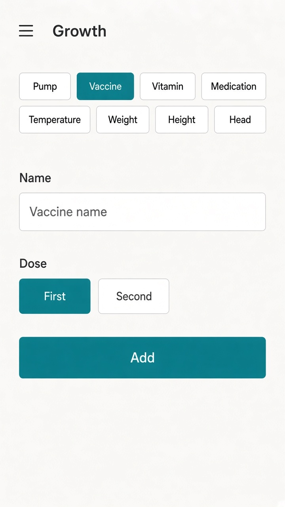

# UI concept (UI/UX designer): baby-log-money-new-form

**Result:** done  
**Updated:** 2026-09-19 (Gate A2 round 2 — chip order lock)  
**Has UI:** yes

## Sources followed

| Source | Applied? | Notes |
|--------|----------|-------|
| Project `docs/DESIGN_GUIDE.md` / AGENTS.md UI rules | yes | Quiet clean-minimal, teal accent, concentric radii, skeleton parity |
| `clean-minimal-ui` skill | yes | One accent, 8px grid, ≥44px hits, no purple/glow |
| `frontend-ui-engineering` skill | yes | Loading/empty/error, labels, keyboard chips |
| Existing UI patterns in repo | yes | `money-transaction-form.tsx` (pattern only), `baby-growth-page.tsx`, `baby-vaccines-page.tsx`, `money-quick-pick-chip-cls.ts` |

## Concept depth

**lean** — one primary surface (Growth + Vaccine chip) + ≥1 light image. Feed/sleep/diaper follow the same chrome; no extra steps on one-tap paths.

## Align with Gate A (80/20)

| Item | From 01a / idea | How concept honors it |
|------|-----------------|------------------------|
| Important info/action #1 | Type chips; Vaccine always visible on Growth | Chip row includes plain **Vaccine** (not overflow) |
| Important info/action #2 | Form: primary Save; one-tap pages: true primary tap | Growth/vaccine: Save dominant; feed/diaper/sleep keep one-tap |
| Secondary (expand / modal / menu) | Timer extras, notes, rare fields, history | Deferred to expand / Activities / Insights |
| Top user journey | Open → type → 1–2 fields → Save | Same top-to-bottom order as money/new |
| Sensible defaults | Common type default; Vaccine visible but not default; dose-first when Vaccine selected | Default selection still Weight (chip order ≠ default); Vaccine via pick or redirect |

## Screen / surface map

| Surface | Purpose | Primary actions |
|---------|---------|-----------------|
| `/baby/growth` (primary) | Log growth/health **and** vaccine with money/new chrome | Pick type chip → fill fields → Save |
| Feed / sleep / diaper (same chrome, not mocked) | High-frequency capture | One-tap / few-field primary — restyle chips/spacing/radii only |

## UI reference images (required for Gate A2; confirm at Gate B without re-show)

| Surface | Variant (light / dark / mobile) | File path | Shown at Gate A2? | Confirmed at Gate B? (text ok) |
|---------|---------------------------------|-----------|-------------------|-------------------------------|
| Growth + Vaccine selected | light | `.my-docs/workflow/baby-log-money-new-form/ui-refs/01-growth-vaccine-money-new-light.png` | yes | |

## Growth type chip order (Gate A2 lock)

Left-to-right (wrap as needed), exact order:

1. Pump  
2. Vaccine  
3. Vitamin  
4. Medication  
5. Temperature  
6. Weight  
7. Height  
8. Head  

Default selection remains **Weight** (not first in the row). Redirect from `/baby/vaccines` preselects **Vaccine**.

## Layout concept (plain words)

- **Hierarchy / eye flow:** Page title → type chips in the locked order above → type-specific fields (`repeat(auto-fit, minmax(…))`) → primary Save. Vaccine selected shows name + dose chips (First / Second), then Save — same as today’s vaccine form, on Growth.
- **Core vs secondary:** Chips + Save always dominant. Optional notes / timers / history stay deferred. No Money account/category/budget widgets on Baby.
- **Feed/sleep/diaper note:** Match chip group + radii + spacing; do **not** force an extra Save step on one-tap paths.
- **Components to reuse:**

| Component / pattern | Where it already lives | Use for |
|---------------------|------------------------|---------|
| Quick-pick chips | `lib/money-quick-pick-chip-cls.ts` | Type + dose chips |
| Field / Input / Button | `components/ui/*` | Form fields + Save |
| Growth page shell | `components/baby-growth-page.tsx` | Merge Vaccine chip + dose fields |
| Vaccine dose UI | `components/baby-vaccines-page.tsx` | Fields when Vaccine selected |

## States

| State | Behavior |
|-------|----------|
| Loading | Skeleton mirrors chips → fields → Save (zero CLS) |
| Empty | Blank fields; default type preselected (not Vaccine) |
| Error | Inline field error + toast; clear when fixed |
| Success | Toast (“saved”); form resets to default type |

## Skeleton parity

Update `baby-page-skeleton` / growth loading so chip count includes Vaccine and field block matches live Vaccine vs growth kinds.

## Mobile / a11y notes

- Thumb reach / ≥44px hits / no hover-only: chips and Save use `fx-hit-40` / `min-h-11`; primary Save in thumb zone.
- Labels, focus, contrast via tokens: visible Field labels; radiogroup on type/dose; accent focus ring.

## Style rules checklist

| Rule | Pass? | Note |
|------|-------|------|
| Semantic tokens (no hard-coded hex in feature UI) | yes | Tokens only in build |
| Concentric radii (`--radius-md` / `--radius-sm`) | yes | Outer form controls md; chips sm |
| One accent; clean-minimal / project preset | yes | Teal quiet — no purple/cream/glow |
| Transition specificity (no `transition` shorthand) | yes | Match existing chip/button patterns |
| Light + dark survive | yes | Concept is light-first; dark uses same structure |

## Out of scope for this concept

- Redesigning Money `/money/new`
- Separate Vaccines nav or standalone vaccine page UI
- Insights/Activities rebuild (link/nav fixes only later)

## Handoff to Analyze / Design

What Architect must preserve (do not reinvent the UI concept):

1. Growth is the one merge surface: always-visible **Vaccine** chip + dose-first fields + primary Save; money/new chrome (chips → fields → save).
2. Growth chip order is locked: Pump → Vaccine → Vitamin → Medication → Temperature → Weight → Height → Head.
3. Feed/sleep/diaper get the same chrome without adding steps on one-tap paths; `/baby/vaccines` → Growth with vaccine preselected (URL shape in design).
