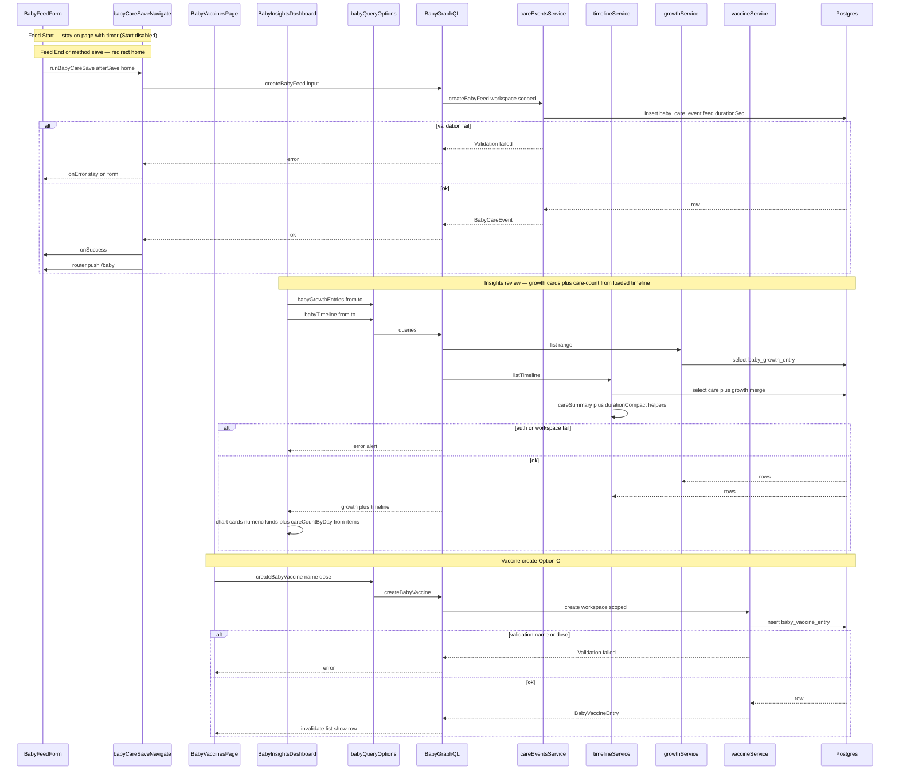

# Design: Baby log UX, vaccine, Insights charts

## Locked product (do not reopen)

From Gate 1 + vaccine Option C (2026-09-06):

1. **Feed/sleep:** after **Start**, stay on page, disable Start, show timer/open state; after **End** (session complete), **redirect home**. Diaper keeps navigate-home on save.
2. **Vaccine:** separate list + **new hamburger item** + route `/baby/vaccines`. Required: **name**, **dose** (`first` | `second`). Log-only.
3. **Growth kind chip bar** on **both** Insights and Measure.
4. **Charts:** more growth series + care-count over time; Money-style chart cards (layout chrome, not finance clones).
5. **Dedicated SVGs** for **all** Baby hamburger items (including vaccine).
6. **Duration format:** compact `12m` / `1h 5m`.
7. Design against **current in-tree** Baby UI.
8. Honor analysis risks: feed often has `durationSec` not `endedAt`; sleep may lack client timer; care-count aggregation vs server bucket; shared navigate helper; e2e expects home today.

---

## Option A — Client charts + thin timeline fix + stay mode

**What it is:**
Ship all Gate 1 outcomes with the smallest new surface area. Extend the shared save helper so feed/sleep can **stay** while diaper still **navigates home**. Fix timeline **labels + duration** in existing `careSummary` / small pure helpers (still one `summary` string + existing `at` / `endedAt`). Build care-count-over-time by **aggregating the timeline (and/or care) data already loaded** for the Insights date range. Wrap growth line charts in Money chart-card chrome and plot every **numeric** growth kind selected by chips. Add vaccine as a **growth-like** table + GraphQL CRUD + `/baby/vaccines` page + hamburger item. Shared growth chip helper for Measure (Insights already has chips). New Baby icon SVGs wired into the section icon map.

**Example:**
Caregiver on `/baby/feed` taps Start → Start disabled, timer runs, **stays on `/baby/feed`** → taps End / saves method → mutation succeeds → **redirects to `/baby`**. Same for sleep Start (stay) / End (home). Partner opens `/baby/insights` → sees Money-style cards: weight/height/head/temp lines (med skipped if no number) + a columns card of feeds/sleeps/diapers per day from loaded timeline rows. Opens `/baby/vaccines` → enters name “Hexaxim”, dose First → list shows the row. Hamburger shows dedicated feed/sleep/diaper/measure/vaccine/etc. icons.

**Pros:**

- Fastest path; reuses timeline + growth queries already on Insights.
- No new analytics GraphQL for charts; fewer migrations beyond vaccine.
- Navigate change is one explicit API (`stay` vs `home`) — diaper and e2e stay controllable.
- Timeline copy fix stays in one server helper + client duration display rules.

**Cons:**

- Care-count chart can under-count if timeline pagination truncates the range (honest empty/partial — must document and preferably raise limit or load all pages for the chart window).
- Timeline UI still parses one `summary` string; stop-time rules for feeds (`occurredAt` + `durationSec`) live in helpers and must stay documented.
- Sleep “timer reset” is Start re-enable only unless we add a small client elapsed display (optional polish, not required).

## Option B — Server care buckets + structured timeline display fields

**What it is:**
Same product outcomes, but invest in **cleaner contracts**. Add GraphQL `babyCareCounts(from, to, bucket)` (or similar) that returns day/week buckets from SQL `GROUP BY`. Extend `BabyTimelineItem` with structured display fields (`label`, `stopAt`, `durationCompact`) so Insights does not re-derive feed/sleep copy. Navigate helper still gains stay vs home. Vaccine table/API/UI same as A. Chart cards consume the **counts query** + growth series. Shared growth chips + dedicated icons same as A.

**Example:**
Insights loads `babyCareCounts(from, to, bucket: DAY)` → `[{ day: "2026-09-06", feed: 8, sleep: 3, diaper: 6 }, …]` and renders a Money-style columns card with full-range honesty. Timeline items arrive as `{ label: "Feed (Breast R)", stopAt: "…", durationCompact: "12m", … }` — UI only formats clock, no method/duration math.

**Pros:**

- Care-count chart is correct for large ranges (not capped by timeline page size).
- Timeline display contract is hard to misuse; client stays dumb.
- Clearer long-term analytics foundation if Baby Insights grows.

**Cons:**

- More API + validator + resolver + test surface this pass.
- Two sources of “what happened” (timeline list vs counts) can drift if filters differ.
- Higher cost before UX lands; overspecified if caregivers only review a short month window.

## Tradeoffs

| Factor | Option A | Option B |
|--------|----------|----------|
| Cost / time | Lower — one vaccine migration + chrome/UX | Higher — counts query + timeline DTO fields |
| Complexity | Client aggregation + documented feed stop rules | Server buckets + structured timeline; more moving parts |
| Usability | Same night UX; charts honest within loaded data | Same night UX; charts honest for full range |
| Failure cases | Truncated timeline → under-count chart; bad stay mode → diaper e2e break | Counts/filter mismatch; more GraphQL errors to handle |

## Recommendation

**Pick Option A.**

Gate 1 is mostly UX + one new log (vaccine). Care-count from loaded range is enough if Insights already fetches a practical window (this month) and the chart either paginates until done for that window or uses a high-enough limit with an honest “partial” empty note. Structured timeline fields and a counts API are valuable later, not required to ship stay-on-page, vaccine Option C, chips, icons, and Money-style growth cards. Address feed `durationSec` / sleep Start-disable in pure helpers and form state so labels stay correct without a schema change to care events.

## Chosen design (user-approved)

**Option A** — approved Gate 2 (2026-09-06), with navigate nuance:

- **Start** (feed timer Start / sleep Start nap): **stay** on the log page; disable Start; show/run timer (sleep: open-session state).
- **End** (feed End/method save that completes the session / sleep End nap): **redirect home** (`/baby`).
- Diaper: still navigate-home on save (unchanged).
- Rest of Option A unchanged (timeline labels, chips both surfaces, Money-style charts, vaccine `/baby/vaccines` + hamburger, dedicated SVGs).

---

## Sequence diagram

Main flow for **recommended Option A**: feed stay-on-page save; Insights load charts + timeline; vaccine create. (Diaper still uses navigate-home path.)



---

## Display rules (timeline — required for both options)

| Row | Label | Stop time shown | Duration |
|-----|-------|-----------------|----------|
| Feed breast L/R | `Feed (Breast L)` / `Feed (Breast R)` | `occurredAt` (save time = stop for today’s create path) | `payload.durationSec` → `12m` / `1h 5m`; hide if missing |
| Feed formula/pump | Clear method label (existing i18n) | same | same |
| Sleep closed | Sleep (existing) | `endedAt` | `endedAt − occurredAt` |
| Sleep open | Started sleep… (existing) | none / show start only as today | hide |
| Diaper | unchanged | `at` / `occurredAt` | none |

**Sleep Start disable:** query or cache open sleep (DB unique open sleep); disable Start while open; after End, clear local state and re-enable Start (this is the “timer reset” — no required ticking clock unless Build adds a light elapsed display).

**Navigate helper contract:**

```ts
// Conceptual — Build picks exact names
runBabyCareSave({ mutate, onSuccess, onError, router, afterSave: "stay" | "home" })
// Start paths → "stay"; End / complete-session saves → "home"; diaper → "home"
```

---

## API contracts

Auth for all: same Baby GraphQL session + workspace cookie as existing care/growth. Errors: existing Yoga / `mapServiceError` patterns (`Validation failed`, `NOT_FOUND`, `FORBIDDEN` / auth).

### Changed: care save navigate helper (module API)

| Field | Detail |
|-------|--------|
| **Function** | `runBabyCareSave` (rename or extend `runBabyCareSaveThenNavigate`) |
| **Who** | Feed / sleep / diaper client forms |
| **Request** | `mutate`, `onSuccess`, `onError`, `router`, `afterSave: "stay" \| "home"` (default `"home"`) |
| **Success** | Await mutate + onSuccess; if `home`, `router.push("/baby")`; if `stay`, no push |
| **Errors** | Catch → `onError`; never navigate |
| **Callers** | Feed/sleep **Start** → `stay`; feed/sleep **End** (complete session) → `home`; diaper → `home` |

### Changed: timeline summary / duration helpers

| Field | Detail |
|-------|--------|
| **Functions** | `careSummary(...)` (labels); new `formatBabyDurationCompact(totalSec: number): string` → `12m` / `1h 5m`; optional `timelineStopAt` / duration resolver used by Insights |
| **Who** | Server timeline list + unit tests; Insights may use returned `summary` + `endedAt` / payload |
| **Success** | Feed labels include Breast L/R; duration compact when known |
| **Errors** | N/A (pure); missing duration → omit duration fragment |

No GraphQL shape change **required** for Option A (keep `summary`, `at`, `endedAt`, `payload`). Option B would add `label`, `stopAt`, `durationCompact` on `BabyTimelineItem`.

### New: vaccine GraphQL (Option A and B)

**Types**

```graphql
enum BabyVaccineDose {
  first
  second
}

type BabyVaccineEntry {
  id: ID!
  workspaceId: ID!
  babyId: ID!
  name: String!
  dose: BabyVaccineDose!
  administeredAt: String!
  notes: String
  source: String!
  createdAt: String!
  updatedAt: String!
}

type BabyVaccineConnection {
  items: [BabyVaccineEntry!]!
  nextCursor: String
}

input CreateBabyVaccineInput {
  name: String!
  dose: BabyVaccineDose!
  administeredAt: String
  notes: String
  source: String
}

input UpdateBabyVaccineInput {
  id: ID!
  name: String
  dose: BabyVaccineDose
  administeredAt: String
  notes: String
}
```

**Query** `babyVaccines(from: String, to: String, cursor: String, limit: Int): BabyVaccineConnection!`

| Field | Type | Required | Notes |
|-------|------|----------|-------|
| from / to | String (ISO datetime) | no | filter `administeredAt` |
| cursor / limit | String / Int | no | same pagination style as growth |

**Mutation** `createBabyVaccine(input: CreateBabyVaccineInput!): BabyVaccineEntry!`

| Field | Type | Required |
|-------|------|----------|
| name | String | yes (trimmed, non-empty) |
| dose | `first` \| `second` | yes |
| administeredAt | String | no (default now) |
| notes | String | no |
| source | String | no (default `web`) |

**Mutation** `updateBabyVaccine` / `deleteBabyVaccine(id: ID!)` — same ownership pattern as growth (workspace-scoped).

**Errors**

| Case | When |
|------|------|
| Validation failed | empty name, bad dose, bad datetime, from > to |
| NOT_FOUND | update/delete unknown id or wrong workspace |
| Auth / workspace | same as other baby ops |

**Downstream:** none (Postgres only).

### Charts (Option A — no new GraphQL)

| Concern | Contract |
|---------|----------|
| Growth series | Client maps `babyGrowthEntries` → visx series per selected numeric kind (`weight`, `height`, `head`, `temperature`); `medication` with only `valueText` → empty card / skip |
| Care-count | Pure helper `aggregateCareCountsByDay(timelineItems)` → `{ day, feed, sleep, diaper }[]`; Money columns card |
| Chrome | `analytics-chart-card-shared` + `CHART_CARD_*` layout tokens |

### Option B only (not recommended this pass)

| Field | Detail |
|-------|--------|
| **Query** | `babyCareCounts(from: String!, to: String!, bucket: DAY \| WEEK): [BabyCareCountBucket!]!` |
| **Bucket** | `{ start: String!, feed: Int!, sleep: Int!, diaper: Int! }` |
| **Errors** | Validation failed on range; auth same |

---

## Database contracts

### New table: `baby_vaccine_entry`

| Item | Detail |
|------|--------|
| **Purpose** | Log-only vaccine doses per baby (not care event, not growth kind) |
| **Writes** | Vaccine service via GraphQL mutations (web); Telegram out of scope |
| **Reads** | List query for `/baby/vaccines`; not mixed into timeline v1 unless Build optionally links |

| Column | Type | Notes |
|--------|------|-------|
| id | uuid PK | default random |
| workspace_id | uuid FK → workspace | cascade delete |
| baby_id | uuid FK → baby_profile | cascade delete |
| name | text | required |
| dose | enum `baby_vaccine_dose` (`first`, `second`) | required |
| administered_at | timestamptz | required |
| notes | text | nullable |
| source | same source enum as care/growth | default `web` |
| created_by_user_sub | text | required |
| updated_by_user_sub | text | required |
| created_at / updated_at | timestamptz | default now |

**Indexes**

- `(workspace_id, administered_at)` for list range
- `(baby_id, administered_at)` for baby-scoped list

**No unique** on (name, dose) — caregivers may log same vaccine name more than once over time; dose is a label, not a schedule slot.

### Unchanged tables

- `baby_care_event` — no schema change; feed keeps `durationSec` in payload; sleep keeps `endedAt`
- `baby_growth_entry` — no schema change; charts read more kinds

---

## Example queries

**1. Insert vaccine (create)**

```ts
// Drizzle-style — placeholders
await db.insert(babyVaccineEntry).values({
  workspaceId: workspaceId, // uuid
  babyId: babyId, // uuid
  name: "Hexaxim",
  dose: "first",
  administeredAt: new Date("2026-09-06T10:00:00.000Z"),
  notes: null,
  source: "web",
  createdByUserSub: userSub,
  updatedByUserSub: userSub,
});
```

**2. List vaccines in range**

```ts
await db
  .select()
  .from(babyVaccineEntry)
  .where(
    and(
      eq(babyVaccineEntry.workspaceId, workspaceId),
      gte(babyVaccineEntry.administeredAt, fromDate),
      lte(babyVaccineEntry.administeredAt, toDate),
    ),
  )
  .orderBy(desc(babyVaccineEntry.administeredAt), desc(babyVaccineEntry.id))
  .limit(limit);
```

**3. Care-count by day (Option A — in memory from timeline items)**

```ts
// Pure helper — not SQL in Option A
aggregateCareCountsByDay([
  { kind: "care", type: "feed", at: "2026-09-06T08:00:00.000Z" },
  { kind: "care", type: "feed", at: "2026-09-06T12:00:00.000Z" },
  { kind: "care", type: "sleep", at: "2026-09-06T13:00:00.000Z" },
]);
// → [{ day: "2026-09-06", feed: 2, sleep: 1, diaper: 0 }]
```

*(Option B would use SQL `date_trunc('day', occurred_at)` + `count(*) filter (where type = …)` on `baby_care_event`.)*

---

## Aggressive challenges answered

| Challenge | Answer |
|-----------|--------|
| Do we need vaccine as its own table? | Yes — Gate 1 separate list; care/growth enums would force fake kinds and pollute Insights filters. |
| Is stay-on-page overspecified? | No — primary night pain; diaper keep-home proves the helper must be explicit, not “remove navigate everywhere.” |
| Why not server care-count now? | Month windows + timeline fetch are enough for v1; under-count risk is mitigated by loading the Insights window fully or a high limit + note. Revisit if e2e/prod shows truncation. |
| Fake chart metrics? | Forbidden — cards bind to real growth numbers and real care rows only. |
| Sleep timer? | Product “reset timer” = Start enabled again after End; optional elapsed UI is polish, not blocking. |
| ADR? | Skip — vaccine table mirrors growth pattern; navigate mode is a small module API. No framework/auth/hosting fork. |
| Parallel Insights merges? | Design against current tree; Build rebases collide files (`baby-insights-dashboard`, skeletons, nav). |

---

## UI surfaces (recommended Option A)

| Surface | Change |
|---------|--------|
| `/baby/feed`, `/baby/sleep` | 3AM eye flow; Start disable + stay; End → home; skeleton parity |
| `/baby/diaper` | Keep navigate-home |
| `/baby/insights` | Timeline label/stop/duration; growth chips (already); Money chart cards for more growth + care-count |
| `/baby/measure` | Replace kind `<Select>` with shared growth chip bar; skeleton |
| `/baby/vaccines` | New list + create form; loading skeleton; hamburger item |
| Hamburger | Dedicated SVGs for home, insights, feed, sleep, diaper, measure, vaccines, settings |
| i18n | EN/VI for duration, vaccine, nav, chart empty states |

---

*Gate 2: Is this design clear? Which option do you approve? Any concerns before build?*
