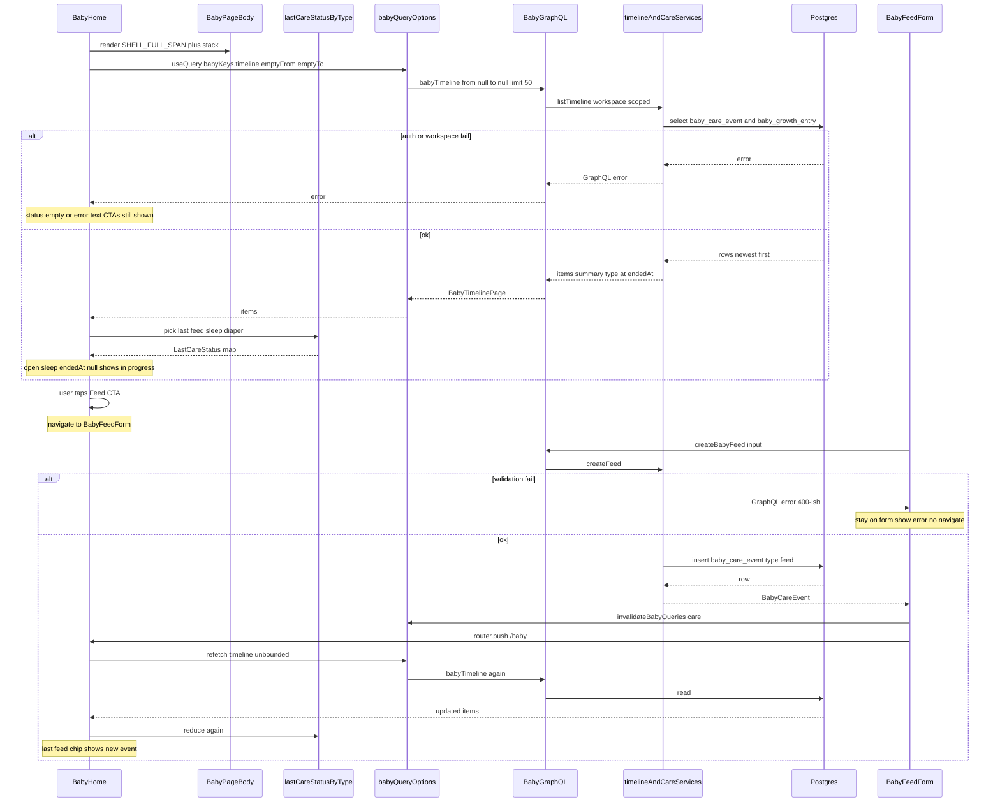

# Design: Baby pages Money layout pattern

## Locked product / soft picks (do not reopen)

From Gate 1 + soft Design picks (2026-09-06):

1. Home status: **last-ever per type** (feed / sleep / diaper) above CTAs.
2. Layout tokens: **MOVE/RENAME** to `lib/shell-layout.ts`; update all callers (Money + Baby + Loans + Investments + Kiosk + shared settings).
3. `SettingsSection`: move to neutral path under `components/settings/` if cheap (it is — folder already exists).
4. Capture after save → `/baby`; Growth add → chart → list; all seven surfaces; reuse/generalize primitives; no new GraphQL.

---

## Option A — Shared Baby page body + first-page last-of-type

**Summary:** Lift layout tokens to `lib/shell-layout.ts` (`SHELL_FULL_SPAN`, `SHELL_DASHBOARD_STACK`). Move `SettingsSection` / `SettingsSubsectionHeading` to `components/settings/settings-section.tsx`. Add a thin shared `BabyPageBody` that applies span + stack once. Home loads **one** unbounded `babyTimeline` page (no `from`/`to`, limit 50), then a pure helper picks the newest item per `feed` / `sleep` / `diaper`. Capture/growth/timeline/settings adopt Field + flat chrome **inside** that body. Skeletons mirror the shared body.

**Pros:**

- One place for span/stack so Baby pages cannot re-apply full-span nested.
- Fast path: one timeline query key shared shape with Timeline (`from`/`to` empty).
- Shared body makes skeleton parity easier (status strip + stack gaps match live UI).
- Smallest change set after the shell-layout rename.

**Cons:**

- First page only: if a care type’s last event sits behind many other events, status for that type can show empty until caregiver logs again (rare for feed/sleep/diaper mix).
- New `BabyPageBody` is Baby-only — Money still composes tokens per page (acceptable; Money already does that).
- Shared body must stay thin or it becomes a second layout framework.

## Option B — Per-page tokens + capped multi-page last-of-type

**Summary:** Same `lib/shell-layout.ts` rename and `SettingsSection` move. **No** shared Baby page body — each of the seven surfaces imports `SHELL_FULL_SPAN` / `SHELL_DASHBOARD_STACK` the way Money pages do today. Home status uses the same pure last-of-type helper, but the fetch **walks `nextCursor`** until all three care types are found or a page cap (e.g. 3 pages / 150 rows) is hit. Forms and settings still adopt Field + flat sections page by page.

**Pros:**

- Stronger “last-ever” guarantee when one type is rare among a long feed of another type.
- Matches Money’s “compose tokens per page” habit — no new Baby abstraction.
- Easier to ship one surface without waiting on a shared shell API.

**Cons:**

- More copy-paste across seven surfaces + skeletons (stack/gaps drift risk).
- Extra timeline pages on home (more network / cache weight) for an edge case.
- Nested full-span mistakes stay possible without a shared outer wrapper.

## Tradeoffs

| Factor | Option A | Option B |
|--------|----------|----------|
| Cost / time | Lower after rename — one body + one fetch | Higher — seven independent compositions + multi-page fetch |
| Complexity | Thin shared body + pure reduce | No shared body; cursor walk + page cap |
| Usability | Same eye flow; status empty rare | Slightly better status completeness when history is skewed |
| Failure cases | Timeline error → status empty + CTAs still work; first-page miss → empty chip | Same + multi-page fail mid-walk → partial status; more loading time |

## Recommendation

**Recommend Option A.**

Locked goals are layout language + last-ever status without new backend. Newest-first timeline means the first page almost always holds the latest feed, sleep, and diaper. A shared `BabyPageBody` keeps all seven surfaces + skeletons honest about span/stack and cuts drift. If status misses a rare type in practice, we can add a capped cursor walk later without changing the UI contract.

## Chosen design (user-approved)

**Option B** (Gate 2, 2026-09-06): Per-page `SHELL_*` token composition (no shared `BabyPageBody`) + capped multi-page timeline walk for home last-ever status. Same shell-layout rename, SettingsSection move, Field/flat chrome, post-save → `/baby`, growth add→chart→list, all seven surfaces.

## Sequence diagram

Main flow (recommended Option A): open home → see last-of-type status → log feed → save → back home with refreshed status.



## Contracts

### API contracts

#### Module: `lib/shell-layout.ts` (new; replaces `lib/money-layout.ts`)

| Item | Detail |
|------|--------|
| Name | `SHELL_FULL_SPAN`, `SHELL_DASHBOARD_STACK` |
| Auth | N/A (client layout class strings) |
| Request fields | N/A |
| Success | String Tailwind class constants (same values as today’s Money exports) |
| Errors | N/A |
| Downstream | None |
| Migration | Update all `@/lib/money-layout` imports. Optional short-lived re-exports `MONEY_FULL_SPAN` / `MONEY_DASHBOARD_STACK` from `shell-layout` **or** delete `money-layout.ts` in the same task. Prefer **delete after bulk rename** to avoid dual names. Update `docs/DESIGN_GUIDE.md` links. |

#### Module: `components/settings/settings-section.tsx` (moved)

| Item | Detail |
|------|--------|
| Name | `SettingsSection`, `SettingsSubsectionHeading` |
| Auth | N/A |
| Props | Unchanged: `id`, `title`, `description?`, `children`, `size?` |
| Success | Same flat heading + body UI |
| Errors | N/A |
| Downstream | None |
| Migration | Update imports from `@/components/money-settings/money-settings-shared`. Leave a one-line re-export shim in the old file for one PR if needed, then remove in the same pass if all callers updated (preferred — cheap, few files). |

#### Module: `lib/baby-last-care-status.ts` (new pure helper)

| Item | Detail |
|------|--------|
| Name | `lastCareStatusByType(items)` |
| Auth | N/A (pure) |
| Request | `items: Array<{ type: string; at: string; endedAt: string \| null; summary: string; … }>` (timeline item subset) |
| Success | `{ feed: Item \| null; sleep: Item \| null; diaper: Item \| null }` — first match per type in newest-first order |
| Errors | None — unknown types ignored |
| Sleep rule | `sleep` with `endedAt == null` → UI treats as in progress |
| Downstream | None |

#### Module: `components/baby-page-body.tsx` (Option A only)

| Item | Detail |
|------|--------|
| Name | `BabyPageBody` |
| Props | `children`, optional `className` |
| Behavior | Outer `cn(SHELL_FULL_SPAN, SHELL_DASHBOARD_STACK, className)` once; no nested span |
| Option B | Skip this module; pages compose tokens directly |

#### GraphQL — **unchanged** (reuse)

| Operation | Role in this design |
|-----------|---------------------|
| `babyTimeline(from, to, cursor, limit)` | Home status: call with `from`/`to` omitted (or null), `limit: 50`. Option B may page with `cursor`. Timeline page keeps day-bounded calls as today. |
| `createBabyFeed` / `createBabyDiaper` / `startBabySleep` / `endBabySleep` | Capture writes — unchanged shapes |
| Growth / settings / Telegram queries & mutations | Unchanged |

**Auth (existing):** Baby GraphQL route uses workspace session / baby context (`lib/api-baby.ts`, yoga context). No new auth surface.

**Client helpers (existing, reused):**

- `fetchBabyTimelinePage({ from?, to?, cursor?, limit })` in `lib/baby-query-options.ts`
- `babyKeys.timeline(from, to)` — home uses `babyKeys.timeline("", "")` or equivalent empty bounds
- `invalidateBabyQueries(qc, "care")` after care mutations so home status refetches

**Post-save navigation (client only):** feed / sleep / diaper `router.push("/baby")` instead of `/baby/timeline`.

### Database contracts

**No schema change.** Home status and care writes use existing tables.

| Table / collection | Purpose | Key fields (name, type) | Indexes / uniques | Write owner | Read owners |
|--------------------|---------|-------------------------|-------------------|-------------|-------------|
| `baby_care_event` | Care log rows for feed / diaper / sleep (status + mutations) | `id` uuid PK; `workspace_id` uuid; `baby_id` uuid; `type` enum feed\|diaper\|sleep; `occurred_at` timestamptz; `ended_at` timestamptz nullable; `payload` jsonb; `source` enum | `(workspace_id, occurred_at)`; `(baby_id, type)`; unique open sleep per baby | Care mutations / Telegram bot (out of scope) | `babyTimeline` union + home reduce |
| `baby_growth_entry` | Growth rows (timeline union only; not home status chips) | `id`, `workspace_id`, `baby_id`, `kind`, `recorded_at`, values | Existing growth indexes | Growth mutations | Timeline list (not home status) |
| `baby_profile` | Workspace baby (unchanged) | `id`, `workspace_id` unique | workspace unique | Profile ensure | Context for all baby queries |

### Example queries

**1. Home status — unbounded timeline page (GraphQL variables)**

```graphql
query BabyTimeline($from: String, $to: String, $cursor: String, $limit: Int) {
  babyTimeline(from: $from, to: $to, cursor: $cursor, limit: $limit) {
    items {
      id
      type
      at
      endedAt
      summary
      source
      cursor
    }
    nextCursor
  }
}
# variables: { "limit": 50 }
# from/to omitted → last-ever window (newest first)
```

**2. Same read — server/DB shape (illustrative Drizzle)**

```ts
// features/baby/server/timeline.ts — unchanged path
// care side (workspace scoped); from/to null → no occurredAt range filter
db.select().from(babyCareEvent)
  .where(and(
    eq(babyCareEvent.workspaceId, workspaceId),
    // optional: gte/lte only when from/to set
  ))
  .orderBy(desc(babyCareEvent.occurredAt))
  .limit(limit);
```

**3. Care write after Feed save**

```graphql
mutation CreateBabyFeed($input: CreateBabyFeedInput!) {
  createBabyFeed(input: $input) {
    id
    type
    at
    endedAt
    summary
    source
  }
}
# variables example:
# { "input": { "method": "formula", "amountMl": 120 } }
# then invalidate care queries → refetch home timeline → lastCareStatusByType
```

## Challenges answered

| Challenge | Answer |
|-----------|--------|
| Do we need this? | Yes — chrome already matches Money; page bodies and home status are the remaining gap for tired caregivers. |
| What fails? | Timeline load fail → show CTAs without status (or short error). Mutation fail → stay on capture form. First-page miss (Option A) → empty chip for that type. Rename miss → typecheck/build catches leftover `money-layout` imports. |
| Is this overspecified? | No new GraphQL or DB. Module rename is forced by Gate 1 “generalize”. Shared body (A) is one thin wrapper — skip it only if Gate 2 picks B. |
| ADR? | **No ADR.** Local rename + UI composition; not a new framework, data model, or public HTTP API. Contracts live in this design doc. |
| Couples Baby to Money names? | Solved by `shell-layout` + settings move — both apps import neutral paths. |

---

*Design draft for Gate 2. No production code in this stage.*
