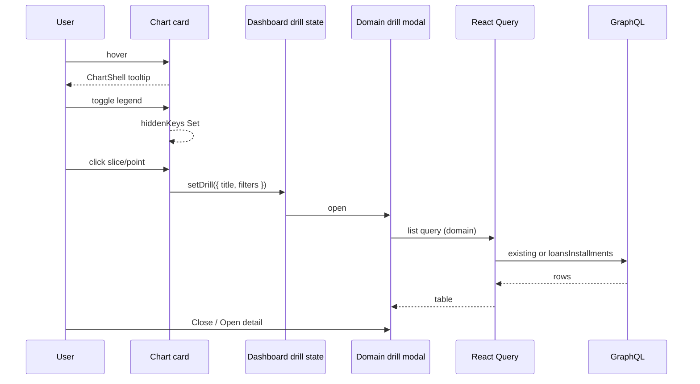

# Design: Chart interaction parity

**Mode:** full  
**Has API:** yes  
**Has DB:** no  
**Has UI:** yes  
**UI lock:** `ui-refs/_proposed-chart-interactions.html` (Gate A2 approved) — Build must match size, positions, texts, chrome.

## Decision 1: which design approach?

### Option 1 — Shared chrome + domain modals + thin Loans list API (recommended)

**What it is:** Refit all in-scope charts onto `ChartShell` / `ChartLegendList` / `onItemClick`. Add Loans / Investments / Baby drill modals cloned from Money’s modal chrome. Add one thin GraphQL `loansInstallments(query)` for multi-loan date/status filters. Single-loan and loan-detail drills may use existing `loan(id)`. Investments use existing `investmentActivities`. Baby modal filters timeline/growth client-side (or existing growth `kind`). Pattern-finder: hover only this pass.

**Example:** Click Loans Remaining pie slice → modal of that loan’s installments; click Investments allocation → activities for instrument; hover Baby hydration → tooltip; toggle Wet/Feeds legend.

**Pros:** Matches A2 HTML; reuses Money pattern; minimal API surface; avoids N+1 on Insights paid charts.

**Cons:** Three modal components (or one shell + adapters); one new Loans query to contract-review.

### Option 2 — Unified drill GraphQL + generic ChartDrilldown framework first

**What it is:** Design a cross-domain `chartDrilldown(domain, filters)` API and one fully generic modal before wiring Baby hover/toggle.

**Example:** Single endpoint returns polymorphic rows for money/loans/investments/baby.

**Pros:** One list contract long-term.

**Cons:** Large Has API blast; blocks UI parity; invents framework before shipping Money-parity UX; worse for this pass.

## Tradeoffs

| Factor | Option 1 | Option 2 |
|--------|----------|----------|
| Cost / time | Medium | High |
| Complexity | Domain adapters + one Loans query | New abstraction + multi-domain API |
| Usability | Same A2 UI sooner | Same UI later |
| Failure cases | Adapter drift | Contract sprawl / delayed ship |

## Recommendation

**Pick Option 1** — analysis shows Money SoT + unused investments activities; only Loans multi-loan list needs new API.

## Chosen design (provisional until Gate B)

**Option 1** — Shared chrome + domain modals + thin Loans list API.

## Locked picks (provisional until Gate B)

| Topic | Pick |
|-------|------|
| Design | Option 1 |
| Drill | Option A in-page modal (not URL primary) |
| Loans Remaining pie | Modal first; footer **Open loan** → `/loans/[id]` |
| Loans multi-loan paid/combined | `loansInstallments` thin query |
| Investments | `investmentActivitiesQueryOptions`; symbol→instrumentId in card |
| Baby care kind | Client filter on fetched timeline for modal this pass |
| Pattern-finder | Hover (+ static/toggle if easy); **no drill** this pass |
| LoanProgressChart | Add `onItemClick` |
| API/DB | Has API **yes** · Has DB **no** |

## System design

### Overview

- **What it is:** Client chart interaction layer (shared visx chrome) plus domain list adapters opening filtered modals. One new Loans read API for installment lists; other domains reuse existing reads.
- **Components / boundaries:** Browser UI → GraphQL (existing + `loansInstallments`) → existing tables. Auth/workspace cookies unchanged. No new write paths.
- **Data flow:** Chart click → build domain filter payload → set drill state → modal `useQuery` list → table. Legend toggles local `Set` hidden keys. Hover via `ChartShell`.
- **Consistency & failure:** Quiet empty modal; query errors use existing alert/error patterns; Money modal unchanged.
- **Why this shape:** Money already owns the UX; Option 2 invents a cross-domain API before parity ships.
- **Best practices:** Shared chrome only; additive GraphQL fields; bigint amounts; skeleton parity for legend.
- **Anti-patterns:** One-off Baby tooltips; N+1 `loan(id)` on Insights; URL-only as primary drill.
- **Reference:** `docs/DESIGN_GUIDE.md`; Money `AnalyticsChartDrilldownModal`.

### Concept 1 — Chart interaction chrome

Shared hover + legend + click handlers on visx primitives/cards (teach in Design patterns).

### Concept 2 — Domain drill adapter

Each domain maps click payload → list query input → table columns (not one polymorphic API this pass).

## Design patterns used

### Pattern 1 — Shared chart shell (repo)

**What:** `ChartShell` + `useChartTooltip` + `ChartLegendList` + `toggleSetKey`.  
**Where:** `components/charts/*`, Money cards.  
**Apply:** Baby charts, Loans Insights combined legend, any card missing toggle.  
**Avoid:** Custom absolute tooltip divs on Baby.

### Pattern 2 — Drill-down modal (repo)

**What:** Parent holds `{ title, filter }` state; modal loads paginated list.  
**Where:** `analytics-dashboard.tsx` + `analytics-chart-drilldown-modal.tsx`.  
**Apply:** Loans/Investments/Baby modals with same Modal + table chrome.  
**Avoid:** `router.push` as the only drill (Loans pie today).

### Pattern 3 — Thin list query (API)

**What:** Cursor list with optional filters (id, date range, status).  
**Where:** Money transactions / Investments activities patterns.  
**Apply:** `loansInstallments(query)`.  
**Avoid:** Returning full multi-loan schedules inside Insights ATF aggregates.

## Sequence diagram



## Contracts

### API contracts

#### `loansInstallments(query: LoansInstallmentsQueryInput!): LoansInstallmentsConnection!`

**Input (additive):**
- `loanId?: ID`
- `from?: Date` / `to?: Date` (due date or paid-at bounds — Design lock: filter by **dueDate** in range; paid status filter separate)
- `status?: LoanInstallmentStatus` (pending | paid | … existing enum)
- `limit?: Int` / `cursor?: String`

**Output:** `items { id loanId dueDate status principalMinor interestMinor … }` + `nextCursor`

**Errors:** Same workspace auth as other loans queries; empty list not an error.

**Existing (reuse, no change required):**
- `investmentActivities(query)` — instrumentId, kind, from, to, cursor
- `loan(id)` — installments for single-loan / detail
- Money transactions — unchanged
- Baby timeline / growth — unchanged (client filter care type)

### Database contracts

N/A — no schema/migration. Reads existing loan installment / investment activity / baby care+growth rows. Prefer indexed dueDate + loanId filters already present or note in Build if query plan needs index (enhancement only if slow).

## Example queries

```graphql
query LoansInstallments($query: LoansInstallmentsQueryInput!) {
  loansInstallments(query: $query) {
    items {
      id
      loanId
      dueDate
      status
      principalMinor
      interestMinor
    }
    nextCursor
  }
}
```

```graphql
query InvestmentActivities($query: InvestmentActivitiesQueryInput) {
  investmentActivities(query: $query) {
    items { id instrumentId kind occurredAt amountMinor }
    nextCursor
  }
}
```

## UI / UX notes

- Match A2: tooltip, legend pressed/muted+strike, modal title + table + Close + optional Open detail
- Loans pie: stop primary `router.push`; open modal
- Legend ≥44px hit via button padding; not color-only
- Skeleton: legend placeholder when multi-series cards gain height

## Security / OWASP notes

- Workspace-scoped reads only; no IDOR across workspaces
- Validate query inputs (Zod) at GQL edge
- No new secrets; PII in Baby modal stays behind existing baby auth

## Tasks handoff

See `04-tasks.md` — TDD red-first; API contract review required (Has API yes).
