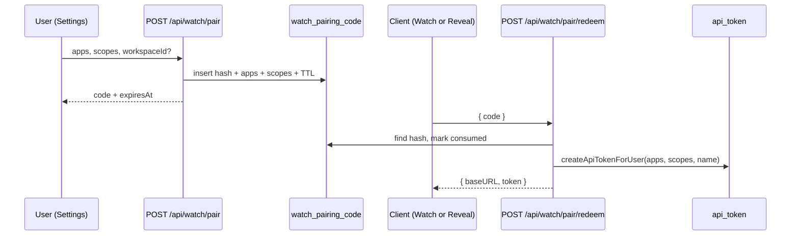

# Design: General device pairing

**Mode:** simple  
**Has API:** yes  
**Has DB:** yes

## Decision 1: which design approach?

### Option 1 — Extend pairing mint with apps + generalize Settings (recommended)

**What it is:** Keep `POST /api/watch/pair` + redeem. Add `apps`/`scopes` on mint and DB. Settings: remove create form; pairing card gets app (+ write) pickers and general copy; optional “Reveal on this device” redeems the shown code and shows `mny_…` once. Redeem creates named token; no auto-revoke of other tokens.

**Example:** User checks Money + Baby, Generate → code `K7M2NP`. Watch redeems OR Settings “Reveal on this device” → Bearer with those apps.

**Pros:** One create path; Watch unchanged aside from grants; scripts/Postman covered; reuses existing pair security.

**Cons:** Small migration; Watch must still select Baby (or default baby on) for care; list can grow without auto-revoke.

### Rejected alternative (≤3 lines)

Mint returns `mny_…` directly in the browser and drop short codes — breaks Watch typing path and rejects the existing pairing product.

## Recommendation

**Pick Option 1** — matches the ask with minimal surface change.

## Locked product picks (from analysis provisional)

| Topic | Pick |
|-------|------|
| Token name | `API pairing · <local short datetime>` |
| Auto-revoke on redeem | **No** — list + manual revoke |
| Web `mny_…` | **Reveal on this device** (redeem same code) + docs for script redeem |
| Write checkbox | Keep; default **on** → scopes `["read","write"]` else `["read"]` |
| Default apps | Baby **on**, Money **off** (Watch-friendly); require ≥1 |
| Workspace | Optional select; default workspace if omitted (current mint) |
| Table rename | **No** this pass — keep `watch_pairing_code` |
| `POST /api/tokens` | Keep route; **remove UI create only**; docs prefer pairing |

## Chosen design (user-approved)

<!-- Fill after Gate B -->

## System design

### Overview

- **Shape:** Session browser mints short-lived hashed code with intended apps/scopes → any client redeems once → durable `api_token` (Bearer) for GraphQL/REST.
- **Boundaries:** Mint = cookie session + same-origin; redeem = public + rate-limited; token auth unchanged after create.
- **Data ownership:** Pairing rows owned by watch-pairing service; tokens by api-token-service.
- **Failure:** Invalid/expired/consumed code → 4xx; no partial token if consume fails first (keep current order: consume then create, or create-then — honor existing redeem safety).
- **Point to:** Sequence + API/DB contracts + OWASP below (do not duplicate field lists here).

### Concept 1 — Grants travel with the code

- **What:** Apps/scopes chosen at mint are stored on the code row and applied only at redeem.
- **Why:** Client that types the code must not choose grants (user already chose on laptop).
- **How:** jsonb columns; redeem → `createApiTokenForUser({ apps, scopes, name })`.

## Design patterns used

### Pattern 1 — Deps-injected pairing service

- **What:** Pure `mintWatchPairingCode` / `redeemWatchPairingCode` with `WatchPairingDeps`.
- **How:** Extend insert row + createWatchToken args for apps/scopes; unit-test without DB.
- **Why:** Existing TDD shape in `lib/watch-pairing-service.ts`.
- **Best practices:** Keep DB wiring in `watch-pairing-db.ts`.

### Pattern 2 — Settings compound card

- **What:** Pairing card + token list as sibling sections under API tokens tab.
- **How:** Generalize `WatchPairingSettings` (or rename file); strip `TokenCreateForm` from `ApiTokenSettings`.
- **Why:** Matches current Settings layout.
- **Best practices:** DESIGN_GUIDE tokens; skeleton parity if order changes.

## Sequence diagram



## API contracts

### `POST /api/watch/pair` (session, same-origin)

**Request JSON:**
```json
{
  "apps": ["baby", "money"],
  "scopes": ["read", "write"],
  "workspaceId": "<uuid optional>"
}
```

- `apps`: required, ≥1 shareable (`money` | `baby`)
- `scopes`: optional; default `["read","write"]`; allow `["read"]` or `["read","write"]`
- Validate user has access to **each** selected app in the workspace
- If any app access check fails → **403** `{ "error": "…", "code": "FORBIDDEN" }` (same shape as other pair errors)

**Response 201:** `{ "data": { "code": "K7M2NP", "expiresAt": "<iso>" } }`

### `POST /api/watch/pair/redeem` (public, rate-limited)

Unchanged body `{ "code" }`.  
**Grants:** `apps` / `scopes` come **only** from the pairing row (never from the redeem body).  
**Response 201:** `{ "data": { "baseURL": "...", "token": "mny_..." } }`  

Used by Watch and by Settings **Reveal on this device** (same one-time consume).
### `POST /api/tokens`

Unchanged (no Settings UI). Prefer pairing in docs.

## Database contracts

### `watch_pairing_code` (add columns)

| Column | Type | Notes |
|--------|------|-------|
| `apps` | jsonb not null | e.g. `["baby"]`; migration: add with DEFAULT `["baby"]` for existing rows, then keep default or drop after backfill |
| `scopes` | jsonb not null | e.g. `["read","write"]`; migration DEFAULT `["read","write"]` for existing rows |

Migration `0045_watch_pairing_grants.sql`. No table rename.

### Example queries

```sql
-- mint insert (via Drizzle)
INSERT INTO watch_pairing_code (user_sub, workspace_id, code_hash, expires_at, apps, scopes)
VALUES ($1, $2, $3, $4, $5::jsonb, $6::jsonb);

-- redeem load
SELECT id, user_sub, workspace_id, expires_at, consumed_at, apps, scopes
FROM watch_pairing_code WHERE code_hash = $1 LIMIT 1;
```

## UI / UX / mobile

| Item | Spec |
|------|------|
| Title | **Device pairing** (or **API pairing**) — not Watch-only |
| Blurb | Short code for Watch, scripts, or other tools |
| #1 visible | App checkboxes (Money, Baby Care) |
| #2 visible | Generate code (+ code display when minted) |
| Secondary | Allow write; workspace select if >1; Reveal on this device; token list/revoke |
| Defaults | Baby on, Money off, write on |
| Generate | Disabled until ≥1 app |
| Reveal | After mint; calls redeem; modal once; consumes code (Watch cannot reuse) |
| Remove | Entire manual create form + create reveal modal path |
| Skeleton | Match new control order in settings loading if present |

## OWASP (Top 10 — pairing/token surface)

| Risk | Mitigation |
|------|------------|
| A01 Broken access | Mint: session + assert app access per workspace; redeem does not accept apps from client |
| A02 Crypto | Hash codes; never log `mny_…` / raw code in server logs |
| A03 Injection | Zod validators; Drizzle binds |
| A04 Insecure design | TTL + one-time consume; rate limits mint/redeem |
| A05 Misconfig | Same-origin mint; Cache-Control no-store |
| A07 Auth failures | Redeem generic errors for unknown/invalid |
| A09 Logging | Audit mint/redeem without secrets |
| Others | N/A or unchanged vs existing pair |

## Aggressive challenges

| Challenge | Response |
|-----------|----------|
| Reveal + Watch race | First redeem wins; UI warns code is one-time |
| Token pile-up | List + revoke; name includes time |
| Keep POST /api/tokens | OK for automation; UI gone |

## Has API / Has DB confirm

- **Has API:** yes  
- **Has DB:** yes  
