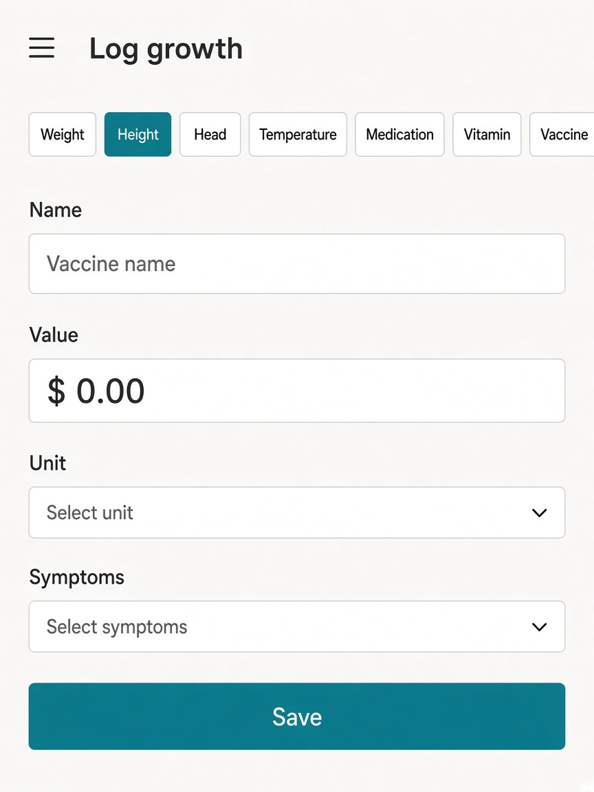
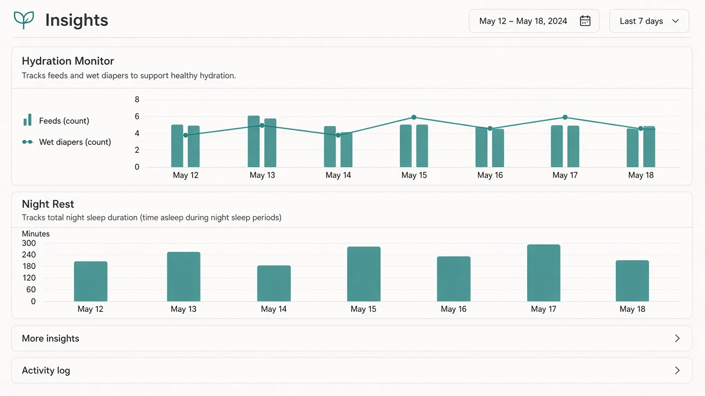
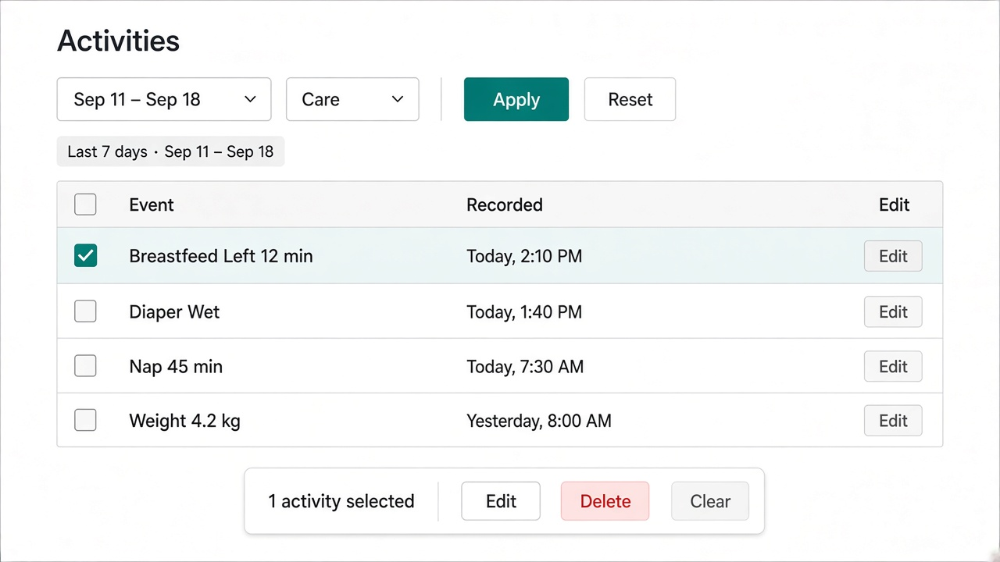

# UI concept (UI/UX designer): extract-reusable-code

**Result:** done
**Updated:** 2026-09-22
**Has UI:** yes

## Sources followed

| Source | Applied? | Notes |
|--------|----------|-------|
| Project `docs/DESIGN_GUIDE.md` / AGENTS.md UI rules | yes | clean-minimal; no new look |
| `clean-minimal-ui` skill | yes | teal accent, quiet shell |
| `frontend-ui-engineering` skill | yes | parity / a11y / states |
| Existing UI patterns in repo (list paths) | yes | prior real screenshot ui-refs; `components/ui/*`; feature headers/skeletons |

## Concept depth

**lean** — parity proof of existing chrome clusters (not a new product screen). Three reference screenshots from prior workflows that match live app look.

## Align with Gate A (80/20)

| Item | From 01a / idea | How concept honors it |
|------|-----------------|------------------------|
| Important info/action #1 | Existing chrome + primary actions stay put | Refs show real headers/forms/CTAs unchanged |
| Important info/action #2 | Skeleton ↔ live layout parity | Extract must keep same layout hierarchy as these surfaces |
| Secondary (expand / modal / menu) | Feature-only / rare widgets | Out of wave-1 concept |
| Top user journey | Open → filters → load → act | Same journey; shared implementation only |
| Sensible defaults | Extend ui/ + existing lib | No new “reuse admin” UI |

## Screen / surface map

| Surface | Purpose | Primary actions |
|---------|---------|-----------------|
| Shared chrome parity (forms / filters / list header) | Prove extract targets look like today’s app | Keep labels, chips, hierarchy; change imports only |

## UI reference images (required for Gate A2; confirm at Gate B without re-show)

**Fidelity rule:** real screenshots copied from known-good prior `ui-refs` (not GenerateImage).

| Surface | Variant | File path | Source | Shown at Gate A2? | Confirmed at Gate B? |
|---------|---------|-----------|--------|-------------------|----------------------|
| Form chrome parity (Money-new style controls) | light | `ui-refs/01-shared-form-chrome-parity-light.png` | prior-ui-ref ← `baby-care-pages-control-parity/.../03-growth-money-new-form-light.png` | yes | |
| Insights filter/chip chrome | light | `ui-refs/02-insights-filter-chip-chrome-light.png` | prior-ui-ref ← `baby-insights-charts/.../01-default-light.png` | yes | |
| Feature page header + list | light | `ui-refs/03-feature-page-header-list-light.png` | prior-ui-ref ← `baby-activities-page/.../01-activities-page-light.png` | yes | |

## Layout concept (plain words)

- **Hierarchy / eye flow:** Shell nav → page header → filters/chips → content. Extract must not reorder these.
- **Core vs secondary:** Shared headers, chips, form fields, skeletons are wave-1 candidates; deep Baby one-tap / one-off charts stay local.
- **Components to reuse** (from `components/ui/*` or feature patterns):

| Component / pattern | Where it already lives | Use for |
|---------------------|------------------------|---------|
| Button, Field, Input, Select, Tabs, Skeleton | `components/ui/*` | Building blocks — extend, don’t fork |
| `*-app-header` helpers | `lib/{money,baby,loan,investment,core}-app-header.ts` | Consolidate shared header config shape |
| Feature page skeletons | `components/*-page-skeleton.tsx` | Shared skeleton shell + feature slots |
| Filter / chip rows | insights + list pages | Shared toolbar pattern if Analyze confirms dup |

## States

| State | Behavior |
|-------|----------|
| Loading | Existing skeletons; must match live layout after extract |
| Empty | Unchanged feature empty copy/patterns |
| Error | Unchanged; reuse existing alert/toast patterns |
| Success | Unchanged feedback |

## Notes

Lean concept = **visual lock** for Gate A2: approve that extract work must match these real screens. Analyze/Design pick which cluster is wave 1.
