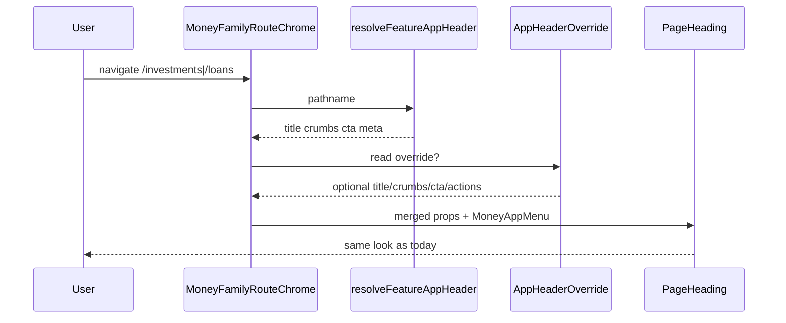

# Design: Whole-app reusable code extract (wave 1)

**Mode:** full

## Decision 1: which design approach?

### Option 1 — Shared route-chrome component (recommended)

**What it is:**
Extract one shared client component that owns the Investment/Loans shell grid, `PageHeading`, `MoneyAppMenu`, override merge, and default CTA link. Feature files pass a `resolveHeader` function and optional actions override.

**Example:**
`components/money-family-route-chrome.tsx` (name locked) exports `MoneyFamilyRouteChrome({ resolveHeader, children, actions? })`. `InvestmentRouteChrome` and `LoanRouteChrome` become thin wrappers (~5–15 lines). **Actions boundary:** Loans wrapper calls `useAppHeaderActions()` and passes `actions` into shared chrome; shared chrome never imports that hook. If `actions` is undefined, chrome renders the default CTA `Link` from the resolver (Investment path).

**Pros:**

- Removes the largest near-duplicate UI surface in wave 1
- Single place for shell grid / CTA styling → fewer drift bugs
- Easy parity unit tests on override + CTA merge

**Cons:**

- Must carefully preserve Loans-only `useAppHeaderActions` behavior
- Does not extract API context yet (intentionally wave 2)

### Option 2 — Shared heading hook only; keep two chrome files

**What it is:**
Extract `useMoneyFamilySectionHeading(resolveHeader)` for title/crumbs/meta/cta merge; leave two `*RouteChrome` files that still duplicate the grid + provider tree.

**Example:**
`lib/use-money-family-section-heading.ts` used inside both Investment and Loan section headings; chrome wrappers stay separate.

**Pros:**

- Smaller diff; lower merge conflict risk
- Easier to diverge layouts later per feature

**Cons:**

- Leaves most duplication (providers + grid + IconPlus + CTA Link) in place
- Weaker “reuse” outcome for this run’s metric (≥1 module, ≥2 features — hook helps but chrome still twins)

## Tradeoffs

| Factor | Option 1 | Option 2 |
|--------|----------|----------|
| Cost / time | M | S |
| Complexity | Medium (actions slot) | Low |
| Usability | Same end-user UI | Same end-user UI |
| Failure cases | Actions slot wrong → Loans CTA regress | Drift between two chrome files continues |

## Recommendation

**Pick Option 1** because the Investment/Loan chrome files are already near copies and Option 1 delivers a real shared module with two adopters while keeping visual parity. Bundle a small path-active helper reuse from `lib/app-section-nav.ts` into Money header if cheap; list `require*Context` factory as wave 2 backlog.

## Chosen design (user-approved)

**Option 1** — shared `components/money-family-route-chrome.tsx` for Investments + Loans; thin feature wrappers. Heading reads `useAppHeaderActions` from shared override context (Investment never sets it; Loans More menu still works). Gate B approved 2026-09-22.
## System design

Has API = no, Has DB = no. Still Mode full with a shared UI boundary — short Overview.

### Overview

- **What it is:** Client-only shared chrome for Money-family features (Investments + Loans) that already share Money workspace bootstrap. No new server boundary.
- **Components / boundaries:** Feature route layouts → shared `MoneyFamilyRouteChrome` → `PageHeading` / override provider / GraphQL Money provider. Header *data* stays in feature `resolve*AppHeader` modules.
- **Data flow:** `usePathname` → feature resolver → merge override → render heading + children. No DB/API in this path.
- **Consistency & failure:** Pure client render; failure = wrong CTA/title if merge logic breaks (caught by unit tests).
- **Why this shape:** Matches ARCHITECTURE “shared UI helpers” without pulling Baby i18n headers into Money-family chrome.
- **Best practices:** Keep resolvers feature-owned; optional actions slot for Loans; no Money-only rules inside shared chrome; DESIGN_GUIDE tokens only.
- **Anti-patterns:** Mega header table for all apps; renaming public APIs; merging Baby home skeleton.
- **Reference:** `docs/ARCHITECTURE.md` shell vs feature vs shared; existing `investment-route-layout.tsx` / `loan-route-layout.tsx`.

### Concept 1 — Feature-owned resolve, shared shell

- **What it is:** Path→title tables stay per feature; only the render shell is shared.
- **How we use it here:** Investment/Loan resolvers unchanged in behavior; chrome imports them.
- **Why we chose it:** Baby/Money header shapes differ (i18n vs CTA types).
- **Best practices:** Do not force one `AppHeaderResolved` across Baby.
- **Reference:** `lib/*-app-header.ts`

## Sequence diagram

## Contracts

### API contracts

N/A — no new or changed public HTTP/GraphQL endpoints. Internal module only.

### Database contracts

N/A — no schema or query changes.

### Example queries

N/A — client-only extract.

## Design patterns used

### Pattern 1 — Thin feature wrapper over shared shell

- **What it is:** Feature file re-exports/wraps shared chrome with one resolver bind.
- **How we use it here:** `InvestmentRouteChrome` / `LoanRouteChrome` call shared component.
- **Why we chose it:** Keeps import paths stable for layouts; gradual adoption.
- **Best practices:** Wrappers stay ≤ ~20 lines; no copy of grid markup.
- **Reference:** Existing layout → chrome pattern in Money/Investment layouts.

### Pattern 2 — Strategy via injected resolver

- **What it is:** Pass `resolveHeader: (pathname) => Resolved` into shared chrome.
- **How we use it here:** Investment vs Loan tables stay separate modules.
- **Why we chose it:** Avoids shared module importing all feature tables.
- **Best practices:** Pure functions; unit-test resolvers independently.
- **Reference:** Current `resolveInvestmentAppHeader` / `resolveLoanAppHeader`.

## UI / UX / mobile

- Align with Gate A / A2: same hierarchy (menu + title + optional CTA).
- No new screens; mobile `responsiveIconOnly` CTA preserved.
- Skeleton parity: not in wave 1 extract (backlog).
- Light/dark: tokens only; no hard-coded colors.

## OWASP (Top 10)

| Risk | Apply? | Mitigation |
|------|--------|------------|
| A01 Broken access control | n/a | Server context unchanged; chrome is presentational |
| A02 Cryptographic failures | n/a | No secrets/crypto in chrome |
| A03 Injection | n/a | No new user input / query paths |
| A04 Insecure design | low | Do not put auth/workspace trust in client chrome |
| A05 Security misconfiguration | low | Keep existing GraphQL Money + override providers |
| A06 Vulnerable components | n/a | No new dependencies planned |
| A07 Identification / auth failures | n/a | Auth stays in `require*Context` (wave 2+) |
| A08 Software / data integrity | n/a | No CI/supply-chain change |
| A09 Logging / monitoring failures | n/a | No new logging surface |
| A10 SSRF | n/a | No server fetch from this extract |

## Aggressive challenges

- Is sharing only Investment/Loan enough for “whole-app”? Yes for wave 1 metric; inventory covers the rest.
- Will Baby need this chrome? Not yet — different menu/i18n; do not force.
- Could Option 2 be “good enough”? Weaker reuse metric; reject for this run.

## Wave 2+ backlog (do not build now)

| Cluster | Note |
|---------|------|
| `require*Context` factory | Four clones; inject resolve/verify; keep exports |
| Header path helpers | Reuse `isAppSectionNavItemActive` in Money header |
| More shared filter skeletons | Only when naming can be feature-neutral |
| GQL client wrappers | Already partially shared (`gql-request-*`) |
| Pagination unify | Explicit non-goal (ARCHITECTURE) |

## Open questions before Gate B

- Confirm Option 1 (shared chrome component) — default yes unless you say otherwise.
- File name: **settled** → `components/money-family-route-chrome.tsx`.
