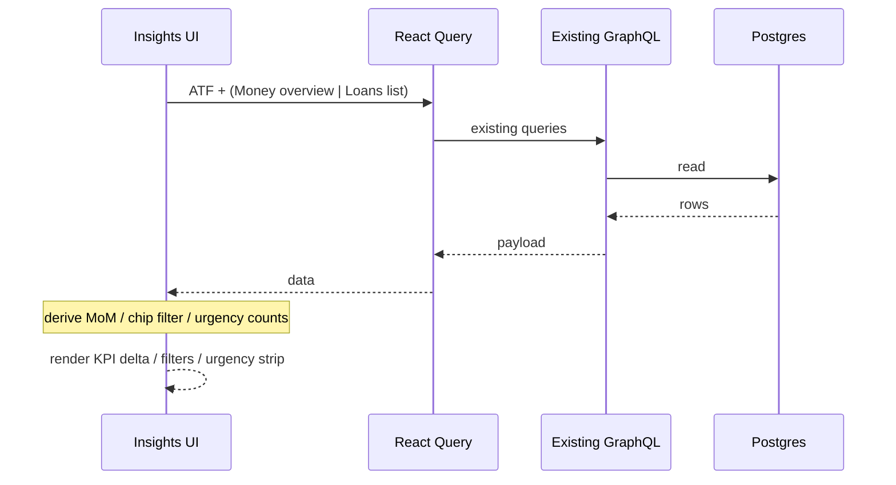

# Design: Insights UX — deltas, Baby filters, Loans urgency

**Mode:** full  
**Has API:** no  
**Has DB:** no  
**Has UI:** yes  
**UI lock:** `ui-refs/_proposed-insights-chrome.html` (Gate A2 approved) — Build must match size, positions, texts, chrome.

## Decision 1: which design approach?

### Option 1 — Client compose existing queries + shared helpers (recommended)

**What it is:** Wire Money overview `column` into `AnalyticsStats`; pass Baby `multiSelectFilters` on the existing Insights date bar; extract loan due helpers and count from `loansListQueryOptions` for an Insights urgency strip. No GraphQL contract changes.

**Example:** Money Insights Expenses shows `↑ 12% vs prior month` when `expenseMomTrend(column)` is non-null; Baby toolbar Care/Growth Apply updates chips; Loans strip shows Overdue / Due this week + View loans.

**Pros:** Matches A2 HTML; lowest blast radius; reuses tested helpers; Has API/DB no.

**Cons:** Extra loans list fetch on Insights; Money depends on overview query timing for delta.

### Option 2 — Extend ATF GraphQL with delta/urgency fields

**What it is:** Add month column (or precomputed MoM) to Money ATF; add overdueCount/dueSoonCount to Loans ATF; Baby still client filters.

**Example:** `loansInsightsAtf.summary.overdueCount` returned from server.

**Pros:** One Insights payload; less client math.

**Cons:** Has API yes (contract review + lens); more server work than needed; duplicates overview column.

## Tradeoffs

| Factor | Option 1 | Option 2 |
|--------|----------|----------|
| Cost / time | Low | Medium |
| Complexity | Client wiring + extract helpers | GraphQL + resolvers |
| Usability | Same UI | Same UI |
| Failure cases | List/overview load lag | New field bugs / versioning |

## Recommendation

**Pick Option 1** — analysis already found overview `column` and list query; A2 is chrome-only; avoid API churn.

## Chosen design (user-approved)

**Option 1** — Client compose existing queries + shared helpers (Gate B approved).

## Locked picks (provisional until Gate B)

| Topic | Pick |
|-------|------|
| Design | Option 1 |
| Money delta | Expenses only; hide when MoM null |
| Baby filters | Care + Growth multi-selects; empty = all |
| Loans urgency | Overdue + due ≤7 days (exclude overdue from due-soon); quiet when both 0; warning tint when overdue &gt; 0 |
| Link | View loans → `/loans` |
| API/DB | No |

## System design

### Overview

- **What it is:** Client-side composition on existing Insights dashboards. UI reads existing React Query options (Money overview, loans list) and shared pure helpers; no new trust boundary.
- **Components / boundaries:** Browser UI → existing GraphQL queries already used by Insights/home → Postgres unchanged. Auth/workspace cookies unchanged.
- **Data flow:** Filters Apply → refetch ATF/series as today; delta derives from overview `column`; urgency derives from loan list rows + today ISO. (No new fields — see Contracts N/A.)
- **Consistency & failure:** Soft-hide missing delta; urgency quiet at zero; query errors keep existing Money/Loans error alerts.
- **Why this shape:** Same as current Insights progressive disclosure; Option 2 would invent server fields for UI chrome.
- **Best practices:** Single due-math owner in `lib/`; never color-only deltas; skeleton parity for new strip.
- **Anti-patterns:** Duplicating overdue logic only in Insights; faking 0% MoM.
- **Reference:** `docs/DESIGN_GUIDE.md` dashboard pattern; workspace-scoped feature queries.

## Sequence diagram

## Contracts

### API contracts

N/A — no new or changed public endpoints this pass. Reuse:

| Existing | Use |
|----------|-----|
| Money analytics overview | `column` for MoM |
| Loans list query | rows for overdue / due-soon counts |
| Baby insights series | unchanged; client chip filter |

### Database contracts

N/A — no schema or persistence changes.

### Example queries

N/A new SQL — overview month aggregation and loan list already exist.

## Design patterns used

### Pattern 1 — Presentational KPI + pure trend helper

- **What it is:** `AnalyticsStats` renders; `expenseMomTrend` stays pure.
- **How we use it here:** Pass `column` from overview into stats; no new UI primitive.
- **Why:** Already matches DESIGN_GUIDE deltas.
- **Best practices:** Keep helper unit-tested; hide when null.
- **Reference:** `components/analytics-stats.tsx`

### Pattern 2 — Shared Insights filter bar multi-select

- **What it is:** `InsightsDateRangeFiltersBar` + `InsightsMultiSelectFilter`.
- **How we use it here:** Baby Care/Growth filters only.
- **Why:** Same chrome as Money Accounts-style Insights filters.
- **Reference:** `components/analytics-filters.tsx`

### Pattern 3 — Extract shared domain helpers

- **What it is:** Move due/overdue/due-soon from dashboard component into `lib/`.
- **How we use it here:** Home + Insights import one module.
- **Why:** One definition; unit-testable.
- **Reference:** extract from `components/loans-dashboard.tsx` → e.g. `lib/loans-due.ts`

## UI / UX / mobile

- **Build must match** `ui-refs/_proposed-insights-chrome.html`: stack filters → period → (urgency) → KPIs → charts; Expenses delta copy `↑ N% vs prior month`; Baby Care/Growth on toolbar; Loans urgency Overdue + Due this week + View loans.
- Gate A #1/#2 honored; More insights unchanged.
- Mobile: toolbar wrap; urgency flex-wrap; skeleton parity.
- Do not re-argue 80/20.

## Security design review (OWASP)

| Item | Notes |
|------|-------|
| A01 Broken access control | No new routes; existing workspace queries |
| A02 Cryptographic failures | N/A |
| A03 Injection | No new SQL/raw input |
| A04 Insecure design | Client-derived counts from authorized list only |
| A05 Security misconfiguration | N/A |
| A06 Vulnerable components | No new deps |
| A07 Auth failures | Unchanged |
| A08 Data integrity | Read-only chrome |
| A09 Logging | No new PII logs |
| A10 SSRF | N/A |

## Aggressive challenges

| Challenge | Response |
|-----------|----------|
| Why not server MoM? | Overview already has column; avoid API |
| Why Growth filter too? | Toolbar supports multi; Gate A preferred both |
| Urgency duplicates home banner? | Insights needs glance without leaving; home keeps list filters |

## Success criteria (design)

- [ ] Money Expenses delta when data supports; else hidden
- [ ] Baby Care+Growth filters Apply/Reset; charts honor chips
- [ ] Loans urgency strip matches HTML; quiet at zero
- [ ] Tests + e2e per `04-tasks.md`
- [ ] Visual parity with approved HTML
