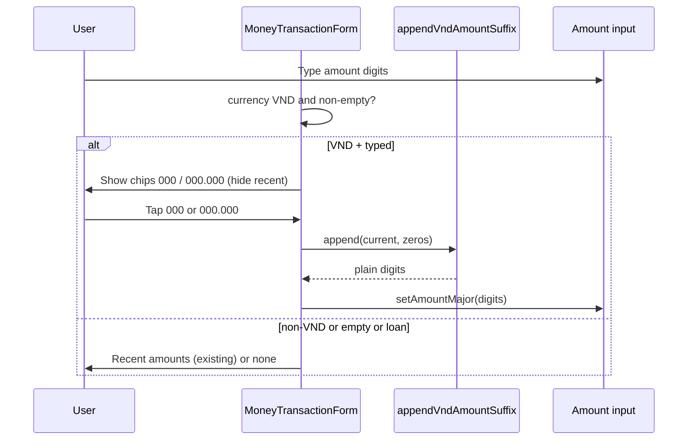

# Design: money-new-vnd-amount-suggestions

**Mode:** simple  
**Has API:** no  
**Has DB:** no

## Recommended design (Option 1)

**What it is:** In `MoneyTransactionForm` Amount `recentSlot`, when currency is VND, amount is non-empty, and kind is not loan: hide recent-amount chips; show two suffix chips labeled `000` and `000.000`. Tap appends those zeros to the typed digits and sets the input to a plain digit string.

**Example:** Workspace VND → type `25` → chips `000` / `000.000` → tap `000` → input `25000` → tap `000.000` → `25000000`. Non-VND → recent amounts as today.

**User-first:** Faster VND entry on the common path beats keeping history chips that do not help short typing.

### Rejected alternative (≤3 lines)

Preview chips showing full values (`25.000` / `25.000.000`) — clearer result, but labels ≠ ask; Decision 1 chose append with literal `000` / `000.000`.

## Locked picks

| Topic | Pick |
|-------|------|
| Tap behavior | Append zeros (Decision 1 Option 1) |
| Fill format | Plain digits only (`25000`) — never `25.000` |
| When shown | `defaultCurrency === "VND"` && trimmed amount has ≥1 digit && `kind !== "loan"` |
| Empty amount | No suffix chips |
| Non-VND / loan | Unchanged recent / hidden amount chips |
| Helper location | Pure function (e.g. `lib/vnd-amount-suffix.ts` or next to money helpers) |
| UI shell | Keep `MoneyAmountField`; only change `recentSlot` content |

## System design

### Overview

- **Shape:** Client-only UI branch + pure string helper. No server contracts.
- **Boundaries:** Form owns currency + `amountMajor`; helper has no React.
- **Failure:** Empty digit strip after normalize → no-op on tap (chips still only when typed).
- **Point to:** Sequence + UI locks below. API/DB N/A.

### Concept 1 — Suffix mode vs recent mode

- **What:** Mutually exclusive chip modes in `recentSlot`.
- **Why:** Avoid two competing suggestion rows.
- **How:** `showVndSuffix ? VndChips : RecentChips`.

## Design patterns used

### Pattern 1 — Pure transform + thin UI

- **What:** Digits-only append helper; buttons only call `setAmountMajor`.
- **How:** `appendVndAmountSuffix(input, "000" | "000000")`.
- **Why:** Unit tests without form mount; avoids parseFloat trap.
- **Best practices:** Strip `.` `,` spaces before append; return digits only.

### Pattern 2 — Presentational slot reuse

- **What:** `MoneyAmountField.recentSlot` stays a slot.
- **How:** Form chooses children; field unchanged.
- **Why:** Growth pages using the field stay untouched.
- **Best practices:** Match existing dashed chip classes / a11y group.

## Sequence diagram

## API contracts

N/A — no public HTTP/GraphQL/server-action change.

## Database contracts

N/A — no schema / migration / persistence query change.

## UI / UX locks (Build must match)

- **Surface:** Amount row on money/new (`MoneyTransactionForm` mode transaction).
- **Chip labels (exact):** `000` and `000.000`.
- **Layout:** Same wrap row as recent chips (`flex flex-wrap gap-1.5`), under Amount.
- **Chip chrome:** Reuse recent-amount button classes (`rounded-[var(--radius-sm)]`, dashed border, `fx-press`, `tabular-nums`).
- **Hint:** Short muted line, e.g. `Tap to add zeros` (replace recent-amount hint in VND mode).
- **a11y:** `role="group"` + `aria-label` e.g. `VND amount shortcuts`.
- **Skeleton:** No new layout section — money/new already skeletons the form; no CLS change expected. If a dedicated amount-chip skeleton exists, leave it unless Structure changes (it does not).

## Security (OWASP)

| OWASP | Status | Note |
|-------|--------|------|
| A01 Broken access control | N/A | UI-only; auth unchanged |
| A03 Injection | ok | Digits-only transform; existing parse on submit |
| A04 Insecure design | ok | Avoid grouping dots that break parseFloat |
| A05 Misconfig | N/A | No new config |
| A07 Auth failures | N/A | |
| A09 Logging | ok | No new logs of amounts required |
| Others | N/A | Client suggestion only |

## Aggressive challenges

- Double-tap stacks zeros — intended (user can edit).
- Pasted `25.000` → strip → digits `25000` then append — OK.
- Very large numbers → still string append; submit uses existing parse/round.
