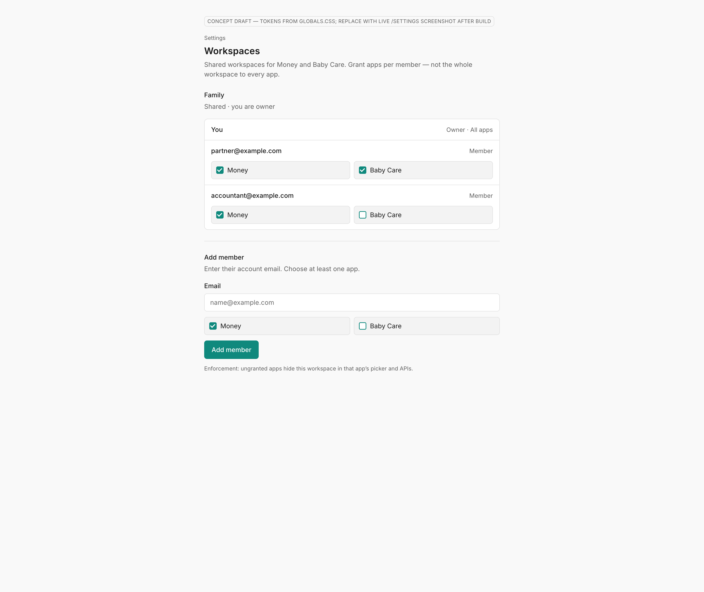

# UI concept (UI/UX designer): per-app-workspace-share

**Result:** done
**Updated:** 2026-09-21
**Has UI:** yes

## Sources followed

| Source | Applied? | Notes |
|--------|----------|-------|
| Project `docs/DESIGN_GUIDE.md` / AGENTS.md UI rules | yes | Teal clean-minimal, Inter, tokens, settings hierarchy |
| `clean-minimal-ui` skill | yes | Off-white, teal accent, 8px spacing |
| `frontend-ui-engineering` skill | yes | Primary actions visible; empty/error/success planned |
| Existing UI patterns in repo (list paths) | yes | `components/workspace-settings.tsx`, `SettingsSection`, Field, Checkbox, Button |

## Concept depth

**lean** — one primary surface + ≥1 image

## Align with Gate A (80/20)

| Item | From 01a / idea | How concept honors it |
|------|-----------------|------------------------|
| Important info/action #1 | Member list + apps each person can use | Per-member Money / Baby Care grant chips always visible |
| Important info/action #2 | Add member + save | Email + grants + primary “Add member” on same surface |
| Secondary (expand / modal / menu) | Remove, role detail | Owner “All apps” meta only; remove deferred |
| Top user journey | Add → grants → member uses app | Layout is that journey top-to-bottom |
| Sensible defaults | ≥1 app; Money preselected on add | Add form defaults Money on, Baby off |

## Screen / surface map

| Surface | Purpose | Primary actions |
|---------|---------|-----------------|
| Settings → Workspaces → shared workspace members | Manage members + per-app grants | Edit grants; Add member |

## UI reference images (required for Gate A2; confirm at Gate B without re-show)

**Fidelity rule:** images must look **exactly like the real app**. This pass uses a **concept draft** built with `globals.css` light tokens (auth required for live `/settings`; no session available). **Replace with a real `/settings` Workspaces screenshot after Build** (before Gate C, or earlier if Gate B needs reconfirm).

| Surface | Variant (light / dark / mobile) | File path | Source (screenshot / prior-ui-ref / concept-draft) | Shown at Gate A2? | Confirmed at Gate B? (text ok) |
|---------|---------------------------------|-----------|-----------------------------------------------------|-------------------|-------------------------------|
| Workspaces members + grants | light | `.my-docs/workflow/per-app-workspace-share/ui-refs/workspaces-members-grants-light.png` | concept-draft (token-faithful HTML) | yes | |

**Replace-after-build:** sign in → `/settings` → Workspaces → capture members+grants light (and dark if easy).

Markdown previews:

## Layout concept (plain words)

- **Hierarchy / eye flow:** Settings eyebrow → Workspaces title → shared workspace name → member rows (owner first) → Add member form
- **Core vs secondary:** Grants + Add member dominant; remove/role quieter
- **Components to reuse** (from `components/ui/*` or feature patterns):

| Component / pattern | Where it already lives | Use for |
|---------------------|------------------------|---------|
| `SettingsSection` | `components/settings/settings-section.tsx` | Section chrome |
| `Checkbox` + label row | `components/ui/checkbox.tsx` | App grants |
| `Field` / `Input` / `Button` | `components/ui/*` | Add member |
| List divide-y pattern | `workspace-settings.tsx` | Member rows |

## States

| State | Behavior |
|-------|----------|
| Loading | Skeleton matching member list + add form (parity) |
| Empty | No members yet — only owner row + Add member |
| Error | Inline/alert on add/grant fail; toast optional |
| Success | Toast or status strip; list updates |

## Notes

- Shareable apps this pass: **Money**, **Baby Care** only
- Not whole-workspace access: copy states grants are per app
- Parent produced concept draft in-session (Task subagents unavailable; live settings needs auth)
