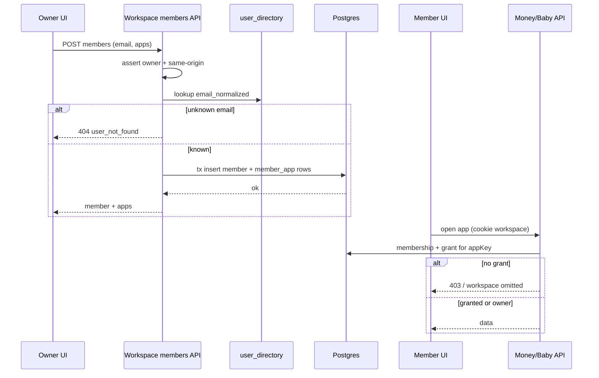

# Design: Per-member app grants on shared workspaces

**Mode:** full — from `00-run.md`  
**Has API:** yes  
**Has DB:** yes

## Decision 1: which design approach?

### Option 1 — Junction grants + user directory (recommended)

**What it is:**
Table `workspace_member_app` for per-member app rows; `user_directory` upserted on sign-in for email→sub lookup. Shared helper `assertWorkspaceAppAccess`. Settings members UI per `01b`.

**Example:**
`POST /api/workspace/members` `{ workspaceId, email, apps: ["money"] }` → insert member + grant rows; Baby list hides that workspace without `baby` grant.

**Pros:**
- Clear queries/indexes; additive apps later
- Email add matches Gate A day-to-day
- Owner role bypass stays simple

**Cons:**
- Two new tables + migration
- Only users who signed in once are addable by email

### Option 2 — JSON apps column + add-by-sub only

**What it is:**
`workspace_member.apps` jsonb/text[]; no directory; owner pastes OIDC `user_sub` to add.

**Example:**
`UPDATE workspace_member SET apps = '["money"]' …`; add body `{ workspaceId, userSub, apps }`.

**Pros:**
- Fewer tables; slightly faster ship
- No email storage

**Cons:**
- Poor UX (opaque ids); weaker Drizzle ergonomics
- Fails Gate A convenience for add-member

## Tradeoffs

| Factor | Option 1 | Option 2 |
|--------|----------|----------|
| Cost / time | M | S–M |
| Complexity | Medium | Lower schema, worse UX |
| Usability | High | Low (sub paste) |
| Failure cases | Unknown email clear error | Wrong sub silent fail risk |

## Recommendation

**Pick Option 1** because it matches Gate A (add by email + grants), keeps enforcement queryable, and fits workspace architecture without inventing a second tenancy model.

## Chosen design (user-approved)

**Option 1** — junction grants (`workspace_member_app`) + `user_directory` + Settings members UI. Gate B approved 2026-09-21.

## System design

### Overview

- **What it is:** Workspace membership stays one row per user; **app capability** is a separate allow-list checked at every app boundary (list, cookie resolve, Money/Baby APIs).
- **Components / boundaries:** Settings UI → `/api/workspace/members*` (owner) → Postgres; feature APIs call `assertWorkspaceAppAccess` (session/API token still via existing auth).
- **Data flow:** Owner adds member (email→directory→sub) + apps; member opens Money/Baby; list/active only return workspaces with grant (or owner/personal). See Contracts.
- **Consistency & failure:** Grant writes in one transaction with membership; missing grant ⇒ 403 / omit from list (fail closed). Cookie to ungranted WS ⇒ reject + fallback personal/first granted.
- **Why this shape:** Extends existing per-app cookies; rejects whole-workspace access and workspace-only app scope.
- **Best practices:** One assert helper; `SHAREABLE_WORKSPACE_APP_KEYS`; Zod + same-origin; no client-trusted workspace id without membership+grant.
- **Anti-patterns:** UI-only filters; checking membership without app; binding JS arrays as PG `::uuid[]`.
- **Reference:** `docs/ARCHITECTURE.md` workspace-scoped features.

### Concept 1 — App capability at the boundary

- **What it is:** Membership ≠ app access; grant (or owner) required per `WorkspaceAppKey`.
- **How we use it here:** Replace bare `assertWorkspaceMember` at Money/Baby/list/active with app-aware check.
- **Why we chose it:** Matches Decision 2 (per-member grants).
- **Best practices:** Pass app key from cookie/context; never default to “all apps”.
- **Reference:** `lib/workspace-context.ts`, `lib/api-auth.ts`.

## Sequence diagram



## Contracts

### API contracts

| Item | Detail |
|------|--------|
| Method + path | `GET /api/workspace/members?workspaceId=` |
| Auth / who | Session; caller must be **owner** of workspace |
| Request | query `workspaceId` uuid |
| Success | `{ data: [{ userSub, email?, role, apps: WorkspaceAppKey[] }] }` — owner row lists all shareable apps; **unbounded household list this pass** (no pagination) |
| Errors | `{ error: string, code: string }` — 401 `unauthorized`; 403 `forbidden`; 400 `bad_request` |
| Downstream | none |

| Item | Detail |
|------|--------|
| Method + path | `POST /api/workspace/members` |
| Auth / who | Session; **owner**; same-origin; rate-limit |
| Request | `{ workspaceId, email, apps: ("money"\|"baby")[] }` — apps min 1, only shareable |
| Success | `{ data: { userSub, email, role: "member", apps } }` |
| Errors | flat `{ error, code }` — 401; 403; 400; 404 `user_not_found`; **409 `conflict` if already member** (retry-safe) |
| Downstream | none |

| Item | Detail |
|------|--------|
| Method + path | `PATCH /api/workspace/members` |
| Auth / who | Session; **owner**; same-origin |
| Request | `{ workspaceId, userSub, apps: [...] }` min 1; cannot patch owner grants (owner always all) |
| Success | `{ data: { userSub, apps } }` |
| Errors | flat `{ error, code }` — 401; 403; 400; 404; 400 if target is owner |

| Item | Detail |
|------|--------|
| Method + path | `POST /api/workspace/members/remove` |
| Auth / who | Session; **owner**; same-origin |
| Request | `{ workspaceId, userSub }` — cannot remove last owner |
| Success | `{ data: { ok: true } }` |
| Errors | flat `{ error, code }` — 401; 403; 400; 404 |
| Note | Prefer POST remove over DELETE+body to match workspace route style; UI secondary “Remove” |

| Item | Detail |
|------|--------|
| Method + path | `GET /api/workspace/list?app=` (changed) |
| Auth / who | Session |
| Behavior | Return only personal + shared where role=owner **or** grant exists for `app` |
| Errors | unchanged |

| Item | Detail |
|------|--------|
| Method + path | `POST /api/workspace/active` (changed) |
| Auth / who | Session; same-origin; rate-limit (existing) |
| Behavior | After Zod parse, require `assertWorkspaceAppAccess(userSub, workspaceId, app)` — not bare membership |
| Errors | 403 if member lacks grant for `app` |

**Also change (behavior, not new routes):** `getActiveWorkspaceId`, `verifyMoneyWorkspaceAccess` (+ loans), Baby membership verify — require app grant.

**Events / other module APIs:** none.

### Database contracts

| Table / collection | Purpose | Key fields (name, type) | Indexes / uniques | Write owner | Read owners |
|--------------------|---------|-------------------------|-------------------|-------------|-------------|
| `workspace_member_app` | App grants per member | `workspace_id` uuid, `user_sub` text, `app_key` text | PK (workspace_id, user_sub, app_key); **composite FK (workspace_id, user_sub) → workspace_member ON DELETE CASCADE**; idx (user_sub, app_key); optional CHECK `app_key IN ('money','baby')` | members API | list/active/feature asserts |
| `user_directory` | Email → sub (**PII** — do not log raw email at info level) | `user_sub` text PK, `email_normalized` text not null, `updated_at` timestamptz | unique `email_normalized` | auth sign-in / bootstrap | members POST lookup |

**Data ownership notes:**
- Deleting membership cascades grant rows via composite FK.
- Shareable keys only: `money`, `baby` (Zod at edge + optional CHECK).
- Migration: for each shared `workspace_member` with role=member, insert money+baby; owners need no rows (bypass).

### Example queries

```sql
-- List workspaces visible for app=money
SELECT w.id, w.name, w.kind, wm.role
FROM workspace_member wm
JOIN workspace w ON w.id = wm.workspace_id
WHERE wm.user_sub = $1
  AND (
    wm.role = 'owner'
    OR w.kind = 'personal'
    OR EXISTS (
      SELECT 1 FROM workspace_member_app a
      WHERE a.workspace_id = wm.workspace_id
        AND a.user_sub = wm.user_sub
        AND a.app_key = $2
    )
  );
```

```sql
-- Add member + grants (transaction; bind each app as a scalar — no JS array ::text[])
INSERT INTO workspace_member (workspace_id, user_sub, role)
VALUES ($1, $2, 'member');
INSERT INTO workspace_member_app (workspace_id, user_sub, app_key) VALUES
  ($1, $2, 'money'),
  ($1, $2, 'baby');
-- Dynamic app list in app code: sql.join of scalar `${app}` binds, or multi-row insert — never ANY(${apps}::text[])
```

## Design patterns used

### Pattern 1 — Shared workspace assert helper

- **What it is:** One function owns “may this user use this workspace for this app?”
- **How we use it here:** `assertWorkspaceAppAccess` in `lib/workspace-context.ts`; Money/Baby/list call it.
- **Why we chose it:** Avoid duplicated grant SQL and missed paths.
- **Best practices:** Owner/personal short-circuit; shareable key validation; never trust body workspace id alone.
- **Anti-patterns:** Ad-hoc `assertWorkspaceMember` left on feature paths.
- **Reference:** existing `assertWorkspaceMember`.

### Pattern 2 — Settings section compound form

- **What it is:** Parent section owns load/save; rows are presentational.
- **How we use it here:** Extend `WorkspaceSettings` with members list + add form (`01b`).
- **Why we chose it:** Matches current Workspaces settings.
- **Best practices:** Skeleton parity; toast feedback; tokens only.
- **Anti-patterns:** New settings category for the same job.
- **Reference:** `components/workspace-settings.tsx`.

## UI / UX / mobile

- **UI concept (01b):** members list + grant chips + Add member — no conflicting layout
- **80/20:** #1 grants per member; #2 Add member; secondary remove
- **Layout / hierarchy:** Workspaces → shared WS → members → add
- **Loading / empty / error / success:** skeleton list; empty = owner only + add; Alert/toast errors; success toast
- **Skeleton parity:** update settings loading skeletal members block if added
- **Mobile:** stacked chips `auto-fit`; ≥44px primary button; no hover-only
- **Accessibility:** checkbox labels; field labels; focus order add form
- **Day-to-day:** partner Money+Baby vs accountant Money-only on one WS

## Security design review (OWASP)

Trust boundaries: session cookie; owner-only member mutations; grant check on every app data path.

Abuse cases: member elevates own apps; non-owner lists members; add unknown email enumeration (generic 404); CSRF cross-origin POST.

| OWASP | Status | Note |
|-------|--------|------|
| A01 Broken Access Control | pass | owner + grant checks |
| A02 Cryptographic Failures | N/A | no new secrets |
| A03 Injection | pass | Zod + Drizzle binds |
| A04 Insecure Design | pass | fail closed on missing grant |
| A05 Security Misconfiguration | pass | same-origin on POST |
| A06 Vulnerable Components | N/A | no new deps planned |
| A07 Auth Failures | pass | session required |
| A08 Software / Data Integrity | pass | tx membership+grants |
| A09 Logging / Monitoring Failures | pass | no email in verbose logs; rate-limit add |
| A10 SSRF | N/A | |

Source: https://owasp.org/Top10/

## Challenges answered

- **Do we need this?** Yes — whole-workspace share is the wrong default for multi-app shell.
- **What fails?** Without enforcement, Baby/Money leak across intent.
- **Is this overspecified?** Directory is the minimum for email add; pending invites deferred.
