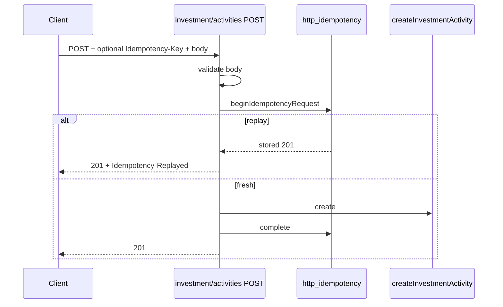

# Design: trust-api-perf-suggest

**Mode:** full · **Has UI:** no · **Has API:** no · **Has DB:** no (this run = suggestions only)  
**Stop:** after Design (Decision 1 Option 3) — no design-review / Build / Gate B/C  
**Lens:** trust / API / perf (Decision 2 Option 3)

## Decision 1: How to package the suggestions

### Option 1 — Ranked backlog + ready future-ship sketch for #1 (recommended)

- **What it is:** Publish ~5–8 ranked items. Fully sketch System design + stub tasks for recommended #1 so a follow-up simple/full run can start at Analyze/Design quickly.
- **Example:** #1 = Idempotency on investment activities POST with contract notes + test bullets.
- **Pros:** Fastest path from “suggest” to next ship run; recommendation clear.
- **Cons:** Slight extra Design work for an item not built here.

### Option 2 — Backlog table only; no #1 sketch

- **What it is:** Ranks + sources + size only; next run rediscovers the slice.
- **Example:** Table rows without sequence/contract detail.
- **Pros:** Shorter Design.
- **Cons:** Extra rediscovery cost when someone picks #1.

### Recommendation

**Pick Option 1** — user-first: maintainer can open a focused ship run tomorrow without re-grilling #1.

## Ranked backlog (vital few)

Score: trust first · API consistency · perf reliability · S/M only on pick line · demote infra L.

| # | Item | Size | Protects (job) | Why now | Primary source |
|---|------|------|----------------|---------|----------------|
| **1** | **Safe retry: Idempotency-Key on `POST /api/investment/activities`** (+ UI/Bearer clients that create) | S–M | Investor journal create without double rows on flaky retry | Hot write in `API.md`; no `beginIdempotencyRequest` today | `app/api/investment/activities/route.ts`, `ARCHITECTURE.md` Idempotency |
| **2** | **Cron: prune `security_rate_limit` + expired `money_import_preview`** | S | Stable rate limits / disk; stale preview cleanup | Documented SQL; no cron route found | `PERFORMANCE.md` housekeeping |
| **3** | **Non-RLS ownership regression tests** (`api_token`, workspace writers, `http_idempotency` actor) | S | Cross-user leak resistance | ARCHITECTURE lists Non-RLS; tests lock filters | `ARCHITECTURE.md`, `lib/api-token-service.ts` |
| **4** | **Baby `quick_care_request` TTL prune** | S–M | Watch idempotency store at scale | Table + `created_at` index; no prune job | `db/schema/baby.ts`, `BABY_API.md` |
| **5** | **Kiosk first-load measure + slim if regressed** | S | Fast household glance | PERFORMANCE still “measure after change” | `PERFORMANCE.md` |
| **6** | **Extend Idempotency to other hot REST** (workspace reset, members remove — after #1) | M | Admin/destructive safe retry | Residual mutators | `app/api/workspace/**` |
| — | Full pagination dialect unify | L | API clients | **Below pick** until S-scoped approved task | `ARCHITECTURE.md` |
| — | Redis response cache / PgBouncer / edge HTML | L | Multi-pod scale | **Out of pick** | `PERFORMANCE.md` Out of scope |
| — | Money `[kind]` / commit / members Idempotency | — | — | **Already shipped** (prior run; ARCHITECTURE table) | — |

## Ship criteria (for a *future* run of any item)

1. One clear user/trust job.  
2. Size S or M (reject L unless re-scoped).  
3. Reuse existing patterns (`http-idempotency`, cron `CRON_SECRET`, RLS helpers).  
4. Honest Has UI / Has API / Has DB.  
5. Failing tests first; one PR.

## Chosen design (future #1 sketch — not built here)

**Safe retry: investment activities POST**

1. Server: `readJsonBoundedWithRaw` → validate create schema → `beginIdempotencyRequest` with `actor.route = POST /api/investment/activities` → create → complete/abort.  
2. Optional `Idempotency-Key` ≤128; absent unchanged (unsafe retry).  
3. Client: `newIdempotencyHeaders` / mint helper on web create path; Bearer automation docs note optional header.  
4. Tests: absent key works; same key+body → replay + `Idempotency-Replayed`; mismatch → 409; length >128 → 400.  
5. Update `ARCHITECTURE.md` Idempotency routes table + `API.md` notes.

**Non-goals for #1:** GraphQL Money mutations; pagination unify; Baby prune; workspace reset.

## System design

### Overview

- **What it is (this run):** Ranked debt backlog + sketch for future #1.
- **What it is (future #1):** Optional Idempotency-Key on investment activity create.
- **Boundaries:** Browser/Bearer → REST route → `lib/http-idempotency` → investment activity service / RLS.
- **Data flow:** Mint key → POST → claim/replay/409 → one durable create.
- **Consistency:** Same 24h TTL / body hash as other Idempotency routes.
- **Why this shape:** Reuse hardened library; fill the hottest remaining REST gap after import/members.
- **Best practices:** Validate before claim; redacted replay; do not log bodies.
- **Anti-patterns:** New idempotency stack; forcing keys on GraphQL in the same PR.
- **Reference:** `docs/ARCHITECTURE.md`, `lib/http-idempotency.ts`, investment commit route.

### Concept 1 — Additive optional header

- **What:** Same contract as Money/Investment import commit.
- **How:** `beginIdempotencyRequest` after Zod success.
- **Why:** No breaking change for existing clients.
- **Best practices:** One key per user gesture.
- **Reference:** `ARCHITECTURE.md` Idempotency-Key table.

## Design patterns used

### Pattern 1 — Opt-in Idempotency middleware helper

- **Problem:** Retries double-apply creates.
- **Solution:** Shared claim/complete/abort around the domain write.
- **Why here:** Already production-proven on import/members.
- **Do:** Match route id strings; validate before claim.
- **Don’t:** Import db helpers into client bundles.
- **Reference:** `lib/http-idempotency.ts`, `lib/idempotency-client.ts`.

### Pattern 2 — Cron + CRON_SECRET (for backlog #2)

- **Problem:** Housekeeping SQL never runs.
- **Solution:** `POST /api/cron/…` with Bearer secret (existing pattern).
- **Why here:** Matches recurrence / loan-reminders.
- **Do:** Batch deletes; fail closed without secret.
- **Don’t:** Expose without auth.
- **Reference:** `app/api/cron/*`, `PERFORMANCE.md`.

## Sequence diagram (future #1)

## API contracts (future #1 — additive)

| Item | Contract |
|------|----------|
| Route | `POST /api/investment/activities` |
| Header | Optional `Idempotency-Key` ≤128 |
| Absent | Current behavior (unsafe retry) |
| Replay | Prior success JSON + `Idempotency-Replayed: true` |
| Conflict | `409` `idempotency_in_progress` / `idempotency_body_mismatch` |

## Database contracts

N/A for this suggest run. Future #1 uses existing `http_idempotency` (no schema change). Future #2/#4 may add cron-only deletes (no new tables).

## Example queries

N/A this run. Future #2 uses SQL from `PERFORMANCE.md` housekeeping section.

## UI / UX / OWASP (this run)

- **UI:** N/A  
- **OWASP (future #1):** Broken access control N/A (existing investment context); Injection via validated JSON; Security misconfig — keep optional header additive; Logging — no response_body logs.

## Risks

| Risk | Mitigation |
|------|------------|
| Picking L infra as “next” | Below pick line |
| Re-doing shipped Idempotency | Explicit “already shipped” row |
| Casual pagination rename | Demoted + ARCHITECTURE hard constraint |
