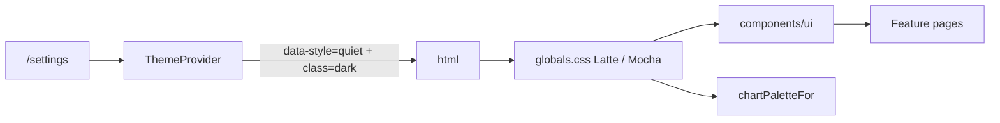

# Design guide — Quiet Ink (minimal & functional)

Every new screen, component, and feature must follow this guide. The shell, primitives, tokens, and motion utilities here are the **only** sanctioned way to build UI.

The non-negotiables:

1. Consume **semantic CSS tokens**; never hard-code colors, fonts, radii, or shadows.
2. Compose from [`components/ui/*`](../components/ui/) primitives; do not reinvent buttons, inputs, modals, popovers, etc.
3. Microinteractions are **CSS-only** (Tailwind transitions, `@starting-style`, View Transitions API, `:has()`, scroll-driven animations) and respect `prefers-reduced-motion`.
4. Layout uses modern CSS (`grid-template-columns: repeat(auto-fit, minmax(...))`, container queries, `clamp()`); no hardcoded breakpoints for content.
5. Charts use **visx** and read colors via [`colorByIndex(resolved, i, style)`](../lib/theme-chart-palette.ts) so they recolor when the user switches light/dark mode.
6. Apply the **interface-polish principles** and **Quiet Ink minimal rules** below by default.

If a need is not covered here, propose an extension to this doc + a primitive — do **not** ship a one-off.

## Quiet Ink minimal rules

Distilled from modern minimal / clean UI practice. Clarity beats decoration.

| Rule | Practice in this app |
|------|----------------------|
| **Whitespace as hierarchy** | Use `.shell-main` padding and section gaps; do not pack chrome. Dense tables stay tight; page chrome breathes. |
| **One type family** | IBM Plex Sans for UI + headings (weight hierarchy). IBM Plex Mono for code/mono. Never add a third family. |
| **Three color roles** | Neutrals (background/surface/muted) + one Catppuccin blue **accent** + **destructive**. No rainbow chrome. |
| **One primary action per view** | Prefer a single `Button` `primary` per screen region; secondary/ghost for the rest. |
| **Alignment & consistency** | Same padding, radius, and component styles everywhere; no one-off card treatments. |
| **Simple navigation** | Shell nav from [`registry.ts`](../lib/features/registry.ts) only; do not stuff menus. |
| **Subtle motion only** | `fx-*` utilities — feedback without clutter. |
| **Never hide essentials** | Minimal ≠ incomplete. Keep required actions visible and labeled. |
| **Progressive disclosure** | Primary chrome only: one primary CTA + essential filters (e.g. Direction, Accounts, Categories, Apply). Secondary filters/actions and help copy live behind [`MoreMenu`](../components/ui/more-menu.tsx) or an About disclosure. Never hide Workspace, View, Apply, or the primary CTA. |

Avoid: purple gradients, cream+terracotta marketing looks, broadsheet density, glow, decorative `rounded-full` pill clusters, Inter/system-only stacks.

## Style architecture

Fixed **Quiet Ink** structure with **Catppuccin** appearance palettes ([style guide](https://github.com/catppuccin/catppuccin/blob/main/docs/style-guide.md)):

| Axis    | Where it lives                                           | Values |
|---------|-----------------------------------------------------------|--------|
| `style` | `<html data-style="quiet">` (set by [`ThemeProvider`](../components/theme-provider.tsx)) | `quiet` only |
| `mode`  | `<html class="dark">` toggled by `ThemeProvider`         | light (**Latte**) or dark (**Mocha**) |

The user picks appearance in **`/settings`** ([`ThemeSettings`](../components/theme-settings.tsx)). Token sets live in [`app/globals.css`](../app/globals.css) under `:root[data-style="quiet"]` and `.dark`. FOUC is prevented by a pre-paint script in [`app/layout.tsx`](../app/layout.tsx).



### Identity tokens (reference)

| Role | Latte (light) | Mocha (dark) |
|------|---------------|--------------|
| Background | `#eff1f5` (base) | `#1e1e2e` (base) |
| Surface | `#e6e9ef` (mantle) | `#313244` (surface0) |
| Foreground | `#4c4f69` (text) | `#cdd6f4` (text) |
| Accent (blue) | `#1e66f5` | `#89b4fa` |
| Radius | `--radius` `0.75rem` / `--radius-inner` `0.4375rem` | same |

## Tokens you must use

Defined in [`app/globals.css`](../app/globals.css). Available as Tailwind utilities via `@theme inline`.

### Color
- Surface stack: `bg-background`, `bg-surface`, `bg-muted-surface`
- Text: `text-foreground`, `text-muted`
- Borders: `border-border`
- Brand: `bg-accent`, `text-accent`, `text-accent-foreground`, focus ring `--ring`
- Status: `--destructive` and `--alert-error-*` / `--alert-warning-*` (used by [`Alert`](../components/ui/alert.tsx)) and `--toast-*` (used by [`NotificationProvider`](../components/notification-provider.tsx))

### Type
- Body: `font-sans` → `--font-body` (IBM Plex Sans)
- Headings/branding: `font-display` → `--font-heading` (IBM Plex Sans, heavier weight via utility)
- Mono: `font-mono` → IBM Plex Mono

Do not hard-code font stacks. Body sets `font-variant-numeric: tabular-nums` globally.

### Shape & elevation

| Token | Tailwind class | Use it on |
|-------|----------------|-----------|
| `--radius` (alias `--radius-md`) | `rounded-[var(--radius-md)]` | Outer surfaces — Cards, Modals, Popovers, Inputs, Buttons, primary panels. |
| `--radius-inner` (alias `--radius-sm`) | `rounded-[var(--radius-sm)]` | Nested chips, badges, segmented items, list rows, checkbox indicators, inline `<code>`. |

If inner padding around a child exceeds 24px, treat it as its own surface.

> **Never** use Tailwind's `rounded-md`, `rounded-lg`, `rounded-2xl`, or `rounded-[calc(var(--radius-md)-2px)]`. Use `--radius-sm` for nested.

Shadows: `shadow-[var(--shadow-sm)]` and `shadow-[var(--shadow-md)]`. Never `shadow-md`/`shadow-lg`. Prefer soft shadow + 1px `border-border` over thick borders for elevation.

### Status colors
- **Positive / desirable:** `text-accent` / `bg-accent` (Catppuccin blue — not a separate green on chrome).
- **Negative / undesirable:** `text-destructive` / `bg-destructive`.
- **Flat / neutral:** `text-muted`.
- Toast success green and chart series greens are **not** brand chrome — do not use them for nav, buttons, or page accents.
- Do **not** hand-pick `text-emerald-*` / `text-rose-*`.

### Charts
```tsx
const { resolved, style } = useTheme();
<rect fill={colorByIndex(resolved, i, style)} />
```
Never hard-code chart hexes; never read only `resolved`.

### Spacing
- `--space-step: 0.5rem` is the density unit.
- Macro whitespace: `.shell-main` uses generous `clamp` padding — do not override with zero padding on page roots.
- Micro whitespace: form/table internals may stay compact.

## Primitives — pick from these first

| Primitive | File | Use it for |
|-----------|------|-----------|
| `Button` | [`components/ui/button.tsx`](../components/ui/button.tsx) | Any button (`primary`/`secondary`/`ghost`/`danger`, `sm`/`md`/`lg`). Built-in `fx-press`. Pass `leading`/`trailing`; `iconOnly` for 40×40 via `fx-hit-40`. |
| `Field` + `Input` / `Textarea` / `Select` | [`field.tsx`](../components/ui/field.tsx), [`input.tsx`](../components/ui/input.tsx), [`textarea.tsx`](../components/ui/textarea.tsx), [`select.tsx`](../components/ui/select.tsx) | Labeled fields with focus underline. |
| `MultiSelect` | [`multi-select.tsx`](../components/ui/multi-select.tsx) | Chip trigger + checkbox popover. |
| `Card` | [`card.tsx`](../components/ui/card.tsx) | Surface container; `interactive` for hover lift. Nested children → `--radius-sm`. |
| `Modal` | [`modal.tsx`](../components/ui/modal.tsx) | Native `<dialog>` + `fx-overlay`. |
| `Popover` | [`popover.tsx`](../components/ui/popover.tsx) | Anchored panel with entry/exit. |
| `MoreMenu` | [`more-menu.tsx`](../components/ui/more-menu.tsx) | Secondary actions / overflow (ellipsis + optional dirty dot). Use `MoreMenuItem` for rows; `variant="danger"` for destructive. |
| `AboutDisclosure` | [`about-disclosure.tsx`](../components/ui/about-disclosure.tsx) | Collapsed-by-default help copy under titles (“About”). |
| `Tabs` | [`tabs.tsx`](../components/ui/tabs.tsx) | Radio tablist with `:has()` underline. |
| `Badge` / `Tag` | [`badge.tsx`](../components/ui/badge.tsx), [`tag.tsx`](../components/ui/tag.tsx) | Inline status chips. |
| `IconSwap` | [`icon-swap.tsx`](../components/ui/icon-swap.tsx) | Stateful icon cross-fade. |
| `Skeleton` | [`skeleton.tsx`](../components/ui/skeleton.tsx) | Loading (`fx-shimmer`). |
| `Alert` | [`alert.tsx`](../components/ui/alert.tsx) | Inline error/warning. |
| Notifications | `useNotify()` | Toasts. |

If you need a new primitive, add it under [`components/ui/`](../components/ui/), document it here, and migrate at least one usage in the same PR.

## Microinteraction utilities

All in [`app/globals.css`](../app/globals.css) `@layer utilities`. Do not author bespoke keyframes.

| Class | Effect |
|-------|--------|
| `fx-press` | `scale(0.98)` on `:active` |
| `fx-fade-in` | Entry via `@starting-style` |
| `fx-stagger-children` | Staggered entry (cap 6) |
| `fx-overlay` | Dialog enter/exit |
| `fx-icon-swap` | Icon cross-fade |
| `fx-hit-40` | ≥40×40 hit target |
| `fx-shimmer` | Skeleton shimmer |
| `fx-field` + `fx-field-underline` | Focus underline |
| `fx-vt-shell-nav-active` | Shell nav view transition |
| `fx-vt-money-tab-active` | Money tab view transition |
| `toast-progress-bar` | Toast countdown |

```ts
import { withViewTransition } from "@/lib/microinteractions";
withViewTransition(() => setTheme("dark"));
```

## Interface-polish principles (applied by default)

| # | Principle | Where it lives |
|---|-----------|----------------|
| 1 | **Concentric radius** | `--radius-md` outer / `--radius-sm` inner |
| 2 | **Optical alignment** | `Button` icon padding |
| 3 | **Shadows over borders** for elevation | `--shadow-sm` / `--shadow-md` |
| 4 | **Interruptible animations** | CSS transitions on interactive state |
| 5 | **Split & stagger** | `fx-stagger-children` (sparingly) |
| 6 | **Subtle exits** | Modal / Popover ~−8px + fade |
| 7 | **Contextual icon swaps** | `IconSwap` |
| 8 | **Font smoothing** | `<html>` antialiased |
| 9 | **Tabular numbers** | `body` global |
| 10 | **Text wrapping** | `balance` on h1–h3; `pretty` on body copy |
| 11 | **Image outlines** | pure black/white 10% — never tinted |
| 12 | **Scale on press** | `fx-press` |
| 13 | **Skip animation on first paint** | `@starting-style` |
| 14 | **No `transition: all`** | list properties |
| 15 | **`will-change` sparingly** | only when stutter observed |
| 16 | **Minimum 40×40 hit area** | `iconOnly` / `fx-hit-40` |

## Layout rules

- **Container**: `.shell-main` for top-level page padding/max width.
- **Multi-column**: `repeat(auto-fit, minmax(min(100%, 22rem), 1fr))` (`.auto-fit-2`). Breakpoint utilities only for shell chrome.
- **Container queries**: `cqi` / `container-type` for component-level layout.
- **Density**: `--space-step`; Quiet Ink radii/type carry the look.

## Shell & navigation

- Source of truth: [`lib/features/registry.ts`](../lib/features/registry.ts).
- Active item: `fx-vt-shell-nav-active`.
- Mobile: fixed Menu → [`Popover`](../components/ui/popover.tsx); desktop: icon rail in [`app-shell.tsx`](../components/app-shell.tsx).
- Route changes: `<main key={pathname}>` + `fx-fade-in`.

## Accessibility & motion

- `aria-label` / `aria-labelledby` on icon-only controls, modals, popovers.
- Focus: `focus-visible:outline focus-visible:ring-2 focus-visible:ring-ring focus-visible:ring-offset-2 focus-visible:ring-offset-background`.
- All `fx-*` and View Transitions respect `prefers-reduced-motion: reduce`.

## Forms

- `Field` + matching primitive for every input.
- Required: `required` on `Field`.
- Radio-cards: `peer sr-only` + `peer-checked:border-foreground peer-checked:ring-1`; outer `--radius-md`, nested `--radius-sm`.
- Segmented controls: `role="radiogroup"`, outer rounded + `--radius-sm` inner, `fx-press`, `transition-[background-color,color,box-shadow]`.

## Charts (visx)

- General visualizations: visx.
- Price charts only: TradingView Lightweight Charts (when installed).
- Always `useTheme()` + `style` into `colorByIndex`.
- Empty: [`AnalyticsEmptyState`](../components/analytics-empty-state.tsx) or `Skeleton`.

## What is forbidden

- Hard-coded colors, font families, radii, or shadows in JSX/CSS (except token source files).
- Framer Motion / Motion-One / other JS animation libs.
- Manual portals for dialogs — use `Modal`.
- Per-style component branching — express differences via tokens.
- Hardcoded breakpoints when `auto-fit` / container queries work.
- `transition` shorthand or `transition-property: all`.
- Tinted image outlines; icon visibility toggles; hit areas &lt; 40×40 without `fx-hit-40`.
- Decorative `rounded-full` pill clusters (true circular controls OK).

## When changing the design system itself

1. Add tokens to **both** light and dark blocks in [`app/globals.css`](../app/globals.css) (`--radius` and `--radius-inner` both required).
2. Update [`lib/theme-chart-palette.ts`](../lib/theme-chart-palette.ts) if chart colors change.
3. Update this doc + [`SPEC.md`](SPEC.md) if success criteria change.

## Quick checklist for any UI change

- [ ] Uses tokens, no raw hex/font/radius/shadow.
- [ ] Composes from [`components/ui/*`](../components/ui/).
- [ ] Microinteractions via `fx-*` or `withViewTransition`.
- [ ] Respects `prefers-reduced-motion`.
- [ ] Layout uses `auto-fit`/container queries.
- [ ] Charts use `colorByIndex(resolved, i, style)`.
- [ ] Concentric radii (`--radius-md` / `--radius-sm`).
- [ ] Icon-only: `iconOnly` or `fx-hit-40`; swaps via `IconSwap`.
- [ ] Explicit `transition-*` properties.
- [ ] Verified light and dark via `/settings`.
- [ ] `npm run lint` and `npm run build` pass.
