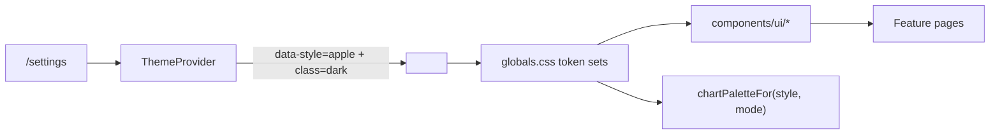

# Design guide — Minimalist & Functional with microinteractions

Every new screen, component, and feature must follow this guide. The shell, primitives, tokens, and motion utilities here are the **only** sanctioned way to build UI.

The non-negotiables:

1. Consume **semantic CSS tokens**; never hard-code colors, fonts, radii, or shadows.
2. Compose from [`components/ui/*`](../components/ui/) primitives; do not reinvent buttons, inputs, modals, popovers, etc.
3. Microinteractions are **CSS-only** (Tailwind transitions, `@starting-style`, View Transitions API, `:has()`, scroll-driven animations) and respect `prefers-reduced-motion`.
4. Layout uses modern CSS (`grid-template-columns: repeat(auto-fit, minmax(...))`, container queries, `clamp()`); no hardcoded breakpoints for content.
5. Charts use **visx** and read colors via [`colorByIndex(resolved, i, style)`](../lib/theme-chart-palette.ts) so they recolor when the user switches light/dark mode.
6. Apply the **interface-polish principles** below by default. They turn token-correct UI into an interface that feels right.

If a need is not covered here, propose an extension to this doc + a primitive — do **not** ship a one-off.

## Style architecture

The app uses a fixed **Apple/iOS** structural preset (typography, radius, shadows) with two color palettes keyed on appearance mode:

| Axis    | Where it lives                                           | Values                              |
|---------|-----------------------------------------------------------|-------------------------------------|
| `style` | `<html data-style="apple">` (always set by [`ThemeProvider`](../components/theme-provider.tsx)) | `apple` only |
| `mode`  | `<html class="dark">` toggled by `ThemeProvider`         | light (GitHub-inspired) or dark (Nord) |

The user picks appearance in **`/settings`** ([`ThemeSettings`](../components/theme-settings.tsx)). Light and dark token sets are keyed on `:root[data-style="apple"]` and `:root[data-style="apple"].dark` in [`app/globals.css`](../app/globals.css). FOUC is prevented by a pre-paint script in [`app/layout.tsx`](../app/layout.tsx).



## Tokens you must use

Defined in [`app/globals.css`](../app/globals.css). All available as Tailwind utilities via the `@theme inline` block.

### Color
- Surface stack: `bg-background`, `bg-surface`, `bg-muted-surface`
- Text: `text-foreground`, `text-muted`
- Borders: `border-border`
- Brand: `bg-accent`, `text-accent`, `text-accent-foreground`, focus ring `--ring`
- Status: `--destructive` and `--alert-error-*` / `--alert-warning-*` (used by [`Alert`](../components/ui/alert.tsx)) and `--toast-*` (used by [`NotificationProvider`](../components/notification-provider.tsx))

### Type
- Body: `font-sans` (resolves to `--font-body`)
- Headings/branding: add `font-display` (resolves to `--font-heading`)
- Mono: `font-mono`

> Apple preset uses the SF/system font stack for headings via `font-display`. Use `font-display` on titles — do not hard-code font stacks.

Body sets `font-variant-numeric: tabular-nums` globally so dynamic counters, prices, and timers never cause layout shift. You don't need to add `tabular-nums` per usage.

### Shape & elevation

Two radius tokens drive **concentric border-radius** (skill rule: outer = inner + padding). Mismatched nested radii are the most common reason interfaces feel off.

| Token | Tailwind class | Use it on |
|-------|----------------|-----------|
| `--radius` (alias `--radius-md`) | `rounded-[var(--radius-md)]` | Outer surfaces — Cards, Modals, Popovers, Inputs, Buttons, primary panels. |
| `--radius-inner` (alias `--radius-sm`) | `rounded-[var(--radius-sm)]` | Anything nested inside a token-radius parent: chips, badges, segmented-control items, list rows, checkbox indicators, inline `<code>`. |

If the inner padding around a child exceeds 24px, treat it as its own surface and pick a radius independently — concentric math only matters when surfaces sit close.

> **Never** use Tailwind's `rounded-md`, `rounded-lg`, `rounded-2xl`, or `rounded-[calc(var(--radius-md)-2px)]`. The `calc()` form is now redundant — use `--radius-sm`.

Shadows: `shadow-[var(--shadow-sm)]` and `shadow-[var(--shadow-md)]`. Never `shadow-md`/`shadow-lg`. Apple uses layered soft shadows for elevation.

Do **not** add a hard `border-2` for elevation; rely on `shadow-[var(--shadow-sm)]` plus a 1px `border-border` for boundaries when needed.

### Status colors
- **Positive / desirable change** (positive net flow, lower spending vs prior month, success metric increasing): `text-accent` / `bg-accent`.
- **Negative / undesirable change** (overspend, budget exceeded, drop in income): `text-destructive` / `bg-destructive` (or `--destructive-*` derivatives for muted backgrounds).
- **Flat / neutral**: `text-muted`.
- Do **not** introduce a new green token; reuse `--accent`. Do **not** hand-pick `text-emerald-*`/`text-rose-*` — those break token-driven theming.

### Charts
Chart palettes in [`lib/theme-chart-palette.ts`](../lib/theme-chart-palette.ts). Always:

```tsx
const { resolved, style } = useTheme();
<rect fill={colorByIndex(resolved, i, style)} />
```

Never hard-code chart hexes; never read only `resolved`.

## Primitives — pick from these first

| Primitive | File | Use it for |
|-----------|------|-----------|
| `Button` | [`components/ui/button.tsx`](../components/ui/button.tsx) | Any button (`primary`/`secondary`/`ghost`/`danger`, `sm`/`md`/`lg`). Has built-in `fx-press`. Pass `leading`/`trailing` icons — Button auto-applies optical asymmetric padding (icon-side −2px). For pure-icon buttons pass `iconOnly` to enable a 40×40 hit target via `fx-hit-40`. |
| `Field` + `Input` / `Textarea` / `Select` | [`components/ui/field.tsx`](../components/ui/field.tsx), [`input.tsx`](../components/ui/input.tsx), [`textarea.tsx`](../components/ui/textarea.tsx), [`select.tsx`](../components/ui/select.tsx) | Labeled form fields with focus underline. |
| `MultiSelect` | [`components/ui/multi-select.tsx`](../components/ui/multi-select.tsx) | Chip trigger + checkbox popover for selecting many of a list. Pass `items` (flat) or `groups`. Searchable by default. |
| `Card` | [`components/ui/card.tsx`](../components/ui/card.tsx) | Surface container; pass `interactive` for hover lift. Inner rounded children must use `rounded-[var(--radius-sm)]`. |
| `Modal` | [`components/ui/modal.tsx`](../components/ui/modal.tsx) | Native `<dialog>` + portal + `fx-overlay` (entry **and** exit animation via `transition-behavior: allow-discrete`). Replaces ad-hoc overlays. |
| `Popover` | [`components/ui/popover.tsx`](../components/ui/popover.tsx) | Anchored panel with entry + subtle exit fade. Stays mounted (with `inert` when closed) so the closing transition can play. |
| `Tabs` | [`components/ui/tabs.tsx`](../components/ui/tabs.tsx) | Radio-input tablist with `:has()` underline. |
| `Badge` / `Tag` | [`components/ui/badge.tsx`](../components/ui/badge.tsx), [`tag.tsx`](../components/ui/tag.tsx) | Inline status chips. Use `--radius-sm` (already wired). |
| `IconSwap` | [`components/ui/icon-swap.tsx`](../components/ui/icon-swap.tsx) | Cross-fade between two icons (play/pause, like/liked, copy/check, expand/collapse). Both icons stay mounted; layout never shifts. CSS-only via `fx-icon-swap`. |
| `Skeleton` | [`components/ui/skeleton.tsx`](../components/ui/skeleton.tsx) | Loading placeholders (uses `fx-shimmer`). |
| `Alert` | [`components/ui/alert.tsx`](../components/ui/alert.tsx) | Inline error/warning. |
| Notifications | `useNotify()` from [`components/notification-provider.tsx`](../components/notification-provider.tsx) | Toasts. |

If you need a new primitive, add it under [`components/ui/`](../components/ui/), document it here, and migrate at least one usage in the same PR.

## Microinteraction utilities

All defined in [`app/globals.css`](../app/globals.css) under `@layer utilities`. Use these classes — do not author bespoke keyframes or transitions.

| Class | Effect |
|-------|--------|
| `fx-press` | Subtle `scale(0.98)` on `:active`. CSS transition (interruptible — releasing mid-press smoothly retargets). Skip with `disabled`. |
| `fx-fade-in` | Single-element entry via `@starting-style`. Pair with React `key={id}` for list/route changes. |
| `fx-stagger-children` | Splits a container's direct children into ~80ms-staggered fade+rise+blur entries (capped at 6). Use on hero sections, empty states, modal content — anywhere the user benefits from "split and stagger" rather than a single-element fade. |
| `fx-overlay` | `<dialog>`-aware entry + exit via `transition-behavior: allow-discrete`. Replaces `fx-fade-in` on `Modal`. Closing transitions play before `display: none` flips. |
| `fx-icon-swap` | Wrapper for cross-fade icon transitions. Toggle `data-active="true"|"false"` on the two child spans. The `IconSwap` primitive composes this for you. |
| `fx-hit-40` | Extends a control's hit target to ≥ 40×40 via a non-visual `::after` pseudo-element. Use on icon-only controls smaller than 40px (toast close, inline chip removers). Never let two `fx-hit-40` boxes overlap. |
| `fx-shimmer` | Token-aware loading shimmer for skeletons. |
| `fx-field` + `fx-field-underline` | Animated underline on focus (via `:has()`). |
| `fx-vt-shell-nav-active` | `view-transition-name` for shell active nav. |
| `fx-vt-money-tab-active` | `view-transition-name` for the active link in `MoneySectionTabs`. |
| `toast-progress-bar` | Per-toast countdown bar (uses `--toast-ms`). |

For appearance changes and modal transitions, wrap state changes with [`withViewTransition`](../lib/microinteractions.ts):

```ts
import { withViewTransition } from "@/lib/microinteractions";
withViewTransition(() => setTheme("dark"));
```

`withViewTransition` is a no-op when the API or motion preference is unavailable, so it's always safe to call. Pair JS-driven motion with `prefersReducedMotion()` if you need an early bail-out.

## Interface-polish principles (applied by default)

These principles come from the [make-interfaces-feel-better](https://github.com/jakubkrehel/make-interfaces-feel-better) skill and have been baked into our tokens, primitives, and global styles. When they're already free, just use the primitive. When they're per-feature decisions, the table tells you what to do.

| # | Principle | Where it lives in this codebase |
|---|-----------|---------------------------------|
| 1 | **Concentric radius** — outer = inner + padding. | `--radius-md` outer / `--radius-sm` inner. Never use Tailwind's preset radius classes; `--radius-sm` already encodes the right child radius. |
| 2 | **Optical alignment** — icon-side padding ≈ text-side − 2px. | `Button` auto-derives padding from `leading`/`trailing`/`iconOnly`. For non-Button anchors, mirror the rule manually (e.g. `pl-3 pr-3.5`). For asymmetric icons (play triangles, stars) adjust in the SVG itself. |
| 3 | **Shadows over borders** for elevation. | `--shadow-sm`/`--shadow-md` are already tuned. Don't reach for `shadow-md` or stack a thicker `border-2`. Borders are still correct for **dividers** (`border-b`, table separators). |
| 4 | **Interruptible animations** — CSS transitions (not keyframes) for interactive state. | `fx-press`, hover/focus styles, `Popover` open/close all use transitions. Reserve keyframes for one-shot stagger entries (`fx-stagger-children`) and the toast progress bar. |
| 5 | **Split & stagger** entrance animations. | Use `fx-stagger-children` on the parent of a hero, empty state, modal body, or any sequence of 2-6 entering items. Don't over-use — staggering a long list is noise. |
| 6 | **Subtle exits** — small fixed translate + fade. | `Modal` (`fx-overlay`) and `Popover` exits ship with `~ -8px` translate + fade out. Don't add full-distance exits unless spatial context is essential. |
| 7 | **Contextual icon swaps** — scale `0.25 → 1`, opacity `0 → 1`, blur `4px → 0px`. | Use the `IconSwap` primitive. Never toggle visibility (`hidden`) for stateful icons. |
| 8 | **Font smoothing** on macOS. | Applied at `<html>` (and `<body>`) via `-webkit-font-smoothing: antialiased`. Don't repeat per element. |
| 9 | **Tabular numbers** for dynamic numerics. | Set globally on `body` (`font-variant-numeric: tabular-nums`). No per-component flag needed. |
| 10 | **Text wrapping** — `balance` on titles, `pretty` on body. | Applied globally on `h1, h2, h3` (balance) and `p, li, figcaption, blockquote, dt, dd` (pretty). Don't wrap a heading manually with `text-wrap-balance` — it's already there. |
| 11 | **Image outlines** — pure-black/10 in light, pure-white/10 in dark. | Applied globally on `img` with `outline-offset: -1px`. Never tint to slate-/zinc-/neutral-; tinted outlines look like dirt. The rule does not affect inline `<svg>` icons. |
| 12 | **Scale on press** — `scale(0.98)` (skill: ≥ 0.95). | `fx-press` on every Button, Card link, segmented-control item, chip. No JS. Disabled by default on `:disabled`. |
| 13 | **Skip animation on first paint** of default-state elements. | `@starting-style` only fires on insertion, so default-state elements naturally don't replay on hydration. View transitions are gated by `prefers-reduced-motion: reduce` in `globals.css`. |
| 14 | **No `transition: all`** — list specific properties. | Use `transition-[opacity,transform,box-shadow]` etc. `transition-colors` and `transition-transform` are also explicit (Tailwind maps them to specific properties). Never write `transition` without a property list. |
| 15 | **`will-change` sparingly** — only `transform`/`opacity`/`filter`, only when first-frame stutter is observed. | Don't add preemptively. There are no `will-change` declarations in this codebase. |
| 16 | **Minimum 40×40 hit area**. | `Button` with `iconOnly` adds `fx-hit-40` automatically. For raw `<button>`/`<a>` icon-only controls (e.g., toast close), wrap with `fx-hit-40`. Don't let two extended hit areas collide — shrink the pseudo-element if they would. |

## Layout rules

- **Container**: wrap top-level page content in `shell-main` (declared in `globals.css`) for the standard padding/max width.
- **Multi-column grids**: prefer `grid-template-columns: repeat(auto-fit, minmax(min(100%, 22rem), 1fr))` (see `.auto-fit-2`). Reach for breakpoint utilities (`sm:`, `md:`, `lg:`) only for shell chrome.
- **Container queries**: use `cqi`/`container-type: inline-size` instead of viewport units for component-level adaptive layouts.
- **Density**: depends on `--space-step`. Use `gap-2`/`gap-4` etc. — they read normally; radii/shadows/typography carry the Apple feel.

## Shell & navigation

- Source of truth: [`lib/features/registry.ts`](../lib/features/registry.ts) (`shellNavItems`).
- Active item carries `fx-vt-shell-nav-active`; do not animate manually.
- Mobile: no sticky shell header — a fixed top-end **Menu** button opens a [`Popover`](../components/ui/popover.tsx) with Workspace branding, primary nav, link to `/settings`, and auth. Desktop keeps the icon rail in [`app-shell.tsx`](../components/app-shell.tsx).
- Route changes use `<main key={pathname}>` + `fx-fade-in`. Page-level animations should rely on this; do not add per-page route-change wrappers.

## Accessibility & motion

- Always include `aria-label`/`aria-labelledby` on icon-only buttons, modals, popovers.
- Focus rings are token-driven: `focus-visible:outline focus-visible:ring-2 focus-visible:ring-ring focus-visible:ring-offset-2 focus-visible:ring-offset-background`. Use these on every interactive element you introduce.
- All `fx-*` utilities and View Transitions degrade under `prefers-reduced-motion: reduce`. Do not introduce JS-driven motion that bypasses this.
- Color choices come from tokens; do not hand-pick hexes for status states.

## Forms

- Use `Field` + the matching primitive for every input. The shared focus underline + label-color transition come for free.
- Mark required fields by passing `required` on `Field` (renders the asterisk in `--foreground`).
- For radio-card pickers (kind, account, category), keep the `peer sr-only` + tokenized `peer-checked:border-foreground peer-checked:ring-1` pattern already used in [`money-dashboard.tsx`](../components/money-dashboard.tsx) — and use `rounded-[var(--radius-md)]` on the outer card with `rounded-[var(--radius-sm)]` on any nested chip/marker.
- Segmented controls (the "When" / "Kind" pattern in `money-dashboard.tsx`) wrap a `role="radiogroup"` with rounded outer + `--radius-sm` inner buttons, `fx-press`, and `transition-[background-color,color,box-shadow]`. Re-use this exact pattern; do not invent a new one.

## Charts (visx + Lightweight Charts)

- General visualizations: visx (already pinned in `package.json`).
- Price charts only: TradingView Lightweight Charts (per user rules).
- Always read theme via `useTheme()`; pass `style` to `colorByIndex` so light/dark palette changes propagate.
- Empty states: use [`AnalyticsEmptyState`](../components/analytics-empty-state.tsx) or compose with `Skeleton` while loading.

## What is forbidden

- Hard-coded colors, font families, radii, or shadows in JSX/CSS.
- New CSS animation libraries / Framer-Motion / Motion-One. CSS-only.
- Manual portals for dialogs — use `Modal`.
- New shell-level overlays for theme/style/auth — use the existing `Popover` in the shell.
- Per-style component branching. All differences must be expressed via tokens/utilities.
- Hardcoded breakpoints for layout decisions when an `auto-fit` / container-query solution exists.
- `transition` shorthand or `transition-property: all`. Always list the specific properties.
- Tinted image outlines (slate/zinc/neutral). Use the global rule; never override with a tinted color.
- Toggling icon visibility for stateful icons. Use `IconSwap`.
- Hit areas < 40×40 on icon-only controls without an `fx-hit-40` extender.

## When changing the design system itself

If you must extend the design system (new token, new primitive):

1. Add the token to **both** light and dark blocks in [`app/globals.css`](../app/globals.css).
   - **Both** `--radius` and `--radius-inner` must be defined.
2. Update or add an entry in [`lib/theme-chart-palette.ts`](../lib/theme-chart-palette.ts) if it's a chart color.
3. Update this doc.

## Quick checklist for any UI change

- [ ] Uses tokens, no raw hex/font/radius/shadow.
- [ ] Composes from [`components/ui/*`](../components/ui/).
- [ ] Microinteractions via `fx-*` utilities or `withViewTransition`; nothing JS-driven.
- [ ] Respects `prefers-reduced-motion` (free if you stuck to `fx-*`).
- [ ] Layout uses `auto-fit`/container queries instead of fixed breakpoints.
- [ ] Charts read `colorByIndex(resolved, i, style)`.
- [ ] Nested rounded surfaces are concentric (outer `--radius-md`, inner `--radius-sm`).
- [ ] Icon-only buttons use `iconOnly` (Button) or `fx-hit-40` (raw element).
- [ ] Stateful icon swaps go through `IconSwap`, not hidden/visible toggles.
- [ ] `transition-*` lists explicit properties; no `transition` shorthand and no `transition-property: all`.
- [ ] Verified in light and dark modes via `/settings`.
- [ ] `npm run lint` and `npm run build` pass.
