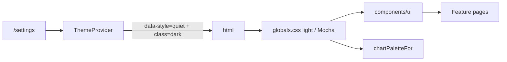

# Design guide — Quiet Ink (restrained & dense)

Every new screen, component, and feature must follow this guide. The shell, primitives, tokens, and motion utilities here are the **only** sanctioned way to build UI.

The non-negotiables:

1. Consume **semantic CSS tokens**; never hard-code colors, fonts, radii, or shadows.
2. Compose from [`components/ui/*`](../components/ui/) primitives; do not reinvent buttons, inputs, modals, popovers, etc.
3. Microinteractions are **CSS-only** (Tailwind transitions, `@starting-style`, View Transitions API, `:has()`, scroll-driven animations) and respect `prefers-reduced-motion`.
4. Layout uses modern CSS (`grid-template-columns: repeat(auto-fit, minmax(...))`, container queries, `clamp()`); no hardcoded breakpoints for content.
5. Charts use **visx** and read colors via [`colorByIndex(resolved, i, style)`](../lib/theme-chart-palette.ts) so they recolor when the user switches light/dark mode.
6. Apply the **interface-polish principles**, **restrained dense rules**, and **Quiet Ink minimal rules** below by default.

If a need is not covered here, propose an extension to this doc + a primitive — do **not** ship a one-off.

## Product context

| Dimension | Requirement |
|-----------|-------------|
| **Platform** | Responsive web app, **mobile-first**. Design for narrow viewports first; enhance with container queries and `auto-fit` grids — never desktop-only layouts that collapse poorly on phones. |
| **Primary user** | A **busy parent** who needs to **add or update spending in seconds** between other tasks. Optimize for capture speed, scannable totals, and one-thumb reach on mobile. |
| **Mood & style** | **Minimal** — Quiet Ink restrained dense (see below). No decoration, no hero marketing chrome. |
| **Styling** | [**Tailwind CSS v4**](https://tailwindcss.com/) utilities + semantic tokens from [`app/globals.css`](../app/globals.css). No daisyUI; no hard-coded hex in feature JSX. |
| **Charts** | [**visx**](https://visx.airbnb.tech/docs) only for data visualization; colors via [`colorByIndex`](../lib/theme-chart-palette.ts). |

### Navigation pattern

**Hamburger menu → popup menu.** On mobile, primary navigation lives behind a hamburger icon that opens a [`Popover`](../components/ui/popover.tsx) panel (not a full-screen drawer unless accessibility requires it):

| Surface | Trigger | Panel contents |
|---------|---------|----------------|
| App shell | Top-right hamburger ([`app-shell.tsx`](../components/app-shell.tsx)) | Shell routes from [`registry.ts`](../lib/features/registry.ts) + sign in/out |
| Money sections | Left hamburger ([`MoneyAppMenu`](../components/money-section-tabs.tsx)) | Spending, Add, Insights, Settings, optional tabs, shell links |

Desktop (`lg+`): shell uses a fixed icon rail on non-Money routes; Money / Help / App Settings hide the rail and use the in-page hamburger. Every shell page uses [`PageHeading`](../components/page-heading.tsx) (Tailwind Plus [page headings](https://tailwindcss.com/plus/ui-blocks/application-ui/headings/page-headings)): **With actions** on top-level routes, **With actions and breadcrumbs** when nested. Primary CTA is a **text-only** button in the heading at all breakpoints (no sticky bottom Add bar).

### Page headings & breadcrumbs

- Structure follows Tailwind Plus application-ui blocks; retokenize onto Quiet Ink + [`components/ui/*`](../components/ui/) (`Button` / `buttonClassName`, [`Breadcrumb`](../components/ui/breadcrumb.tsx) from [Simple with chevrons](https://tailwindcss.com/plus/ui-blocks/application-ui/navigation/breadcrumbs)).
- Hamburger = icon-only (`fx-hit-40`); primary page actions = **text labels only** (e.g. “Create loan”, “Add transaction”).
- Breadcrumbs sit **above** the title when nested; omit on top-level section pages.
- Path defaults: [`resolveMoneyAppHeader`](../lib/money-app-header.ts); dynamic pages override via [`useSetAppHeader`](../components/app-header-override.tsx).

### Dashboard layout pattern

Money home surfaces follow **metric cards → (optional chart) → table**, top to bottom:

1. **Filters** — compact toolbar; secondary filters under **More**.
2. **Metric cards** — [`AnalyticsStats`](../components/analytics-stats.tsx) in a responsive `auto-fit` grid of [`Card`](../components/ui/card.tsx) cells.
3. **Chart** *(optional)* — visx chart card when the ledger preset defines `chart` (e.g. Bills, Savings). **Spending** omits the chart — metrics + table only.
4. **Table** — transaction ledger ([`AnalyticsTransactionsTable`](../components/analytics-transactions-table.tsx)) as a flat `<section>` with hairline table chrome — **not** wrapped in a Card.

Wrap page bodies in [`MONEY_DASHBOARD_STACK`](../lib/money-layout.ts) (`flex flex-col gap-6`) with semantic `<section>` landmarks. Apply [`MONEY_FULL_SPAN`](../lib/money-layout.ts) **once** on the outermost page body in the shell grid — never on nested filters, tables, or section children.

```text
[ Crumbs when nested ──────────── ]
[ Hamburger | Title | Add (text) ]
[ Filters ─────────────────────── ]
[ Metric │ Metric │ Metric │ …   ]
[ Table ───────────────────────── ]
```

**Flat surfaces:** Cards are for discrete metrics, charts, and entity tiles. Tables, full-page forms, and settings/help sections sit on the page background with headings + dividers — no Card-in-page or Card-around-table.
## Restrained dense rules

Information-grid first: medium–high density in controls, tables, filters, and forms; airy rhythm between sections.

| Rule | Practice in this app |
|------|----------------------|
| **Stepped surfaces** | White / off-white / cool gray layers via `--surface`, `--background`, `--muted-surface`. Dark: Catppuccin Mocha base / surface0 / surface1. Build depth with hairline `border-border`, shallow `--shadow-*`, and layered surfaces — not thick borders or glow. |
| **Subdued accents** | Dark neutral text + **one subdued primary** (`--accent`) + **muted secondary** (`--secondary`). Reserve saturated color for semantic states (destructive, alerts, toasts) and chart series — not chrome. |
| **Compact controls** | Default `Button` `size="md"` (`text-base`); form fields at `text-base` with comfortable padding. Tables use `text-base` rows. Section gaps via `.shell-main` and `gap-6` dashboard stacks. |
| **Imagery subordinate** | Prefer small avatars, product thumbnails, precise diagrams, restrained data viz. No decorative illustration or cinematic photography. Empty-state icons stay modest — not hero-scale rings. |
| **Measured motion** | Short fades, small slides, focus rings, state transitions for menus, dialogs, sorting, validation. No ambient blur theater, scale pops, or long chart draws. |
| **Restrained geometry** | `--radius-md` / `--radius-sm` between `0.25rem`–`1rem`. Plain rectangles, compact pills, inset controls. |
| **Quiet type** | IBM Plex Sans + Mono only. Strong hierarchy via size, weight, alignment — not expressive styling. Medium-weight labels; muted supporting text; tabular nums global. |

### DaisyUI role aliases (mapping only — we do not use daisyUI)

This app uses custom tokens + [`components/ui`](components/ui/). When reading daisyUI-themed specs, map roles as follows:

| daisyUI role | This app's token | Tailwind examples |
|--------------|------------------|-------------------|
| `primary` | `--accent` | `bg-accent`, `text-accent` |
| `secondary` | `--secondary` | `bg-secondary`, `text-secondary-foreground` |
| `base-100` | `--surface` | `bg-surface` |
| `base-200` | `--background` | `bg-background` |
| `base-300` | `--muted-surface` | `bg-muted-surface` |
| `*-sm` size | primitive `size="sm"` | `Button size="sm"`, dense inputs |

## Quiet Ink minimal rules

Distilled from modern minimal / clean UI practice. Clarity beats decoration.

| Rule | Practice in this app |
|------|----------------------|
| **Whitespace as hierarchy** | Dense tables and forms; airy section gaps. Do not pack page chrome into hero blocks. |
| **One type family** | IBM Plex Sans for UI + headings (weight hierarchy). IBM Plex Mono for code/mono. Never add a third family. |
| **Four color roles** | Neutrals (background / surface / muted-surface) + subdued **primary** + muted **secondary** + **destructive** / semantic states. No rainbow chrome. |
| **One primary action per view** | Prefer a single `Button` `primary` per screen region; `secondary` / `ghost` for the rest. |
| **Alignment & consistency** | Same padding, radius, and component styles everywhere; no one-off card treatments. |
| **Simple navigation** | Shell nav from [`registry.ts`](../lib/features/registry.ts) only; do not stuff menus. |
| **Subtle motion only** | `fx-*` utilities — measured feedback without clutter. |
| **Never hide essentials** | Minimal ≠ incomplete. Keep required actions visible and labeled. |
| **Progressive disclosure** | Primary chrome only: one primary CTA + essential filters (e.g. Direction, Accounts, Categories, Apply). Secondary filters/actions and help copy live behind [`MoreMenu`](../components/ui/more-menu.tsx) or an info-icon tooltip ([`AboutDisclosure`](../components/ui/about-disclosure.tsx)). Never hide Workspace, View, Apply, or the primary CTA. |
| **Load only what the viewport shows** | Default Insights must not fetch form lookups, budgets, sankey, or leaders until Add / More insights / advanced filters need them. |

## Default spender experience (Money)

Default audience is a **busy parent**: log a spend in seconds, then scan where money went. Power tools (loans, investments, import, advanced charts) stay reachable via the hamburger menu but out of the default path.

| Tab / route | Job |
|-------------|-----|
| **Spending** `/money/spending` (home) | Default landing: full ledger. `/money` and signed-in `/` redirect here. |
| **Add** `/money/new` | Capture a transaction (form lookups load here, not on Insights). |
| **Insights** `/money/analytics` | KPIs + spend-by-category + income vs expense. Remaining charts behind **More insights**. |
| **Settings** `/money/settings` | Workspace config; optional section tabs (Bills, Savings, Loans, Invest, Import) stay off by default. |

Avoid: purple gradients, cream+terracotta marketing looks, broadsheet density, glow, decorative `rounded-full` pill clusters, Inter/system-only stacks, cinematic hero layouts.

## Style architecture

Fixed **Quiet Ink** structure with a **subdued neutral light** palette and **Catppuccin Mocha** dark ([Catppuccin style guide](https://github.com/catppuccin/catppuccin/blob/main/docs/style-guide.md)):

| Axis    | Where it lives                                           | Values |
|---------|-----------------------------------------------------------|--------|
| `style` | `<html data-style="quiet">` (set by [`ThemeProvider`](../components/theme-provider.tsx)) | `quiet` only |
| `mode`  | `<html class="dark">` toggled by `ThemeProvider`         | light (neutral stepped grays) or dark (**Mocha**) |

The user picks appearance in **`/settings`** ([`ThemeSettings`](../components/theme-settings.tsx)). Token sets live in [`app/globals.css`](../app/globals.css) under `:root[data-style="quiet"]` and `.dark`. FOUC is prevented by a pre-paint script in [`app/layout.tsx`](../app/layout.tsx).



### Identity tokens (reference)

| Role | Light | Mocha (dark) |
|------|-------|--------------|
| Surface (`base-100`) | `#ffffff` | `#313244` (surface0) |
| Background (`base-200`) | `#f3f4f6` | `#1e1e2e` (base) |
| Muted surface (`base-300`) | `#e8ebf0` | `#45475a` (surface1) |
| Foreground | `#111827` | `#eff1f8` (text) |
| Muted text | `#475569` | `#b8c0dc` (subtext0) |
| Primary (`accent`) | `#356089` (subdued blue) | `#89b4fa` |
| Secondary | `#d8dee6` (muted slate wash) | `#6c7086` (overlay) |
| Body size | `1rem` / `line-height: 1.5` | same |
| Radius | `--radius` `0.5rem` / `--radius-inner` `0.3125rem` | same |

## Tokens you must use

Defined in [`app/globals.css`](../app/globals.css). Available as Tailwind utilities via `@theme inline`.

### Color
- Surface stack: `bg-background`, `bg-surface`, `bg-muted-surface`
- Text: `text-foreground`, `text-muted`
- Borders: `border-border`
- Primary: `bg-accent`, `text-accent`, `text-accent-foreground`, focus ring `--ring`
- Secondary: `bg-secondary`, `text-secondary-foreground`, `--secondary-hover`
- Status: `--destructive` and `--alert-error-*` / `--alert-warning-*` (used by [`Alert`](../components/ui/alert.tsx)) and `--toast-*` (used by [`NotificationProvider`](../components/notification-provider.tsx))

### Type
- Body: `font-sans` → `--font-body` (IBM Plex Sans)
- Headings/branding: `font-display` → `--font-heading` (IBM Plex Sans, heavier weight via utility)
- Mono: `font-mono` → IBM Plex Mono

Do not hard-code font stacks. Body sets `font-size: 1rem`, `line-height: 1.5`, and `font-variant-numeric: tabular-nums` globally. Prefer readable scale: `text-base` for controls and table body; `text-sm` for metadata; page titles `text-2xl`–`text-3xl`.

### Shape & elevation

| Token | Tailwind class | Use it on |
|-------|----------------|-----------|
| `--radius` (alias `--radius-md`) | `rounded-[var(--radius-md)]` | Outer surfaces — Cards, Modals, Popovers, Inputs, Buttons, primary panels. Range: `0.25rem`–`1rem`. |
| `--radius-inner` (alias `--radius-sm`) | `rounded-[var(--radius-sm)]` | Nested chips, badges, segmented items, list rows, checkbox indicators, inline `<code>`. |

If inner padding around a child exceeds 24px, treat it as its own surface.

> **Never** use Tailwind's `rounded-md`, `rounded-lg`, `rounded-2xl`, or `rounded-[calc(var(--radius-md)-2px)]`. Use `--radius-sm` for nested.

Shadows: `shadow-[var(--shadow-sm)]` and `shadow-[var(--shadow-md)]`. Never `shadow-md`/`shadow-lg`. Prefer hairline `border-border` + shallow shadow for elevation.

### Status colors
- **Positive / desirable:** `text-accent` / `bg-accent` (subdued primary — not a separate green on chrome).
- **Negative / undesirable:** `text-destructive` / `bg-destructive`.
- **Flat / neutral:** `text-muted`.
- Toast success green and chart series greens are **not** brand chrome — do not use them for nav, buttons, or page accents.
- Do **not** hand-pick `text-emerald-*` / `text-rose-*`.

### Charts
```tsx
const { resolved, style } = useTheme();
<rect fill={colorByIndex(resolved, i, style)} />
```
Never hard-code chart hexes; never read only `resolved`. Keep charts restrained — precise axes, modest legend, no decorative illustration.

### Spacing
- `--space-step: 0.5rem` is the density unit.
- Macro whitespace: `.shell-main` uses `clamp` padding with airy section `gap` — do not override with zero padding on page roots.
- Micro whitespace: form/table internals use comfortable padding (`py-2.5`–`py-3` rows, `px-3`–`px-4` cells, `gap-3` in toolbars).

## Primitives — pick from these first

| Primitive | File | Use it for |
|-----------|------|-----------|
| `Button` | [`components/ui/button.tsx`](../components/ui/button.tsx) | Any button (`primary`/`secondary`/`ghost`/`danger`, `sm`/`md`/`lg`). Default **`md`** (`text-base`). Built-in `fx-press`. Pass `leading`/`trailing`; `iconOnly` for 40×40 via `fx-hit-40`. |
| `Field` + `Input` / `Textarea` / `Select` | [`field.tsx`](../components/ui/field.tsx), [`input.tsx`](../components/ui/input.tsx), [`textarea.tsx`](../components/ui/textarea.tsx), [`select.tsx`](../components/ui/select.tsx) | Labeled fields with focus underline. Dense default padding. |
| `MultiSelect` | [`multi-select.tsx`](../components/ui/multi-select.tsx) | Chip trigger + checkbox popover. |
| `Card` | [`card.tsx`](../components/ui/card.tsx) | Discrete surfaces only: KPI tiles, chart panels, entity tiles. Nested children → `--radius-sm`. Do **not** wrap tables, page forms, or settings sections. |
| `Table` | [`table.tsx`](../components/ui/table.tsx) | Data grids (ledgers, schedules, holdings, CSV maps). Sticky header, optional frozen identity column, sort button, hover/focus row actions. **Not** for settings entity editors (those stay divide-y lists). |
| `Modal` | [`modal.tsx`](../components/ui/modal.tsx) | Native `<dialog>` + `fx-overlay`. |
| `Popover` | [`popover.tsx`](../components/ui/popover.tsx) | Anchored panel with entry/exit. |
| `MoreMenu` | [`more-menu.tsx`](../components/ui/more-menu.tsx) | Secondary actions / overflow (ellipsis + optional dirty dot). Use `MoreMenuItem` for rows; `variant="danger"` for destructive. |
| `AboutDisclosure` | [`about-disclosure.tsx`](../components/ui/about-disclosure.tsx) | Info icon beside a title; page/section help in a hover/focus tooltip. |
| `Tabs` | [`tabs.tsx`](../components/ui/tabs.tsx) | Radio tablist with `:has()` underline. |
| `Badge` / `Tag` | [`badge.tsx`](../components/ui/badge.tsx), [`tag.tsx`](../components/ui/tag.tsx) | Inline status chips — compact pills. |
| `IconSwap` | [`icon-swap.tsx`](../components/ui/icon-swap.tsx) | Stateful icon cross-fade (opacity-only motion). |
| `Skeleton` | [`skeleton.tsx`](../components/ui/skeleton.tsx) | Loading (`fx-shimmer`). |
| `Alert` | [`alert.tsx`](../components/ui/alert.tsx) | Inline error/warning. |
| Notifications | `useNotify()` | Toasts. |

If you need a new primitive, add it under [`components/ui/`](../components/ui/), document it here, and migrate at least one usage in the same PR.

## Microinteraction utilities

All in [`app/globals.css`](../app/globals.css) `@layer utilities`. Do not author bespoke keyframes.

| Class | Effect |
|-------|--------|
| `fx-press` | `scale(0.98)` on `:active` |
| `fx-fade-in` | Stable visible hook (no stuck-opacity entry) |
| `fx-stagger-children` | Short staggered fade/slide (no blur) |
| `fx-overlay` | Dialog enter/exit (~−8px + fade) |
| `fx-icon-swap` | Opacity cross-fade only |
| `fx-hit-40` | ≥40×40 hit target |
| `fx-shimmer` | Skeleton shimmer |
| `fx-field` + `fx-field-underline` | Focus underline |
| `fx-vt-shell-nav-active` | Shell nav view transition |
| `fx-vt-money-tab-active` | Money tab view transition |
| `toast-progress-bar` | Toast countdown |

**Forbidden motion:** ambient blur on stagger/icon swap, theatrical scale pops, chart line draws > ~350ms, decorative parallax, JS animation libraries.

```ts
import { withViewTransition } from "@/lib/microinteractions";
withViewTransition(() => setTheme("dark"));
```

## Interface-polish principles (applied by default)

| # | Principle | Where it lives |
|---|-----------|----------------|
| 1 | **Concentric radius** | `--radius-md` outer / `--radius-sm` inner |
| 2 | **Optical alignment** | `Button` icon padding |
| 3 | **Shadows over borders** for elevation | `--shadow-sm` / `--shadow-md` + hairline border |
| 4 | **Interruptible animations** | CSS transitions on interactive state |
| 5 | **Split & stagger** | `fx-stagger-children` (sparingly, no blur) |
| 6 | **Subtle exits** | Modal / Popover ~−8px + fade |
| 7 | **Contextual icon swaps** | `IconSwap` (opacity only) |
| 8 | **Font smoothing** | `<html>` antialiased |
| 9 | **Tabular numbers** | `body` global |
| 10 | **Text wrapping** | `balance` on h1–h3; `pretty` on body copy |
| 11 | **Image outlines** | pure black/white 10% — never tinted |
| 12 | **Scale on press** | `fx-press` |
| 13 | **Skip animation on first paint** | `@starting-style` where safe |
| 14 | **No `transition: all`** | list properties |
| 15 | **`will-change` sparingly** | only when stutter observed |
| 16 | **Minimum 40×40 hit area** | `iconOnly` / `fx-hit-40` |

## Layout rules

- **Container**: `.shell-main` for top-level page padding/max width.
- **One full-span**: [`MONEY_FULL_SPAN`](../lib/money-layout.ts) once per grid child under Money / ShellMainPage — not on nested filters or tables.
- **Dashboard stack**: [`MONEY_DASHBOARD_STACK`](../lib/money-layout.ts) for metric cards + chart + table pages (`gap-6`).
- **Flat sections**: tables and forms are `<section>` / heading + content on the page background; Cards reserved for metrics, charts, and entity tiles. Settings use [`SettingsSection`](../components/money-settings/money-settings-shared.tsx) (heading + body, no Card).
- **Multi-column**: `repeat(auto-fit, minmax(min(100%, 22rem), 1fr))` (`.auto-fit-2`). Breakpoint utilities only for shell chrome (hamburger vs rail).
- **Container queries**: `cqi` / `container-type` / `@container` for filter bars and chart cards.
- **Density**: `--space-step`; compact controls + airy section rhythm.
- **Mobile-first**: stack sections vertically; metric cards use `auto-fit` with `minmax(min(100%, 9rem), 1fr)`; tables scroll horizontally inside their section when needed.

## Shell & navigation

- Source of truth: [`lib/features/registry.ts`](../lib/features/registry.ts).
- **Mobile-first:** hamburger → [`Popover`](../components/ui/popover.tsx) popup menu (`aria-label="Open navigation menu"` / Money: `"Open Money menu"`).
- **Desktop (`lg+`):** icon rail in [`app-shell.tsx`](../components/app-shell.tsx) when not on Money/Help/Settings; otherwise in-page [`PageHeading`](../components/page-heading.tsx) with section-aware text CTA.
- Active item: `fx-vt-shell-nav-active`.
- Route changes: `<main key={pathname}>` + `fx-fade-in`.
- Touch targets: `iconOnly` / `fx-hit-40` (≥40×40) on all menu triggers.

## Accessibility & motion

- `aria-label` / `aria-labelledby` on icon-only controls, modals, popovers.
- Focus: `focus-visible:outline focus-visible:ring-2 focus-visible:ring-ring focus-visible:ring-offset-2 focus-visible:ring-offset-background`.
- All `fx-*` and View Transitions respect `prefers-reduced-motion: reduce`.

## Tables

Use [`components/ui/table.tsx`](../components/ui/table.tsx) for every HTML data table. Patterns follow [Pencil & Paper enterprise table UX](https://www.pencilandpaper.io/articles/ux-pattern-analysis-enterprise-data-tables), constrained for Quiet Ink and a mobile-first busy-parent audience.

| Rule | Practice |
|------|----------|
| **Classify the view** | Action-oriented, info-oriented, or both — choose sticky/freeze/sort/row actions accordingly. |
| **Alignment** | Text and qualitative numbers/dates → `align="start"`. Quantitative amounts/qty/% → `align="end"` + `numeric`. Header alignment **matches** the column. Never center. |
| **Division** | Hairline `divide-y` rows only. No zebra stripes (they fight hover/selected/accent). No vertical column rules. |
| **Sticky header** | Built into `TableHead`. Use `Table` `maxHeight` only for tall scrollports (installments, CSV maps, modal drilldowns). Paginated ledgers stay page-scroll. |
| **Freeze identity** | Freeze the leading identity column (`freeze="leading"`). With a checkbox column, freeze checkbox + identity (`leading` + `afterCheckbox`). |
| **Row actions** | Prefer `TableRowActions` (hover-reveal on fine pointers; always visible on touch + `focus-within`). Keep bulk toolbar ([`TransactionSelectionBar`](../components/transaction-selection-bar.tsx)) only after selection. |
| **Flat surface** | Tables sit on the page background inside the table shell — **never** wrap a table in `Card`. |
| **Mobile** | Keep `@md:hidden` card lists for ledgers/loans/installments; row actions on cards stay always visible. |
| **Settings lists** | Accounts, categories, merchants, tags, budgets, rules, recurrence stay divide-y action lists — not this primitive. |

**Out of this system (ask before adding):** column show/hide, reorder, resize, density switch, view-state persistence, inline cell editing, expandable rows, fullscreen table.

## Forms

- `Field` + matching primitive for every input.
- Required: `required` on `Field`.
- Radio-cards: `peer sr-only` + `peer-checked:border-foreground peer-checked:ring-1`; outer `--radius-md`, nested `--radius-sm`.
- Segmented controls: `role="radiogroup"`, outer rounded + `--radius-sm` inner, `fx-press`, `transition-[background-color,color,box-shadow]`.

## Charts (visx)

- **Library:** [visx](https://visx.airbnb.tech/docs) for all normal charts; TradingView Lightweight Charts for price series only (when installed).
- Always `useTheme()` + `style` into `colorByIndex`.
- Charts sit in the **dashboard** stack between metrics and table (or as the primary viz on Insights).
- Empty: [`AnalyticsEmptyState`](../components/analytics-empty-state.tsx) or `Skeleton`.

## What is forbidden

- Hard-coded colors, font families, radii, or shadows in JSX/CSS (except token source files).
- Framer Motion / Motion-One / other JS animation libs.
- Manual portals for dialogs — use `Modal`.
- Per-style component branching — express differences via tokens.
- Hardcoded breakpoints when `auto-fit` / container queries work.
- `transition` shorthand or `transition-property: all`.
- Tinted image outlines; icon visibility toggles; hit areas &lt; 40×40 without `fx-hit-40`.
- Decorative `rounded-full` pill clusters (true circular controls OK).
- Cinematic photography, hero-scale empty states, theatrical motion.

## When changing the design system itself

1. Add tokens to **both** light and dark blocks in [`app/globals.css`](../app/globals.css) (`--radius` and `--radius-inner` both required).
2. Update [`lib/theme-chart-palette.ts`](../lib/theme-chart-palette.ts) if chart colors change.
3. Update this doc + [`SPEC.md`](SPEC.md) if success criteria change.

## Quick checklist for any UI change

- [ ] Uses tokens, no raw hex/font/radius/shadow.
- [ ] Composes from [`components/ui/*`](../components/ui/).
- [ ] Default readable density (`md` buttons, `text-base` inputs/tables).
- [ ] Microinteractions via `fx-*` or `withViewTransition` — measured only.
- [ ] Respects `prefers-reduced-motion`.
- [ ] Layout uses `auto-fit`/container queries.
- [ ] Charts use `colorByIndex(resolved, i, style)`.
- [ ] Concentric radii (`--radius-md` / `--radius-sm`).
- [ ] Icon-only: `iconOnly` or `fx-hit-40`; swaps via `IconSwap`.
- [ ] Explicit `transition-*` properties.
- [ ] Mobile-first: hamburger popup nav, dashboard stack, primary CTA in PageHeading on all breakpoints.
- [ ] Verified light and dark via `/settings`.
- [ ] `npm run lint` and `npm run build` pass.
