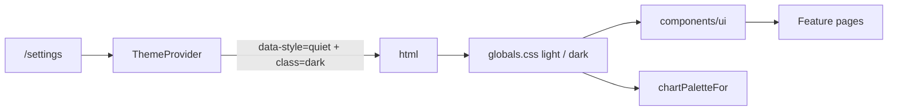

# Design guide — Clean minimal (teal + Inter)

Every new screen, component, and feature must follow this guide. The shell, primitives, tokens, and motion utilities here are the **only** sanctioned way to build UI.

The non-negotiables:

1. Consume **semantic CSS tokens**; never hard-code colors, fonts, radii, or shadows.
2. Compose from [`components/ui/*`](../components/ui/) primitives; do not reinvent buttons, inputs, modals, popovers, etc.
3. Microinteractions are **CSS-only** (Tailwind transitions, `@starting-style`, View Transitions API, `:has()`, scroll-driven animations) and respect `prefers-reduced-motion`.
4. Layout uses modern CSS (`grid-template-columns: repeat(auto-fit, minmax(...))`, container queries, `clamp()`); no hardcoded breakpoints for content.
5. Charts use **visx** and read colors via [`colorByIndex(resolved, i, style)`](../lib/theme-chart-palette.ts) so they recolor when the user switches light/dark mode.
6. Apply the **interface-polish principles**, **clean-minimal rules**, and **8px spacing** below by default.
7. Every action has a **visible reaction**. Match feedback scale to stakes and frequency (inline → toast → alert → modal). Missing feedback is worse than imperfect feedback.

If a need is not covered here, propose an extension to this doc + a primitive — do **not** ship a one-off.

## Product context

| Dimension | Requirement |
|-----------|-------------|
| **Platform** | Responsive web app, **mobile-first**. Design for narrow viewports first; enhance with container queries and `auto-fit` grids — never desktop-only layouts that collapse poorly on phones. |
| **Primary user** | A **busy parent** who needs to **add or update spending in seconds** between other tasks. Optimize for capture speed, scannable totals, and one-thumb reach on mobile. |
| **Mood & style** | **Clean minimal** — off-white surfaces, dark gray type, one teal accent, Inter. No decoration, no hero marketing chrome. |
| **Styling** | [**Tailwind CSS v4**](https://tailwindcss.com/) utilities + semantic tokens from [`app/globals.css`](../app/globals.css). No daisyUI; no hard-coded hex in feature JSX. |
| **Charts** | [**visx**](https://visx.airbnb.tech/docs) only for data visualization; colors via [`colorByIndex`](../lib/theme-chart-palette.ts). |

### Navigation pattern

**Hamburger menu → popup menu.** On mobile, primary navigation lives behind a hamburger icon that opens a [`Popover`](../components/ui/popover.tsx) panel (not a full-screen drawer unless accessibility requires it):

| Surface | Trigger | Panel contents |
|---------|---------|----------------|
| App shell | Top-right hamburger ([`app-shell.tsx`](../components/app-shell.tsx)) | Shell routes from [`registry.ts`](../lib/features/registry.ts) + sign in/out |
| Money / Investments / Loans / Help / Settings | Left hamburger ([`MoneyAppMenu`](../components/money-section-tabs.tsx)) | Context-first app nav from [`app-section-nav.ts`](../lib/app-section-nav.ts) + labeled workspace links |

Desktop (`lg+`): shell uses a fixed icon rail on routes that are not Money, Investments, Loans, Help, or App Settings. Those apps hide the rail and use the in-page nested hamburger. Every shell page uses [`PageHeading`](../components/page-heading.tsx) (Tailwind Plus [page headings](https://tailwindcss.com/plus/ui-blocks/application-ui/headings/page-headings)): **With actions** on top-level routes, **With actions and breadcrumbs** when nested. Primary CTA is a responsive button in the heading at all breakpoints (icon-only on mobile, icon + text on `sm+`; no sticky bottom Add bar).

#### Navigation assessment (long nav)

This app is **long navigation** ([Pencil & Paper Navigation Assessment Framework](https://www.pencilandpaper.io/articles/navigation-assessment-framework)): many sibling destinations across Money, Investments, and Loans — not deep breadcrumb chains. Apply these rules when adding or reordering menu items:

| Concept | Practice in this app |
|---------|----------------------|
| **Navigation budget** | Every page hop costs reorientation. Prefer fewer, clearer destinations; do not add a nav item for a one-off action — use heading CTAs, drawers, or inline expansion instead. |
| **Context-first menu** | [`MoneyAppMenu`](../components/money-section-tabs.tsx) detects the active app from the pathname and shows **that app’s nav items first**. Other apps appear as compact jump links to their home route — not a second copy of all their pages. |
| **Clean hierarchy** | Items are ordered by job (Review → Capture → Browse → Configure) without noisy intermediate subtitle headers. Source of truth: [`APP_SECTION_NAV`](../lib/app-section-nav.ts). |
| **Item order** | Insights → primary capture action → main browse surface → optional ledgers → configure. Match page titles (“Spending”, “Loans”, “Investments”) — not generic “Overview”. |
| **Low-value cuts** | Optional Money ledgers (Bills, Savings, Import) stay **off by default** ([`money-section-tab-visibility.ts`](../lib/money-section-tab-visibility.ts)); enable in Money settings. Do not add nav rent for empty shells or single-action pages. |
| **Labeled essentials** | Workspace footer links (API help, Settings, Sign in/out) use **icon + text** rows — never icon-only in the menu panel. Hamburger trigger stays icon-only (`fx-hit-40`). |
| **Wide vs deep** | Nested routes (loan detail, settings child, instrument create) use **breadcrumbs**, not extra hamburger rows. Do not mirror folder depth in the menu. |
| **Search is not nav** | Find-in-list search only where a corpus is long (see [Search](#search)). No global command palette to paper over IA. |

When evaluating a new destination, ask: (1) which app and task group does it belong to? (2) does it earn a permanent menu row or should it be progressive disclosure? (3) will a busy parent use it weekly or is it configure-once?

### Page headings & breadcrumbs

- Structure follows Tailwind Plus application-ui blocks; retokenize onto clean-minimal + [`components/ui/*`](../components/ui/) (`Button` / `buttonClassName`, [`Breadcrumb`](../components/ui/breadcrumb.tsx) from [Simple with chevrons](https://tailwindcss.com/plus/ui-blocks/application-ui/navigation/breadcrumbs)).
- Hamburger = icon-only (`fx-hit-40`); primary page actions = responsive (icon-only `fx-hit-40` on mobile, icon + text on `sm+`, e.g. “Create loan”, “Add transaction”).
- Path defaults: [`resolveMoneyAppHeader`](../lib/money-app-header.ts); dynamic pages override via [`useSetAppHeader`](../components/app-header-override.tsx).

Crumbs follow [Pencil & Paper breadcrumb UX](https://www.pencilandpaper.io/articles/breadcrumbs-ux), constrained to **location-based** hierarchy for a mobile-first busy parent. They preserve *where this page sits*, not the click path (browser Back is the path).

| Rule | Practice |
|------|----------|
| **Omit on top-level** | Spending, Add, Insights, Settings, Bills, Savings, Loans, Investments lists have **no** crumbs. Nested only (loan detail, settings child, invest activity, instruments). |
| **Origin** | Start at the **section** (Loans, Settings, Investments) — never Home / Money. The hamburger already locates the app; repeating it is noise. |
| **Current** | Last item is the page or entity name, not a link (`aria-current="page"`). Title in `PageHeading` can match or be more specific (loan nickname). |
| **Not a stepper** | CSV import stays a wizard. Filter chips are not crumbs. Do not encode query state in the trail. |
| **Truncation** | [`Breadcrumb`](../components/ui/breadcrumb.tsx) truncates long labels. Keep the distinctive **end** of names (loan nickname, merchant). Never ellipsis the origin. Wrap on small screens — no horizontal crumb scroll. |
| **Depth** | Two or three levels max. If a fourth is tempting, the page is probably in the wrong section. |

### Dashboard layout pattern

Money home surfaces are **product-home + functional** dashboards ([Pencil & Paper dashboard UX](https://www.pencilandpaper.io/articles/ux-pattern-analysis-data-dashboards)): scan totals, then act in the table. They are not live monitoring and not “show every chart we can compute.”

Stack **metric cards → (optional chart) → table**, top to bottom (F/Z scan: most global numbers first):

1. **Filters** — compact toolbar; secondary filters under **More**. Changing filters must show loading in the metrics/chart/table that will change.
2. **Metric cards** — [`AnalyticsStats`](../components/analytics-stats.tsx) in a responsive `auto-fit` grid of [`Card`](../components/ui/card.tsx) cells. Same internal layout on every tile (label, value, optional delta).
3. **Chart** *(optional)* — visx chart card when the ledger preset defines `chart` (e.g. Bills, Savings). **Spending** omits the chart — metrics + table only. Do not add a viz because the data exists.
4. **Table** — transaction ledger ([`AnalyticsTransactionsTable`](../components/analytics-transactions-table.tsx)) as a flat `<section>` with hairline table chrome — **not** wrapped in a Card.

Wrap page bodies in [`SHELL_DASHBOARD_STACK`](../lib/shell-layout.ts) (`flex flex-col gap-8`) with semantic `<section>` landmarks. Apply [`SHELL_FULL_SPAN`](../lib/shell-layout.ts) **once** on the outermost page body in the shell grid — never on nested filters, tables, or section children.

```text
[ Crumbs when nested ──────────── ]
[ Hamburger | Title | Add (text) ]
[ Filters ─────────────────────── ]
[ Metric │ Metric │ Metric │ …   ]
[ Chart (optional) ────────────── ]
[ Table ───────────────────────── ]
```

**Flat surfaces:** Cards are for discrete metrics, charts, and entity tiles. Tables, full-page forms, and settings/help sections sit on the page background with headings + dividers — no Card-in-page or Card-around-table.

| Rule | Practice |
|------|----------|
| **One job** | Spending: “where did it go?” Money Insights: category + income vs expense. Investments Insights: results + allocation. Loans Insights: remaining + principal vs interest. Extra charts stay behind **More insights**. |
| **Defaults** | Sensible date range and primary filters so the first paint answers the job without 12 clicks. |
| **Deltas** | Relative change (e.g. expense MoM) with direction + `text-accent` / `text-destructive` / `text-muted` — never color alone. |
| **Jargon** | KPI names and chart titles get [`AboutDisclosure`](../components/ui/about-disclosure.tsx) when the term is not everyday (savings rate, P&L). |
| **Drill** | Object detail is a **page** (loan, edit transaction), not a drawer. Drawers/popovers are for filters, More, and confirms. |
| **Empty / load** | [`AnalyticsEmptyState`](../components/analytics-empty-state.tsx) with a next action; [`Skeleton`](../components/ui/skeleton.tsx) while fetching. Empty is not an error. |
| **Out of scope** | Drag-to-rearrange modules, per-user dashboard builders, rainbow stoplight palettes. Ask before adding. |

### Kiosk glance pattern

`/kiosk` is a **status board**, not a Money home dashboard. Stack **context strip → metrics band → action list**:

1. **Context strip** — today + weather in one full-width card (no section heading).
2. **Metrics band** — enabled summary cards (`net`, `bills`, `savings`) in `repeat(auto-fit, minmax(min(100%,14rem),1fr))`. Labels live **inside** the card — no outer section heading.
3. **Insight bands** *(optional)* — loan / investment KPI grids full-width under metrics; still no outer heading.
4. **Action list** — loan payments due as a flat divide-y list with a thin title + one deep link (“All loans”). Not wrapped in a Card.

Do not double-title (section heading + in-card label). Keep secondary links rare (city setup only when weather needs it). Skeleton must mirror this stack with the same `@container` / auto-fit structure.

## Clean-minimal rules

Information-grid first: readable density in controls, tables, filters, and forms; generous section whitespace on an **8px grid** (8 / 16 / 24 / 32 / 48 / 64).

| Rule | Practice in this app |
|------|----------------------|
| **Stepped surfaces** | Off-white / white / light gray via `--background`, `--surface`, `--muted-surface`. Dark: near-black neutrals. Depth via hairline `border-border` — **cards use border only** (no shadow). Modals/popovers may use `--shadow-md`. |
| **One accent** | Dark gray text + **one teal primary** (`--accent`) + muted secondary. Semantic red/amber for errors/warnings only. No purple/rainbow chrome. |
| **Comfortable controls** | Default `Button` `size="md"` (`text-base`, ~12×24 padding); form fields `text-base` with `px-4 py-3`. Tables `text-base`. Section gaps `gap-6` (24px) / `gap-8` (32px). |
| **Imagery subordinate** | Prefer small avatars, product thumbnails, precise diagrams, restrained data viz. No decorative illustration or cinematic photography. |
| **Measured motion** | Short fades, small slides, focus rings, button lift on hover. No ambient blur, scale pops, or long chart draws. Never `transition: all`. |
| **Restrained geometry** | `--radius-md` 8px outer / `--radius-sm` 6px nested. Tables stay sharp (no radius). |
| **Clean type** | Inter for UI + headings. IBM Plex Mono for code only. Body ≥16px; metadata ≥14px (`text-sm`). H1 ~32px with `-0.02em` tracking. |

### Modern Minimal UI style (Diana Malewicz)

Modern Minimal UI combines functional minimalism with warmth and high visual polish:

1. **Whitespace as primary structure:** Whitespace is not empty space; it organizes sections, creates calm scannability, and eliminates visual clutter.
2. **Subtly rounded elements:** Softly rounded corners (`--radius-md` 8px outer, `--radius-sm` 6px inner) make surfaces feel organic and tactile without looking cartoonish or over-rounded.
3. **Large, high-contrast, accessible typography:** Clear weight hierarchy (Inter), strong contrast ratios (≥4.5:1), and tabular figures for numbers eliminate ambiguity. Body inputs stay ≥16px to prevent viewport zoom on mobile browsers.
4. **Restrained color architecture:** Strict 4-role palette (neutrals + 1 teal accent + muted secondary + semantic status). No multi-color gradient chrome.
5. **Hairline depth over heavy shadows:** Cards use 1px hairline borders (`border-border`) with flat surfaces; elevation shadows (`--shadow-md`) are reserved for interactive overlays (popovers, modals).

## 10 Mobile UX principles for 2026 (UXCam)

Mobile UX is a distinct discipline designed for thumb-driven input, distracted contexts, variable networks, and varied devices.

| # | Principle | Implementation in this app |
|---|-----------|----------------------------|
| 1 | **Understand actual users** | Design for a busy parent operating with one hand in seconds; test on real mobile viewports. |
| 2 | **Design for the thumb zone** | Primary CTAs and frequent controls sit within easy reach; top corners reserved for navigation and low-frequency utility. |
| 3 | **Minimize input friction** | Use explicit `inputMode` (`decimal`, `numeric`, `email`, `tel`), `enterKeyHint`, and pickers ([`MoneyDateQuickPick`](../components/money-date-quick-pick.tsx), [`MoneyUsageQuickPick`](../components/money-usage-quick-pick.tsx)) instead of freeform typing. |
| 4 | **Lean flow to value** | First meaningful action completed in seconds without multi-step friction. |
| 5 | **Respect the back button & gestures** | Standard system back dismissal for modals and popovers (`cancel` event listeners, swipe-safe dialogs). |
| 6 | **Performance is UX** | Zero Cumulative Layout Shift (CLS) through skeleton parity ([`money-analytics-skeleton.tsx`](../components/money-analytics-skeleton.tsx)); `touch-action: manipulation` for instant touch response (no 300ms delay). |
| 7 | **Graceful, actionable error recovery** | Every error message explains what happened, why, and how to recover via [`toUserFacingMessage`](../lib/user-facing-error.ts). |
| 8 | **Intermittent connectivity resilience** | Client-side optimistic feedback, safe caching with TanStack Query, and graceful offline/loading states. |
| 9 | **Respect attention & interruptions** | Non-intrusive popovers over screen-blocking modals where possible; preserve user input state. |
| 10 | **Validate with interaction metrics** | Prevent rage taps and dead clicks via clear active states (`fx-press`), adequate spacing, and touch target minimums (≥44×44pt / 48dp). |

### Mobile size optimization & viewport preservation

- **Tablet & desktop preservation:** Tablet (`md`/`lg`) and desktop (`xl`) layouts remain intact. Responsive adaptations use Tailwind v4 `@container`, `@md:`, `clamp()`, and fluid grid `repeat(auto-fit, minmax(...))`.
- **Touch target floor:** All interactive elements on mobile provide ≥44×44px hit targets (using `iconOnly` or `fx-hit-40`).
- **Safe-area insets:** Handle edge-to-edge mobile displays using `safe-bottom`, `safe-top`, and `env(safe-area-inset-*)`.
- **Responsive page headings:** Title scales smoothly (`text-2xl sm:text-3xl`) on narrow mobile screens to prevent squishing beside navigation and primary actions.
- **Mobile card lists:** Data grids automatically render touch-friendly card lists on mobile viewports (`@md:hidden`) with full action visibility.

### DaisyUI role aliases (mapping only — we do not use daisyUI)

This app uses custom tokens + [`components/ui`](components/ui/). When reading daisyUI-themed specs, map roles as follows:

| daisyUI role | This app's token | Tailwind examples |
|--------------|------------------|-------------------|
| `primary` | `--accent` | `bg-accent`, `text-accent` |
| `secondary` | `--secondary` | `bg-secondary`, `text-secondary-foreground` |
| `base-100` | `--surface` | `bg-surface` |
| `base-200` | `--background` | `bg-background` |
| `base-300` | `--muted-surface` | `bg-muted-surface` |
| `*-sm` size | primitive `size="sm"` | `Button size="sm"`, dense inputs |

## Minimal UI rules

Clarity beats decoration.

| Rule | Practice in this app |
|------|----------------------|
| **Whitespace as hierarchy** | Dense tables and forms; airy section gaps. Do not pack page chrome into hero blocks. |
| **One type family** | Inter for UI + headings (weight hierarchy). IBM Plex Mono for code/mono. Never add a third sans family. |
| **Four color roles** | Neutrals (background / surface / muted-surface) + teal **primary** + muted **secondary** + **destructive** / semantic states. Max ~3 chrome colors (grays + accent). |
| **One primary action per view** | Prefer a single `Button` `primary` per screen region; `secondary` / `ghost` for the rest. |
| **Alignment & consistency** | Same padding, radius, and component styles everywhere; no one-off card treatments. |
| **Simple navigation** | Shell nav from [`registry.ts`](../lib/features/registry.ts); app sections from [`app-section-nav.ts`](../lib/app-section-nav.ts). Context-first menu — do not flatten all apps into one long list. |
| **Subtle motion only** | `fx-*` utilities — measured feedback without clutter. |
| **Never hide essentials** | Minimal ≠ incomplete. Keep required actions visible and labeled. |
| **Progressive disclosure** | Primary chrome only: one primary CTA + essential filters (e.g. Direction, Accounts, Categories, Apply). Secondary filters/actions and help copy live behind [`MoreMenu`](../components/ui/more-menu.tsx) or an info-icon tooltip ([`AboutDisclosure`](../components/ui/about-disclosure.tsx)). Never hide Workspace, View, Apply, or the primary CTA. |
| **Load only what the viewport shows** | Default Insights must not fetch form lookups, budgets, sankey, or leaders until Add / More insights / advanced filters need them. |

## Default spender experience (Money)

Default audience is a **busy parent**: log a spend in seconds, then scan where money went. Power tools (import, advanced charts) stay reachable via the Money hamburger; **Investments** and **Loans** are top-level shell apps.

| Tab / route | Job |
|-------------|-----|
| **Spending** `/money` | Full ledger. `/money/spending` redirects here. |
| **Add** `/money/new` | Default landing after sign-in (`/` redirects here). Capture a transaction (form lookups load here, not on Insights). |
| **Insights** `/money/insights` | KPIs + spend-by-category + income vs expense. Remaining charts behind **More insights**. |
| **Investments Insights** `/investments/insights` | Results, open notional, realized P&amp;L, open lots; results-over-time + allocation. Holdings tables behind **More insights**. |
| **Loans Insights** `/loans/insights` | Remaining, monthly obligation, weighted APR, next due; remaining-by-loan + paid principal vs interest. Extra payoff charts behind **More insights**. |
| **Settings** `/money/settings` | Workspace config; optional section tabs (Bills, Savings, Import) stay off by default. |

Avoid: purple gradients, rainbow multi-color chrome, text below 14px for UI copy, heavy drop shadows, cinematic hero layouts.

## Style architecture

Fixed clean-minimal structure with **teal accent** light palette and **neutral gray + teal** dark. Internal hook `data-style="quiet"` remains for ThemeProvider / FOUC compatibility.

| Axis    | Where it lives                                           | Values |
|---------|-----------------------------------------------------------|--------|
| `style` | `<html data-style="quiet">` (set by [`ThemeProvider`](../components/theme-provider.tsx)) | `quiet` only |
| `mode`  | `<html class="dark">` toggled by `ThemeProvider`         | light (off-white + teal) or dark (near-black + teal) |

The user picks appearance in **`/settings`** ([`ThemeSettings`](../components/theme-settings.tsx)). Token sets live in [`app/globals.css`](../app/globals.css) under `:root[data-style="quiet"]` and `.dark`. FOUC is prevented by a pre-paint script in [`app/layout.tsx`](../app/layout.tsx).



### Identity tokens (reference)

| Role | Light | Dark |
|------|-------|------|
| Surface (`base-100`) | `#ffffff` | `#1a1a1a` |
| Background (`base-200`) | `#fafafa` | `#171717` |
| Muted surface (`base-300`) | `#f5f5f5` | `#262626` |
| Foreground | `#1a1a1a` | `#fafafa` |
| Muted text | `#6b6b6b` | `#a0a0a0` |
| Border | `#e5e5e5` | `#404040` |
| Primary (`accent`) | `#0d9488` (teal) | `#2dd4bf` |
| Secondary | `#f5f5f5` | `#262626` |
| Body size | `1rem` / `line-height: 1.5` | same |
| Radius | `--radius` `0.5rem` / `--radius-inner` `0.375rem` | same |

## Tokens you must use

Defined in [`app/globals.css`](../app/globals.css). Available as Tailwind utilities via `@theme inline`.

### Color
- Surface stack: `bg-background`, `bg-surface`, `bg-muted-surface`
- Text: `text-foreground`, `text-muted`
- Borders: `border-border`
- Primary: `bg-accent`, `text-accent`, `text-accent-foreground`, focus ring `--ring`
- Secondary: `bg-secondary`, `text-secondary-foreground`, `--secondary-hover`
- Status: `--destructive` and `--alert-error-*` / `--alert-warning-*` (used by [`Alert`](../components/ui/alert.tsx)) and `--toast-*` (used by [`NotificationProvider`](../components/notification-provider.tsx))

### Type
- Body: `font-sans` → `--font-body` (Inter)
- Headings/branding: `font-display` → `--font-heading` (Inter, heavier weight via utility)
- Mono: `font-mono` → IBM Plex Mono

Do not hard-code font stacks. Body sets `font-size: 1rem`, `line-height: 1.5`, and `font-variant-numeric: tabular-nums` globally. Prefer readable scale: `text-base` for controls and table body; `text-sm` (14px) for metadata — never `text-xs` for UI copy; page titles `text-3xl` (32px).

### Shape & elevation

| Token | Tailwind class | Use it on |
|-------|----------------|-----------|
| `--radius` (alias `--radius-md`) | `rounded-[var(--radius-md)]` | Outer surfaces — Cards, Modals, Popovers, Inputs, Buttons, primary panels. |
| `--radius-inner` (alias `--radius-sm`) | `rounded-[var(--radius-sm)]` | Nested chips, badges, segmented items, list rows, checkbox indicators, inline `<code>`. |

If inner padding around a child exceeds 24px, treat it as its own surface.

> **Never** use Tailwind's `rounded-md`, `rounded-lg`, `rounded-2xl`, or `rounded-[calc(var(--radius-md)-2px)]`. Use `--radius-sm` for nested. Tables stay sharp (no radius on the table shell).

Shadows: `shadow-[var(--shadow-sm)]` and `shadow-[var(--shadow-md)]` for buttons / modals / popovers. **Cards: border only** — do not combine border + shadow on the same card. Never `shadow-md`/`shadow-lg` Tailwind presets.

### Status colors
- **Positive / desirable:** `text-accent` / `bg-accent` (subdued primary — not a separate green on chrome).
- **Negative / undesirable:** `text-destructive` / `bg-destructive`.
- **Flat / neutral:** `text-muted`.
- Toast success green and chart series greens are **not** brand chrome — do not use them for nav, buttons, or page accents.
- Do **not** hand-pick `text-emerald-*` / `text-rose-*`.

### Charts
```tsx
const { resolved, style } = useTheme();
<rect fill={colorByIndex(resolved, i, style)} />
```
Never hard-code chart hexes; never read only `resolved`. Keep charts restrained — precise axes, modest legend, no decorative illustration.

### Spacing
- `--space-step: 0.5rem` is the **8px grid** unit. Prefer 8 / 16 / 24 / 32 / 48 / 64 (`gap-2` … `gap-16`, `p-2` … `p-16`).
- Macro whitespace: `.shell-main` uses `clamp` padding; dashboard stacks use `gap-8` (32px). Do not override with zero padding on page roots.
- Micro whitespace: form/table internals use comfortable padding (`py-3` rows, `px-4` cells, `gap-3`–`gap-4` in toolbars).

## Primitives — pick from these first

| Primitive | File | Use it for |
|-----------|------|-----------|
| `Button` | [`components/ui/button.tsx`](../components/ui/button.tsx) | Any button (`primary`/`secondary`/`ghost`/`danger`, `sm`/`md`/`lg`). Default **`md`** (`text-base`, ~12×24 padding). Built-in `fx-press` + hover lift. Pass `leading`/`trailing`; `iconOnly` for 44×44 via `fx-hit-40`. |
| `Field` + `Input` / `Textarea` / `Select` | [`field.tsx`](../components/ui/field.tsx), [`input.tsx`](../components/ui/input.tsx), [`textarea.tsx`](../components/ui/textarea.tsx), [`select.tsx`](../components/ui/select.tsx) | Labeled fields with focus ring. Optional `error` slot. Comfortable `px-4 py-3` padding. |
| `MultiSelect` | [`multi-select.tsx`](../components/ui/multi-select.tsx) | Chip trigger + checkbox popover. |
| `Card` | [`card.tsx`](../components/ui/card.tsx) | Discrete surfaces only: KPI tiles, chart panels, entity tiles. **Border only** (no shadow). Nested children → `--radius-sm`. Do **not** wrap tables, page forms, or settings sections. |
| `Table` | [`table.tsx`](../components/ui/table.tsx) | Data grids (ledgers, schedules, holdings, CSV maps). Sharp shell, sticky header, optional frozen identity column, sort button, hover/focus row actions. **Not** for settings entity editors (those stay divide-y lists). |
| `Modal` | [`modal.tsx`](../components/ui/modal.tsx) | Native `<dialog>` + `fx-overlay`. |
| `Popover` | [`popover.tsx`](../components/ui/popover.tsx) | Anchored panel with entry/exit. |
| `MoreMenu` | [`more-menu.tsx`](../components/ui/more-menu.tsx) | Secondary actions / overflow (ellipsis + optional dirty dot). Use `MoreMenuItem` for rows; `variant="danger"` for destructive. |
| `AboutDisclosure` | [`about-disclosure.tsx`](../components/ui/about-disclosure.tsx) | Info icon beside a title; page/section help in a hover/focus tooltip. |
| `Tabs` | [`tabs.tsx`](../components/ui/tabs.tsx) | Radio tablist with `:has()` underline. |
| `Badge` / `Tag` | [`badge.tsx`](../components/ui/badge.tsx), [`tag.tsx`](../components/ui/tag.tsx) | Inline status chips — compact pills. |
| `IconSwap` | [`icon-swap.tsx`](../components/ui/icon-swap.tsx) | Stateful icon cross-fade (opacity-only motion). |
| `Skeleton` | [`skeleton.tsx`](../components/ui/skeleton.tsx) | Loading (`fx-shimmer`). |
| `Alert` | [`alert.tsx`](../components/ui/alert.tsx) | Inline **error/warning** banner (what happened + optional how to fix). Not for success; not for empty. |
| Notifications | `useNotify()` | Toasts for completed or failed **mutations** that leave the user on the same flow. Specific titles, not “Success”. |

If you need a new primitive, add it under [`components/ui/`](../components/ui/), document it here, and migrate at least one usage in the same PR.

## Microinteraction utilities

Interaction is a conversation with the computer ([Pencil & Paper interaction patterns](https://www.pencilandpaper.io/articles/microinteractions-ux-interaction-patterns)). Quality means the situation is clear, the user stays in control, and **every action has a reaction**. Missing states (no hover, no loading, no success) read as “broken” or “I did it wrong” — worse than an imperfect toast.

Every control must represent **default / hover / focus-visible / disabled / active**. Forms, tables, cards, and filters are CRUD plus edge cases: empty, loading, error, success. Design those four before shipping the happy path.

All utilities live in [`app/globals.css`](../app/globals.css) `@layer utilities`. Do not author bespoke keyframes.

| Class | Effect |
|-------|--------|
| `fx-press` | `scale(0.98)` on `:active` |
| `fx-fade-in` | Stable visible hook (no stuck-opacity entry) |
| `fx-stagger-children` | Short staggered fade/slide (no blur) |
| `fx-overlay` | Dialog enter/exit (~−8px + fade) |
| `fx-icon-swap` | Opacity cross-fade only |
| `fx-hit-40` | ≥44×44 hit target (class name kept for callers) |
| `fx-shimmer` | Skeleton shimmer |
| `fx-vt-shell-nav-active` | Shell nav view transition |
| `fx-vt-money-tab-active` | Money tab view transition |
| `toast-progress-bar` | Toast countdown |

**Forbidden motion:** ambient blur on stagger/icon swap, theatrical scale pops, chart line draws > ~350ms, decorative parallax, JS animation libraries.

```ts
import { withViewTransition } from "@/lib/microinteractions";
withViewTransition(() => setTheme("dark"));
```

## Interface-polish principles (applied by default)

| # | Principle | Where it lives |
|---|-----------|----------------|
| 1 | **Concentric radius** | `--radius-md` outer / `--radius-sm` inner |
| 2 | **Optical alignment** | `Button` icon padding |
| 3 | **Shadows over borders** for elevation | `--shadow-sm` / `--shadow-md` + hairline border |
| 4 | **Interruptible animations** | CSS transitions on interactive state |
| 5 | **Split & stagger** | `fx-stagger-children` (sparingly, no blur) |
| 6 | **Subtle exits** | Modal / Popover ~−8px + fade |
| 7 | **Contextual icon swaps** | `IconSwap` (opacity only) |
| 8 | **Font smoothing** | `<html>` antialiased |
| 9 | **Tabular numbers** | `body` global |
| 10 | **Text wrapping** | `balance` on h1–h3; `pretty` on body copy |
| 11 | **Image outlines** | pure black/white 10% — never tinted |
| 12 | **Scale on press** | `fx-press` |
| 13 | **Skip animation on first paint** | `@starting-style` where safe |
| 14 | **No `transition: all`** | list properties |
| 15 | **`will-change` sparingly** | only when stutter observed |
| 16 | **Minimum 44×44 hit area** | `iconOnly` / `fx-hit-40` |

## Layout rules

- **Container**: `.shell-main` for top-level page padding/max width.
- **One full-span**: [`SHELL_FULL_SPAN`](../lib/shell-layout.ts) once per grid child under Money / ShellMainPage — not on nested filters or tables.
- **Dashboard stack**: [`SHELL_DASHBOARD_STACK`](../lib/shell-layout.ts) for metric cards + chart + table pages (`gap-8`).
- **Flat sections**: tables and forms are `<section>` / heading + content on the page background; Cards reserved for metrics, charts, and entity tiles. Settings use [`SettingsSection`](../components/settings/settings-section.tsx) (heading + body, no Card).
- **Multi-column**: `repeat(auto-fit, minmax(min(100%, 22rem), 1fr))` (`.auto-fit-2`). Breakpoint utilities only for shell chrome (hamburger vs rail).
- **Container queries**: `cqi` / `container-type` / `@container` for filter bars and chart cards.
- **Density**: `--space-step`; compact controls + airy section rhythm.
- **Mobile-first**: stack sections vertically; metric cards use `auto-fit` with `minmax(min(100%, 9rem), 1fr)`; tables scroll horizontally inside their section when needed.

## Shell & navigation

- Source of truth: product apps in [`lib/app-section-nav.ts`](../lib/app-section-nav.ts); shell features in [`lib/features/registry.ts`](../lib/features/registry.ts).
- **Mobile-first:** hamburger → [`Popover`](../components/ui/popover.tsx) popup menu. App menu: `aria-label="Open {App} menu"`; shell menu: `"Open navigation menu"`.
- **Context-first app menu:** page actions (if any) → current-app navigation links → switch to other apps → labeled workspace footer (Help, Settings, auth).
- **Desktop (`lg+`):** icon rail in [`app-shell.tsx`](../components/app-shell.tsx) when not on Money/Help/Settings; otherwise in-page [`PageHeading`](../components/page-heading.tsx) with section-aware text CTA.
- Active item: `fx-vt-shell-nav-active` (rail) or `bg-muted-surface` (menu row).
- Route changes: `<main key={pathname}>` + `fx-fade-in`.
- Touch targets: `iconOnly` / `fx-hit-40` (≥44×44) on menu **triggers** only; panel rows are labeled text links.

## Accessibility & motion

- `aria-label` / `aria-labelledby` on icon-only controls, modals, popovers.
- Focus: `focus-visible:outline focus-visible:ring-2 focus-visible:ring-ring focus-visible:ring-offset-2 focus-visible:ring-offset-background`.
- All `fx-*` and View Transitions respect `prefers-reduced-motion: reduce`.

## Tables

Use [`components/ui/table.tsx`](../components/ui/table.tsx) for every HTML data table. Patterns follow [Pencil & Paper enterprise table UX](https://www.pencilandpaper.io/articles/ux-pattern-analysis-enterprise-data-tables), constrained for clean-minimal and a mobile-first busy-parent audience.

| Rule | Practice |
|------|----------|
| **Classify the view** | Action-oriented, info-oriented, or both — choose sticky/freeze/sort/row actions accordingly. |
| **Alignment** | Text and qualitative numbers/dates → `align="start"`. Quantitative amounts/qty/% → `align="end"` + `numeric`. Header alignment **matches** the column. Never center. |
| **Division** | Hairline `divide-y` rows only. No zebra stripes (they fight hover/selected/accent). No vertical column rules. |
| **Sticky header** | Built into `TableHead`. Use `Table` `maxHeight` only for tall scrollports (installments, CSV maps, modal drilldowns). Paginated ledgers stay page-scroll. |
| **Freeze identity** | Freeze the leading identity column (`freeze="leading"`). With a checkbox column, freeze checkbox + identity (`leading` + `afterCheckbox`). |
| **Row actions** | Prefer `TableRowActions` (hover-reveal on fine pointers; always visible on touch + `focus-within`). Keep bulk toolbar ([`TransactionSelectionBar`](../components/transaction-selection-bar.tsx)) only after selection. |
| **Flat surface** | Tables sit on the page background inside the table shell — **never** wrap a table in `Card`. |
| **Mobile** | Keep `@md:hidden` card lists for ledgers/loans/installments; row actions on cards stay always visible. |
| **Settings lists** | Accounts, categories, merchants, tags, budgets, rules, recurrence stay divide-y action lists — not this primitive. |

**Out of this system (ask before adding):** column show/hide, reorder, resize, density switch, view-state persistence, inline cell editing, expandable rows, fullscreen table.

## Forms

- `Field` + matching primitive for every input.
- Required: `required` on `Field`. Show constraints in `hint` *before* the user fails (password-length style rules, amount units, date format).
- Prefer pickers over free text when the value has a format ([`MoneyDateQuickPick`](../components/money-date-quick-pick.tsx), `Select`) — prevent the error instead of explaining it.
- Radio-cards: `peer sr-only` + `peer-checked:border-foreground peer-checked:ring-1`; outer `--radius-md`, nested `--radius-sm`.
- Segmented controls: `role="radiogroup"`, outer rounded + `--radius-sm` inner, `fx-press`, `transition-[background-color,color,box-shadow]`.

**Validation timing** ([error feedback](https://www.pencilandpaper.io/articles/ux-pattern-analysis-error-feedback)):

| When | Practice |
|------|----------|
| **While typing** | Do not flag errors. |
| **Blur** | Validate only if the field **has a value**. Empty blur on an optional field is not an error. |
| **Submit** | Show **all** remaining errors at once (field `error` slots + one form [`Alert`](../components/ui/alert.tsx) if the failure is not field-scoped). Never drip one error per submit. |
| **Recovery** | Clear the field error as soon as the value is valid. Do not persist a red state after the user has fixed it. |
| **Invalid input** | Set `aria-invalid` on the control (`Input` already styles it). Focus the first invalid field. |

## Charts (visx)

- **Library:** [visx](https://visx.airbnb.tech/docs) for all normal charts; TradingView Lightweight Charts for price series only (when installed).
- Always `useTheme()` + `style` into `colorByIndex`.
- Charts sit in the **dashboard** stack between metrics and table (or as the primary viz on Insights).
- Empty: [`AnalyticsEmptyState`](../components/analytics-empty-state.tsx) or `Skeleton`.
- **Color is not the only signal.** Series distinction can use `colorByIndex`; good vs bad uses accent/destructive **and** words, icons, or slope — never red/green chrome as brand.
- **Labels:** fewer axis ticks that still read (quarters, not every week). Truncate the distinctive part of long category names; denser values live in a tooltip on hover/focus — not a wall of labels.
- **Hover:** reveal the exact value; do not dump that precision onto the canvas by default.
- Do not rely on a rainbow of chart colors for status. Status tokens stay on alerts/toasts/deltas, not as extra series paint.

## Feedback (errors & success)

Errors and success are one system ([error feedback](https://www.pencilandpaper.io/articles/ux-pattern-analysis-error-feedback), [success UX](https://www.pencilandpaper.io/articles/success-ux)). Match the **channel** to stakes and how often the action happens. A busy parent logging a coffee does not get a full-page party; a failed CSV import that ate twenty minutes of mapping does not get a silent toast they might miss.

| Stakes | Channel | Primitive |
|--------|---------|-----------|
| Field value rejected | Inline under the field | `Field` `error` + `aria-invalid` |
| Form or page blocked | Banner in context | [`Alert`](../components/ui/alert.tsx) `error` / `warning` |
| Routine save, copy, refresh | Toast | `useNotify().success` / `.error` |
| High-stakes confirm (delete, revoke) | Modal, then toast on completion | [`Modal`](../components/ui/modal.tsx) + notify |
| Background / system status | Persistent inline, not a stacked toast | e.g. quote refresh, import progress |
| Full-page success | **Do not use** for Money capture | Redirect or stay + toast; next action lives in the heading |

### Error copy

Every error answers three questions: **what happened** (tied to the action, not “Error occurred”), **why** in plain language, **what to do next** (retry, fix this field, sign in). If nothing can be done, say that.

- User-visible strings go through [`toUserFacingMessage`](../lib/user-facing-error.ts) / `presentClientError`. Never dump GraphQL, stack traces, or `ECONNREFUSED` into the UI.
- No humour, emoji punchlines, or jargon in error titles. Technical detail can live in the console only.
- Hide or disable actions the user cannot perform (permissions) instead of letting them fail.
- Communicate as soon as it is relevant (mapping failures on the import step they are on, not after finish).
- Distinct copy when several tasks can fail at once (“Could not save instrument”, not three× “Something went wrong”).

### Success copy

- Name the object: “Transaction added”, “Loan created”, “Trade saved” — not “Success” or “Saved”.
- Scale to frequency: Add transaction → toast (~5s). Creating a loan stays on the form with a toast; optional “View loan” text link opens the new detail page.
- Put the confirmation **near the action**. Toasts are for mutations after which the form is gone or the list updated; inline checkmarks are for in-place saves (settings rows).
- Guide the next step only when it is newly available. After create flows that stay on the form, an optional text link (“View transaction”, “View loan”, “View investments”) on the toast is allowed — not a filled button or second primary CTA.
- Undo in a toast is allowed only if the mutation is actually reversible in-session (Gmail-style). Do not fake Undo.

## Empty & loading

Empty is a valid zero, not a failure ([interaction patterns](https://www.pencilandpaper.io/articles/microinteractions-ux-interaction-patterns)).

| State | Practice |
|-------|----------|
| **Empty** | [`AnalyticsEmptyState`](../components/analytics-empty-state.tsx): what is missing + one next action (“Add a transaction”). No cinematic illustration. |
| **No search hits** | Same empty primitive or a one-line status: no matches + how to widen the query. |
| **Loading** | [`Skeleton`](../components/ui/skeleton.tsx) + `fx-shimmer` in the region that will fill. Match duration: short waits stay in-place; long jobs (import, quote refresh) need progress or a toast when they finish. |
| **Forbidden** | Spinner as the only feedback for a long job; static “Loading” text; error `Alert` for “you have no loans yet.” |

Preserve in-session filters and table sort while the user stays in the section. Cross-session view-pref persistence is out of scope (see Tables).

## Search

Follow [Pencil & Paper search UX](https://www.pencilandpaper.io/articles/search-ux) only where a list is long enough to need find. **Search is not a substitute for navigation.** The hamburger + section tabs are how people move; do not add a global command palette to paper over IA.

This app’s search is **find-in-list** (filter a known corpus), not site search and not Spotlight-style command search.

| Rule | Practice |
|------|----------|
| **Need** | Add find when a `Select` / [`MultiSelect`](../components/ui/multi-select.tsx) / table is tedious to scan (categories, merchants, CSV columns). Skip it on short lists. |
| **Placeholder** | Name the corpus: “Search categories…”, not “Search…”. |
| **Access** | Icon + focus ring; in `MultiSelect` the search field autofocuses when the panel opens. |
| **Results** | Keep the list in context (dropdown or table filter). Show a hit count when useful. Highlight the match when implementing typeahead. |
| **Loading / empty** | Do not freeze the panel with no status. Zero hits get an empty line, not a blank hole. |
| **Out of scope** | Global command search, advanced query syntax, fuzzy-across-the-whole-app. Ask before adding. |

## What is forbidden

- Hard-coded colors, font families, radii, or shadows in JSX/CSS (except token source files).
- Framer Motion / Motion-One / other JS animation libs.
- Manual portals for dialogs — use `Modal`.
- Per-style component branching — express differences via tokens.
- Hardcoded breakpoints when `auto-fit` / container queries work.
- `transition` shorthand or `transition-property: all`.
- Tinted image outlines; icon visibility toggles; hit areas &lt; 44×44 without `fx-hit-40`.
- Decorative `rounded-full` pill clusters (true circular controls OK).
- Cinematic photography, hero-scale empty states, theatrical motion.
- Text below 14px for UI copy (`text-xs` reserved for rare chart ticks).
- Borders **and** shadows on the same card.
- Full-page success screens for routine capture; generic “Success” / “Error occurred” copy.
- Raw system/GraphQL messages in the UI (use `toUserFacingMessage`).
- Global search as a substitute for hamburger / section navigation.
- Error `Alert` or destructive styling for empty states.

## When changing the design system itself

1. Add tokens to **both** light and dark blocks in [`app/globals.css`](../app/globals.css) (`--radius` and `--radius-inner` both required).
2. Update [`lib/theme-chart-palette.ts`](../lib/theme-chart-palette.ts) if chart colors change.
3. Update this doc + [`SPEC.md`](SPEC.md) if success criteria change.

## Copy & text hierarchy (Money)

Plain language, short helpers, and typography — not color alone — carry scan order on dashboards, wizards, and settings.

| Pattern | Practice |
|---------|----------|
| **Page meta** | One `text-sm text-muted` sentence under the h1 via `PageHeading` `meta` — scope in plain language (from ledger presets or section config). |
| **Period chip** | `Showing {from} – {to}` with dates in `font-medium text-foreground tabular-nums`; suffix `· Apply to update` when filters are dirty. |
| **Status strip** | Inline counts: bold `tabular-nums` on numbers and blocking words (“left”, “to fix”); remainder muted. |
| **Blockers** | `Alert` (error/warning) for anything that stops progress — never a muted `<p>` alone. |
| **Field labels** | Human names only in UI; internal keys and JSON never shown. Jargon behind `AboutDisclosure` when needed. |

Wizard steps: render the step hint under the progress bar. Review/summary steps lead with scannable numbers, then detail, then errors.

**Loading / skeleton parity:** Route `loading.tsx`, Suspense fallbacks, and in-component loading branches must mirror the shipped page stack (filters → period chip / active filters → KPIs → status strip → content). Reuse `AnalyticsPeriodChipSkeleton`, `AnalyticsStatsSkeleton`, and shared page skeletons from [`money-analytics-skeleton.tsx`](../components/money-analytics-skeleton.tsx). Verify on slow network in light and dark — chip/KPI positions should not jump when content loads.

## Quick checklist for any UI change

- [ ] Uses tokens, no raw hex/font/radius/shadow.
- [ ] Composes from [`components/ui/*`](../components/ui/).
- [ ] Default readable density (`md` buttons, `text-base` inputs/tables).
- [ ] Microinteractions via `fx-*` or `withViewTransition` — measured only.
- [ ] Respects `prefers-reduced-motion`.
- [ ] Layout uses `auto-fit`/container queries.
- [ ] Charts use `colorByIndex(resolved, i, style)`.
- [ ] Concentric radii (`--radius-md` / `--radius-sm`).
- [ ] Icon-only: `iconOnly` or `fx-hit-40` (≥44×44); swaps via `IconSwap`.
- [ ] Explicit `transition-*` properties (never `transition: all`).
- [ ] Mobile-first: hamburger popup nav, dashboard stack, primary CTA in PageHeading on all breakpoints.
- [ ] Mobile inputs use appropriate `inputMode` (`decimal`, `numeric`, `email`) and keep font-size ≥16px to prevent iOS auto-zoom.
- [ ] Mobile touch targets ≥44×44pt / 48dp (`fx-hit-40`) and touch manipulation enabled (no tap delay).
- [ ] Safe-area insets respected on edge-to-edge mobile screens.
- [ ] Tablet (`md`/`lg`) and desktop (`xl`) layouts preserved without regression.
- [ ] Every action has a reaction: default/hover/focus/disabled; empty ≠ error; loading in the region that changes.
- [ ] Feedback scale matches stakes (field / Alert / toast / Modal); error copy via `toUserFacingMessage`; success names the object.
- [ ] Nested pages use location crumbs from the section origin; top-level sections have none.
- [ ] Dashboards: metrics → optional chart → table; no extra viz “because we have the data.”
- [ ] Kiosk: context strip → metrics band → action list; no double headings; skeleton matches `@container` / auto-fit.
- [ ] Skeleton/loading order matches live page stack (chip → filters → KPIs → content).
- [ ] Verified light and dark via `/settings`.
- [ ] `npm run lint` and `npm run build` pass.
